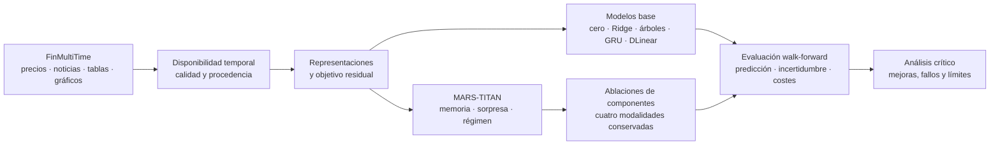

# MARS-TITAN

**Memoria causal adaptativa para predicción bursátil multimodal**

Proyecto de investigación y desarrollo de **Gonzalo García Lama** sobre memoria neural y predicción financiera multimodal.

[](LICENSE)

[Tablero Kanban privado](https://github.com/users/GonxKZ/projects/4) · [Issues](https://github.com/GonxKZ/mars-titan/issues) · [Hitos](https://github.com/GonxKZ/mars-titan/milestones) · [Documentación](docs/README.md)

[Observatorio de experimentos](https://gonxkz.github.io/mars-titan/) · [Uso, contrato y límites](docs/engineering/observatory.md)

## Qué se quiere investigar

Los mercados cambian, las noticias llegan a distintas horas y una parte de la información financiera se publica después del periodo al que se refiere. En estas condiciones, una buena predicción sobre un histórico no basta para demostrar que un modelo generaliza.

MARS-TITAN estudia si una memoria neural adaptativa, que selecciona eventos financieros relevantes y conserva información útil de distintos contextos de mercado, aporta valor frente a modelos más sencillos. Los entrenamientos combinan siempre cuatro modalidades de **FinMultiTime**: precios, noticias, fundamentales y gráficos. Cada muestra debe justificar la disponibilidad de las cuatro. El contexto macroeconómico las complementa, no sustituye ninguna de ellas.

La investigación incorpora mecanismos de aprendizaje y memoria, recurrencia interna de pocos pasos y contexto macroeconómico. La inspiración biológica se traduce en hipótesis sobre retención, adaptación y reaprendizaje. Los antecedentes recientes, incluidos DeepSeek y modelos financieros con memoria, sirven para decidir qué comparar y qué técnicas pueden ser útiles en una GPU pequeña.

La pregunta principal es: **¿mejora una memoria adaptativa de eventos la predicción de retornos residuales fuera de muestra, con un presupuesto de cómputo comparable y después de controlar la fuga temporal?** La utilidad financiera se examinará mediante simulaciones con costes. Una mejora predictiva no implica por sí sola rentabilidad.

**Estado actual:** preparación multimodal implementada, referencias tabulares evaluadas y 48 ejecuciones de GRU y DLinear registradas, incluidas variaciones de pérdida, tasa de aprendizaje, semilla y continuación controlada. Estas ejecuciones utilizan 65 muestras con las cuatro modalidades admitidas, 50 de entrenamiento y 15 de validación. Ninguna supera la referencia de predicción cero en MAE de validación. La [comparación de variantes](reports/baselines/reference-variants.md) conserva las medidas y sus límites.

El panel técnico anterior de 25.856 muestras sirvió para preparar y medir el flujo de datos. Ese recuento no acredita la verificación editorial completa de sus noticias. El inventario cubre toda la copia y los datos macro conservan publicaciones, revisiones y unidades históricas. La arquitectura MARS-TITAN y la comparación confirmatoria siguen pendientes. «Causal» se refiere al orden de disponibilidad de la información, no a la identificación de causas económicas.

La [preparación y sus límites](docs/data/preparation.md) detallan la cobertura real. El [presupuesto experimental](reports/resources/campaign-budget.md) recoge entrenamientos con las cuatro modalidades y retorno residual, incluida una comprobación de 20 épocas. El observatorio conserva su último estado publicado, no constituye un monitor automático de estos ensayos locales.

## Alcance y recursos

El equipo de trabajo tiene **32 GB de RAM y una RTX 4070 Max-Q de 8 GB**. Se propone un piloto de hasta 64 activos y una comparación principal de hasta 128, seleccionados con información del periodo de desarrollo. La copia original contiene 108,2 GiB. Los paneles ya preparados se guardan en Parquet y se leen por lotes, sin duplicar todas las ventanas en memoria. El [presupuesto de almacenamiento](reports/resources/storage-budget.md) distingue bytes de disco, tensores y memoria del proceso. Ampliar el entrenamiento a más activos o a China dependerá del coste medido y de la disponibilidad real de las cuatro modalidades.

La preparación y las representaciones son reanudables. Los ensayos breves guardan checkpoints por época y se ha comprobado recuperación exacta de MLP, GRU y DLinear. La [política de recuperación](docs/engineering/checkpoint-recovery.md) de la futura memoria adaptativa sigue pendiente de implementar con esa arquitectura. El [plan de cómputo](docs/engineering/compute-plan.md) contempla la disponibilidad del equipo durante las 24 horas, sin confundirla con rendimiento máximo sostenido.

## Diseño del estudio



Una predicción solo puede usar datos disponibles en su instante de decisión. La memoria se actualiza con errores de predicciones anteriores **cuando sus etiquetas ya han madurado**. Las tablas contables necesitan fechas de publicación y los gráficos se construirán exclusivamente con ventanas pasadas.

## Objetivos y evidencias

| Objetivo / fase | Resultado que se deberá demostrar |
| --- | --- |
| 1. Datos multimodales | Subconjunto reproducible, contrato temporal, procedencia y controles contra fuga de información. |
| 2. Problema predictivo | Objetivo residual respecto al mercado. Extensión sectorial solo si los datos permiten justificarla. |
| 3. Memoria adaptativa | Prototipo compacto, actualización temporal verificable, regímenes e incertidumbre. |
| 4. Comparativa | Modelos base y ablaciones con iguales datos, particiones y presupuesto documentado. |
| 5. Evaluación | Walk-forward, métricas predictivas y financieras, costes y estimación de incertidumbre de las diferencias. |
| 6. Análisis crítico | Interpretación por periodo, modalidad y régimen. Resultados negativos, limitaciones y trabajo futuro. |

Los objetivos se gestionan como seis hitos y 64 tareas canónicas, con prioridad, tamaño, dependencias y criterios de aceptación. Cada issue concreta herramientas, entradas, pasos, artefactos previstos y pruebas. Cinco tareas redundantes se han consolidado conservando su historial. El código y la documentación se organizan por su función, no por fase. El [plan de trabajo](docs/research/roadmap.md), el [catálogo del tablero](docs/research/task-board.md) y la [guía de implementación](docs/engineering/implementation-guide.md) explican cómo avanzar sin convertir las extensiones en obligaciones del núcleo.

## Documentación

- [Mapa de documentación](docs/README.md).
- [Protocolo de investigación](docs/research/protocol.md), [experimentos](docs/research/experiment-matrix.md) y [revisión del documento inicial](docs/research/original-review.md).
- [Arquitectura candidata](docs/research/candidate-architecture.md), [hipótesis y antecedentes](docs/research/novelty-ledger.md) y [revisión adversarial](docs/research/adversarial-review.md).
- [Contrato de datos](docs/data/data-contract.md), [inspección inicial de FinMultiTime](docs/data/finmultitime-card.md) y [arquitectura](docs/engineering/architecture.md).
- [140 indicadores macroeconómicos candidatos](docs/data/macro-catalog.md), con fuentes, fórmulas y reglas de disponibilidad. Se han calculado las 70 fórmulas y 125 indicadores tienen algún valor admisible en el intervalo preparado. Cada ausencia conserva su motivo.
- [Fuentes gratuitas y nueve archivos complementarios obtenidos](docs/data/free-data-sources.md), conservados en instantáneas locales separadas del benchmark, y [actualización manual](docs/data/public-source-updates.md).
- [Biblioteca y revisión bibliográfica](docs/references/README.md): publicaciones primarias, libros, fuentes financieras, BibTeX y descargas locales con huella de integridad.
- [Memoria y aprendizaje](docs/references/brain-review.md), [eficiencia de DeepSeek](docs/references/deepseek-review.md), [recorrido completo del dataset](docs/engineering/full-dataset-training.md) y [presupuesto de latencia](docs/engineering/latency-budget.md).
- [Contraste de los ocho posts aportados](docs/references/social-followup.md): recursos aprovechables, límites de acceso y afirmaciones que no se pueden verificar.
- [Entorno y reproducción](docs/engineering/reproducibility.md) y [riesgos](docs/research/risks.md).
- [Verificación de esta entrega](docs/engineering/research-verification.md), con comprobaciones realizadas y límites pendientes.

## Estructura del repositorio

```text
src/mars_titan/       Preparación temporal, macro y ensayos de coste
native/              C/C++ y CUDA con CMake, optimización guiada por perfilado
configs/             Configuraciones de datos y experimentos
tests/               Pruebas de datos, cálculos, recuperación y herramientas
scripts/             Biblioteca, captura de fuentes y mantenimiento
site/                Observatorio estático, sin ejecutar modelos en el navegador
notebooks/           Exploraciones acotadas y reproducibles
data/                Contratos y manifiestos, derivados locales ignorados
dataset/             Copia local existente de FinMultiTime, fuera de Git
docs/                Investigación, ingeniería y bibliografía
thesis/              Documento de investigación en LaTeX
reports/             Auditorías, mediciones y fichas de experimentos
.github/             Planificación y plantillas de revisión
```

## Empezar

Requisitos: Git, [uv](https://docs.astral.sh/uv/) y ripgrep. La comprobación nativa necesita CMake y compiladores C/C++. El entorno de desarrollo usa Python 3.12, gestionado por uv. La [guía de entorno](docs/engineering/reproducibility.md) recoge las dependencias del sistema.

```bash
git clone https://github.com/GonxKZ/mars-titan.git
cd mars-titan
uv sync --locked
uv run pytest
uv run ruff check .
uv run ruff format --check .
uv run python scripts/check_repository.py
```

Las comprobaciones se ejecutan localmente antes de publicar cambios. La única excepción autorizada de GitHub Actions es publicar la página de GitHub Pages, sin pruebas ni entrenamientos en GitHub.

Para preparar análisis y entrenamiento en Linux x86-64 con NVIDIA:

```bash
uv sync --locked --extra data --extra research --extra cuda --extra encoders
nvidia-smi
uv run python - <<'PY'
import torch

if not torch.cuda.is_available():
    raise RuntimeError("CUDA no está disponible")
device = torch.device("cuda:0")
print(torch.cuda.get_device_name(device))
print(torch.ones(1, device=device).item())
PY
```

La comprobación falla si no hay CUDA. Los experimentos seleccionarán `cuda:0`. La instalación de PyTorch tiene un índice CUDA explícito y los controles de calidad no requieren descargarlo. Para tareas independientes existe además un entorno compartido compatible: véase [reproducibilidad](docs/engineering/reproducibility.md).

La biblioteca se obtiene desde las fuentes registradas:

```bash
uv run python scripts/fetch_references.py
```

Los fallos de acceso quedan registrados. El catálogo no autoriza redistribuir publicaciones. Los PDF de terceros se conservan en `docs/references/library/`, fuera de Git. Un clon contiene las referencias y el procedimiento de descarga.

Para consultar las fuentes públicas habilitadas y obtener una captura nueva del RSS monetario oficial:

```bash
uv run python scripts/refresh_public_sources.py --list
uv run python scripts/refresh_public_sources.py --source fed_monetary_rss
```

El actualizador necesita `curl`. Sin `--source`, consulta las ocho fuentes renovables validadas. Cada ejecución crea su propio manifiesto y conserva las capturas anteriores. No mezcla actualizaciones con el benchmark ni instala tareas periódicas. Los límites, la selección explícita de documentos PDF y las precauciones temporales se detallan en la [guía de actualización](docs/data/public-source-updates.md).

## Datos, resultados y licencia

Para generar una instantánea del observatorio desde estados locales:

```bash
uv run --locked python scripts/export_observatory.py --output site/data/observatory.json
node --test site/tests/*.test.mjs
```

El exportador no usa GPU, red ni logs completos. Generar una instantánea no la publica. La web puede consultar el último resumen publicado o importar un JSON local sin enviarlo a un servidor. La [guía del observatorio](docs/engineering/observatory.md) explica la integración futura con los entrenadores, el historial privado y la protección del test.

La copia de FinMultiTime y sus derivados no se suben al repositorio. La selección experimental se fijará tras auditar cobertura, fechas y derechos de uso. No se presentan aquí resultados de rentabilidad ni recomendaciones de inversión.

El código y la documentación originales se distribuyen bajo [MIT](LICENSE), una licencia gratuita y permisiva. Los documentos de terceros, los datos, los artículos y los libros mantienen sus condiciones originales: [avisos de terceros](THIRD_PARTY_NOTICES.md).

Para citar el proyecto, utilizar [CITATION.cff](CITATION.cff). Las normas de desarrollo están en [CONTRIBUTING.md](CONTRIBUTING.md).
