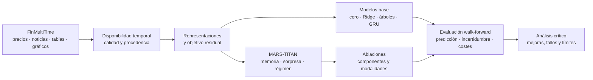
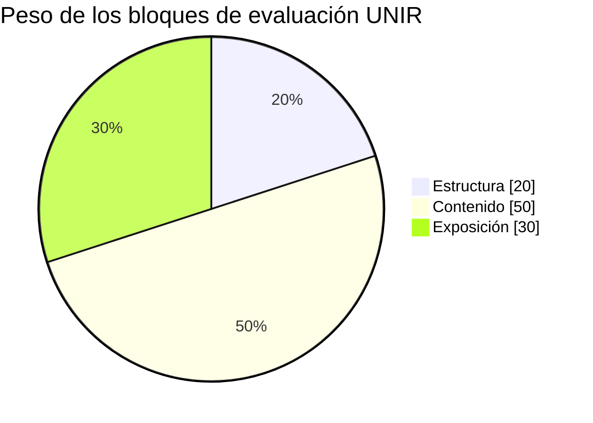

# MARS-TITAN

**Memoria causal adaptativa para predicción bursátil multimodal**

Trabajo Fin de Máster de **Gonzalo García Lama** · Máster Universitario en Inteligencia Artificial · UNIR · Trabajo individual de **Tipo 3: comparativa de soluciones**.

[](https://github.com/GonxKZ/mars-titan/actions/workflows/quality.yml)
[](LICENSE)

[Tablero Kanban](https://github.com/users/GonxKZ/projects/4) · [Issues](https://github.com/GonxKZ/mars-titan/issues) · [Hitos](https://github.com/GonxKZ/mars-titan/milestones) · [Documentación](docs/README.md)

## Qué se quiere investigar

Los mercados cambian, las noticias llegan a distintas horas y una parte de la información financiera se publica después del periodo al que se refiere. En estas condiciones, una buena predicción sobre un histórico no basta para demostrar que un modelo generaliza.

MARS-TITAN estudia si una memoria neural adaptativa, que selecciona eventos financieros relevantes y conserva información útil de distintos contextos de mercado, aporta valor frente a modelos más sencillos. El trabajo combina precios, noticias y, cuando su disponibilidad temporal pueda justificarse, información fundamental y representaciones de gráficos de **FinMultiTime**.

La pregunta principal es: **¿mejora una memoria adaptativa de eventos la predicción de retornos residuales fuera de muestra, con un presupuesto de cómputo comparable y después de controlar la fuga temporal?** La utilidad financiera se examinará mediante simulaciones con costes. Una mejora predictiva no implica por sí sola rentabilidad.

**Estado actual:** preparación documental y configuración del repositorio, sin implementación científica iniciada. La arquitectura está propuesta. Los experimentos y sus resultados están pendientes. Las únicas utilidades ejecutables mantienen y verifican la documentación. Los diagramas muestran el diseño del estudio, no rendimiento observado. «Causal» se refiere al orden de disponibilidad de la información. No implica haber identificado causas económicas.

## Diseño del estudio



Una predicción solo puede usar datos disponibles en su instante de decisión. La memoria se actualiza con errores de predicciones anteriores **cuando sus etiquetas ya han madurado**. Las tablas contables necesitan fechas de publicación y los gráficos se construirán exclusivamente con ventanas pasadas.

## Objetivos y evidencias

| Objetivo / fase | Resultado que se deberá demostrar |
| --- | --- |
| 1. Datos multimodales | Subconjunto reproducible, contrato temporal, procedencia y controles contra fuga de información. |
| 2. Problema predictivo | Objetivo residual respecto al mercado. Extensión sectorial solo si los datos permiten justificarla. |
| 3. Memoria adaptativa | Prototipo compacto, actualización temporal verificable, regímenes e incertidumbre. |
| 4. Comparativa | Modelos base y ablaciones con iguales datos, particiones y presupuesto documentado. |
| 5. Evaluación | Walk-forward, métricas predictivas y financieras, costes y estimación de incertidumbre de las diferencias. |
| 6. Análisis crítico | Interpretación por periodo, modalidad y régimen. Resultados negativos, limitaciones y trabajo futuro. |

Los objetivos se gestionan como seis hitos y 46 tareas, con prioridad, tamaño, dependencias y criterios de aceptación. El código y la documentación se organizan por su función, no por fase. El [plan de trabajo](docs/research/roadmap.md) y el [catálogo del tablero](docs/research/task-board.md) explican cómo avanzar y qué evidencia permite cerrar cada tarea.

## Documentación

- [Mapa de documentación](docs/README.md) y [propuesta presentada](docs/academic/proposal.md).
- [Requisitos académicos](docs/academic/requirements.md) y [matriz completa de la rúbrica](docs/academic/rubric-matrix.md).
- [Protocolo de investigación](docs/research/protocol.md), [experimentos](docs/research/experiment-matrix.md) y [revisión del documento inicial](docs/research/original-review.md).
- [Contrato de datos](docs/data/data-contract.md), [inspección inicial de FinMultiTime](docs/data/finmultitime-card.md) y [arquitectura](docs/engineering/architecture.md).
- [Biblioteca y revisión bibliográfica](docs/references/README.md): publicaciones primarias, libros, fuentes financieras, BibTeX y descargas locales con huella de integridad.
- [Entorno y reproducción](docs/engineering/reproducibility.md), [riesgos](docs/research/risks.md) y [preparación de la defensa](docs/academic/defense.md).

La rúbrica orienta el trabajo completo, incluida la exposición oral:



Fuente: rúbrica aportada para el proyecto, página 1. Estos porcentajes son pesos de evaluación. No representan avance ni calificaciones obtenidas.

## Estructura del repositorio

```text
src/mars_titan/       Espacio reservado para los futuros módulos científicos
native/              C/C++ y CUDA con CMake, optimización guiada por perfilado
configs/             Configuraciones de datos y experimentos
tests/               Verificación documental y plan de pruebas científicas
scripts/             Biblioteca, comprobaciones y mantenimiento
notebooks/           Exploraciones acotadas y reproducibles
data/                Contratos y manifiestos, derivados locales ignorados
dataset/             Copia local existente de FinMultiTime, fuera de Git
docs/                Investigación, ingeniería, normativa y bibliografía
thesis/              Memoria de trabajo en LaTeX
reports/             Plantillas de resultados y fichas de experimentos
.github/             Integración continua y plantillas de revisión
```

## Empezar

Requisitos: Git y [uv](https://docs.astral.sh/uv/). El entorno de desarrollo usa Python 3.12. Uv lo gestiona automáticamente.

```bash
git clone https://github.com/GonxKZ/mars-titan.git
cd mars-titan
uv sync --locked
uv run pytest
uv run ruff check .
uv run ruff format --check .
uv run python scripts/check_repository.py
```

Para preparar análisis y entrenamiento en Linux x86-64 con NVIDIA:

```bash
uv sync --locked --extra data --extra research --extra cuda
nvidia-smi
uv run python - <<'PY'
import torch

if not torch.cuda.is_available():
    raise RuntimeError("CUDA no está disponible")
device = torch.device("cuda:0")
print(torch.cuda.get_device_name(device))
print(torch.ones(1, device=device).item())
PY
```

El equipo de referencia es una **RTX 4070 Laptop de 8 GB**. La comprobación falla si no hay CUDA. Los experimentos seleccionarán `cuda:0`. La instalación de PyTorch tiene un índice CUDA explícito y los controles de calidad no requieren descargarlo. Para tareas independientes existe además un entorno compartido compatible: véase [reproducibilidad](docs/engineering/reproducibility.md).

La biblioteca se obtiene desde las fuentes registradas:

```bash
uv run python scripts/fetch_references.py
```

Los fallos de acceso quedan registrados. El catálogo no autoriza redistribuir publicaciones. Los PDF de terceros se conservan en `docs/references/library/`, fuera de Git. Un clon contiene las referencias y el procedimiento de descarga.

## Datos, resultados y licencia

La copia de FinMultiTime y sus derivados no se suben al repositorio. La selección experimental se fijará tras auditar cobertura, fechas y derechos de uso. No se presentan aquí resultados de rentabilidad ni recomendaciones de inversión.

El código y la documentación originales se distribuyen bajo [MIT](LICENSE), una licencia gratuita y permisiva. Los documentos de UNIR, los datos, los artículos y los libros mantienen sus condiciones originales: [avisos de terceros](THIRD_PARTY_NOTICES.md). La publicación de la memoria académica requiere revisar las condiciones de depósito con el director.

Para citar el proyecto, utilizar [CITATION.cff](CITATION.cff). Las normas de desarrollo están en [CONTRIBUTING.md](CONTRIBUTING.md).
