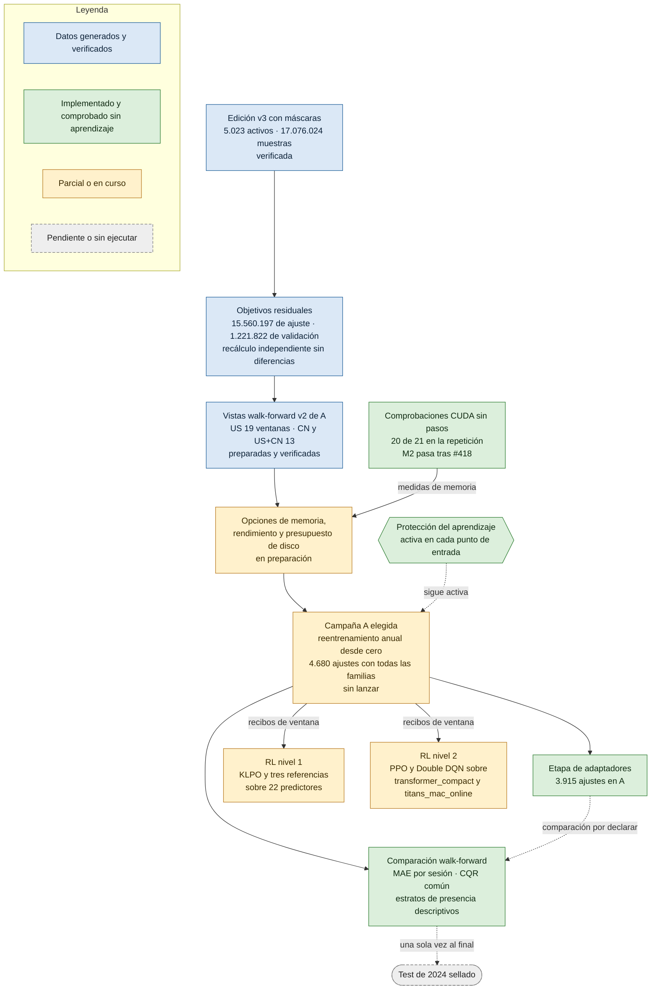
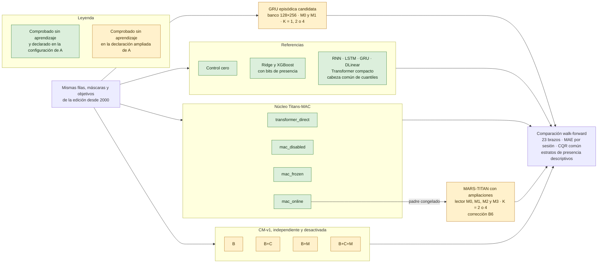
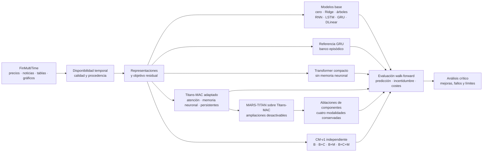

# MARS-TITAN

**Memoria causal adaptativa para predicción bursátil multimodal**

Proyecto de investigación y desarrollo de **Gonzalo García Lama** sobre memoria neural y predicción financiera multimodal.

[](LICENSE)

[Tablero Kanban privado](https://github.com/users/GonxKZ/projects/4) · [Issues](https://github.com/GonxKZ/mars-titan/issues) · [Hitos](https://github.com/GonxKZ/mars-titan/milestones) · [Documentación](docs/README.md)

[Observatorio de experimentos](https://gonxkz.github.io/mars-titan/) · [Recolección, publicación y límites](docs/engineering/campaign-observatory.md)

## Qué se quiere investigar

Los mercados cambian, las noticias llegan a distintas horas y una parte de la información financiera se publica después del periodo al que se refiere. En estas condiciones, una buena predicción sobre un histórico no basta para demostrar que un modelo generaliza.

MARS-TITAN estudia si la memoria neuronal y la selección de episodios aportan información para predecir retornos residuales. Utiliza precios, noticias, fundamentales y gráficos de **FinMultiTime**, junto con contexto macroeconómico. La edición histórica desde 2000 conserva todos los datos utilizables y sus ausencias explícitas. La comparación estricta mantiene por separado las filas con cuatro modalidades y los 140 indicadores observados. Cada comparación utiliza las mismas filas y cortes para todos sus modelos.

La [dirección arquitectónica](docs/research/titans-mac-architecture.md) conserva el candidato GRU con banco episódico, añade una referencia Transformer compacta y adopta Titans-MAC como núcleo identificable para otra adaptación. MARS-TITAN incorporará sus modificaciones sobre ese núcleo mediante componentes desactivables. La memoria neuronal de Titans guarda asociaciones en pesos rápidos y usa pérdida asociativa, gradientes, momentum y olvido. Su memoria persistente aprendida y el banco episódico del proyecto son estados diferentes. CM-v1 continúa como variante independiente, desactivada por defecto.

La investigación incorpora mecanismos de aprendizaje y memoria, recurrencia interna de pocos pasos y contexto macroeconómico. La inspiración biológica se traduce en hipótesis sobre retención, adaptación y reaprendizaje. Los antecedentes recientes, incluidos DeepSeek y modelos financieros con memoria, sirven para decidir qué comparar y qué técnicas pueden ser útiles en una GPU pequeña.

La pregunta principal es: **¿mejora una memoria adaptativa de eventos la predicción de retornos residuales fuera de muestra, con un presupuesto de cómputo comparable y después de controlar la fuga temporal?** La utilidad financiera se examinará mediante simulaciones con costes. Una mejora predictiva no implica por sí sola rentabilidad.

## Campaña sobre la edición desde 2000

Estado a 9 de octubre de 2026. La campaña reentrenará desde cero todos los brazos con las mismas filas de la edición histórica con máscaras (`historical_masked_2000_v1`). La edición y sus objetivos residuales ya están preparados y verificados, pero sobre ellos no se ha ejecutado todavía ningún entrenamiento, postentrenamiento, RL ni evaluación científica, así que no hay resultados predictivos nuevos. La protección local del aprendizaje sigue activa y la campaña no se ha lanzado. El [plan de la campaña](docs/research/training-campaign-2000.md) describe cada etapa y el [protocolo walk-forward v2](docs/research/walk-forward-2000.md) fija sus ventanas.

La [edición v3 verificada](docs/data/historical-materialization.md#edición-v3-completa-y-objetivos-residuales) recorre los 5.676 candidatos y codifica 5.023 activos (4.213 de EE. UU. y 810 de China), 15 de ellos sin muestras. Reúne 17.076.024 muestras de 64 sesiones, el mismo número que el censo de ventanas. Cada fila conserva las posiciones de precios, noticias, gráficos, fundamentales y 140 indicadores macro con nivel, presencia y antigüedad, además de cinco bits de presencia por modalidad. Precios, gráficos y macro están presentes en todas las filas. Los fundamentales aparecen en el 34,4 % (40,6 % en EE. UU. y 0,8 % en China) y las noticias en el 17,9 % (18,6 % y 13,7 %). La verificación independiente de la edición termina con `corpus_complete` verdadero.

Los objetivos residuales (`targets-v3`) dejan 15.560.197 filas de entrenamiento hasta 2022 (13.137.025 de EE. UU. y 2.423.172 de China) y 1.221.822 de validación en 2023 (1.027.173 y 194.649). Se excluyen 294.005 filas con su motivo: 265.880 sin historia suficiente para el residual, 18.237 sin la sesión siguiente, 4.962 con el objetivo posterior al corte y 4.926 purgadas porque su objetivo cruza la frontera entre particiones. Las filas aceptadas y las excluidas suman exactamente las muestras de la edición. Una verificación independiente recalculó 190.830 etiquetas de 60 activos con la referencia en pandas, distinta del motor NumPy que las generó, y no encontró ninguna diferencia. El año 2024 sigue sellado. Las cifras proceden del [recibo de la edición y los objetivos](reports/data/historical-edition-v3-targets-20261009.json). Generar los objetivos exigió leer las sesiones de precios guardadas como diccionario ([#413](https://github.com/GonxKZ/mars-titan/pull/413)), y preparar las vistas exige saltar el grupo Parquet vacío con el que terminan 25 archivos de muestras ([#416](https://github.com/GonxKZ/mars-titan/pull/416)).

Las [vistas walk-forward de la campaña A](docs/research/walk-forward-2000.md#vistas-de-la-campaña-a) están preparadas y verificadas, con 19 ventanas en EE. UU. y 13 en China y en ambos mercados, y ocupan 12,9 GB de datos. Una verificación independiente, que no reutiliza el código de preparación, recorrió los 5.008 activos con objetivos. Recalculó las fronteras desde los protocolos y comprobó la purga por intervalo de etiqueta, que ningún objetivo queda fuera de su ventana ni llega a 2024, que los objetivos son idénticos bit a bit a `targets-v3`, que no se pierde ninguna fila elegible y que US+CN reproduce las vistas por mercado ([recibo](reports/data/campaign-a-views-20261009.json)). La campaña sigue sin lanzar y no se entrenará ningún modelo hasta terminar el código y las implementaciones pendientes y revisar un resumen de su estado.


```mermaid
flowchart TD
    E["Edición v3 con máscaras<br/>5.023 activos · 17.076.024 muestras<br/>verificada"]:::ejecutado
    O["Objetivos residuales<br/>15.560.197 de ajuste · 1.221.822 de validación<br/>recálculo independiente sin diferencias"]:::ejecutado
    H{{"Protección del aprendizaje<br/>activa en cada punto de entrada"}}:::comprobado
    W["Vistas walk-forward v2 de A<br/>US 19 ventanas · CN y US+CN 13<br/>preparadas y verificadas"]:::ejecutado
    K["Comprobaciones CUDA sin pasos<br/>20 de 21 en la repetición<br/>M2 pasa tras #418"]:::comprobado
    Q["Opciones de memoria,<br/>rendimiento y presupuesto de disco<br/>en preparación"]:::parcial
    A["Campaña A elegida<br/>reentrenamiento anual desde cero<br/>4.680 ajustes con todas las familias<br/>sin lanzar"]:::parcial
    P["Etapa de adaptadores<br/>3.915 ajustes en A"]:::comprobado
    R1["RL nivel 1<br/>KLPO y tres referencias<br/>sobre 22 predictores"]:::parcial
    R2["RL nivel 2<br/>PPO y Double DQN sobre<br/>transformer_compact y titans_mac_online"]:::parcial
    C["Comparación walk-forward<br/>MAE por sesión · CQR común<br/>estratos de presencia descriptivos"]:::comprobado
    T(["Test de 2024 sellado"]):::pendiente

    E --> O --> W --> Q --> A
    K -- medidas de memoria --> Q
    H -. sigue activa .-> A
    A --> P
    A -- recibos de ventana --> R1
    A -- recibos de ventana --> R2
    A --> C
    P -. comparación por declarar .-> C
    C -. una sola vez al final .-> T

    subgraph LEY["Leyenda"]
        L0["Datos generados y verificados"]:::ejecutado
        L1["Implementado y comprobado sin aprendizaje"]:::comprobado
        L2["Parcial o en curso"]:::parcial
        L3["Pendiente o sin ejecutar"]:::pendiente
    end

    classDef ejecutado fill:#dbe8f6,stroke:#1f5f99,color:#0d2238
    classDef comprobado fill:#dcefdc,stroke:#2e7d32,color:#102a12
    classDef parcial fill:#fff1cc,stroke:#b7791f,color:#3a2a00
    classDef pendiente fill:#eeeeee,stroke:#757575,color:#222222,stroke-dasharray:5 3
```

El color indica cuánto está preparada cada etapa, no que se haya ejecutado con aprendizaje. Azul marca los datos ya generados y verificados. Verde significa código integrado en `develop` con pruebas que recorren el ajuste hasta el paso del optimizador sin aplicarlo. Las [comprobaciones CUDA del 9 de octubre](reports/engineering/cuda-checks-20261009/README.md) recorrieron 21 comprobaciones en `cuda:0` sin pasos de optimizador y pasaron 20. La de M2 fallaba con el enlace nativo de `develop` porque la prueba fijaba la huella de un binario anterior. [#418](https://github.com/GonxKZ/mars-titan/pull/418) retiró esa huella fija y ahora la prueba comprueba que la huella registrada coincide con el binario realmente cargado. Con el enlace `native-release` de `develop`, M2 y M3 pasan en `cuda:0` en 31,7 s, también sin pasos de optimizador, según la evidencia de esa PR. La etapa RL ya no tiene capacidades nativas pendientes. Desde [#420](https://github.com/GonxKZ/mars-titan/pull/420), `mars-titan-ppo` con el esquema 4 y la orden nueva `mars-titan-klpo` ajustan sobre [cintas reconstruidas](docs/engineering/native-policy-real-tapes.md), también chinas con sus reglas, y están comprobados sin aprendizaje en el diagnóstico CPU. Falta compilarlos con LibTorch CUDA y medir su rendimiento, y no se ha ejecutado ningún ajuste RL.

La variante elegida es A. Cada ventana anual se reentrena desde cero con todo el pasado disponible desde 2000, sin trasladar modelos entre ventanas. Para cada año evaluado, el [protocolo v2](docs/research/walk-forward-2000.md) ajusta con todo el pasado desde 2000 hasta abril del año anterior, valida en los seis meses siguientes, calibra en los tres últimos meses de ese año y evalúa el año completo. La purga se deriva del intervalo real de cada etiqueta. EE. UU. evalúa de 2005 a 2023 y China y la unión de ambos mercados de 2011 a 2023, el primer año con tres años de etiquetas maduras en los dos. La regla común de parada usa un presupuesto fijo de 30 épocas, conserva el mejor estado por MAE residual de validación y declara una mejora mínima de 0,00001. La variante B, que reentrena cada 36 meses, conserva su configuración, pero no es la elegida.

La [configuración de A](configs/baselines/historical-masked-campaign-a.json) declara hoy 2.385 ajustes de las referencias neuronales, Ridge, XGBoost y los cuatro controles de Titans-MAC. La campaña elegida incluye además todas las familias de la [declaración ampliada](docs/research/training-campaign-2000.md#declaración-preparada-de-las-familias-pendientes): la GRU episódica (135 ajustes), MARS-TITAN con M0 a M3 y K = 2 y 4 (1.080) y CM-v1 con B, B+C, B+M y B+C+M (1.080, 360 de ellos de sus dos núcleos auxiliares), hasta 4.680 ajustes. `run_masked_campaign.py extensions` comprueba sin leer datos que esos límites son los recuentos exactos, pero las secciones todavía no se han copiado a la configuración de A. La [etapa de adaptadores](docs/engineering/masked-posttraining.md) prevé 3.915 ajustes y no cambia. La [etapa de políticas](docs/research/training-campaign-2000.md#etapa-de-políticas-por-ventana) tiene dos niveles. El primero aplica KLPO terminal y las tres referencias sin aprendizaje a todos los predictores con productor de la campaña, 22 con la declaración ampliada. El segundo compara las tres variantes PPO y Double DQN sobre `transformer_compact` y `titans_mac_online`. Entre los dos suman 2.160 ajustes y 1.584 ejecuciones de referencia. Son recuentos de plan fijados por pruebas.

Con las vistas preparadas, antes del lanzamiento faltan las opciones de memoria y terminar el código y las implementaciones pendientes. Con la variante A ya elegida, la [orden de caudal](docs/research/training-campaign-2000.md#medición-de-caudal) no decide nada y las opciones se fijarán con las medidas de memoria de las comprobaciones CUDA. La duración real se medirá con los primeros trabajos. Según la estimación del medidor con la receta de campaña, un tramo de `mac_online` con 5.023 flujos necesitaría 14,74 GiB sin acumulación y 1,24 GiB con `accumulation_rows=128`, y ninguna variante de Titans-MAC cabría en los 8 GiB de la GPU sin acumular. En la GRU candidata con 512 activos, el pico neto medido pasa de 1.157,8 MiB sin acumulación a 256,6 MiB con `accumulation_rows=128`. Los núcleos de CM-v1 comparten la receta de Titans-MAC porque la penalización C [acumula por bloques de flujos](docs/experiments/mars_titan_cm_v1/factorial.md#acumulación-por-bloques-con-c) con el mismo gradiente que el tramo completo. Ninguna opción se ha fijado todavía en las recetas. También se están preparando optimizaciones de rendimiento y un presupuesto de disco para la campaña, todavía sin medidas publicadas.


```mermaid
flowchart LR
    D["Mismas filas, máscaras y objetivos<br/>de la edición desde 2000"]

    subgraph REF["Referencias"]
        Z["Control cero"]:::comprobado
        TAB["Ridge y XGBoost<br/>con bits de presencia"]:::comprobado
        NEU["RNN · LSTM · GRU · DLinear<br/>Transformer compacto<br/>cabeza común de cuantiles"]:::comprobado
    end

    G["GRU episódica candidata<br/>banco 128×256 · M0 y M1 · K = 1, 2 o 4"]:::parcial

    subgraph TIT["Núcleo Titans-MAC"]
        T1["transformer_direct"]:::comprobado
        T2["mac_disabled"]:::comprobado
        T3["mac_frozen"]:::comprobado
        T4["mac_online"]:::comprobado
    end

    M["MARS-TITAN con ampliaciones<br/>lector M0, M1, M2 y M3 · K = 2 o 4<br/>corrección B6"]:::parcial

    subgraph CM["CM-v1, independiente y desactivada"]
        C1["B"]:::parcial
        C2["B+C"]:::parcial
        C3["B+M"]:::parcial
        C4["B+C+M"]:::parcial
    end

    EV["Comparación walk-forward<br/>23 brazos · MAE por sesión · CQR común<br/>estratos de presencia descriptivos"]

    D --> REF
    D --> G
    D --> TIT
    D --> CM
    T4 -- padre congelado --> M
    REF --> EV
    G --> EV
    TIT --> EV
    M --> EV
    CM --> EV

    subgraph LEY["Leyenda"]
        L1["Comprobado sin aprendizaje<br/>y declarado en la configuración de A"]:::comprobado
        L2["Comprobado sin aprendizaje<br/>en la declaración ampliada de A"]:::parcial
    end

    classDef comprobado fill:#dcefdc,stroke:#2e7d32,color:#102a12
    classDef parcial fill:#fff1cc,stroke:#b7791f,color:#3a2a00
```

Las referencias y los cuatro controles de Titans-MAC tienen entrenador por ventana y están declarados en la configuración de A. La [GRU episódica](docs/engineering/candidate-chronological-trainer.md), [MARS-TITAN con ampliaciones](docs/engineering/mars-titan-extensions.md) y el [factorial de CM-v1](docs/experiments/mars_titan_cm_v1/factorial.md) tienen entrenador, entrada por ventana, traslado y sección en la declaración ampliada. MARS-TITAN ajusta solo el lector episódico sobre el padre `mac_online` congelado, y con todas las ampliaciones apagadas reproduce bit a bit la sesión de ese padre. Sus seis brazos tienen productor, también [M3](docs/engineering/m3-write-policy.md), que ordena el índice selectivo con error maduro, anomalía y relevancia normalizados con escalas del tramo de entrenamiento de cada ventana y pesos fijos de un tercio. CM-v1 ajusta dos núcleos `mac_online` auxiliares, uno con C desactivado y otro con C como penalización, y aplica M como retención con centros fijos del banco del lector. La comparación declara además un [análisis por presencia de noticias y fundamentales](docs/research/metrics.md#estratos-por-presencia-de-modalidades), fijado antes de cualquier resultado y solo descriptivo. Ninguno de estos brazos tiene diferencias medidas.

| Antes del lanzamiento de la campaña A | Estado | Tarea |
| --- | --- | --- |
| Completar la codificación y verificar la edición con los 5.676 candidatos | Hecho el 9 de octubre ([recibo](reports/data/historical-edition-v3-targets-20261009.json)) | [#171](https://github.com/GonxKZ/mars-titan/issues/171) |
| Generar y verificar los objetivos residuales | Hecho el 9 de octubre, con el mismo recibo | [#15](https://github.com/GonxKZ/mars-titan/issues/15) |
| Preparar las vistas v2 reales con sus purgas por ventana | Hecho el 9 de octubre, con verificación independiente ([recibo](reports/data/campaign-a-views-20261009.json)) | [#363](https://github.com/GonxKZ/mars-titan/issues/363) |
| Ejecutar las comprobaciones CUDA pendientes, sin pasos de optimizador | Hecho. 20 de 21 en la repetición ([resumen](reports/engineering/cuda-checks-20261009/README.md)) y M2 con el enlace de `develop` tras [#418](https://github.com/GonxKZ/mars-titan/pull/418) | [#374](https://github.com/GonxKZ/mars-titan/issues/374) |
| Elegir la variante de presupuesto | A, con todas las familias | [#363](https://github.com/GonxKZ/mars-titan/issues/363) |
| Fijar `accumulation_rows` o `recompute` con las medidas de memoria en `cuda:0` | Pendiente | [#363](https://github.com/GonxKZ/mars-titan/issues/363) |
| Copiar la declaración ampliada de la GRU episódica, MARS-TITAN y CM-v1 a la configuración de A | Pendiente | [#383](https://github.com/GonxKZ/mars-titan/issues/383), [#366](https://github.com/GonxKZ/mars-titan/issues/366), [#293](https://github.com/GonxKZ/mars-titan/issues/293) |
| Optimizar el rendimiento y fijar el presupuesto de disco | En preparación | [#363](https://github.com/GonxKZ/mars-titan/issues/363) |
| Admitir cintas reconstruidas en `mars-titan-ppo` y `mars-titan-sim` y crear la orden financiera de KLPO | Hecho sin aprendizaje ([#420](https://github.com/GonxKZ/mars-titan/pull/420)) | [#137](https://github.com/GonxKZ/mars-titan/issues/137) |
| Compilar los ejecutores RL con LibTorch CUDA y medir su rendimiento | En curso | [#137](https://github.com/GonxKZ/mars-titan/issues/137) |
| Terminar el código y las implementaciones pendientes y revisar un resumen de su estado antes de entrenar | Pendiente | [#363](https://github.com/GonxKZ/mars-titan/issues/363) |

## Ediciones y campañas anteriores

**Última edición analizada:** la [comparación del 5 de octubre](reports/baselines/campaign-comparison-20261005.md) revisa 756 estados y sus predicciones congeladas sobre cuatro ventanas con 140 indicadores. La evaluación real reúne 69 sesiones y no acredita una mejora estable frente a predecir cero. Se separan selección, efecto de la rejilla y aprendizaje adicional. La [revisión de validación del 30 de septiembre](reports/baselines/strict140-validation-20260930.md) y la [edición de 470 muestras](reports/baselines/post-scan-reference-study.md) conservan sus resultados por separado.

La [edición documental H.15](docs/data/h15-archive.md) conserva dos boletines históricos de enero de 2000, con 60 observaciones revisadas y disponibilidad separada por mercado. Su recuperación y contraste están comprobados. Requiere admisión macro posterior y no reanuda la campaña.

La [preparación histórica del 8 de octubre](docs/data/historical-materialization.md) recorre los 5.676 candidatos y conserva los 5.023 activos con precios, con 18.982.446 filas de precios verificadas. Los paneles macro US y CN mantienen todas sus sesiones de 2000 a 2023, con máscaras donde faltan valores admisibles. El [enriquecimiento contable](docs/data/historical-accounting-context.md) incorpora 287 hechos revisados de 49 empresas CN sin cambiar precios ni noticias. La codificación por bloques de la edición v2 se detuvo con un prefijo verificado de 480 activos y 1.673.363 muestras. El [censo de ventanas](docs/data/historical-materialization.md#ventanas-de-entrada-y-condiciones-del-objetivo) contiene 17.076.024 ventanas de precios, las mismas que reúne después la edición v3 completa descrita en la sección anterior, con sus objetivos verificados. Entrenamientos, postentrenamientos, pilotos y evaluaciones científicas siguen sin ejecutarse.

La [consulta congelada de palabras en CPU](docs/data/frozen-embedding-placement.md) reduce el pico asignado de PyTorch de 549.734.400 a 165.955.584 bytes en las formas comprobadas. Las salidas fueron idénticas y la ruta resultó algo más lenta. Con esa ruta se codificó la edición v3 uniforme. Su [avance verificado de la madrugada del 9 de octubre](reports/data/historical-cpu-encoding-progress-20261009.json) reunía 512 activos US y 1.773.121 muestras, y la edición quedó completa y verificada ese mismo día con los 5.023 activos ([recibo](reports/data/historical-edition-v3-targets-20261009.json)). El [contraste de los primeros 64 activos](reports/data/historical-cpu-encoding-20261008.json) acredita valores idénticos bit a bit a las mismas filas de la edición v2. Esa paridad no se extrapola al resto. Ambas ediciones conservan identidades y cachés separadas y sus recuentos no se suman.

El [factor retrospectivo CSI 300](docs/data/csi300-market-factor.md) cubre ya las 4.374 sesiones del calendario de 2006 a 2023. Se conservaron las filas anteriores y se recuperaron los meses intermedios desde los boletines oficiales. Esa cobertura no acredita versiones diarias contemporáneas ni una simulación financiera ejecutable.

La [edición real ampliada](docs/engineering/real-expanded-comparison.md), preparada el 6 de octubre, reúne 400.367 muestras únicas admitidas en diez ventanas, con cuatro modalidades y 140 conceptos macro. La mayor partición de entrenamiento contiene 317.426 muestras y las evaluaciones suman 212.337, sin duplicados entre meses. Los padres se emparejan por semilla y la evaluación añade acierto, abstención y cobertura calibrada. La campaña arrancó en CUDA el 6 de octubre y completó 400 casos neuronales el día 7. La campaña está pausada de forma recuperable para revisar la [cobertura histórica desde 2000](docs/data/historical-coverage.md). El estado comprobado el 7 de octubre conserva 511 operaciones terminadas, con el servicio deshabilitado y sin reanudación automática. Sus resultados comparativos siguen pendientes y no sustituyen los anteriores.

La [preparación conjunta de US y CN](docs/engineering/joint-market-campaigns.md), del 7 de octubre, conserva 408.200 muestras reales en una representación contable común. Sus diez ventanas admiten 405.694 filas distintas y 215.181 filas de evaluación sin repeticiones entre meses. Los calendarios y la calibración se separan por mercado. La parte china sigue limitada a 25 empresas, por lo que esta edición es parcial y todavía no constituye una comparación científica conjunta ejecutada.

El [cuarto lote contable chino](docs/data/chinese-balance-batch04.md), verificado el 7 de octubre, añade doce empresas, 72 hechos revisados y 1.676 muestras. La edición CN alcanza 49 empresas y 9.596 muestras, con 9.516 filas distintas en sus diez ventanas y 5.087 de evaluación sin repeticiones entre meses. La codificación CUDA y su recuperación se comprobaron antes de la pausa posterior. La cobertura sigue parcial y esta ampliación todavía no se ha usado para entrenar comparadores chinos.

La campaña de convergencia ya analizada completó 160 casos neuronales y 1.352 casos posteriores, incluidos 68 tabulares, 528 ajustes y 756 evaluaciones. El RL financiero sintético terminó sus 75 casos. Su auditoría se contrasta con 9.216 episodios nuevos de reglas fijas en C++20. PPO supera esas reglas en la media sintética, pero pierde en los escenarios de inversión de señal. Los 216 ajustes históricos permanecen separados. El candidato base MARS-TITAN está en implementación, todavía no se ha entrenado y el test final sigue cerrado.

Los [controladores PPO](docs/engineering/ppo-objective-variants.md) incorporan recorte con diagnóstico KL, penalización KL adaptativa y parada por KL, con probabilidades históricas y estado versionados. Las comprobaciones CPU/CUDA no ejecutan pasos de optimizador. La recuperación posterior a una actualización real sigue pendiente. El [colector KLPO terminal](docs/engineering/terminal-klpo.md) registra episodios completos, reloj original y política de recogida, con gradientes de la historia GRU y recuperación contrastados. Su [controlador optativo](docs/engineering/terminal-klpo-updates.md) separa actor, Adam y referencia y cuenta actualizaciones confirmadas por referencia. La ejecución de Adam, la alternancia con referencias aprendidas y la recuperación posterior a un paso real siguen pendientes. Se conserva separado del [KLPO predictivo de una decisión](docs/engineering/ppo-objective-controls.md). No hay un algoritmo ganador elegido ni nuevas comparaciones científicas ejecutadas.

La [revisión de las 216 predicciones históricas](reports/baselines/historical-validation-20261001.md) encuentra 21 ajustes con menor MAE por sesión que su padre y 195 con mayor error. Corresponden a la edición con cobertura macro incompleta y salida discreta. Ese balance no se atribuye automáticamente a sobreajuste ni se mezcla con las ventanas estrictas.

La [edición de convergencia](reports/resources/convergence-verification-20261001.md) añade mínimos de aprendizaje antes de consumir paciencia, selección durante XGBoost y parada financiera en C++20. Conserva el mejor estado y una recuperación acotada. Las pruebas incluyen CUDA y recuperación exacta, sin atribuir todavía una mejora predictiva a esta edición.

El [ejecutor recuperable](docs/engineering/reference-campaign.md) recorre todas las filas admitidas de cada edición, continúa desde el cursor confirmado y conserva los casos terminados. Las campañas anteriores de [405 muestras](reports/baselines/streaming-reference-study.md) y [295 muestras](reports/baselines/verified-reference-study.md) también completaron 100 ajustes cada una. Los ensayos sobre [105 muestras](reports/baselines/expanded-comparison.md) y [65 observaciones](reports/baselines/recurrent-comparison.md) permanecen como registros separados.

El panel técnico anterior de 25.856 muestras sirvió para preparar y medir el flujo de datos. Ese recuento no acredita la verificación editorial completa de sus noticias. El inventario cubre toda la copia y los datos macro conservan publicaciones, revisiones y unidades históricas. La arquitectura MARS-TITAN y la comparación confirmatoria siguen pendientes. «Causal» se refiere al orden de disponibilidad de la información, no a la identificación de causas económicas.

El [índice textual completo](reports/data/corpus-index-20260922.md) ya recorre los 5.586 archivos de ambos mercados y conserva 4.469.917 registros con sus localizadores y hashes. Incluye instrumentos incompletos y no filtra por sector. Este censo no convierte las noticias pendientes en contenido verificado ni acredita nuevos entrenamientos.

La [preparación y sus límites](docs/data/preparation.md) y la [ampliación verificada de noticias](reports/data/verified-news-cohort-20260922.md) detallan la cobertura real. El [presupuesto experimental](reports/resources/campaign-budget.md) conserva las mediciones anteriores, incluida una comprobación de 20 épocas. El observatorio muestra la última publicación del recolector local. Su fecha de publicación se distingue del último progreso y de la observación del proceso.

## Módulos implementados y comprobaciones pendientes

Las guías de cada módulo recogen sus pruebas y límites. La implementación de estas herramientas no acredita haber entrenado el candidato MARS-TITAN ni completado nuevas comparaciones científicas.

| Módulo | Comportamiento implementado | Límite de la evidencia |
| --- | --- | --- |
| [Transformer compacto](docs/engineering/compact-transformer-reference.md) | Atención causal sobre precios con la fusión y cabeza comunes. Contratos de carga, máscaras temporales y paridad CPU/CUDA comprobados. Admitido en el runner de referencias con [la fusión con presencia de la edición histórica](docs/engineering/masked-reference-runners.md). | No se ha entrenado. La búsqueda histórica preparada no se ha ejecutado. Sus pruebas CUDA con la fusión de presencia pasan sin pasos de optimizador. |
| [Referencia GRU con lectura episódica](native/candidate.md) | Núcleo C++20 y LibTorch. La [entrada histórica con máscaras](native/candidate_historical.md) conserva una identidad propia y tiene pruebas CPU/CUDA de gradientes y recuperación del módulo. | El [codec CPU, el banco 128×256 y la sesión financiera](docs/engineering/gru-financial-sessions.md) tienen pruebas CPU, paridad Titans M0/M1/M2, ASan/UBSan y una comprobación CUDA superada. El [entrenador cronológico](docs/engineering/candidate-chronological-trainer.md) ajusta el módulo nativo con M0/M1, K = 1, 2 o 4 y la cabeza común, comprobado sin pasos de optimizador en CPU y en `cuda:0`. La acumulación por bloques y la recomputación acotan su memoria, medida también en `cuda:0`, y su ventana walk-forward con traslado está en la declaración ampliada de A, sin copiar a su configuración. Los ocho casos anteriores de Compute Sanitizer corresponden al candidato completo previo. La ruta ASan/UBSan con CUDA falla al inicializar el dispositivo. |
| [Núcleo Titans-MAC](docs/engineering/titans-memory-core.md) y [adaptador financiero](docs/engineering/titans-financial-adapter.md) | Memoria asociativa con momentum y olvido, parámetros persistentes y estado explícito. Cuatro controles financieros con máscaras y recuperación CPU/CUDA, conectados al consumidor cronológico y a un [entrenador cronológico](docs/engineering/titans-chronological-trainer.md) comprobado sin pasos de optimizador, con una [ventana walk-forward](docs/engineering/titans-chronological-trainer.md#ventana-walk-forward) que escribe predicciones por fila. La [memoria con residual y LayerNorm](docs/engineering/titans-mac-output-scale.md) del artículo es un componente desactivable. Las [puertas con bias declarados](docs/engineering/titans-gate-initialization.md) evitan que la memoria rápida se vacíe con los parámetros iniciales. La receta de la campaña activa ambos, con dos casos de búsqueda de la tasa, y las campañas A y B la declaran. [M2](docs/engineering/mature-error-write-policy.md) añade tres índices 50/25/25. | M2 tiene una comprobación CUDA focal en FP32/FP64, K=1, B_mem=4 y C apagado, que pasa con el enlace nativo de `develop` desde [#418](https://github.com/GonxKZ/mars-titan/pull/418). [M3](docs/engineering/m3-write-policy.md) pasa sus comprobaciones CPU y CUDA. La consolidación M sobre M2 sigue pendiente. La memoria por tramo medida en `cuda:0` exige `accumulation_rows=128` con la población completa, todavía sin fijar en la receta. Sin entrenamiento ni ejecución científica sobre el corpus completo. |
| [Cabeza común de cuantiles](docs/engineering/quantile-head.md) | Cinco niveles ordenados por construcción y media de pinball, con la parametrización de la GRU nativa y paridad bit a bit en FP32 y FP64. Disponible en las referencias neuronales, el Transformer compacto, Titans-MAC, su entrenador cronológico y la lectura episódica con identidades nuevas. | Sin entrenar. El control frente a la salida escalar L1 está declarado sin ejecutar, la [calibración común CQR](docs/research/metrics.md#calibración-común-de-intervalos) está implementada sin aplicar a predicciones reales. Las comprobaciones CUDA pasan, salvo las rutas que el bloqueo omite. |
| [Mecanismos CM-v1](docs/experiments/mars_titan_cm_v1/specification.md) | C calcula una compresión del Jacobiano del estado rápido de MAC, con pruebas CPU/CUDA. M selecciona medoids por bloques y tiene un oráculo pequeño. El [codec episódico](docs/engineering/episodic-codec.md) conserva máscaras e identidad fija. | El [factorial B, B+C, B+M y B+C+M](docs/experiments/mars_titan_cm_v1/factorial.md) está implementado sobre Titans-MAC, con C como penalización durante el ajuste del núcleo, M como retención con centros fijos y Jacobianos completos para el diagnóstico. C acumula por bloques de flujos con el mismo gradiente que el tramo completo y los núcleos B y B+C pasan la comprobación CUDA. Está en la declaración ampliada de A, sin copiar a su configuración. El diagnóstico local no certifica estabilidad. No hay mejora predictiva medida. |
| [Consumidor financiero congelado](docs/engineering/financial-session-v2.md) | Conecta núcleo, lector, banco y estados por bloques. Distingue calentamiento, emisión, maduración y cierre administrativo, sin eliminar observaciones por falta de etiqueta. M0/M1 y recuperación comprobados en CPU/CUDA. | Requiere el backend declarado y conserva el RNG separado de hashes futuros. La aceptación de cola y almacenamiento sobre cada fase real sigue pendiente. LSan del componente Python/nativo anterior no quedó limpio, sin crecimiento observado en seis pruebas de ciclo de vida. |
| [Lectura episódica financiera](docs/engineering/episodic-financial-readout.md) | Recuperación sobre una instantánea común y refinamientos K = 1, 2 y 4 sin repetir el núcleo MAC. Integrada en el consumidor, con gradientes y recuperación comprobados en CPU/CUDA. | La paridad al desactivar el componente no demuestra utilidad predictiva. Las pruebas técnicas no son un entrenamiento. |
| [Memoria asociativa con resultados maduros](docs/engineering/mature-associative-memory.md) | Matriz de clave por valor con regla delta o escritura proximal de cohorte, orden canónico, cursor contra entregas repetidas y recuperación con huella. | Conectada a la sesión como corrección B6 de Titans-MAC sin banco, dentro de [MARS-TITAN con ampliaciones](docs/engineering/mars-titan-extensions.md). La [correspondencia de modificaciones](docs/research/titans-mac-architecture.md#correspondencia-de-las-modificaciones-de-integración) fija su punto de inserción. Falta emitirla en el recorrido por ventanas. Sin tasas elegidas con datos ni comparación predictiva. |
| [Observatorio](docs/engineering/campaign-observatory.md) | Recolección local con historial SQLite, páginas de 64 registros y publicación periódica en Pages. Separa entrenamiento, generación sintética y evaluación financiera, y excluye datos reservados del paquete público. | La web depende de los informes observados y del último despliegue. No deduce pasos de entrenamiento a partir de un proceso activo. |
| [Episodios y mundos sintéticos](docs/engineering/experimental-episodes.md) | Bloques cronológicos recuperables, remuestreo solo de entrenamiento, mundos de mecanismo conocido y aumentos con tamaños emparejados. Conserva las cuatro modalidades y el contexto macro simulado con sus máscaras. | Las pruebas de contrato usan codificadores controlados. La ruta con MiniLM y ResNet18 reales requiere comprobación CUDA. No demuestra utilidad predictiva del aumento. |
| [Benchmarks identificados](docs/engineering/named-benchmarks.md) | Ocho mecanismos existentes con nombres propios y perfiles de 64 y 256 sesiones. El catálogo fija semillas separadas, límites de volumen y manifiestos verificables. | Preparación y pruebas técnicas sin ajustes. La dificultad empírica y la comparación de modelos siguen pendientes. Sus once campos de contexto no sustituyen las modalidades reales. |
| [Simulación y comparadores](docs/engineering/persistent-simulation.md) | Efectivo por moneda, posiciones, órdenes, splits y dividendos. PPO, Double DQN y reglas fijas utilizan predicciones congeladas y estados recuperables. | La comprobación usa datos sintéticos de contabilidad conocida. Las [cintas reconstruidas](docs/engineering/rl-environment-integrity.md) usan precios negociados verificados por tramos, con acciones corporativas incompletas y sin retornos de salida declarados en su identidad. |
| [Ejecutable C++20](docs/engineering/native-financial-simulation.md) | `mars-titan-sim` lee Parquet con Arrow C++, ejecuta la contabilidad y las políticas de referencia, recupera checkpoints y compara escenarios concurrentes sin iniciar Python. | Se contrasta con la referencia sobre validación sintética. El núcleo y la sesión tienen perfiles de Clang/GCC, análisis estático, sanitizadores y fuzzing separados de Release. |
| [Entornos por lotes y contexto causal](docs/engineering/batched-rl-environments.md) | Lotes C++20 con observaciones contiguas, contexto externo fechado, confirmación conjunta y reinicio explícito. Filtro HMM recuperable y ventajas PPO por entorno. | Las medidas del simulador no equivalen a acelerar el entrenamiento completo. Los especialistas y su integración neural requieren comparaciones separadas. |
| [PPO nativo](docs/engineering/native-ppo.md) | Política C++20 con LibTorch, dos capas de 64 unidades, decisiones por lotes y recuperación de modelo, Adam, RNG y rollout. Valida el estado inicial y conserva dos recientes y el mejor seleccionado. | Admite fuentes sintéticas y un diagnóstico CPU de hasta 32 transiciones de ajuste. La implementación no acredita rendimiento CUDA ni resultados del candidato MARS-TITAN. |
| [Adaptación RL y auditoría](docs/engineering/adaptive-rl.md) | Ocho familias sintéticas y nueve variantes, con ventana, GRU, memoria episódica, HMM, consolidación y control Double DQN. Rotación de fuentes, trazas confirmadas, explicaciones sin otro LLM y auditoría separada del mejor checkpoint a tres costes. | [Recuperación CUDA de las nueve variantes](reports/resources/adaptive-cuda-recovery-20260929.json). La edición de convergencia terminó 75 casos y evalúa 512 mundos separados. Los mundos simulan tres conceptos macro de 140. Sus resultados no acreditan rentabilidad histórica real. |
| [Integridad de los entornos de refuerzo](docs/engineering/rl-environment-integrity.md) | Auditoría adversarial con agentes guionizados, perturbaciones del futuro y mutación dirigida. Los checkpoints predictivos no contienen etiquetas pendientes, la fuente declara su partición y las cintas históricas exigen predicciones fuera de muestra. | Tres fases en CPU. La segunda amplía las cohortes a 8.192 activos y aplica en Python las reglas de las acciones A. La tercera admite ventanas walk-forward con recibos y cintas de [precios reconstruidos](docs/data/unadjusted-prices.md). No demuestra la ausencia de cualquier trampa. La población apenas contiene bajas y los resultados quedarán condicionados a la supervivencia. Las reglas chinas se aplican también en el motor nativo, con paridad paso a paso frente a Python. Faltan recibos de ventana reales. |
| [Postentrenamiento con máscaras y matriz de adaptadores](docs/engineering/masked-posttraining.md) | Corpus ordenado con bits de presencia, padres con fusión de presencia o bits tabulares, normalizador por ventana y matriz finita de adaptadores de cabeza, lectura y fusión con presupuesto común. | Comprobado en CPU hasta el paso del optimizador, sin ajustes. La matriz v2 optimiza la pinball con padres de cuantiles y su etapa por ventana está registrada en la campaña. Las pruebas CUDA de adaptadores y cuantiles pasan. El recorrido de la cola y de la etapa en `cuda:0`, la comparación de los brazos postentrenados y la ejecución siguen pendientes. |
| [Referencias con la edición desde 2000](docs/engineering/masked-reference-runners.md) y [comparadores tabulares](docs/engineering/masked-tabular-comparators.md) | RNN, LSTM, GRU, DLinear y Transformer compacto fusionan los cinco bits de presencia y Ridge y XGBoost los reciben como columnas. Presupuesto fijo con mejor estado, retención de validación, calibración y evaluación por fila y presupuesto de disco para la caché externa de XGBoost. | Paridad exacta de la ruta estricta y pruebas CPU sin ajustes. Las pruebas CUDA de la fusión, del runner y de la caché externa de XGBoost pasan sin pasos de optimizador. Falta medir el coste por época. HistGradientBoosting queda fuera porque su matriz en memoria rondaría 212 GB. |
| [Protocolo walk-forward v2](docs/research/walk-forward-2000.md) y [orquestación de la campaña](docs/research/training-campaign-2000.md#orquestación-de-los-brazos-con-entrenador) | Ventanas anuales desde 2000 con purga por intervalo de etiqueta, variantes A y B, recibos por trabajo, reanudación sin repetir trabajos confirmados, recibos de ventana para RL y una orden de caudal para todas las familias. | Comprobada con dobles que escriben predicciones nulas con las filas de cada vista. Variante A elegida. Las [vistas reales de A](docs/research/walk-forward-2000.md#vistas-de-la-campaña-a) están preparadas y verificadas, y la orden de caudal no se ha ejecutado. |
| [Evaluación walk-forward y calibración común](docs/research/metrics.md#evaluación-walk-forward-de-la-edición-desde-2000) | MAE, dirección, Rank IC, pinball, cobertura y riesgo-cobertura por sesión, contrastes emparejados con bootstrap por bloques de días y CQR por mercado congelado antes de leer la evaluación. [Estratos por presencia de noticias y fundamentales](docs/research/metrics.md#estratos-por-presencia-de-modalidades), declarados antes de cualquier resultado como análisis descriptivo. | Valores calculados a mano y predicciones sintéticas. No se ha leído ningún dato de la edición. La longitud de bloque y las familias de contrastes deben revisarse antes de evaluar. |
| [Precios negociados reconstruidos](docs/data/unadjusted-prices.md) | Inversión del ajuste del proveedor con verificación por tramos y controles negativos. La edición de 5.012 activos verifica por completo 3.377 US y 705 CN. | Contraste con series oficiales de SSE, EODHD y Alpha Vantage. No incorpora bajas por falta de una fuente libre y verificable de retornos de salida. |
| [MARS-TITAN con ampliaciones](docs/engineering/mars-titan-extensions.md) | Constructor de combinaciones con identidad propia, K con episodios fijos, corrección B6 y entrenador del lector episódico sobre `mac_online` congelado, con ventana walk-forward y traslado. | Con todo apagado reproduce bit a bit la sesión `mac_online`. Sus seis brazos tienen productor, M3 incluido, en la declaración ampliada de A. Los diez casos CUDA del lector pasan con M1 y M3. Seis componentes siguen sin conexión. |
| [Etapa de políticas por ventana](docs/research/training-campaign-2000.md#etapa-de-políticas-por-ventana) | Dos niveles sobre las mismas cintas y con selección por criterio de cartera. KLPO terminal y tres referencias sin aprendizaje sobre todos los predictores con productor, 11 en la configuración actual de A y 22 con la declaración ampliada, y las tres variantes PPO y Double DQN sobre el Transformer compacto y Titans-MAC `mac_online`. El [controlador de KLPO](docs/engineering/terminal-klpo-updates.md) separa actor, Adam y referencia. | Comprobada en CPU con ejecutores sustitutos y, desde [#420](https://github.com/GonxKZ/mars-titan/pull/420), con los [binarios nativos sobre cintas reconstruidas](docs/engineering/native-policy-real-tapes.md) en el diagnóstico CPU, sin pasos de optimizador. Falta compilarlos con LibTorch CUDA y medir su rendimiento. Ningún ajuste RL ejecutado. |
| [Protección del aprendizaje](tests/README.md#protección-del-aprendizaje) | Cada punto de entrada que ajusta parámetros, en Python y en los ejecutables nativos, se detiene antes de abrir fuentes o crear salidas mientras la protección local lo indique. Las pruebas omiten cualquier paso de optimizador de PyTorch. | Mutación dirigida de las guardas. El gancho de pruebas no cubre LibTorch en C++ ni scikit-learn, que se protegen en sus puntos de entrada. |
| [Postentrenamiento emparejado](docs/engineering/paired-posttraining.md) | Ajustes sobre datos reales, remuestreados y sintéticos, con padres identificados, seis objetivos residuales y continuaciones neuronales MAE/MSE. La selección usa validación real y el test permanece cerrado. | Terminados y revisados 528 ajustes de la condición real. Las condiciones aumentadas no forman parte de esa campaña y su utilidad sigue sin demostrarse. |

La [medición de lectura y simulación](docs/engineering/episode-pipeline-performance.md) compara concurrencia sobre episodios analíticos y comprueba paridad contable. No mide codificadores neuronales ni entrenamiento en GPU. El [diseño de capacidad y coste por parámetro](docs/research/parameter-efficiency.md) define futuros contrastes de representación, parámetros compartidos, destilación y selección de memoria para O3, O4 y O6.

Las [continuaciones de edición 2](docs/engineering/continuation-selection.md) consideran el estado inicial del padre y permiten parada temprana en el control real. Conservan dos checkpoints de recuperación y el mejor si es distinto. La [revisión de cómputo](reports/resources/compute-review.md) reúne las optimizaciones medidas, sus referencias y los recorridos CUDA pendientes de una ventana exclusiva.

## Avances por día

Las fechas siguientes corresponden a cambios del historial de desarrollo, en horario de Madrid. Los enlaces permiten consultar su alcance. Incorporar código o documentar un contraste no equivale a haber ejecutado el experimento.

| Fecha de 2026 | Cambios y evidencia |
| --- | --- |
| 18 de septiembre | [Estructura y protocolo](https://github.com/GonxKZ/mars-titan/commit/d126b511a3920a62ee939875e218a98b7c50ee39), contratos de recuperación y [observatorio inicial](https://github.com/GonxKZ/mars-titan/commit/4a16fc26b00c062d6afe8e8108db2e68de68f2a2). |
| 19 de septiembre | [Preparación de entradas multimodales](https://github.com/GonxKZ/mars-titan/commit/7d2e21d324104491db8c1d6589d08b799c7653cc), medición de coste y revisión de la documentación propia en español. |
| 20 de septiembre | Comprobaciones de noticias, precios y exportación Parquet recuperable. [Admisión estricta de artículos](https://github.com/GonxKZ/mars-titan/commit/3766e00c786b7a0b5bb8713e47d87f3737c06806) y procedencia del tokenizador. |
| 21 de septiembre | [Ridge por bloques](https://github.com/GonxKZ/mars-titan/commit/b4c85dbd5cfd111858c9de5f3bcc702d461e7c97), boosting, diagnósticos nativos y [diseño de regímenes causales](https://github.com/GonxKZ/mars-titan/commit/c3bfe932593ba5a7cfedff4ca6ec2ff565b0861f). |
| 22 de septiembre | [Referencias recurrentes y DLinear](https://github.com/GonxKZ/mars-titan/pull/103), factores empresariales e [inventario recuperable del corpus](https://github.com/GonxKZ/mars-titan/commit/73c7c87be08c6b837264212290f72c24abd635e9). |
| 23 de septiembre | [Campañas y checkpoints recuperables](https://github.com/GonxKZ/mars-titan/commit/1c018c97ac5d4b3f30f813780cb59a519c352600), selección de épocas, métricas por sesión y [búsqueda de configuraciones](https://github.com/GonxKZ/mars-titan/commit/9b8344757df908467712ef8d34bb7d6aaaee892f). |
| 24 de septiembre | [Episodios sintéticos](https://github.com/GonxKZ/mars-titan/pull/138), [simulación y comparadores financieros](https://github.com/GonxKZ/mars-titan/pull/139), ejecución C++20 y [medidas de rendimiento](https://github.com/GonxKZ/mars-titan/pull/156). |
| 25 de septiembre | Sin commits fechados ese día en el historial consultado. No permite concluir si hubo ejecuciones o trabajo local. |
| 26 de septiembre | Correcciones de [admisión GPU](https://github.com/GonxKZ/mars-titan/pull/161), memoria de ordenación y [seguimiento del progreso CPU](https://github.com/GonxKZ/mars-titan/pull/166). |
| 27 de septiembre | [Auditoría temporal](https://github.com/GonxKZ/mars-titan/pull/169), sanitizadores, cuarentena ALFRED, [cobertura macro completa](https://github.com/GonxKZ/mars-titan/pull/174) y contratos de validación con purga. |
| 28 de septiembre | Recuperación de publicaciones macro y [ediciones versionadas](https://github.com/GonxKZ/mars-titan/pull/178), [vistas temporales](https://github.com/GonxKZ/mars-titan/pull/179) y [búsqueda estricta con retención del padre](https://github.com/GonxKZ/mars-titan/pull/180). Ampliación de [entornos por lotes](docs/engineering/batched-rl-environments.md), [PPO nativo con validación y recuperación](https://github.com/GonxKZ/mars-titan/pull/182) y revisión de [expertos y contexto financiero](docs/research/contextual-experts.md). Corrección del [seguimiento y recálculo por ventanas temporales](docs/engineering/prediction-review.md). |
| 29 de septiembre | [Memoria, GRU, HMM y Double DQN en C++20](docs/engineering/adaptive-rl.md), con [pruebas de integración](reports/resources/adaptive-integration-verification.json) y [recuperación exacta CUDA](reports/resources/adaptive-cuda-recovery-20260929.json). La [medición del recorrido completo](reports/resources/adaptive-pipeline-performance.md) registra mejoras y regresiones. El piloto de 21 ejecuciones terminó y seleccionó 524.288 transiciones para cada ajuste principal, ya en marcha sobre mundos sintéticos. El test final real sigue cerrado. |
| 30 de septiembre | [Continuación temporal](docs/engineering/temporal-posttraining.md) con recuperación entre etapas y evaluación de estados congelados. [Análisis de las 160 ejecuciones neuronales terminadas](reports/baselines/strict140-validation-20260930.md), con 59 mejoras de validación y 37 continuaciones que conservan al padre. |
| 1 de octubre | Integración de [comparadores nativos](https://github.com/GonxKZ/mars-titan/pull/187) y [continuación temporal](https://github.com/GonxKZ/mars-titan/pull/188), con [verificación local conjunta](reports/resources/integration-20261001.md). [Estado comprobado de las campañas](reports/baselines/campaign-status-20261001.md), con la serie histórica terminada y 67 casos nuevos confirmados. [Mínimos, paciencia y recuperación](https://github.com/GonxKZ/mars-titan/pull/196) verificados en CPU y CUDA. |
| 4 de octubre | [Caché de consultas episódicas C++20](reports/resources/episodic-query-20261004.md), con menos asignaciones y dos comparaciones completas CUDA. Paridad exacta de pesos, Adam, RNG y trazas. Sanitizadores y seguimiento de asignaciones de LibTorch en [#202](https://github.com/GonxKZ/mars-titan/issues/202). [Memoria y contexto](docs/research/neuroarchitecture-review.md), con 27 fuentes nuevas. Segunda revisión de [atención y replay](docs/research/attention-replay-review.md), [eventos y señales reducidas](docs/research/event-signal-comparison.md), con otras 40 fuentes y [comprobaciones matemáticas](docs/research/attention-replay-mathematics.md). Las variantes continúan en diseño. |
| 5 de octubre | Publicación del análisis de [integración arquitectónica y postentrenamiento](docs/research/system-integration.md). Implementación de [controles experimentales](docs/engineering/experimental-controls.md): memoria saturada y ruido, documentos individuales, vistas reducidas, replay, adaptadores y cohortes recuperables. Corrección de [supervisión CUDA](docs/engineering/gpu-admission.md), [recibos](docs/engineering/campaign-receipts.md) y [despliegue de Pages](docs/engineering/campaign-observatory.md). Cierre y [comparación de las campañas](reports/baselines/campaign-comparison-20261005.md), con errores por sesión, incertidumbre temporal y controles financieros C++20. Se conservan resultados desfavorables y límites. El candidato continúa en diseño. |
| 6 de octubre | [Ampliación de historia macro y protocolo real común](docs/engineering/real-expanded-comparison.md), recuperación explícita de etiquetas del corte anual y comprobaciones contra cambios SQLite pendientes. Emparejamiento de padres y semillas, evaluación de fiabilidad y lectura por columnas con paridad CUDA. Arranque del reentrenamiento en [#234](https://github.com/GonxKZ/mars-titan/issues/234), con parada temprana y recuperación comprobadas en el primer caso. [Conciliación del observatorio](reports/resources/observatory-identity-20261006.json), con 578 alias históricos retirados. [Exportación de ventanas variables y fiabilidad](reports/resources/comparison-export-20261006.json), con resultados reales separados de los escenarios financieros sintéticos. [Verificación reutilizable del lector](reports/resources/verified-corpus-artifacts-20261006.json), con paridad CUDA y una mediana de tiempo un 4,18 % menor en tres parejas completas. [Pesos GRU compartidos en C++20](reports/resources/gru-weight-packing-20261006.md), con 14 pares exactos, menos copias GPU y límites de variabilidad y cierre documentados. [Cierre automático del análisis](reports/resources/real-campaign-analysis-20261006.json), con espera de las tres etapas, recuperación acotada y paridad sobre 756 modelos anteriores. [Contraste de adjuntos GSCPI](reports/data/gscpi-release-audit-20261006.json), con versiones distintas, contraste de las copias de FRASER y siete sesiones potenciales todavía sin admitir. [Reutilización de rutas del lector](reports/resources/artifact-path-reuse-20261006.json), con cuatro parejas CUDA exactas y una mejora total pequeña. [Materialización contable china](reports/data/china-facts-materialization-20261006.json) y [preparación derivada del activo](reports/data/china-preparation-20261006.json), con seis hechos revisados y 77 pruebas relacionadas, sin admitir todavía muestras de entrenamiento. [Panel macro CN](docs/data/china-macro-edition.md), con 387 sesiones completas e historia de disponibilidad conservada. [Factor CSI 300](docs/data/csi300-market-factor.md), con 484 sesiones y paridad residual exacta en el caso chino. |
| 7 de octubre | [Codificación china en CUDA](docs/data/chinese-multimodal-samples.md), con 169 muestras de las cuatro modalidades y 140 macros, 168 etiquetas y representación CAS/CNY separada. Recuperación verificada sin nueva inferencia, enlaces de manifiestos comprobados y supervisión sin reescribir metadatos idénticos. La [unión de publicaciones contables](docs/data/chinese-fact-history.md) amplía la preparación a Ping An y Vanke, con 721 muestras y contraste numérico explícito. La [historia CSI 300 de 2021](reports/data/csi300-history-20261007.json) recupera 46 etiquetas y conserva las 484 sesiones posteriores. El [corpus chino común](docs/data/chinese-corpus.md) prepara diez ventanas con 715 muestras distintas y 362 filas de evaluación sin repeticiones. Lectura temporal y comprobación CPU/CUDA de las cuatro familias verificadas. La [ampliación contable posterior](docs/data/chinese-balance-expansion.md) incorpora once empresas y 2.503 muestras. La unión reúne 3.224 muestras de trece empresas y 1.691 filas de evaluación sin repeticiones. Preparación CUDA y 172 pruebas comprobadas, con la cobertura y los nuevos entrenamientos aún pendientes. El [segundo lote contable](docs/data/chinese-balance-batch02.md) añade doce empresas y 2.150 muestras. La unión alcanza 25 empresas, 5.374 muestras y 2.844 filas de evaluación sin repeticiones. El [inventario de balances](docs/data/chinese-balance-inventory.md) deja 6.480 trabajos de reconciliación para 810 empresas y ocho cierres. Tres parejas de medidas reducen el tiempo de inventario un 11,35 % y el JSON un 95,99 %, con la cola Parquet idéntica. El [catálogo recuperable de anuncios](docs/data/chinese-announcements.md) conserva 192 respuestas del nuevo recorrido y 5.508 anuncios, con candidatos por título de 351 empresas adicionales, todavía sin revisión de sus PDF ni admisión contable. [Publicación de Pages recuperada](reports/resources/pages-recovery-20261007.json), con 3.212 identidades únicas comprobadas en el índice y 50 páginas. [Coordinación temporal CN](docs/engineering/single-market-campaigns.md), con propagación del mercado a tabulares, ajustes y evaluación, 136 pruebas CPU y recuperación de 30 casos técnicos en CUDA. [Ediciones históricas H.15](docs/data/h15-archive.md), con seis series revisadas y publicación documental recuperable, pendiente de admisión macro. |
| 8 de octubre | [Vistas temporales con máscaras](docs/data/historical-temporal-views.md) y cohortes históricas con ausencias explícitas. [Núcleo Titans-MAC](docs/engineering/titans-memory-core.md), [Transformer compacto](docs/engineering/compact-transformer-reference.md) y [adaptador financiero con cuatro controles](docs/engineering/titans-financial-adapter.md). Controles matemáticos de CM-v1 y [diagnóstico local de C sobre MAC](docs/experiments/mars_titan_cm_v1/mac_local_control.md). [Codec episódico](docs/engineering/episodic-codec.md), [lectura episódica financiera](docs/engineering/episodic-financial-readout.md) y [sesiones financieras congeladas](docs/engineering/financial-session-v2.md). [Variantes de objetivo PPO](docs/engineering/ppo-objective-variants.md) y referencias KLPO verificadas. [Consulta congelada de palabras en CPU](docs/data/frozen-embedding-placement.md) para la codificación histórica. Sin entrenamientos. |
| 9 de octubre | Preparación de la campaña desde 2000, sin aprendizaje. [Plan](docs/research/training-campaign-2000.md) y [protocolo walk-forward v2](docs/research/walk-forward-2000.md) ([#368](https://github.com/GonxKZ/mars-titan/pull/368), [#375](https://github.com/GonxKZ/mars-titan/pull/375)), referencias neuronales y tabulares con máscaras ([#372](https://github.com/GonxKZ/mars-titan/pull/372), [#373](https://github.com/GonxKZ/mars-titan/pull/373)), [cabeza común de cuantiles](docs/engineering/quantile-head.md) ([#381](https://github.com/GonxKZ/mars-titan/pull/381)), [métricas por sesión y CQR común](docs/research/metrics.md) ([#371](https://github.com/GonxKZ/mars-titan/pull/371), [#384](https://github.com/GonxKZ/mars-titan/pull/384)) y orquestación con variantes A y B ([#391](https://github.com/GonxKZ/mars-titan/pull/391), [#398](https://github.com/GonxKZ/mars-titan/pull/398), [#400](https://github.com/GonxKZ/mars-titan/pull/400)). [Entrenador cronológico de Titans-MAC](docs/engineering/titans-chronological-trainer.md) con ventana walk-forward, [puertas con bias](docs/engineering/titans-gate-initialization.md) y memoria con residual ([#377](https://github.com/GonxKZ/mars-titan/pull/377), [#387](https://github.com/GonxKZ/mars-titan/pull/387), [#396](https://github.com/GonxKZ/mars-titan/pull/396)). [GRU episódica](docs/engineering/candidate-chronological-trainer.md) en la sesión común, con entrenador, memoria acotada y ventana walk-forward ([#376](https://github.com/GonxKZ/mars-titan/pull/376), [#389](https://github.com/GonxKZ/mars-titan/pull/389), [#394](https://github.com/GonxKZ/mars-titan/pull/394), [#395](https://github.com/GonxKZ/mars-titan/pull/395)). [MARS-TITAN con ampliaciones](docs/engineering/mars-titan-extensions.md) y su correspondencia con la revisión de integración ([#393](https://github.com/GonxKZ/mars-titan/pull/393), [#399](https://github.com/GonxKZ/mars-titan/pull/399)). [Adaptadores por ventana](docs/engineering/masked-posttraining.md) ([#386](https://github.com/GonxKZ/mars-titan/pull/386), [#397](https://github.com/GonxKZ/mars-titan/pull/397)). [Auditoría de los entornos RL](docs/engineering/rl-environment-integrity.md) en tres fases, [precios negociados reconstruidos](docs/data/unadjusted-prices.md), etapa de políticas por ventana en dos niveles y [reglas de las acciones A en el motor nativo](docs/engineering/china-market-rules.md) ([#369](https://github.com/GonxKZ/mars-titan/pull/369), [#378](https://github.com/GonxKZ/mars-titan/pull/378), [#385](https://github.com/GonxKZ/mars-titan/pull/385), [#390](https://github.com/GonxKZ/mars-titan/pull/390), [#401](https://github.com/GonxKZ/mars-titan/pull/401), [#405](https://github.com/GonxKZ/mars-titan/pull/405), [#406](https://github.com/GonxKZ/mars-titan/pull/406)). [Factorial de CM-v1](docs/experiments/mars_titan_cm_v1/factorial.md) sobre Titans-MAC ([#404](https://github.com/GonxKZ/mars-titan/pull/404)). [Controlador de KLPO terminal](docs/engineering/terminal-klpo-updates.md) y paridad de M2 con el diagnóstico C ([#362](https://github.com/GonxKZ/mars-titan/pull/362), [#367](https://github.com/GonxKZ/mars-titan/pull/367)). [Protección del aprendizaje](tests/README.md#protección-del-aprendizaje) en cada punto de entrada y reparación de pruebas ([#370](https://github.com/GonxKZ/mars-titan/pull/370), [#380](https://github.com/GonxKZ/mars-titan/pull/380), [#388](https://github.com/GonxKZ/mars-titan/pull/388)). Por la tarde, [edición v3 completa y objetivos residuales verificados](docs/data/historical-materialization.md#edición-v3-completa-y-objetivos-residuales), con la lectura de sesiones como diccionario y de grupos Parquet vacíos corregida ([#413](https://github.com/GonxKZ/mars-titan/pull/413), [#416](https://github.com/GonxKZ/mars-titan/pull/416)). [Escritura M3](docs/engineering/m3-write-policy.md) y su lector en la orden de caudal ([#410](https://github.com/GonxKZ/mars-titan/pull/410), [#412](https://github.com/GonxKZ/mars-titan/pull/412)), [acumulación por bloques de la penalización C](docs/experiments/mars_titan_cm_v1/factorial.md#acumulación-por-bloques-con-c) ([#411](https://github.com/GonxKZ/mars-titan/pull/411)) y declaración ampliada de las campañas con MARS-TITAN y CM-v1 en la orden de caudal ([#409](https://github.com/GonxKZ/mars-titan/pull/409)). [Estratos por presencia de modalidades](docs/research/metrics.md#estratos-por-presencia-de-modalidades) en la comparación ([#415](https://github.com/GonxKZ/mars-titan/pull/415)), [políticas nativas sobre cintas reconstruidas y orden financiera de KLPO](docs/engineering/native-policy-real-tapes.md), sin capacidades RL pendientes ([#420](https://github.com/GonxKZ/mars-titan/pull/420), [#421](https://github.com/GonxKZ/mars-titan/pull/421), [#422](https://github.com/GonxKZ/mars-titan/pull/422)), y [comprobaciones CUDA sin pasos de optimizador](reports/engineering/cuda-checks-20261009/README.md), con 20 de 21 superadas ([#417](https://github.com/GonxKZ/mars-titan/pull/417)) y M2 comprobada con el binario realmente cargado ([#418](https://github.com/GonxKZ/mars-titan/pull/418)). Elección de la variante A con todas las familias y [vistas walk-forward de A](docs/research/walk-forward-2000.md#vistas-de-la-campaña-a) preparadas y verificadas. Ningún entrenamiento ni evaluación científica. |

## Alcance y recursos

El equipo de trabajo tiene **32 GB de RAM y una RTX 4070 Max-Q de 8 GB**. La campaña prevista utiliza todo el universo admisible, sin límite de 64 o 128 activos, en tres brazos: Estados Unidos, China y ambos mercados juntos. La copia original contiene 108,2 GiB. Los datos preparados se guardan en Parquet y se leen por lotes, sin duplicar todas las ventanas en memoria. Los recursos limitan el tamaño del lote y condicionan el tiempo, no justifican presentar un panel pequeño como el corpus completo. El [presupuesto de almacenamiento](reports/resources/storage-budget.md) distingue disco, tensores y memoria. La edición histórica admite modalidades ausentes con máscaras y causas. La estricta exige las cuatro modalidades y los 140 indicadores observados. La falta de precios u objetivos válidos se registra aparte y no se rellena con datos inventados.

La preparación y las representaciones son reanudables. Las referencias neuronales conservan pesos, AdamW, generadores y cursor confirmado, con pruebas de continuidad exacta. La [persistencia comprobada](reports/reproducibility/reference-checkpoints.md) distingue esa implementación de los contratos pendientes de la futura memoria adaptativa. XGBoost recupera la última ronda confirmada. Ridge puede repetir el caso en curso si no terminó. El [plan de cómputo](docs/engineering/compute-plan.md) contempla la disponibilidad del equipo durante las 24 horas, sin confundirla con rendimiento máximo sostenido.

## Diseño del estudio


```mermaid
flowchart LR
    D[FinMultiTime<br/>precios · noticias · tablas · gráficos] --> P[Disponibilidad temporal<br/>calidad y procedencia]
    P --> X[Representaciones<br/>y objetivo residual]
    X --> B[Modelos base<br/>cero · Ridge · árboles<br/>RNN · LSTM · GRU · DLinear]
    X --> G[Referencia GRU<br/>banco episódico]
    X --> T[Transformer compacto<br/>sin memoria neuronal]
    X --> N[Titans-MAC adaptado<br/>atención · memoria neuronal · persistentes]
    N --> M[MARS-TITAN sobre Titans-MAC<br/>ampliaciones desactivables]
    M --> A[Ablaciones de componentes<br/>cuatro modalidades conservadas]
    X --> CM[CM-v1 independiente<br/>B · B+C · B+M · B+C+M]
    B --> E[Evaluación walk-forward<br/>predicción · incertidumbre · costes]
    G --> E
    T --> E
    N --> E
    A --> E
    CM --> E
    E --> C[Análisis crítico<br/>mejoras, fallos y límites]
```

La [revisión de la memoria posterior a Titans](docs/research/post-titans-memory-review.md) deja tres innovaciones para el núcleo de la campaña, cada una desactivable y desactivada por defecto. Su punto de inserción sobre Titans-MAC y las ampliaciones de MARS-TITAN está en el [diagrama del sistema](docs/research/titans-mac-architecture.md#innovaciones-posteriores-a-titans). Ninguna se ha entrenado ni evaluado, así que no hay resultados experimentales.

- **PT1, memoria de Titans acotada y contractiva** ([#453](https://github.com/GonxKZ/mars-titan/issues/453)): propuesta. Resultado experimental pendiente.

- **PT2, calibración conformal en línea con etiquetas maduras** ([#454](https://github.com/GonxKZ/mars-titan/issues/454)): propuesta. Resultado experimental pendiente.

- **PT3, regla de Kalman con ruido de cohorte correlacionado en B6** ([#455](https://github.com/GonxKZ/mars-titan/issues/455)): propuesta. Resultado experimental pendiente.

Una predicción solo puede usar datos disponibles en su instante de decisión. La actualización asociativa de Titans utiliza entradas observadas bajo una política explícita. El error financiero de escritura episódica solo se calcula cuando madura la etiqueta de la predicción realmente emitida. Las tablas contables necesitan fechas de publicación y los gráficos se construyen exclusivamente con ventanas pasadas.

## Objetivos y evidencias

| Objetivo / fase | Resultado que se deberá demostrar |
| --- | --- |
| 1. Datos multimodales | Subconjunto reproducible, contrato temporal, procedencia y controles contra fuga de información. |
| 2. Problema predictivo | Objetivo residual respecto al mercado. Extensión sectorial solo si los datos permiten justificarla. |
| 3. Memoria adaptativa | Prototipo compacto, actualización temporal verificable, regímenes e incertidumbre. |
| 4. Comparativa | Modelos base y ablaciones con iguales datos, particiones y presupuesto documentado. |
| 5. Evaluación | Walk-forward, métricas predictivas y financieras, costes y estimación de incertidumbre de las diferencias. |
| 6. Análisis crítico | Interpretación por periodo, modalidad y régimen. Resultados negativos, limitaciones y trabajo futuro. |

Los objetivos se gestionan como seis hitos y 64 tareas canónicas, con prioridad, tamaño, dependencias y criterios de aceptación. Cada issue concreta herramientas, entradas, pasos, artefactos previstos y pruebas. Cinco tareas redundantes se han consolidado conservando su historial. El código y la documentación se organizan por su función, no por fase. El [plan de trabajo](docs/research/roadmap.md), el [catálogo del tablero](docs/research/task-board.md) y la [guía de implementación](docs/engineering/implementation-guide.md) explican cómo avanzar sin convertir las extensiones en obligaciones del núcleo.

## Documentación

- [Mapa de documentación](docs/README.md).
- [Protocolo de investigación](docs/research/protocol.md), [experimentos](docs/research/experiment-matrix.md) y [revisión del documento inicial](docs/research/original-review.md).
- [Arquitectura candidata](docs/research/candidate-architecture.md), [capacidad y coste por parámetro](docs/research/parameter-efficiency.md), [hipótesis y antecedentes](docs/research/novelty-ledger.md) y [revisión adversarial](docs/research/adversarial-review.md).
- [Titans-MAC, Transformer y referencia GRU](docs/research/titans-mac-architecture.md), con estados, correspondencia matemática, controles y límites de implementación.
- [Memoria posterior a Titans](docs/research/post-titans-memory-review.md), con [propuestas](docs/research/post-titans-proposals.md), [certificado de contracción](docs/research/titans-memory-certificate.md) y [diagnósticos](docs/research/memory-diagnostics.md).
- [Variante ampliada y comparaciones justas](docs/research/neuroarchitecture-review.md), con [condiciones de memoria y contraejemplos](docs/research/memory-mathematics.md). La variante sigue en diseño. El candidato base está en implementación y todavía no se ha entrenado.
- [Atención, repetición y autoevaluación](docs/research/attention-replay-review.md), [eventos públicos y señales reducidas](docs/research/event-signal-comparison.md), con [límites de información y replay](docs/research/attention-replay-mathematics.md).
- [Integración arquitectónica y postentrenamiento](docs/research/system-integration.md), con responsabilidades, puntos de extensión, dependencias de estado y estimaciones matemáticas.
- [Campaña sobre la edición desde 2000](docs/research/training-campaign-2000.md), con el [protocolo walk-forward v2](docs/research/walk-forward-2000.md), las [métricas y la calibración común](docs/research/metrics.md) y la [auditoría de los entornos de refuerzo](docs/engineering/rl-environment-integrity.md).
- [Preparación experimental ejecutable](docs/engineering/experimental-controls.md), con controles C++20, lectores y vistas, recuperación, medidas y perfiles de verificación conjuntos.
- [Contrato de datos](docs/data/data-contract.md), [inspección inicial de FinMultiTime](docs/data/finmultitime-card.md) y [arquitectura](docs/engineering/architecture.md).
- [140 indicadores macroeconómicos](docs/data/macro-catalog.md), con fuentes, fórmulas y disponibilidad. La [edición temporal estricta](docs/engineering/strict-temporal-search.md) exige los 140 en cada muestra admitida. Las ediciones anteriores conservan su cobertura y exclusiones originales.
- [Expertos, regímenes y contexto financiero](docs/research/contextual-experts.md), con fuentes primarias hasta 2026, hipótesis pendientes y controles adversariales.
- [Fuentes gratuitas y nueve archivos complementarios obtenidos](docs/data/free-data-sources.md), conservados en instantáneas locales separadas del benchmark, y [actualización manual](docs/data/public-source-updates.md).
- [Biblioteca y revisión bibliográfica](docs/references/README.md): publicaciones primarias, libros, fuentes financieras, BibTeX y descargas locales con huella de integridad.
- [Memoria y aprendizaje](docs/references/brain-review.md), [eficiencia de DeepSeek](docs/references/deepseek-review.md), [recorrido completo del dataset](docs/engineering/full-dataset-training.md) y [presupuesto de latencia](docs/engineering/latency-budget.md).
- [Contraste de los ocho posts aportados](docs/references/social-followup.md): recursos aprovechables, límites de acceso y afirmaciones que no se pueden verificar.
- [Entorno y reproducción](docs/engineering/reproducibility.md) y [riesgos](docs/research/risks.md).
- [Verificación de esta entrega](docs/engineering/research-verification.md), con comprobaciones realizadas y límites pendientes.

## Estructura del repositorio

```text
src/mars_titan/       Datos, modelos de referencia, episodios y simulación
native/              C/C++ y CUDA con CMake, optimización guiada por perfilado
configs/             Configuraciones de datos y experimentos
tests/               Pruebas de datos, cálculos, recuperación y herramientas
scripts/             Biblioteca, captura de fuentes y mantenimiento
site/                Observatorio estático, sin ejecutar modelos en el navegador
notebooks/           Exploraciones acotadas y reproducibles
data/                Contratos y manifiestos, derivados locales ignorados
dataset/             Copia local existente de FinMultiTime, fuera de Git
docs/                Investigación, ingeniería y bibliografía
thesis/              Documento de investigación en LaTeX
reports/             Auditorías, mediciones y fichas de experimentos
.github/             Planificación y plantillas de revisión
```

## Empezar

Requisitos: Git, [uv](https://docs.astral.sh/uv/) y ripgrep. La comprobación nativa necesita CMake y compiladores C/C++. El entorno de desarrollo usa Python 3.12, gestionado por uv. La [guía de entorno](docs/engineering/reproducibility.md) recoge las dependencias del sistema.

```bash
git clone https://github.com/GonxKZ/mars-titan.git
cd mars-titan
uv sync --locked
uv run ruff check .
uv run ruff format --check .
uv run python scripts/check_repository.py
```

La suite completa de `uv run pytest` requiere las dependencias científicas y los binarios nativos. Su preparación se describe en las guías de [reproducibilidad](docs/engineering/reproducibility.md), [simulación C++20](docs/engineering/native-financial-simulation.md) y [PPO nativo](docs/engineering/native-ppo.md). Las comprobaciones CUDA requieren una GPU libre.

Las comprobaciones se ejecutan localmente antes de publicar cambios. La única excepción autorizada de GitHub Actions es publicar la página de GitHub Pages, sin pruebas ni entrenamientos en GitHub.

Para preparar análisis y entrenamiento en Linux x86-64 con NVIDIA:

```bash
uv sync --locked --extra data --extra research --extra cuda --extra encoders
nvidia-smi
uv run python - <<'PY'
import torch

if not torch.cuda.is_available():
    raise RuntimeError("CUDA no está disponible")
device = torch.device("cuda:0")
print(torch.cuda.get_device_name(device))
print(torch.ones(1, device=device).item())
PY
```

La comprobación falla si no hay CUDA. Los experimentos seleccionarán `cuda:0`. La instalación de PyTorch tiene un índice CUDA explícito y los controles de calidad no requieren descargarlo. Para tareas independientes existe además un entorno compartido compatible: véase [reproducibilidad](docs/engineering/reproducibility.md).

La biblioteca se obtiene desde las fuentes registradas:

```bash
uv run python scripts/fetch_references.py
```

Los fallos de acceso quedan registrados. El catálogo no autoriza redistribuir publicaciones. Los PDF de terceros se conservan en `docs/references/library/`, fuera de Git. Un clon contiene las referencias y el procedimiento de descarga.

Para consultar las fuentes públicas habilitadas y obtener una captura nueva del RSS monetario oficial:

```bash
uv run python scripts/refresh_public_sources.py --list
uv run python scripts/refresh_public_sources.py --source fed_monetary_rss
```

El actualizador necesita `curl`. Sin `--source`, consulta las ocho fuentes renovables validadas. Cada ejecución crea su propio manifiesto y conserva las capturas anteriores. No mezcla actualizaciones con el benchmark ni instala tareas periódicas. Los límites, la selección explícita de documentos PDF y las precauciones temporales se detallan en la [guía de actualización](docs/data/public-source-updates.md).

## Datos, resultados y licencia

Para generar una instantánea puntual del observatorio desde estados locales:

```bash
uv run --locked python scripts/export_observatory.py --output site/data/observatory.json
node --test site/tests/*.test.mjs
```

El exportador no usa GPU, red ni logs completos. Generar una instantánea no la publica. La web puede consultar el último resumen publicado o importar un JSON local sin enviarlo a un servidor. El [recolector de campañas](docs/engineering/campaign-observatory.md) mantiene el historial paginado y permite observar fuentes cada 15 segundos y publicar cambios ordinarios cada cinco minutos. Los estados terminales tienen prioridad. La [guía de la web](site/README.md) describe la consulta y las comprobaciones locales.

La copia de FinMultiTime y sus derivados no se suben al repositorio. La selección experimental se fijará tras auditar cobertura, fechas y derechos de uso. No se presentan aquí resultados de rentabilidad ni recomendaciones de inversión.

El código y la documentación originales se distribuyen bajo [MIT](LICENSE), una licencia gratuita y permisiva. Los documentos de terceros, los datos, los artículos y los libros mantienen sus condiciones originales: [avisos de terceros](THIRD_PARTY_NOTICES.md).

Para citar el proyecto, utilizar [CITATION.cff](CITATION.cff). Las normas de desarrollo están en [CONTRIBUTING.md](CONTRIBUTING.md).
