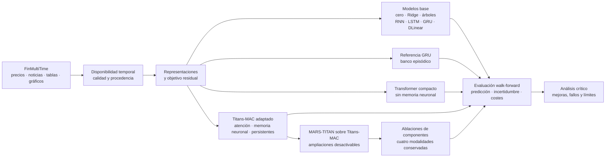

# MARS-TITAN

**Memoria causal adaptativa para predicción bursátil multimodal**

Proyecto de investigación y desarrollo de **Gonzalo García Lama** sobre memoria neural y predicción financiera multimodal.

[](LICENSE)

[Tablero Kanban privado](https://github.com/users/GonxKZ/projects/4) · [Issues](https://github.com/GonxKZ/mars-titan/issues) · [Hitos](https://github.com/GonxKZ/mars-titan/milestones) · [Documentación](docs/README.md)

[Observatorio de experimentos](https://gonxkz.github.io/mars-titan/) · [Recolección, publicación y límites](docs/engineering/campaign-observatory.md)

## Qué se quiere investigar

Los mercados cambian, las noticias llegan a distintas horas y una parte de la información financiera se publica después del periodo al que se refiere. En estas condiciones, una buena predicción sobre un histórico no basta para demostrar que un modelo generaliza.

MARS-TITAN estudia si la memoria neuronal y la selección de episodios aportan información para predecir retornos residuales. Utiliza precios, noticias, fundamentales y gráficos de **FinMultiTime**, junto con contexto macroeconómico. La edición histórica desde 2000 conserva todos los datos utilizables y sus ausencias explícitas. La comparación estricta mantiene por separado las filas con cuatro modalidades y los 140 indicadores observados. Cada comparación utiliza las mismas filas y cortes para todos sus modelos.

La [dirección arquitectónica](docs/research/titans-mac-architecture.md) conserva el candidato GRU con banco episódico, añade una referencia Transformer compacta y adopta Titans-MAC como núcleo identificable para otra adaptación. MARS-TITAN incorporará sus modificaciones sobre ese núcleo mediante componentes desactivables. La memoria neuronal de Titans guarda asociaciones en pesos rápidos y usa pérdida asociativa, gradientes, momentum y olvido. Su memoria persistente aprendida y el banco episódico del proyecto son estados diferentes. CM-v1 continúa como variante independiente, desactivada por defecto.

La investigación incorpora mecanismos de aprendizaje y memoria, recurrencia interna de pocos pasos y contexto macroeconómico. La inspiración biológica se traduce en hipótesis sobre retención, adaptación y reaprendizaje. Los antecedentes recientes, incluidos DeepSeek y modelos financieros con memoria, sirven para decidir qué comparar y qué técnicas pueden ser útiles en una GPU pequeña.

La pregunta principal es: **¿mejora una memoria adaptativa de eventos la predicción de retornos residuales fuera de muestra, con un presupuesto de cómputo comparable y después de controlar la fuga temporal?** La utilidad financiera se examinará mediante simulaciones con costes. Una mejora predictiva no implica por sí sola rentabilidad.

**Última edición analizada:** la [comparación del 5 de octubre](reports/baselines/campaign-comparison-20261005.md) revisa 756 estados y sus predicciones congeladas sobre cuatro ventanas con 140 indicadores. La evaluación real reúne 69 sesiones y no acredita una mejora estable frente a predecir cero. Se separan selección, efecto de la rejilla y aprendizaje adicional. La [revisión de validación del 30 de septiembre](reports/baselines/strict140-validation-20260930.md) y la [edición de 470 muestras](reports/baselines/post-scan-reference-study.md) conservan sus resultados por separado.

La [edición documental H.15](docs/data/h15-archive.md) conserva dos boletines históricos de enero de 2000, con 60 observaciones revisadas y disponibilidad separada por mercado. Su recuperación y contraste están comprobados. Requiere admisión macro posterior y no reanuda la campaña.

La [preparación histórica del 8 de octubre](docs/data/historical-materialization.md) recorre los 5.676 candidatos y conserva los 5.023 activos con precios, con 18.982.446 filas de precios verificadas. Los paneles macro US y CN mantienen todas sus sesiones de 2000 a 2023, con máscaras donde faltan valores admisibles. El [enriquecimiento contable](docs/data/historical-accounting-context.md) incorpora 287 hechos revisados de 49 empresas CN sin cambiar precios ni noticias. La codificación por bloques conserva un prefijo verificado de 480 activos y 1.673.363 muestras. El [censo de ventanas](docs/data/historical-materialization.md#ventanas-de-entrada-y-condiciones-del-objetivo) contiene 17.076.024 ventanas de precios. Faltan el resto del corpus codificado, los objetivos y la conciliación de los cortes comunes. Entrenamientos, postentrenamientos, pilotos y evaluaciones científicas siguen bloqueados.

La [consulta congelada de palabras en CPU](docs/data/frozen-embedding-placement.md) reduce el pico asignado de PyTorch de 549.734.400 a 165.955.584 bytes en las formas comprobadas. Las salidas fueron idénticas y la ruta resultó algo más lenta. La edición uniforme nueva tiene [320 activos US y 1.102.849 muestras verificadas](reports/data/historical-cpu-encoding-progress-20261009.json). El [contraste de los primeros 64 activos](reports/data/historical-cpu-encoding-20261008.json) acredita valores idénticos bit a bit a las mismas filas de la edición anterior. Esa paridad no se extrapola al resto. Ambas conservan identidades y cachés separadas. Sus recuentos no se suman como datos nuevos.

El [factor retrospectivo CSI 300](docs/data/csi300-market-factor.md) cubre ya las 4.374 sesiones del calendario de 2006 a 2023. Se conservaron las filas anteriores y se recuperaron los meses intermedios desde los boletines oficiales. Esa cobertura no acredita versiones diarias contemporáneas ni una simulación financiera ejecutable.

La [edición real ampliada](docs/engineering/real-expanded-comparison.md), preparada el 6 de octubre, reúne 400.367 muestras únicas admitidas en diez ventanas, con cuatro modalidades y 140 conceptos macro. La mayor partición de entrenamiento contiene 317.426 muestras y las evaluaciones suman 212.337, sin duplicados entre meses. Los padres se emparejan por semilla y la evaluación añade acierto, abstención y cobertura calibrada. La campaña arrancó en CUDA el 6 de octubre y completó 400 casos neuronales el día 7. La campaña está pausada de forma recuperable para revisar la [cobertura histórica desde 2000](docs/data/historical-coverage.md). El estado comprobado el 7 de octubre conserva 511 operaciones terminadas, con el servicio deshabilitado y sin reanudación automática. Sus resultados comparativos siguen pendientes y no sustituyen los anteriores.

La [preparación conjunta de US y CN](docs/engineering/joint-market-campaigns.md), del 7 de octubre, conserva 408.200 muestras reales en una representación contable común. Sus diez ventanas admiten 405.694 filas distintas y 215.181 filas de evaluación sin repeticiones entre meses. Los calendarios y la calibración se separan por mercado. La parte china sigue limitada a 25 empresas, por lo que esta edición es parcial y todavía no constituye una comparación científica conjunta ejecutada.

El [cuarto lote contable chino](docs/data/chinese-balance-batch04.md), verificado el 7 de octubre, añade doce empresas, 72 hechos revisados y 1.676 muestras. La edición CN alcanza 49 empresas y 9.596 muestras, con 9.516 filas distintas en sus diez ventanas y 5.087 de evaluación sin repeticiones entre meses. La codificación CUDA y su recuperación se comprobaron antes de la pausa posterior. La cobertura sigue parcial y esta ampliación todavía no se ha usado para entrenar comparadores chinos.

La campaña de convergencia ya analizada completó 160 casos neuronales y 1.352 casos posteriores, incluidos 68 tabulares, 528 ajustes y 756 evaluaciones. El RL financiero sintético terminó sus 75 casos. Su auditoría se contrasta con 9.216 episodios nuevos de reglas fijas en C++20. PPO supera esas reglas en la media sintética, pero pierde en los escenarios de inversión de señal. Los 216 ajustes históricos permanecen separados. El candidato base MARS-TITAN está en implementación, todavía no se ha entrenado y el test final sigue cerrado.

Los [controladores PPO](docs/engineering/ppo-objective-variants.md) incorporan recorte con diagnóstico KL, penalización KL adaptativa y parada por KL, con probabilidades históricas y estado versionados. Las comprobaciones CPU/CUDA no ejecutan pasos de optimizador. La recuperación posterior a una actualización real sigue pendiente. El [colector KLPO terminal](docs/engineering/terminal-klpo.md) registra episodios completos, reloj original y política de recogida, con gradientes de la historia GRU y recuperación contrastados. Las actualizaciones del actor y la alternancia entre referencias ajustadas siguen pendientes. Se conserva separado del [KLPO predictivo de una decisión](docs/engineering/ppo-objective-controls.md). No hay un algoritmo ganador elegido ni nuevas comparaciones científicas ejecutadas.

La [revisión de las 216 predicciones históricas](reports/baselines/historical-validation-20261001.md) encuentra 21 ajustes con menor MAE por sesión que su padre y 195 con mayor error. Corresponden a la edición con cobertura macro incompleta y salida discreta. Ese balance no se atribuye automáticamente a sobreajuste ni se mezcla con las ventanas estrictas.

La [edición de convergencia](reports/resources/convergence-verification-20261001.md) añade mínimos de aprendizaje antes de consumir paciencia, selección durante XGBoost y parada financiera en C++20. Conserva el mejor estado y una recuperación acotada. Las pruebas incluyen CUDA y recuperación exacta, sin atribuir todavía una mejora predictiva a esta edición.

El [ejecutor recuperable](docs/engineering/reference-campaign.md) recorre todas las filas admitidas de cada edición, continúa desde el cursor confirmado y conserva los casos terminados. Las campañas anteriores de [405 muestras](reports/baselines/streaming-reference-study.md) y [295 muestras](reports/baselines/verified-reference-study.md) también completaron 100 ajustes cada una. Los ensayos sobre [105 muestras](reports/baselines/expanded-comparison.md) y [65 observaciones](reports/baselines/recurrent-comparison.md) permanecen como registros separados.

El panel técnico anterior de 25.856 muestras sirvió para preparar y medir el flujo de datos. Ese recuento no acredita la verificación editorial completa de sus noticias. El inventario cubre toda la copia y los datos macro conservan publicaciones, revisiones y unidades históricas. La arquitectura MARS-TITAN y la comparación confirmatoria siguen pendientes. «Causal» se refiere al orden de disponibilidad de la información, no a la identificación de causas económicas.

El [índice textual completo](reports/data/corpus-index-20260922.md) ya recorre los 5.586 archivos de ambos mercados y conserva 4.469.917 registros con sus localizadores y hashes. Incluye instrumentos incompletos y no filtra por sector. Este censo no convierte las noticias pendientes en contenido verificado ni acredita nuevos entrenamientos.

La [preparación y sus límites](docs/data/preparation.md) y la [ampliación verificada de noticias](reports/data/verified-news-cohort-20260922.md) detallan la cobertura real. El [presupuesto experimental](reports/resources/campaign-budget.md) conserva las mediciones anteriores, incluida una comprobación de 20 épocas. El observatorio muestra la última publicación del recolector local. Su fecha de publicación se distingue del último progreso y de la observación del proceso.

## Módulos implementados y comprobaciones pendientes

Las guías de cada módulo recogen sus pruebas y límites. La implementación de estas herramientas no acredita haber entrenado el candidato MARS-TITAN ni completado nuevas comparaciones científicas.

| Módulo | Comportamiento implementado | Límite de la evidencia |
| --- | --- | --- |
| [Transformer compacto](docs/engineering/compact-transformer-reference.md) | Atención causal sobre precios con la fusión y cabeza comunes. Contratos de carga, máscaras temporales y paridad CPU/CUDA comprobados. | No se ha entrenado ni incorporado a una campaña científica. |
| [Referencia GRU con lectura episódica](native/candidate.md) | Núcleo C++20 y LibTorch con pruebas CPU/CUDA, gradientes y recuperación del módulo. Compute Sanitizer sin errores en ocho casos. | Exige entradas completas. Faltan la política histórica con máscaras y la integración cronológica. ASan/UBSan con CUDA falla al inicializar el dispositivo. |
| [Núcleo Titans-MAC](docs/engineering/titans-memory-core.md) y [adaptador financiero](docs/engineering/titans-financial-adapter.md) | Memoria asociativa con momentum y olvido, parámetros persistentes y estado explícito. Cuatro controles financieros con máscaras y recuperación CPU/CUDA, conectados al consumidor cronológico. | Sin entrenamiento ni ejecución científica sobre el corpus completo. Las ampliaciones M2/M3 siguen pendientes. |
| [Mecanismos CM-v1](docs/experiments/mars_titan_cm_v1/specification.md) | C calcula una compresión del Jacobiano del estado rápido de MAC, con pruebas CPU/CUDA. M selecciona medoids por bloques y tiene un oráculo pequeño. El [codec episódico](docs/engineering/episodic-codec.md) conserva máscaras e identidad fija. | El consumidor conecta el banco y admite retenciones configuradas. Faltan el contraste factorial completo y su estudio científico. El diagnóstico local no certifica estabilidad. No hay mejora predictiva medida. |
| [Consumidor financiero congelado](docs/engineering/financial-session-v2.md) | Conecta núcleo, lector, banco y estados por bloques. Distingue calentamiento, emisión, maduración y cierre administrativo, sin eliminar observaciones por falta de etiqueta. M0/M1 y recuperación comprobados en CPU/CUDA. | Requiere el backend declarado y conserva el RNG separado de hashes futuros. La aceptación de cola y almacenamiento sobre cada fase real sigue pendiente. LSan del componente Python/nativo anterior no quedó limpio, sin crecimiento observado en seis pruebas de ciclo de vida. |
| [Lectura episódica financiera](docs/engineering/episodic-financial-readout.md) | Recuperación sobre una instantánea común y refinamientos K = 1, 2 y 4 sin repetir el núcleo MAC. Integrada en el consumidor, con gradientes y recuperación comprobados en CPU/CUDA. | La paridad al desactivar el componente no demuestra utilidad predictiva. Las pruebas técnicas no son un entrenamiento. |
| [Observatorio](docs/engineering/campaign-observatory.md) | Recolección local con historial SQLite, páginas de 64 registros y publicación periódica en Pages. Separa entrenamiento, generación sintética y evaluación financiera, y excluye datos reservados del paquete público. | La web depende de los informes observados y del último despliegue. No deduce pasos de entrenamiento a partir de un proceso activo. |
| [Episodios y mundos sintéticos](docs/engineering/experimental-episodes.md) | Bloques cronológicos recuperables, remuestreo solo de entrenamiento, mundos de mecanismo conocido y aumentos con tamaños emparejados. Conserva las cuatro modalidades y el contexto macro simulado con sus máscaras. | Las pruebas de contrato usan codificadores controlados. La ruta con MiniLM y ResNet18 reales requiere comprobación CUDA. No demuestra utilidad predictiva del aumento. |
| [Benchmarks identificados](docs/engineering/named-benchmarks.md) | Ocho mecanismos existentes con nombres propios y perfiles de 64 y 256 sesiones. El catálogo fija semillas separadas, límites de volumen y manifiestos verificables. | Preparación y pruebas técnicas sin ajustes. La dificultad empírica y la comparación de modelos siguen pendientes. Sus once campos de contexto no sustituyen las modalidades reales. |
| [Simulación y comparadores](docs/engineering/persistent-simulation.md) | Efectivo por moneda, posiciones, órdenes, splits y dividendos. PPO, Double DQN y reglas fijas utilizan predicciones congeladas y estados recuperables. | La comprobación usa datos sintéticos de contabilidad conocida. El histórico real con OHLC sin ajustar, calendarios y acciones corporativas acreditados sigue pendiente. |
| [Ejecutable C++20](docs/engineering/native-financial-simulation.md) | `mars-titan-sim` lee Parquet con Arrow C++, ejecuta la contabilidad y las políticas de referencia, recupera checkpoints y compara escenarios concurrentes sin iniciar Python. | Se contrasta con la referencia sobre validación sintética. El núcleo y la sesión tienen perfiles de Clang/GCC, análisis estático, sanitizadores y fuzzing separados de Release. |
| [Entornos por lotes y contexto causal](docs/engineering/batched-rl-environments.md) | Lotes C++20 con observaciones contiguas, contexto externo fechado, confirmación conjunta y reinicio explícito. Filtro HMM recuperable y ventajas PPO por entorno. | Las medidas del simulador no equivalen a acelerar el entrenamiento completo. Los especialistas y su integración neural requieren comparaciones separadas. |
| [PPO nativo](docs/engineering/native-ppo.md) | Política C++20 con LibTorch, dos capas de 64 unidades, decisiones por lotes y recuperación de modelo, Adam, RNG y rollout. Valida el estado inicial y conserva dos recientes y el mejor seleccionado. | Admite fuentes sintéticas y un diagnóstico CPU de hasta 32 transiciones de ajuste. La implementación no acredita rendimiento CUDA ni resultados del candidato MARS-TITAN. |
| [Adaptación RL y auditoría](docs/engineering/adaptive-rl.md) | Ocho familias sintéticas y nueve variantes, con ventana, GRU, memoria episódica, HMM, consolidación y control Double DQN. Rotación de fuentes, trazas confirmadas, explicaciones sin otro LLM y auditoría separada del mejor checkpoint a tres costes. | [Recuperación CUDA de las nueve variantes](reports/resources/adaptive-cuda-recovery-20260929.json). La edición de convergencia terminó 75 casos y evalúa 512 mundos separados. Los mundos simulan tres conceptos macro de 140. Sus resultados no acreditan rentabilidad histórica real. |
| [Postentrenamiento emparejado](docs/engineering/paired-posttraining.md) | Ajustes sobre datos reales, remuestreados y sintéticos, con padres identificados, seis objetivos residuales y continuaciones neuronales MAE/MSE. La selección usa validación real y el test permanece cerrado. | Terminados y revisados 528 ajustes de la condición real. Las condiciones aumentadas no forman parte de esa campaña y su utilidad sigue sin demostrarse. |

La [medición de lectura y simulación](docs/engineering/episode-pipeline-performance.md) compara concurrencia sobre episodios analíticos y comprueba paridad contable. No mide codificadores neuronales ni entrenamiento en GPU. El [diseño de capacidad y coste por parámetro](docs/research/parameter-efficiency.md) define futuros contrastes de representación, parámetros compartidos, destilación y selección de memoria para O3, O4 y O6.

Las [continuaciones de edición 2](docs/engineering/continuation-selection.md) consideran el estado inicial del padre y permiten parada temprana en el control real. Conservan dos checkpoints de recuperación y el mejor si es distinto. La [revisión de cómputo](reports/resources/compute-review.md) reúne las optimizaciones medidas, sus referencias y los recorridos CUDA pendientes de una ventana exclusiva.

## Avances por día

Las fechas siguientes corresponden a cambios del historial de desarrollo, en horario de Madrid. Los enlaces permiten consultar su alcance. Incorporar código o documentar un contraste no equivale a haber ejecutado el experimento.

| Fecha de 2026 | Cambios y evidencia |
| --- | --- |
| 18 de septiembre | [Estructura y protocolo](https://github.com/GonxKZ/mars-titan/commit/d126b511a3920a62ee939875e218a98b7c50ee39), contratos de recuperación y [observatorio inicial](https://github.com/GonxKZ/mars-titan/commit/4a16fc26b00c062d6afe8e8108db2e68de68f2a2). |
| 19 de septiembre | [Preparación de entradas multimodales](https://github.com/GonxKZ/mars-titan/commit/7d2e21d324104491db8c1d6589d08b799c7653cc), medición de coste y revisión de la documentación propia en español. |
| 20 de septiembre | Comprobaciones de noticias, precios y exportación Parquet recuperable. [Admisión estricta de artículos](https://github.com/GonxKZ/mars-titan/commit/3766e00c786b7a0b5bb8713e47d87f3737c06806) y procedencia del tokenizador. |
| 21 de septiembre | [Ridge por bloques](https://github.com/GonxKZ/mars-titan/commit/b4c85dbd5cfd111858c9de5f3bcc702d461e7c97), boosting, diagnósticos nativos y [diseño de regímenes causales](https://github.com/GonxKZ/mars-titan/commit/c3bfe932593ba5a7cfedff4ca6ec2ff565b0861f). |
| 22 de septiembre | [Referencias recurrentes y DLinear](https://github.com/GonxKZ/mars-titan/pull/103), factores empresariales e [inventario recuperable del corpus](https://github.com/GonxKZ/mars-titan/commit/73c7c87be08c6b837264212290f72c24abd635e9). |
| 23 de septiembre | [Campañas y checkpoints recuperables](https://github.com/GonxKZ/mars-titan/commit/1c018c97ac5d4b3f30f813780cb59a519c352600), selección de épocas, métricas por sesión y [búsqueda de configuraciones](https://github.com/GonxKZ/mars-titan/commit/9b8344757df908467712ef8d34bb7d6aaaee892f). |
| 24 de septiembre | [Episodios sintéticos](https://github.com/GonxKZ/mars-titan/pull/138), [simulación y comparadores financieros](https://github.com/GonxKZ/mars-titan/pull/139), ejecución C++20 y [medidas de rendimiento](https://github.com/GonxKZ/mars-titan/pull/156). |
| 25 de septiembre | Sin commits fechados ese día en el historial consultado. No permite concluir si hubo ejecuciones o trabajo local. |
| 26 de septiembre | Correcciones de [admisión GPU](https://github.com/GonxKZ/mars-titan/pull/161), memoria de ordenación y [seguimiento del progreso CPU](https://github.com/GonxKZ/mars-titan/pull/166). |
| 27 de septiembre | [Auditoría temporal](https://github.com/GonxKZ/mars-titan/pull/169), sanitizadores, cuarentena ALFRED, [cobertura macro completa](https://github.com/GonxKZ/mars-titan/pull/174) y contratos de validación con purga. |
| 28 de septiembre | Recuperación de publicaciones macro y [ediciones versionadas](https://github.com/GonxKZ/mars-titan/pull/178), [vistas temporales](https://github.com/GonxKZ/mars-titan/pull/179) y [búsqueda estricta con retención del padre](https://github.com/GonxKZ/mars-titan/pull/180). Ampliación de [entornos por lotes](docs/engineering/batched-rl-environments.md), [PPO nativo con validación y recuperación](https://github.com/GonxKZ/mars-titan/pull/182) y revisión de [expertos y contexto financiero](docs/research/contextual-experts.md). Corrección del [seguimiento y recálculo por ventanas temporales](docs/engineering/prediction-review.md). |
| 29 de septiembre | [Memoria, GRU, HMM y Double DQN en C++20](docs/engineering/adaptive-rl.md), con [pruebas de integración](reports/resources/adaptive-integration-verification.json) y [recuperación exacta CUDA](reports/resources/adaptive-cuda-recovery-20260929.json). La [medición del recorrido completo](reports/resources/adaptive-pipeline-performance.md) registra mejoras y regresiones. El piloto de 21 ejecuciones terminó y seleccionó 524.288 transiciones para cada ajuste principal, ya en marcha sobre mundos sintéticos. El test final real sigue cerrado. |
| 30 de septiembre | [Continuación temporal](docs/engineering/temporal-posttraining.md) con recuperación entre etapas y evaluación de estados congelados. [Análisis de las 160 ejecuciones neuronales terminadas](reports/baselines/strict140-validation-20260930.md), con 59 mejoras de validación y 37 continuaciones que conservan al padre. |
| 1 de octubre | Integración de [comparadores nativos](https://github.com/GonxKZ/mars-titan/pull/187) y [continuación temporal](https://github.com/GonxKZ/mars-titan/pull/188), con [verificación local conjunta](reports/resources/integration-20261001.md). [Estado comprobado de las campañas](reports/baselines/campaign-status-20261001.md), con la serie histórica terminada y 67 casos nuevos confirmados. [Mínimos, paciencia y recuperación](https://github.com/GonxKZ/mars-titan/pull/196) verificados en CPU y CUDA. |
| 4 de octubre | [Caché de consultas episódicas C++20](reports/resources/episodic-query-20261004.md), con menos asignaciones y dos comparaciones completas CUDA. Paridad exacta de pesos, Adam, RNG y trazas. Sanitizadores y seguimiento de asignaciones de LibTorch en [#202](https://github.com/GonxKZ/mars-titan/issues/202). [Memoria y contexto](docs/research/neuroarchitecture-review.md), con 27 fuentes nuevas. Segunda revisión de [atención y replay](docs/research/attention-replay-review.md), [eventos y señales reducidas](docs/research/event-signal-comparison.md), con otras 40 fuentes y [comprobaciones matemáticas](docs/research/attention-replay-mathematics.md). Las variantes continúan en diseño. |
| 5 de octubre | Publicación del análisis de [integración arquitectónica y postentrenamiento](docs/research/system-integration.md). Implementación de [controles experimentales](docs/engineering/experimental-controls.md): memoria saturada y ruido, documentos individuales, vistas reducidas, replay, adaptadores y cohortes recuperables. Corrección de [supervisión CUDA](docs/engineering/gpu-admission.md), [recibos](docs/engineering/campaign-receipts.md) y [despliegue de Pages](docs/engineering/campaign-observatory.md). Cierre y [comparación de las campañas](reports/baselines/campaign-comparison-20261005.md), con errores por sesión, incertidumbre temporal y controles financieros C++20. Se conservan resultados desfavorables y límites. El candidato continúa en diseño. |
| 6 de octubre | [Ampliación de historia macro y protocolo real común](docs/engineering/real-expanded-comparison.md), recuperación explícita de etiquetas del corte anual y comprobaciones contra cambios SQLite pendientes. Emparejamiento de padres y semillas, evaluación de fiabilidad y lectura por columnas con paridad CUDA. Arranque del reentrenamiento en [#234](https://github.com/GonxKZ/mars-titan/issues/234), con parada temprana y recuperación comprobadas en el primer caso. [Conciliación del observatorio](reports/resources/observatory-identity-20261006.json), con 578 alias históricos retirados. [Exportación de ventanas variables y fiabilidad](reports/resources/comparison-export-20261006.json), con resultados reales separados de los escenarios financieros sintéticos. [Verificación reutilizable del lector](reports/resources/verified-corpus-artifacts-20261006.json), con paridad CUDA y una mediana de tiempo un 4,18 % menor en tres parejas completas. [Pesos GRU compartidos en C++20](reports/resources/gru-weight-packing-20261006.md), con 14 pares exactos, menos copias GPU y límites de variabilidad y cierre documentados. [Cierre automático del análisis](reports/resources/real-campaign-analysis-20261006.json), con espera de las tres etapas, recuperación acotada y paridad sobre 756 modelos anteriores. [Contraste de adjuntos GSCPI](reports/data/gscpi-release-audit-20261006.json), con versiones distintas, contraste de las copias de FRASER y siete sesiones potenciales todavía sin admitir. [Reutilización de rutas del lector](reports/resources/artifact-path-reuse-20261006.json), con cuatro parejas CUDA exactas y una mejora total pequeña. [Materialización contable china](reports/data/china-facts-materialization-20261006.json) y [preparación derivada del activo](reports/data/china-preparation-20261006.json), con seis hechos revisados y 77 pruebas relacionadas, sin admitir todavía muestras de entrenamiento. [Panel macro CN](docs/data/china-macro-edition.md), con 387 sesiones completas e historia de disponibilidad conservada. [Factor CSI 300](docs/data/csi300-market-factor.md), con 484 sesiones y paridad residual exacta en el caso chino. |
| 7 de octubre | [Codificación china en CUDA](docs/data/chinese-multimodal-samples.md), con 169 muestras de las cuatro modalidades y 140 macros, 168 etiquetas y representación CAS/CNY separada. Recuperación verificada sin nueva inferencia, enlaces de manifiestos comprobados y supervisión sin reescribir metadatos idénticos. La [unión de publicaciones contables](docs/data/chinese-fact-history.md) amplía la preparación a Ping An y Vanke, con 721 muestras y contraste numérico explícito. La [historia CSI 300 de 2021](reports/data/csi300-history-20261007.json) recupera 46 etiquetas y conserva las 484 sesiones posteriores. El [corpus chino común](docs/data/chinese-corpus.md) prepara diez ventanas con 715 muestras distintas y 362 filas de evaluación sin repeticiones. Lectura temporal y comprobación CPU/CUDA de las cuatro familias verificadas. La [ampliación contable posterior](docs/data/chinese-balance-expansion.md) incorpora once empresas y 2.503 muestras. La unión reúne 3.224 muestras de trece empresas y 1.691 filas de evaluación sin repeticiones. Preparación CUDA y 172 pruebas comprobadas, con la cobertura y los nuevos entrenamientos aún pendientes. El [segundo lote contable](docs/data/chinese-balance-batch02.md) añade doce empresas y 2.150 muestras. La unión alcanza 25 empresas, 5.374 muestras y 2.844 filas de evaluación sin repeticiones. El [inventario de balances](docs/data/chinese-balance-inventory.md) deja 6.480 trabajos de reconciliación para 810 empresas y ocho cierres. Tres parejas de medidas reducen el tiempo de inventario un 11,35 % y el JSON un 95,99 %, con la cola Parquet idéntica. El [catálogo recuperable de anuncios](docs/data/chinese-announcements.md) conserva 192 respuestas del nuevo recorrido y 5.508 anuncios, con candidatos por título de 351 empresas adicionales, todavía sin revisión de sus PDF ni admisión contable. [Publicación de Pages recuperada](reports/resources/pages-recovery-20261007.json), con 3.212 identidades únicas comprobadas en el índice y 50 páginas. [Coordinación temporal CN](docs/engineering/single-market-campaigns.md), con propagación del mercado a tabulares, ajustes y evaluación, 136 pruebas CPU y recuperación de 30 casos técnicos en CUDA. [Ediciones históricas H.15](docs/data/h15-archive.md), con seis series revisadas y publicación documental recuperable, pendiente de admisión macro. |

## Alcance y recursos

El equipo de trabajo tiene **32 GB de RAM y una RTX 4070 Max-Q de 8 GB**. La campaña prevista utiliza todo el universo admisible, sin límite de 64 o 128 activos, en tres brazos: Estados Unidos, China y ambos mercados juntos. La copia original contiene 108,2 GiB. Los datos preparados se guardan en Parquet y se leen por lotes, sin duplicar todas las ventanas en memoria. Los recursos limitan el tamaño del lote y condicionan el tiempo, no justifican presentar un panel pequeño como el corpus completo. El [presupuesto de almacenamiento](reports/resources/storage-budget.md) distingue disco, tensores y memoria. La edición histórica admite modalidades ausentes con máscaras y causas. La estricta exige las cuatro modalidades y los 140 indicadores observados. La falta de precios u objetivos válidos se registra aparte y no se rellena con datos inventados.

La preparación y las representaciones son reanudables. Las referencias neuronales conservan pesos, AdamW, generadores y cursor confirmado, con pruebas de continuidad exacta. La [persistencia comprobada](reports/reproducibility/reference-checkpoints.md) distingue esa implementación de los contratos pendientes de la futura memoria adaptativa. XGBoost recupera la última ronda confirmada. Ridge puede repetir el caso en curso si no terminó. El [plan de cómputo](docs/engineering/compute-plan.md) contempla la disponibilidad del equipo durante las 24 horas, sin confundirla con rendimiento máximo sostenido.

## Diseño del estudio


```mermaid
flowchart LR
    D[FinMultiTime<br/>precios · noticias · tablas · gráficos] --> P[Disponibilidad temporal<br/>calidad y procedencia]
    P --> X[Representaciones<br/>y objetivo residual]
    X --> B[Modelos base<br/>cero · Ridge · árboles<br/>RNN · LSTM · GRU · DLinear]
    X --> G[Referencia GRU<br/>banco episódico]
    X --> T[Transformer compacto<br/>sin memoria neuronal]
    X --> N[Titans-MAC adaptado<br/>atención · memoria neuronal · persistentes]
    N --> M[MARS-TITAN sobre Titans-MAC<br/>ampliaciones desactivables]
    M --> A[Ablaciones de componentes<br/>cuatro modalidades conservadas]
    B --> E[Evaluación walk-forward<br/>predicción · incertidumbre · costes]
    G --> E
    T --> E
    N --> E
    A --> E
    E --> C[Análisis crítico<br/>mejoras, fallos y límites]
```

Una predicción solo puede usar datos disponibles en su instante de decisión. La actualización asociativa de Titans utiliza entradas observadas bajo una política explícita. El error financiero de escritura episódica solo se calcula cuando madura la etiqueta de la predicción realmente emitida. Las tablas contables necesitan fechas de publicación y los gráficos se construyen exclusivamente con ventanas pasadas.

## Objetivos y evidencias

| Objetivo / fase | Resultado que se deberá demostrar |
| --- | --- |
| 1. Datos multimodales | Subconjunto reproducible, contrato temporal, procedencia y controles contra fuga de información. |
| 2. Problema predictivo | Objetivo residual respecto al mercado. Extensión sectorial solo si los datos permiten justificarla. |
| 3. Memoria adaptativa | Prototipo compacto, actualización temporal verificable, regímenes e incertidumbre. |
| 4. Comparativa | Modelos base y ablaciones con iguales datos, particiones y presupuesto documentado. |
| 5. Evaluación | Walk-forward, métricas predictivas y financieras, costes y estimación de incertidumbre de las diferencias. |
| 6. Análisis crítico | Interpretación por periodo, modalidad y régimen. Resultados negativos, limitaciones y trabajo futuro. |

Los objetivos se gestionan como seis hitos y 64 tareas canónicas, con prioridad, tamaño, dependencias y criterios de aceptación. Cada issue concreta herramientas, entradas, pasos, artefactos previstos y pruebas. Cinco tareas redundantes se han consolidado conservando su historial. El código y la documentación se organizan por su función, no por fase. El [plan de trabajo](docs/research/roadmap.md), el [catálogo del tablero](docs/research/task-board.md) y la [guía de implementación](docs/engineering/implementation-guide.md) explican cómo avanzar sin convertir las extensiones en obligaciones del núcleo.

## Documentación

- [Mapa de documentación](docs/README.md).
- [Protocolo de investigación](docs/research/protocol.md), [experimentos](docs/research/experiment-matrix.md) y [revisión del documento inicial](docs/research/original-review.md).
- [Arquitectura candidata](docs/research/candidate-architecture.md), [capacidad y coste por parámetro](docs/research/parameter-efficiency.md), [hipótesis y antecedentes](docs/research/novelty-ledger.md) y [revisión adversarial](docs/research/adversarial-review.md).
- [Titans-MAC, Transformer y referencia GRU](docs/research/titans-mac-architecture.md), con estados, correspondencia matemática, controles y límites de implementación.
- [Variante ampliada y comparaciones justas](docs/research/neuroarchitecture-review.md), con [condiciones de memoria y contraejemplos](docs/research/memory-mathematics.md). La variante sigue en diseño. El candidato base está en implementación y todavía no se ha entrenado.
- [Atención, repetición y autoevaluación](docs/research/attention-replay-review.md), [eventos públicos y señales reducidas](docs/research/event-signal-comparison.md), con [límites de información y replay](docs/research/attention-replay-mathematics.md).
- [Integración arquitectónica y postentrenamiento](docs/research/system-integration.md), con responsabilidades, puntos de extensión, dependencias de estado y estimaciones matemáticas.
- [Preparación experimental ejecutable](docs/engineering/experimental-controls.md), con controles C++20, lectores y vistas, recuperación, medidas y perfiles de verificación conjuntos.
- [Contrato de datos](docs/data/data-contract.md), [inspección inicial de FinMultiTime](docs/data/finmultitime-card.md) y [arquitectura](docs/engineering/architecture.md).
- [140 indicadores macroeconómicos](docs/data/macro-catalog.md), con fuentes, fórmulas y disponibilidad. La [edición temporal estricta](docs/engineering/strict-temporal-search.md) exige los 140 en cada muestra admitida. Las ediciones anteriores conservan su cobertura y exclusiones originales.
- [Expertos, regímenes y contexto financiero](docs/research/contextual-experts.md), con fuentes primarias hasta 2026, hipótesis pendientes y controles adversariales.
- [Fuentes gratuitas y nueve archivos complementarios obtenidos](docs/data/free-data-sources.md), conservados en instantáneas locales separadas del benchmark, y [actualización manual](docs/data/public-source-updates.md).
- [Biblioteca y revisión bibliográfica](docs/references/README.md): publicaciones primarias, libros, fuentes financieras, BibTeX y descargas locales con huella de integridad.
- [Memoria y aprendizaje](docs/references/brain-review.md), [eficiencia de DeepSeek](docs/references/deepseek-review.md), [recorrido completo del dataset](docs/engineering/full-dataset-training.md) y [presupuesto de latencia](docs/engineering/latency-budget.md).
- [Contraste de los ocho posts aportados](docs/references/social-followup.md): recursos aprovechables, límites de acceso y afirmaciones que no se pueden verificar.
- [Entorno y reproducción](docs/engineering/reproducibility.md) y [riesgos](docs/research/risks.md).
- [Verificación de esta entrega](docs/engineering/research-verification.md), con comprobaciones realizadas y límites pendientes.

## Estructura del repositorio

```text
src/mars_titan/       Datos, modelos de referencia, episodios y simulación
native/              C/C++ y CUDA con CMake, optimización guiada por perfilado
configs/             Configuraciones de datos y experimentos
tests/               Pruebas de datos, cálculos, recuperación y herramientas
scripts/             Biblioteca, captura de fuentes y mantenimiento
site/                Observatorio estático, sin ejecutar modelos en el navegador
notebooks/           Exploraciones acotadas y reproducibles
data/                Contratos y manifiestos, derivados locales ignorados
dataset/             Copia local existente de FinMultiTime, fuera de Git
docs/                Investigación, ingeniería y bibliografía
thesis/              Documento de investigación en LaTeX
reports/             Auditorías, mediciones y fichas de experimentos
.github/             Planificación y plantillas de revisión
```

## Empezar

Requisitos: Git, [uv](https://docs.astral.sh/uv/) y ripgrep. La comprobación nativa necesita CMake y compiladores C/C++. El entorno de desarrollo usa Python 3.12, gestionado por uv. La [guía de entorno](docs/engineering/reproducibility.md) recoge las dependencias del sistema.

```bash
git clone https://github.com/GonxKZ/mars-titan.git
cd mars-titan
uv sync --locked
uv run ruff check .
uv run ruff format --check .
uv run python scripts/check_repository.py
```

La suite completa de `uv run pytest` requiere las dependencias científicas y los binarios nativos. Su preparación se describe en las guías de [reproducibilidad](docs/engineering/reproducibility.md), [simulación C++20](docs/engineering/native-financial-simulation.md) y [PPO nativo](docs/engineering/native-ppo.md). Las comprobaciones CUDA requieren una GPU libre.

Las comprobaciones se ejecutan localmente antes de publicar cambios. La única excepción autorizada de GitHub Actions es publicar la página de GitHub Pages, sin pruebas ni entrenamientos en GitHub.

Para preparar análisis y entrenamiento en Linux x86-64 con NVIDIA:

```bash
uv sync --locked --extra data --extra research --extra cuda --extra encoders
nvidia-smi
uv run python - <<'PY'
import torch

if not torch.cuda.is_available():
    raise RuntimeError("CUDA no está disponible")
device = torch.device("cuda:0")
print(torch.cuda.get_device_name(device))
print(torch.ones(1, device=device).item())
PY
```

La comprobación falla si no hay CUDA. Los experimentos seleccionarán `cuda:0`. La instalación de PyTorch tiene un índice CUDA explícito y los controles de calidad no requieren descargarlo. Para tareas independientes existe además un entorno compartido compatible: véase [reproducibilidad](docs/engineering/reproducibility.md).

La biblioteca se obtiene desde las fuentes registradas:

```bash
uv run python scripts/fetch_references.py
```

Los fallos de acceso quedan registrados. El catálogo no autoriza redistribuir publicaciones. Los PDF de terceros se conservan en `docs/references/library/`, fuera de Git. Un clon contiene las referencias y el procedimiento de descarga.

Para consultar las fuentes públicas habilitadas y obtener una captura nueva del RSS monetario oficial:

```bash
uv run python scripts/refresh_public_sources.py --list
uv run python scripts/refresh_public_sources.py --source fed_monetary_rss
```

El actualizador necesita `curl`. Sin `--source`, consulta las ocho fuentes renovables validadas. Cada ejecución crea su propio manifiesto y conserva las capturas anteriores. No mezcla actualizaciones con el benchmark ni instala tareas periódicas. Los límites, la selección explícita de documentos PDF y las precauciones temporales se detallan en la [guía de actualización](docs/data/public-source-updates.md).

## Datos, resultados y licencia

Para generar una instantánea puntual del observatorio desde estados locales:

```bash
uv run --locked python scripts/export_observatory.py --output site/data/observatory.json
node --test site/tests/*.test.mjs
```

El exportador no usa GPU, red ni logs completos. Generar una instantánea no la publica. La web puede consultar el último resumen publicado o importar un JSON local sin enviarlo a un servidor. El [recolector de campañas](docs/engineering/campaign-observatory.md) mantiene el historial paginado y permite observar fuentes cada 15 segundos y publicar cambios ordinarios cada cinco minutos. Los estados terminales tienen prioridad. La [guía de la web](site/README.md) describe la consulta y las comprobaciones locales.

La copia de FinMultiTime y sus derivados no se suben al repositorio. La selección experimental se fijará tras auditar cobertura, fechas y derechos de uso. No se presentan aquí resultados de rentabilidad ni recomendaciones de inversión.

El código y la documentación originales se distribuyen bajo [MIT](LICENSE), una licencia gratuita y permisiva. Los documentos de terceros, los datos, los artículos y los libros mantienen sus condiciones originales: [avisos de terceros](THIRD_PARTY_NOTICES.md).

Para citar el proyecto, utilizar [CITATION.cff](CITATION.cff). Las normas de desarrollo están en [CONTRIBUTING.md](CONTRIBUTING.md).
