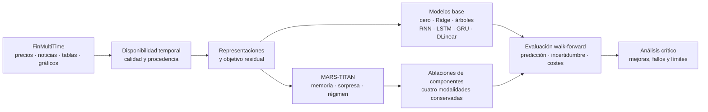

# MARS-TITAN

**Memoria causal adaptativa para predicción bursátil multimodal**

Proyecto de investigación y desarrollo de **Gonzalo García Lama** sobre memoria neural y predicción financiera multimodal.

[](LICENSE)

[Tablero Kanban privado](https://github.com/users/GonxKZ/projects/4) · [Issues](https://github.com/GonxKZ/mars-titan/issues) · [Hitos](https://github.com/GonxKZ/mars-titan/milestones) · [Documentación](docs/README.md)

[Observatorio de experimentos](https://gonxkz.github.io/mars-titan/) · [Recolección, publicación y límites](docs/engineering/campaign-observatory.md)

## Qué se quiere investigar

Los mercados cambian, las noticias llegan a distintas horas y una parte de la información financiera se publica después del periodo al que se refiere. En estas condiciones, una buena predicción sobre un histórico no basta para demostrar que un modelo generaliza.

MARS-TITAN estudia si una memoria neural adaptativa, que selecciona eventos financieros relevantes y conserva información útil de distintos contextos de mercado, aporta valor frente a modelos más sencillos. Los entrenamientos combinan siempre cuatro modalidades de **FinMultiTime**: precios, noticias, fundamentales y gráficos. Cada muestra debe justificar la disponibilidad de las cuatro. El contexto macroeconómico las complementa, no sustituye ninguna de ellas.

La investigación incorpora mecanismos de aprendizaje y memoria, recurrencia interna de pocos pasos y contexto macroeconómico. La inspiración biológica se traduce en hipótesis sobre retención, adaptación y reaprendizaje. Los antecedentes recientes, incluidos DeepSeek y modelos financieros con memoria, sirven para decidir qué comparar y qué técnicas pueden ser útiles en una GPU pequeña.

La pregunta principal es: **¿mejora una memoria adaptativa de eventos la predicción de retornos residuales fuera de muestra, con un presupuesto de cómputo comparable y después de controlar la fuga temporal?** La utilidad financiera se examinará mediante simulaciones con costes. Una mejora predictiva no implica por sí sola rentabilidad.

**Última edición analizada:** las cuatro ventanas con 140 indicadores completaron 64 referencias neuronales y 96 continuaciones supervisadas. En validación, 59 continuaciones mejoran al padre y 37 conservan su estado inicial. La [revisión de esta edición](reports/baselines/strict140-validation-20260930.md) distingue selección, sobreajuste observado y evaluación pendiente. La [edición anterior de 470 muestras](reports/baselines/post-scan-reference-study.md) mantiene sus resultados y límites por separado.

El [estado del 5 de octubre](reports/baselines/campaign-status-20261005.md) confirma los 160 casos neuronales y los 1.352 casos posteriores completos, incluidos 68 tabulares, 528 ajustes y 756 evaluaciones. El RL financiero sintético se reanudó tras corregir supervisión y recibos. Los 216 ajustes históricos y sus [comprobaciones anteriores](reports/baselines/campaign-status-20261001.md) permanecen separados. Completar las ejecuciones no sustituye la revisión de sus resultados.

La [revisión de las 216 predicciones históricas](reports/baselines/historical-validation-20261001.md) encuentra 21 ajustes con menor MAE por sesión que su padre y 195 con mayor error. Corresponden a la edición con cobertura macro incompleta y salida discreta. Ese balance no se atribuye automáticamente a sobreajuste ni se mezcla con las ventanas estrictas.

La [edición de convergencia](reports/resources/convergence-verification-20261001.md) añade mínimos de aprendizaje antes de consumir paciencia, selección durante XGBoost y parada financiera en C++20. Conserva el mejor estado y una recuperación acotada. Las pruebas incluyen CUDA y recuperación exacta, sin atribuir todavía una mejora predictiva a esta edición.

El [ejecutor recuperable](docs/engineering/reference-campaign.md) recorre todas las filas admitidas de cada edición, continúa desde el cursor confirmado y conserva los casos terminados. Las campañas anteriores de [405 muestras](reports/baselines/streaming-reference-study.md) y [295 muestras](reports/baselines/verified-reference-study.md) también completaron 100 ajustes cada una. Los ensayos sobre [105 muestras](reports/baselines/expanded-comparison.md) y [65 observaciones](reports/baselines/recurrent-comparison.md) permanecen como registros separados.

El panel técnico anterior de 25.856 muestras sirvió para preparar y medir el flujo de datos. Ese recuento no acredita la verificación editorial completa de sus noticias. El inventario cubre toda la copia y los datos macro conservan publicaciones, revisiones y unidades históricas. La arquitectura MARS-TITAN y la comparación confirmatoria siguen pendientes. «Causal» se refiere al orden de disponibilidad de la información, no a la identificación de causas económicas.

El [índice textual completo](reports/data/corpus-index-20260922.md) ya recorre los 5.586 archivos de ambos mercados y conserva 4.469.917 registros con sus localizadores y hashes. Incluye instrumentos incompletos y no filtra por sector. Este censo no convierte las noticias pendientes en contenido verificado ni acredita nuevos entrenamientos.

La [preparación y sus límites](docs/data/preparation.md) y la [ampliación verificada de noticias](reports/data/verified-news-cohort-20260922.md) detallan la cobertura real. El [presupuesto experimental](reports/resources/campaign-budget.md) conserva las mediciones anteriores, incluida una comprobación de 20 épocas. El observatorio muestra la última publicación del recolector local. Su fecha de publicación se distingue del último progreso y de la observación del proceso.

## Módulos implementados y comprobaciones pendientes

Las guías de cada módulo recogen sus pruebas y límites. La implementación de estas herramientas no acredita haber entrenado el candidato MARS-TITAN ni completado nuevas comparaciones científicas.

| Módulo | Comportamiento implementado | Límite de la evidencia |
| --- | --- | --- |
| [Observatorio](docs/engineering/campaign-observatory.md) | Recolección local con historial SQLite, páginas de 64 registros y publicación periódica en Pages. Separa entrenamiento, generación sintética y evaluación financiera, y excluye datos reservados del paquete público. | La web depende de los informes observados y del último despliegue. No deduce pasos de entrenamiento a partir de un proceso activo. |
| [Episodios y mundos sintéticos](docs/engineering/experimental-episodes.md) | Bloques cronológicos recuperables, remuestreo solo de entrenamiento, mundos de mecanismo conocido y aumentos con tamaños emparejados. Conserva las cuatro modalidades y el contexto macro simulado con sus máscaras. | Las pruebas de contrato usan codificadores controlados. La ruta con MiniLM y ResNet18 reales requiere comprobación CUDA. No demuestra utilidad predictiva del aumento. |
| [Simulación y comparadores](docs/engineering/persistent-simulation.md) | Efectivo por moneda, posiciones, órdenes, splits y dividendos. PPO, Double DQN y reglas fijas utilizan predicciones congeladas y estados recuperables. | La comprobación usa datos sintéticos de contabilidad conocida. El histórico real con OHLC sin ajustar, calendarios y acciones corporativas acreditados sigue pendiente. |
| [Ejecutable C++20](docs/engineering/native-financial-simulation.md) | `mars-titan-sim` lee Parquet con Arrow C++, ejecuta la contabilidad y las políticas de referencia, recupera checkpoints y compara escenarios concurrentes sin iniciar Python. | Se contrasta con la referencia sobre validación sintética. El núcleo y la sesión tienen perfiles de Clang/GCC, análisis estático, sanitizadores y fuzzing separados de Release. |
| [Entornos por lotes y contexto causal](docs/engineering/batched-rl-environments.md) | Lotes C++20 con observaciones contiguas, contexto externo fechado, confirmación conjunta y reinicio explícito. Filtro HMM recuperable y ventajas PPO por entorno. | Las medidas del simulador no equivalen a acelerar el entrenamiento completo. Los especialistas y su integración neural requieren comparaciones separadas. |
| [PPO nativo](docs/engineering/native-ppo.md) | Política C++20 con LibTorch, dos capas de 64 unidades, decisiones por lotes y recuperación de modelo, Adam, RNG y rollout. Valida el estado inicial y conserva dos recientes y el mejor seleccionado. | Admite fuentes sintéticas y un diagnóstico CPU de hasta 32 transiciones de ajuste. La implementación no acredita rendimiento CUDA ni resultados del candidato MARS-TITAN. |
| [Adaptación RL y auditoría](docs/engineering/adaptive-rl.md) | Ocho familias sintéticas y nueve variantes, con ventana, GRU, memoria episódica, HMM, consolidación y control Double DQN. Rotación de fuentes, trazas confirmadas, explicaciones sin otro LLM y auditoría separada del mejor checkpoint a tres costes. | [Recuperación CUDA de las nueve variantes](reports/resources/adaptive-cuda-recovery-20260929.json). La campaña terminó 63 casos de siete variantes, tres semillas y tres etapas (piloto, ajuste y auditoría). Los mundos simulan tres conceptos macro de 140. El candidato MARS-TITAN sigue pendiente. |
| [Postentrenamiento emparejado](docs/engineering/paired-posttraining.md) | Ajustes sobre datos reales, remuestreados y sintéticos, con padres identificados, seis objetivos residuales y continuaciones neuronales MAE/MSE. La selección usa validación real y el test permanece cerrado. | Se ha comprobado con ejemplos pequeños en CPU. La campaña científica no se ha ejecutado y la integración real en GPU sigue pendiente. |

La [medición de lectura y simulación](docs/engineering/episode-pipeline-performance.md) compara concurrencia sobre episodios analíticos y comprueba paridad contable. No mide codificadores neuronales ni entrenamiento en GPU. El [diseño de capacidad y coste por parámetro](docs/research/parameter-efficiency.md) define futuros contrastes de representación, parámetros compartidos, destilación y selección de memoria para O3, O4 y O6.

Las [continuaciones de edición 2](docs/engineering/continuation-selection.md) consideran el estado inicial del padre y permiten parada temprana en el control real. Conservan dos checkpoints de recuperación y el mejor si es distinto. La [revisión de cómputo](reports/resources/compute-review.md) reúne las optimizaciones medidas, sus referencias y los recorridos CUDA pendientes de una ventana exclusiva.

## Avances por día

Las fechas siguientes corresponden a cambios del historial de desarrollo, en horario de Madrid. Los enlaces permiten consultar su alcance. Incorporar código o documentar un contraste no equivale a haber ejecutado el experimento.

| Fecha de 2026 | Cambios y evidencia |
| --- | --- |
| 18 de septiembre | [Estructura y protocolo](https://github.com/GonxKZ/mars-titan/commit/d126b511a3920a62ee939875e218a98b7c50ee39), contratos de recuperación y [observatorio inicial](https://github.com/GonxKZ/mars-titan/commit/4a16fc26b00c062d6afe8e8108db2e68de68f2a2). |
| 19 de septiembre | [Preparación de entradas multimodales](https://github.com/GonxKZ/mars-titan/commit/7d2e21d324104491db8c1d6589d08b799c7653cc), medición de coste y revisión de la documentación propia en español. |
| 20 de septiembre | Comprobaciones de noticias, precios y exportación Parquet recuperable. [Admisión estricta de artículos](https://github.com/GonxKZ/mars-titan/commit/3766e00c786b7a0b5bb8713e47d87f3737c06806) y procedencia del tokenizador. |
| 21 de septiembre | [Ridge por bloques](https://github.com/GonxKZ/mars-titan/commit/b4c85dbd5cfd111858c9de5f3bcc702d461e7c97), boosting, diagnósticos nativos y [diseño de regímenes causales](https://github.com/GonxKZ/mars-titan/commit/c3bfe932593ba5a7cfedff4ca6ec2ff565b0861f). |
| 22 de septiembre | [Referencias recurrentes y DLinear](https://github.com/GonxKZ/mars-titan/pull/103), factores empresariales e [inventario recuperable del corpus](https://github.com/GonxKZ/mars-titan/commit/73c7c87be08c6b837264212290f72c24abd635e9). |
| 23 de septiembre | [Campañas y checkpoints recuperables](https://github.com/GonxKZ/mars-titan/commit/1c018c97ac5d4b3f30f813780cb59a519c352600), selección de épocas, métricas por sesión y [búsqueda de configuraciones](https://github.com/GonxKZ/mars-titan/commit/9b8344757df908467712ef8d34bb7d6aaaee892f). |
| 24 de septiembre | [Episodios sintéticos](https://github.com/GonxKZ/mars-titan/pull/138), [simulación y comparadores financieros](https://github.com/GonxKZ/mars-titan/pull/139), ejecución C++20 y [medidas de rendimiento](https://github.com/GonxKZ/mars-titan/pull/156). |
| 25 de septiembre | Sin commits fechados ese día en el historial consultado. No permite concluir si hubo ejecuciones o trabajo local. |
| 26 de septiembre | Correcciones de [admisión GPU](https://github.com/GonxKZ/mars-titan/pull/161), memoria de ordenación y [seguimiento del progreso CPU](https://github.com/GonxKZ/mars-titan/pull/166). |
| 27 de septiembre | [Auditoría temporal](https://github.com/GonxKZ/mars-titan/pull/169), sanitizadores, cuarentena ALFRED, [cobertura macro completa](https://github.com/GonxKZ/mars-titan/pull/174) y contratos de validación con purga. |
| 28 de septiembre | Recuperación de publicaciones macro y [ediciones versionadas](https://github.com/GonxKZ/mars-titan/pull/178), [vistas temporales](https://github.com/GonxKZ/mars-titan/pull/179) y [búsqueda estricta con retención del padre](https://github.com/GonxKZ/mars-titan/pull/180). Ampliación de [entornos por lotes](docs/engineering/batched-rl-environments.md), [PPO nativo con validación y recuperación](https://github.com/GonxKZ/mars-titan/pull/182) y revisión de [expertos y contexto financiero](docs/research/contextual-experts.md). Corrección del [seguimiento y recálculo por ventanas temporales](docs/engineering/prediction-review.md). |
| 29 de septiembre | [Memoria, GRU, HMM y Double DQN en C++20](docs/engineering/adaptive-rl.md), con [pruebas de integración](reports/resources/adaptive-integration-verification.json) y [recuperación exacta CUDA](reports/resources/adaptive-cuda-recovery-20260929.json). La [medición del recorrido completo](reports/resources/adaptive-pipeline-performance.md) registra mejoras y regresiones. El piloto de 21 ejecuciones terminó y seleccionó 524.288 transiciones para cada ajuste principal, ya en marcha sobre mundos sintéticos. El test final real sigue cerrado. |
| 30 de septiembre | [Continuación temporal](docs/engineering/temporal-posttraining.md) con recuperación entre etapas y evaluación de estados congelados. [Análisis de las 160 ejecuciones neuronales terminadas](reports/baselines/strict140-validation-20260930.md), con 59 mejoras de validación y 37 continuaciones que conservan al padre. |
| 1 de octubre | Integración de [comparadores nativos](https://github.com/GonxKZ/mars-titan/pull/187) y [continuación temporal](https://github.com/GonxKZ/mars-titan/pull/188), con [verificación local conjunta](reports/resources/integration-20261001.md). [Estado comprobado de las campañas](reports/baselines/campaign-status-20261001.md), con la serie histórica terminada y 67 casos nuevos confirmados. [Mínimos, paciencia y recuperación](https://github.com/GonxKZ/mars-titan/pull/196) verificados en CPU y CUDA. |
| 4 de octubre | [Caché de consultas episódicas C++20](reports/resources/episodic-query-20261004.md), con menos asignaciones y dos comparaciones completas CUDA. Paridad exacta de pesos, Adam, RNG y trazas. Sanitizadores y seguimiento de asignaciones de LibTorch en [#202](https://github.com/GonxKZ/mars-titan/issues/202). [Memoria y contexto](docs/research/neuroarchitecture-review.md), con 27 fuentes nuevas. Segunda revisión de [atención y replay](docs/research/attention-replay-review.md), [eventos y señales reducidas](docs/research/event-signal-comparison.md), con otras 40 fuentes y [comprobaciones matemáticas](docs/research/attention-replay-mathematics.md). Las variantes continúan en diseño. |
| 5 de octubre | Publicación del análisis de [integración arquitectónica y postentrenamiento](docs/research/system-integration.md). Implementación de [controles experimentales](docs/engineering/experimental-controls.md): memoria saturada y ruido, documentos individuales, vistas reducidas, replay, adaptadores y cohortes recuperables. Corrección de [supervisión CUDA](docs/engineering/gpu-admission.md) y [recibos](docs/engineering/campaign-receipts.md), con reanudación de comparadores. Se conservan medidas desfavorables y límites de los controles. La [publicación en Pages](docs/engineering/campaign-observatory.md) permite terminar el despliegue en curso. El candidato continúa en diseño. |

## Alcance y recursos

El equipo de trabajo tiene **32 GB de RAM y una RTX 4070 Max-Q de 8 GB**. La campaña prevista utiliza todo el universo admisible, sin límite de 64 o 128 activos, en tres brazos: Estados Unidos, China y ambos mercados juntos. La copia original contiene 108,2 GiB. Los datos preparados se guardan en Parquet y se leen por lotes, sin duplicar todas las ventanas en memoria. Los recursos limitan el tamaño del lote y condicionan el tiempo, no justifican presentar un panel pequeño como el corpus completo. El [presupuesto de almacenamiento](reports/resources/storage-budget.md) distingue disco, tensores y memoria. Cada brazo requiere cuatro modalidades válidas, contexto macro y disponibilidad temporal comprobada. La procedencia china pendiente debe resolverse antes de declarar preparado ese mercado o la comparación conjunta.

La preparación y las representaciones son reanudables. Las referencias neuronales conservan pesos, AdamW, generadores y cursor confirmado, con pruebas de continuidad exacta. La [persistencia comprobada](reports/reproducibility/reference-checkpoints.md) distingue esa implementación de los contratos pendientes de la futura memoria adaptativa. XGBoost recupera la última ronda confirmada. Ridge puede repetir el caso en curso si no terminó. El [plan de cómputo](docs/engineering/compute-plan.md) contempla la disponibilidad del equipo durante las 24 horas, sin confundirla con rendimiento máximo sostenido.

## Diseño del estudio


```mermaid
flowchart LR
    D[FinMultiTime<br/>precios · noticias · tablas · gráficos] --> P[Disponibilidad temporal<br/>calidad y procedencia]
    P --> X[Representaciones<br/>y objetivo residual]
    X --> B[Modelos base<br/>cero · Ridge · árboles<br/>RNN · LSTM · GRU · DLinear]
    X --> M[MARS-TITAN<br/>memoria · sorpresa · régimen]
    M --> A[Ablaciones de componentes<br/>cuatro modalidades conservadas]
    B --> E[Evaluación walk-forward<br/>predicción · incertidumbre · costes]
    A --> E
    E --> C[Análisis crítico<br/>mejoras, fallos y límites]
```

Una predicción solo puede usar datos disponibles en su instante de decisión. La memoria se actualiza con errores de predicciones anteriores **cuando sus etiquetas ya han madurado**. Las tablas contables necesitan fechas de publicación y los gráficos se construirán exclusivamente con ventanas pasadas.

## Objetivos y evidencias

| Objetivo / fase | Resultado que se deberá demostrar |
| --- | --- |
| 1. Datos multimodales | Subconjunto reproducible, contrato temporal, procedencia y controles contra fuga de información. |
| 2. Problema predictivo | Objetivo residual respecto al mercado. Extensión sectorial solo si los datos permiten justificarla. |
| 3. Memoria adaptativa | Prototipo compacto, actualización temporal verificable, regímenes e incertidumbre. |
| 4. Comparativa | Modelos base y ablaciones con iguales datos, particiones y presupuesto documentado. |
| 5. Evaluación | Walk-forward, métricas predictivas y financieras, costes y estimación de incertidumbre de las diferencias. |
| 6. Análisis crítico | Interpretación por periodo, modalidad y régimen. Resultados negativos, limitaciones y trabajo futuro. |

Los objetivos se gestionan como seis hitos y 64 tareas canónicas, con prioridad, tamaño, dependencias y criterios de aceptación. Cada issue concreta herramientas, entradas, pasos, artefactos previstos y pruebas. Cinco tareas redundantes se han consolidado conservando su historial. El código y la documentación se organizan por su función, no por fase. El [plan de trabajo](docs/research/roadmap.md), el [catálogo del tablero](docs/research/task-board.md) y la [guía de implementación](docs/engineering/implementation-guide.md) explican cómo avanzar sin convertir las extensiones en obligaciones del núcleo.

## Documentación

- [Mapa de documentación](docs/README.md).
- [Protocolo de investigación](docs/research/protocol.md), [experimentos](docs/research/experiment-matrix.md) y [revisión del documento inicial](docs/research/original-review.md).
- [Arquitectura candidata](docs/research/candidate-architecture.md), [capacidad y coste por parámetro](docs/research/parameter-efficiency.md), [hipótesis y antecedentes](docs/research/novelty-ledger.md) y [revisión adversarial](docs/research/adversarial-review.md).
- [Variante ampliada y comparaciones justas](docs/research/neuroarchitecture-review.md), con [condiciones de memoria y contraejemplos](docs/research/memory-mathematics.md). El candidato continúa sin implementar ni entrenar.
- [Atención, repetición y autoevaluación](docs/research/attention-replay-review.md), [eventos públicos y señales reducidas](docs/research/event-signal-comparison.md), con [límites de información y replay](docs/research/attention-replay-mathematics.md).
- [Integración arquitectónica y postentrenamiento](docs/research/system-integration.md), con responsabilidades, puntos de extensión, dependencias de estado y estimaciones matemáticas.
- [Preparación experimental ejecutable](docs/engineering/experimental-controls.md), con controles C++20, lectores y vistas, recuperación, medidas y perfiles de verificación conjuntos.
- [Contrato de datos](docs/data/data-contract.md), [inspección inicial de FinMultiTime](docs/data/finmultitime-card.md) y [arquitectura](docs/engineering/architecture.md).
- [140 indicadores macroeconómicos](docs/data/macro-catalog.md), con fuentes, fórmulas y disponibilidad. La [edición temporal estricta](docs/engineering/strict-temporal-search.md) exige los 140 en cada muestra admitida. Las ediciones anteriores conservan su cobertura y exclusiones originales.
- [Expertos, regímenes y contexto financiero](docs/research/contextual-experts.md), con fuentes primarias hasta 2026, hipótesis pendientes y controles adversariales.
- [Fuentes gratuitas y nueve archivos complementarios obtenidos](docs/data/free-data-sources.md), conservados en instantáneas locales separadas del benchmark, y [actualización manual](docs/data/public-source-updates.md).
- [Biblioteca y revisión bibliográfica](docs/references/README.md): publicaciones primarias, libros, fuentes financieras, BibTeX y descargas locales con huella de integridad.
- [Memoria y aprendizaje](docs/references/brain-review.md), [eficiencia de DeepSeek](docs/references/deepseek-review.md), [recorrido completo del dataset](docs/engineering/full-dataset-training.md) y [presupuesto de latencia](docs/engineering/latency-budget.md).
- [Contraste de los ocho posts aportados](docs/references/social-followup.md): recursos aprovechables, límites de acceso y afirmaciones que no se pueden verificar.
- [Entorno y reproducción](docs/engineering/reproducibility.md) y [riesgos](docs/research/risks.md).
- [Verificación de esta entrega](docs/engineering/research-verification.md), con comprobaciones realizadas y límites pendientes.

## Estructura del repositorio

```text
src/mars_titan/       Datos, modelos de referencia, episodios y simulación
native/              C/C++ y CUDA con CMake, optimización guiada por perfilado
configs/             Configuraciones de datos y experimentos
tests/               Pruebas de datos, cálculos, recuperación y herramientas
scripts/             Biblioteca, captura de fuentes y mantenimiento
site/                Observatorio estático, sin ejecutar modelos en el navegador
notebooks/           Exploraciones acotadas y reproducibles
data/                Contratos y manifiestos, derivados locales ignorados
dataset/             Copia local existente de FinMultiTime, fuera de Git
docs/                Investigación, ingeniería y bibliografía
thesis/              Documento de investigación en LaTeX
reports/             Auditorías, mediciones y fichas de experimentos
.github/             Planificación y plantillas de revisión
```

## Empezar

Requisitos: Git, [uv](https://docs.astral.sh/uv/) y ripgrep. La comprobación nativa necesita CMake y compiladores C/C++. El entorno de desarrollo usa Python 3.12, gestionado por uv. La [guía de entorno](docs/engineering/reproducibility.md) recoge las dependencias del sistema.

```bash
git clone https://github.com/GonxKZ/mars-titan.git
cd mars-titan
uv sync --locked
uv run ruff check .
uv run ruff format --check .
uv run python scripts/check_repository.py
```

La suite completa de `uv run pytest` requiere las dependencias científicas y los binarios nativos. Su preparación se describe en las guías de [reproducibilidad](docs/engineering/reproducibility.md), [simulación C++20](docs/engineering/native-financial-simulation.md) y [PPO nativo](docs/engineering/native-ppo.md). Las comprobaciones CUDA requieren una GPU libre.

Las comprobaciones se ejecutan localmente antes de publicar cambios. La única excepción autorizada de GitHub Actions es publicar la página de GitHub Pages, sin pruebas ni entrenamientos en GitHub.

Para preparar análisis y entrenamiento en Linux x86-64 con NVIDIA:

```bash
uv sync --locked --extra data --extra research --extra cuda --extra encoders
nvidia-smi
uv run python - <<'PY'
import torch

if not torch.cuda.is_available():
    raise RuntimeError("CUDA no está disponible")
device = torch.device("cuda:0")
print(torch.cuda.get_device_name(device))
print(torch.ones(1, device=device).item())
PY
```

La comprobación falla si no hay CUDA. Los experimentos seleccionarán `cuda:0`. La instalación de PyTorch tiene un índice CUDA explícito y los controles de calidad no requieren descargarlo. Para tareas independientes existe además un entorno compartido compatible: véase [reproducibilidad](docs/engineering/reproducibility.md).

La biblioteca se obtiene desde las fuentes registradas:

```bash
uv run python scripts/fetch_references.py
```

Los fallos de acceso quedan registrados. El catálogo no autoriza redistribuir publicaciones. Los PDF de terceros se conservan en `docs/references/library/`, fuera de Git. Un clon contiene las referencias y el procedimiento de descarga.

Para consultar las fuentes públicas habilitadas y obtener una captura nueva del RSS monetario oficial:

```bash
uv run python scripts/refresh_public_sources.py --list
uv run python scripts/refresh_public_sources.py --source fed_monetary_rss
```

El actualizador necesita `curl`. Sin `--source`, consulta las ocho fuentes renovables validadas. Cada ejecución crea su propio manifiesto y conserva las capturas anteriores. No mezcla actualizaciones con el benchmark ni instala tareas periódicas. Los límites, la selección explícita de documentos PDF y las precauciones temporales se detallan en la [guía de actualización](docs/data/public-source-updates.md).

## Datos, resultados y licencia

Para generar una instantánea puntual del observatorio desde estados locales:

```bash
uv run --locked python scripts/export_observatory.py --output site/data/observatory.json
node --test site/tests/*.test.mjs
```

El exportador no usa GPU, red ni logs completos. Generar una instantánea no la publica. La web puede consultar el último resumen publicado o importar un JSON local sin enviarlo a un servidor. El [recolector de campañas](docs/engineering/campaign-observatory.md) mantiene el historial paginado y permite observar fuentes cada 15 segundos y publicar cambios ordinarios cada cinco minutos. Los estados terminales tienen prioridad. La [guía de la web](site/README.md) describe la consulta y las comprobaciones locales.

La copia de FinMultiTime y sus derivados no se suben al repositorio. La selección experimental se fijará tras auditar cobertura, fechas y derechos de uso. No se presentan aquí resultados de rentabilidad ni recomendaciones de inversión.

El código y la documentación originales se distribuyen bajo [MIT](LICENSE), una licencia gratuita y permisiva. Los documentos de terceros, los datos, los artículos y los libros mantienen sus condiciones originales: [avisos de terceros](THIRD_PARTY_NOTICES.md).

Para citar el proyecto, utilizar [CITATION.cff](CITATION.cff). Las normas de desarrollo están en [CONTRIBUTING.md](CONTRIBUTING.md).
