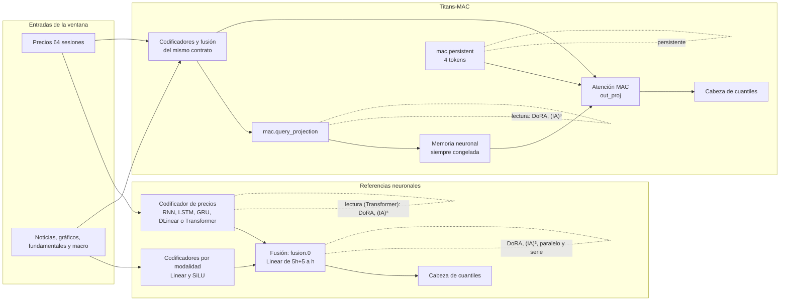
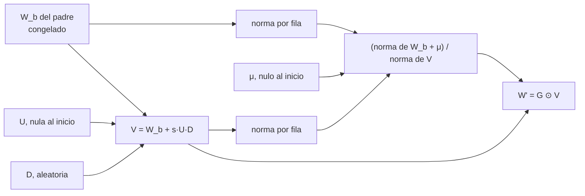
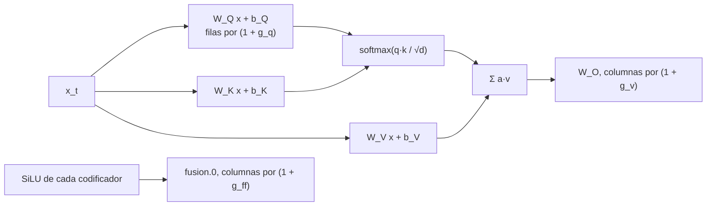
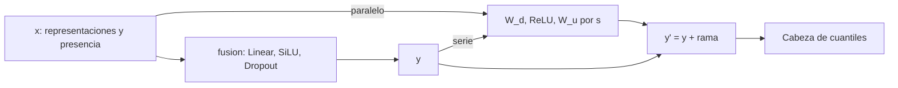
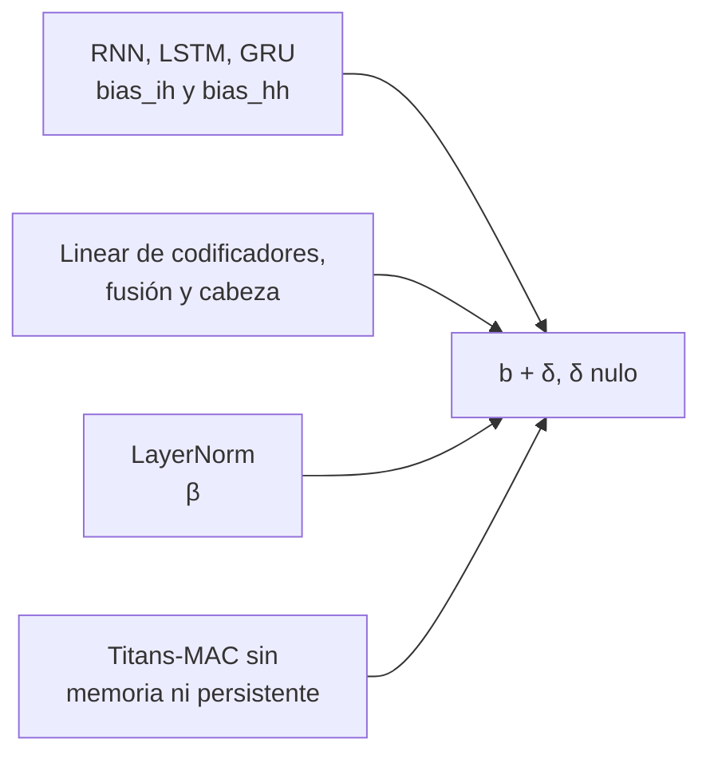
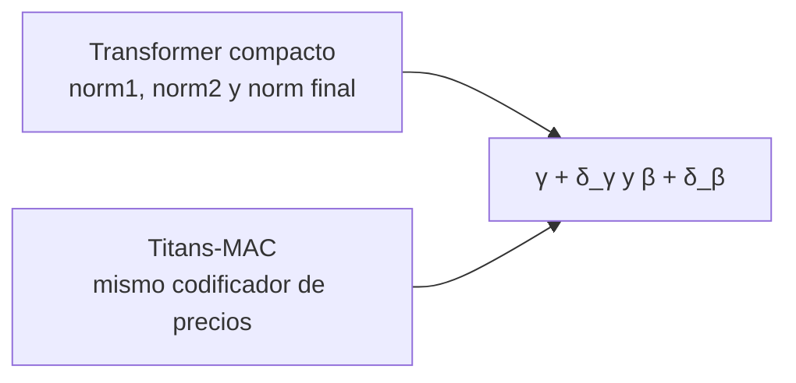
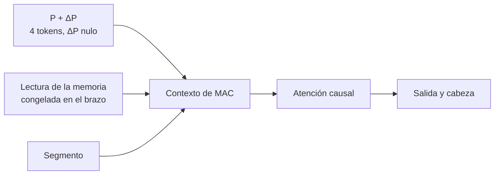

# Variedad de adaptadores del postentrenamiento

La matriz de adaptadores de [#364](https://github.com/GonxKZ/mars-titan/issues/364) compara correcciones completas y de bajo rango (LoRA) en tres puntos (cabeza, lectura y fusión), la continuación completa y el padre congelado. [#444](https://github.com/GonxKZ/mars-titan/issues/444) amplía esa comparación con otras familias de adaptadores sin cambiar el diseño: mismas filas nuevas por ventana, mismo número de actualizaciones, mismo objetivo y misma selección. Este documento recoge la revisión de fuentes primarias, los descartes razonados, las ecuaciones de lo implementado, su correspondencia con el código y las pruebas, el coste medido sin ajustar y los brazos propuestos.

Estado: implementado y comprobado sin aprendizaje. No se ha ajustado ningún brazo ni se ha ejecutado ningún paso de optimizador, también en las pruebas. No hay resultados predictivos y nada de lo que sigue afirma que un adaptador mejore a otro.

## Problema y criterio de admisión

El [walk-forward por etapas](masked-posttraining.md#etapa-por-ventana-de-la-campaña) condiciona qué adaptadores tienen sentido. En la ventana k el padre es el estado que la campaña base eligió en k-1 y cada caso solo ve las filas de k que ese padre no usó. En la vista conjunta US+CN preparada (fold-001 a fold-012) son entre 166.494 y 308.022 filas nuevas por ventana, menos que su validación (340.354 a 609.090 filas). Con lotes de 256 y cinco épocas, cada caso aplica entre 3.255 y 6.020 actualizaciones. Las series no son estacionarias, los padres son pequeños (dimensión 32 o 64, una capa) y el presupuesto total de la campaña es de unas cuatro semanas de GPU.

De ahí salen cinco condiciones para admitir una forma:

1. **Identidad exacta al inicio.** Con sus correcciones nulas el brazo emite los mismos bits que el padre. El padre congelado es candidato en la época cero y solo se sustituye con una mejora estricta de la validación, así que un brazo que difiera del padre por redondeo podría ganar o perder sin haber aprendido nada.
2. **Fuente verificable.** Artículo con versión y fecha y, si existe, código oficial con commit y licencia. Lo que no viene de la fuente se marca como derivación propia o desviación.
3. **Alternativa trivial en la misma matriz.** Cada forma se contrasta con algo más sencillo que puede descartarla: LoRA en el mismo punto, el rango completo, la continuación completa con las mismas actualizaciones y el padre congelado.
4. **Punto existente.** Se inserta en un tensor o bloque que ya tiene el padre, sin cambiar la arquitectura ni las entradas.
5. **Coste medido.** Forward y backward con las formas reales, sin pasos de optimizador.

## Fuentes revisadas

Las versiones y commits se comprobaron el 10 de octubre de 2026. «Sin licencia» significa que el repositorio no declara ninguna, así que su código no se ha copiado. Ninguna implementación de este trabajo copia código de terceros. Las ecuaciones se reescriben a partir de los artículos.

| Método | Artículo | Código oficial | Licencia |
| --- | --- | --- | --- |
| LoRA | Hu et al., arXiv:2106.09685v2 (16 oct. 2021), ICLR 2022 | microsoft/LoRA `c4593f06` | MIT |
| DoRA | Liu et al., arXiv:2402.09353v6 (9 jul. 2024), ICML 2024 | NVlabs/DoRA `7e2f10ab` | NVIDIA Source Code License |
| PiSSA | Meng et al., arXiv:2404.02948v4 (9 abr. 2025), NeurIPS 2024 | MuLabPKU/PiSSA `a6e4c9c1` | Sin licencia |
| rsLoRA | Kalajdzievski, arXiv:2312.03732v1 (28 nov. 2023) | Sin repositorio oficial (opción `use_rslora` de PEFT) | No aplica |
| LoRA+ | Hayou et al., arXiv:2402.12354v2 (4 jul. 2024), ICML 2024 | nikhilgsh/loraplus `a0c44bfe` | MIT |
| VeRA | Kopiczko et al., arXiv:2310.11454v2 (16 ene. 2024), ICLR 2024 | Sin repositorio oficial público | No aplica |
| (IA)³ | Liu et al., arXiv:2205.05638v2 (26 ago. 2022), NeurIPS 2022 | r-three/t-few `114deced` | MIT |
| BitFit | Ben Zaken et al., arXiv:2106.10199v5 (5 sep. 2022), ACL 2022 | benzakenelad/BitFit `7ead19a8` | MIT |
| Adaptadores en serie | Houlsby et al., arXiv:1902.00751v2 (13 jun. 2019), ICML 2019 | google-research/adapter-bert `1a31fc6e` | Apache-2.0 |
| Adaptadores en paralelo | He et al., arXiv:2110.04366v3 (2 feb. 2022), ICLR 2022 | jxhe/unify-parameter-efficient-tuning `3222ce2c` | Apache-2.0 |
| Prefix-Tuning | Li y Liang, arXiv:2101.00190v1 (1 ene. 2021), ACL 2021 | XiangLi1999/PrefixTuning `6519d30e` | Sin licencia |
| Prompt Tuning | Lester et al., arXiv:2104.08691v2 (2 sep. 2021), EMNLP 2021 | google-research/prompt-tuning `72285eea` | Apache-2.0 |
| P-Tuning v2 | Liu et al., arXiv:2110.07602v3, ACL 2022 | THUDM/P-tuning-v2 `b1520c9a` | Apache-2.0 |
| LLaMA-Adapter | Zhang et al., arXiv:2303.16199v3 (18 sep. 2024), ICLR 2024 | OpenGVLab/LLaMA-Adapter `521a09da` | GPL-3.0 |
| Ajuste de LayerNorm | Qi et al., arXiv:2211.08682v3 y Zhao et al., arXiv:2312.11420v1, ICLR 2024 | No revisado | No aplica |
| Memoria persistente | Sukhbaatar et al., arXiv:1907.01470v1 y Titans, Behrouz et al., arXiv:2501.00663v1, sección 3.3 | No aplica | No aplica |
| Series temporales | GPT4TS, Zhou et al., arXiv:2302.11939v6, NeurIPS 2023. LLM4TS, Chang et al., arXiv:2308.08469v6. Gupta et al., arXiv:2405.10216v1. LLIAM, arXiv:2410.11539v3 | DAMO-DI-ML/NeurIPS2023-One-Fits-All `9f3875db` (sin licencia), blacksnail789521/LLM4TS `cb2426c7` (MIT) | Indicada en cada caso |
| Olvido y regularización | Biderman et al., arXiv:2405.09673v2, TMLR 2024. Shuttleworth et al., arXiv:2410.21228v3. L2-SP, Li et al., arXiv:1802.01483v2, ICML 2018. EWC, Kirkpatrick et al., arXiv:1612.00796v2, PNAS 2017 | No aplica | No aplica |
| Ajuste por partes y posterior | Surgical fine-tuning, Lee et al., arXiv:2210.11466v3, ICLR 2023. LP-FT, Kumar et al., arXiv:2202.10054v1, ICLR 2022. WiSE-FT, Wortsman et al., arXiv:2109.01903v3, CVPR 2022. TENT, Wang et al., arXiv:2006.10726v3, ICLR 2021 | mlfoundations/wise-ft `58b7a4b3`, DequanWang/tent `e9e926a6` (MIT) | Indicada en cada caso |
| Aprendizaje continuo con LoRA | O-LoRA, Wang et al., arXiv:2310.14152v1. MiLoRA, Wang et al., arXiv:2406.09044v3, NAACL 2025 | cmnfriend/O-LoRA `07117e1f` (MIT), sufenlp/MiLoRA `c3c94693` | Indicada en cada caso |
| Implementación de referencia | Hugging Face PEFT. Las pruebas de paridad usan la versión 0.21.0 publicada | huggingface/peft `9db0f371` (9 oct. 2026) | Apache-2.0 |

## Revisión adversarial y descartes

Cada propuesta se revisó frente a las cinco condiciones, a sus propias hipótesis y a la alternativa más sencilla que ya está en la matriz.

**Supervivientes.**

- **DoRA.** Separa magnitud y dirección de cada fila. Su tabla 15 muestra la mayor ventaja sobre LoRA con rango bajo (rango 4), que es nuestro régimen. Con la magnitud parametrizada como desplazamiento sobre la norma del padre arranca exactamente en el padre. La alternativa que puede descartarla es LoRA en el mismo punto con el mismo rango, que solo tiene `h` parámetros menos.
- **(IA)³.** Reescala activaciones con vectores aprendidos. En T-Few fue el único método eficiente que superó al ajuste completo con 20 a 70 ejemplos por tarea, y nuestra etapa tiene pocos datos nuevos por ventana. Parte de la identidad (factor 1) y tiene unas cinco veces menos parámetros que LoRA en la fusión.
- **Adaptadores en cuello de botella.** Son los únicos con una no linealidad propia. He et al. encuentran que en paralelo superan a la versión en serie, así que el paralelo entra en la campaña y el serie queda como reserva para poder contrastar esa conclusión. Con la proyección de subida a cero la rama vale exactamente cero.
- **BitFit.** Solo mueve los sesgos y es aplicable a todas las familias, incluidas las compuertas de RNN, LSTM y GRU. El artículo encuentra su mayor ventaja relativa con pocos datos.
- **Memoria persistente de Titans.** Es el prefijo aprendido que el propio artículo antepone al contexto de atención (ecuación 19). Adaptarlo con un desplazamiento nulo es el análogo de prefix-tuning que conserva la identidad exacta, porque no añade tokens.
- **Solo normalizaciones (reserva).** GPT4TS ajusta LayerNorm y embeddings posicionales de un GPT-2 congelado para series temporales y Zhao et al. lo proponen para LLM multimodales. Houlsby et al., en cambio, miden una caída de entre el 3,5 y el 4 % al ajustar solo LayerNorm frente a los adaptadores. En nuestras familias solo tienen LayerNorm el Transformer compacto y el codificador de precios de Titans-MAC, que es el mismo: dos por bloque y una final, $6h$ parámetros con una capa (384 con h = 64). Queda implementado y comprobado, sin proponerlo para la campaña.

**Descartes.**

| Propuesta | Motivo del descarte | Alternativa que ya lo cubre |
| --- | --- | --- |
| PiSSA | Inicializa con las componentes singulares principales y resta su producto del peso. El modelo inicial solo coincide con el padre salvo el redondeo de la SVD, así que rompe la condición 1. Su ventaja declarada es converger antes en modelos grandes, que con presupuesto fijo equivale a más pasos. El repositorio no tiene licencia. | LoRA en el mismo punto |
| MiLoRA | Mismo problema de identidad que PiSSA, con las componentes menores. | LoRA en el mismo punto |
| rsLoRA | Cambia la escala de α/r a α/√r. Su teorema 3.2 trata el límite de rango grande y nuestros rangos son 4. Con rango fijo es un cambio de α, es decir, de la tasa efectiva, no un adaptador distinto. | El α declarado de LoRA |
| LoRA+ | Da a la proyección de subida una tasa λ veces mayor (λ ≈ 2⁴ en RoBERTa). Se deriva con anchura n → ∞ y es una opción del optimizador, no del adaptador. Compararla exigiría su propia búsqueda de tasas. | La tasa común de la matriz |
| VeRA | Matrices aleatorias congeladas y compartidas con dos vectores entrenables. Su objetivo es ahorrar memoria en muchas capas de un LLM. Nuestros adaptadores ya tienen cientos o pocos miles de parámetros y, con vectores como único grado de libertad, (IA)³ cubre el mismo régimen con identidad exacta. Sin código oficial público. | (IA)³ y LoRA de rango bajo |
| Prefix-Tuning y P-Tuning v2 | Añadir claves y valores al contexto cambia el denominador del softmax aunque sean nulos, así que no parten del padre. El artículo además necesita una reparametrización con MLP para estabilizar el ajuste. | Memoria persistente en Titans-MAC |
| Prompt Tuning | El propio artículo solo lo encuentra competitivo a partir de miles de millones de parámetros. Tampoco parte del padre. | Memoria persistente en Titans-MAC |
| LLaMA-Adapter | Su compuerta tanh(g) con g = 0 sí da identidad exacta. En Titans-MAC duplica el papel de la memoria persistente, que ya comparte el softmax con el segmento, y en el Transformer compacto exigiría reescribir la atención sin evidencia en series temporales. | Memoria persistente y lectura con (IA)³ o DoRA |
| O-LoRA | Mantiene subespacios ortogonales entre tareas sucesivas sobre el mismo adaptador. En nuestra etapa cada ventana parte del padre de la campaña base, no del adaptador anterior, así que no hay secuencia de tareas. | No aplica |
| TENT | Minimiza la entropía en el test sin etiquetas y ajusta BatchNorm. Nuestros padres no tienen BatchNorm, la etapa sí tiene etiquetas maduras y adaptar en evaluación tocaría filas que deben quedar fuera del ajuste. | No aplica |
| EWC y L2-SP | Son regularizadores del ajuste completo, no adaptadores. L2-SP corrige la asimetría del decaimiento descrita más abajo y se propone como control. | Continuación completa |
| WiSE-FT | Interpola los pesos del padre y de la continuación con un α elegido en validación. No es un adaptador y exige inferencias adicionales por α. Queda como control posterior posible. | Padre congelado y continuación |
| LP-FT | Ajusta primero la cabeza y luego todo. Repartir el presupuesto en dos fases rompe la igualdad de actualizaciones de la matriz. | Brazo de la cabeza y continuación |

Surgical fine-tuning respalda el diseño por puntos que ya tiene la matriz: qué parte conviene ajustar depende del tipo de desplazamiento. Biderman et al. («LoRA learns less and forgets less») y Shuttleworth et al. (dimensiones intrusas) motivan las trazas del espectro singular de cada actualización, descritas más abajo.

## Formas implementadas

Las formas viven en `src/mars_titan/models/predictive_adaptation.py` y sus puntos de inserción en `src/mars_titan/posttraining/adapter_variety.py`. Las de tensor son parametrizaciones de PyTorch (`torch.nn.utils.parametrize`). El tensor original queda congelado y el peso efectivo se recalcula en cada forward. Las de módulo son ganchos de salida sobre el bloque de fusión. En todas, h es la dimensión oculta, r el rango, s = α/r la escala y los parámetros nuevos se inicializan con un generador propio, sin consumir el RNG global.

### Puntos de inserción por familia

Los sesgos (BitFit) y las normalizaciones se enumeran sobre el modelo cargado, fuera de la memoria neuronal y de la memoria persistente de Titans-MAC.

### DoRA

Para el bloque de filas $W_b \in \mathbb{R}^{m \times n}$ de un tensor del padre, con $U \in \mathbb{R}^{m \times r}$ nula, $D \in \mathbb{R}^{r \times n}$ aleatoria y el desplazamiento de magnitud $\mu \in \mathbb{R}^m$ nulo:

$$
V = W_b + s\,U D, \qquad
W'_b = \operatorname{diag}\!\left(\frac{\lVert W_b \rVert_{\text{fila}} + \mu}{\lVert V \rVert_{\text{fila}}}\right) V .
$$

La norma es la euclídea de cada fila de `nn.Linear`, una por unidad de salida, como en el código oficial. El artículo la escribe por columnas porque su matriz es la traspuesta. El artículo entrena la magnitud $m = \lVert W_b \rVert + \mu$ directamente. Aquí se parametriza como desplazamiento sobre la norma del padre, con la misma familia de funciones y el mismo gradiente. Solo cambia hacia dónde empuja el decaimiento de AdamW, que lleva al padre como en LoRA. Con $U = 0$, $V$ y $W_b$ tienen los mismos bits, las dos normas salen del mismo núcleo y el cociente vale exactamente 1.

Desviación declarada: la sección 4.3 del artículo y PEFT separan $\lVert V \rVert$ del grafo para ahorrar memoria. Aquí no se separa, porque con estas matrices la memoria no lo exige y así el gradiente es el de la función declarada. Parámetros: $r(m + n) + m$. La [paridad con PEFT 0.21.0](../../tests/models/test_adapter_peft_parity.py) lo comprueba: salidas y gradientes de la entrada y de la magnitud coinciden, los de $U$ y $D$ coinciden con PEFT al separar la norma en nuestras ecuaciones, y la diferencia con los nuestros es exactamente la proyección $-(c/\lVert V \rVert)(G \cdot \hat V)\hat V$ de cada fila, con $c$ la magnitud, $G$ el gradiente respecto a $W'_b$ y $\hat V = V/\lVert V \rVert$. En el caso de la prueba esa diferencia equivale al 40 % de la norma del gradiente de PEFT para $U$ y al 30 % para $D$.

Puntos: `fusion.0` en todas las familias. En la lectura del Transformer compacto, el bloque de consulta de `in_proj_weight` (filas 0 a h) y `out_proj` de cada capa. En Titans-MAC, `mac.query_projection` y `mac.attention.out_proj`.

### (IA)³

El artículo reescala claves, valores y la activación intermedia de la FFN con vectores $l_k, l_v, l_{ff}$ inicializados a uno. Aquí cada vector es $1 + g$ con $g = 0$, de modo que el factor inicial es exactamente 1. Las equivalencias que siguen son derivaciones propias, comprobadas numéricamente en las pruebas.

En la lectura de una atención con $q_t = W_Q x_t + b_Q$, la ganancia por filas sobre la consulta (pesos y sesgo comparten el mismo vector) es la ganancia de las claves del artículo, porque en cada cabeza

$$
\big(\operatorname{diag}(1+g)\,q\big)^\top k = q^\top \big(\operatorname{diag}(1+g)\,k\big) .
$$

La ganancia por columnas de `out_proj` equivale a la de los valores, porque la atención es lineal en ellos:

$$
W_O \operatorname{diag}(1+g) \sum_j a_{tj} v_j = W_O \sum_j a_{tj} \big(\operatorname{diag}(1+g)\, v_j\big) .
$$

En la fusión, la ganancia por columnas de `fusion.0` reescala las activaciones SiLU de cada codificador antes de la capa lineal, como $l_{ff}$ reescala $\gamma(W_1 x)$ antes de $W_2$. Las cinco columnas de bits de presencia reciben también su ganancia. En Titans-MAC la consulta pasa por la memoria neuronal, que no es lineal, así que la ganancia de `mac.query_projection` es una reescala de la consulta de memoria y no equivale a la de las claves. La de `out_proj` sí equivale a la de los valores de MAC. Parámetros: $5h + 5$ en la fusión y $2h$ por capa en la lectura.

### Adaptadores en cuello de botella

Sobre el bloque de fusión $f$ (Linear, SiLU y Dropout), con $x$ su entrada (las representaciones concatenadas y los bits de presencia) y $y = f(x)$ su salida:

$$
\text{paralelo: } y' = f(x) + s\,\big(W_u\,\operatorname{ReLU}(W_d x + b_d) + b_u\big), \qquad
\text{serie: } y' = y + s\,\big(W_u\,\operatorname{ReLU}(W_d y + b_d) + b_u\big) .
$$

$W_u$ y $b_u$ empiezan en cero, así que la rama vale exactamente cero. He et al. usan ReLU y comparan escalas, con s = 4 algo mejor que s = 1. Aquí s = α/r = 1 como en los brazos LoRA de la matriz, para que la diferencia entre ambos sea la forma y no la escala. Houlsby et al. inicializan cerca de la identidad con una gaussiana pequeña. La subida nula es la inicialización de «lora» del código de He et al. y da la identidad exacta. Parámetros: $r(\text{salida} + \text{entrada}) + r + \text{salida}$.

El adaptador vive en `posttraining_modules` del modelo, se registra como gancho de salida de `fusion` y `copy.deepcopy` lo vuelve a enlazar con la copia. No se añade ningún gancho dentro de los bloques del Transformer, que conservan su ruta rápida en inferencia.

### BitFit

Todos los sesgos del padre fuera de los módulos congelados reciben una corrección completa nula, $b' = b + \delta$ con $\delta = 0$. Incluye los de las capas lineales, los de LayerNorm y los de las recurrentes (`bias_ih_l*` y `bias_hh_l*`), igual que el artículo incluye los de LayerNorm. En Titans-MAC se excluyen `mac.memory` y `mac.persistent`.

### Solo normalizaciones

Ganancia y sesgo de cada LayerNorm con parámetros, $\gamma' = \gamma + \delta_\gamma$ y $\beta' = \beta + \delta_\beta$ con correcciones nulas. Solo existen en el codificador de precios del Transformer compacto, que Titans-MAC reutiliza (`norm1` y `norm2` de cada bloque y `norm` final). La LayerNorm de la lectura de memoria de MAC no tiene parámetros. RNN, LSTM, GRU y DLinear quedan excluidas con su motivo en la matriz.

### Memoria persistente de Titans-MAC

MAC antepone al contexto de atención $N_p = 4$ tokens aprendidos e independientes de la entrada (Titans, ecuación 19), seguidos de la lectura de memoria y del segmento:

$$
\tilde{x} = \big[\,P + \Delta P \;\|\; \mathcal{M}^{*}(q) \;\|\; x\,\big], \qquad \Delta P = 0 \text{ al inicio} .
$$

Es el único brazo que toca `mac.persistent`, y solo existe en `mac_frozen` y `mac_online`. En `transformer_direct` no hay MAC y `mac_disabled` atiende solo al segmento. Sukhbaatar et al. añaden vectores persistentes por capa a claves y valores. Titans los antepone como tokens, que es lo que implementa nuestro núcleo. Parámetros: $N_p\,h = 256$. Los lectores de MARS-TITAN y CM-v1 pueden recibir este brazo sobre su núcleo `mac_online` como `core_persistent`, con el lector congelado. Por su coste queda de reserva.

## Brazos de la matriz v3

La sección opcional `variety` de [`adapter-matrix-v3.json`](../../configs/posttraining/adapter-matrix-v3.json) declara los brazos de un solo punto. Cada uno tiene identidad propia, el mismo presupuesto y la misma selección que los de #364. `campaign` enumera los ámbitos donde el brazo se propone: `references` (las cinco referencias neuronales), `titans_mac:<variante>` y `readers` (los núcleos de MARS-TITAN y CM-v1). Un ámbito solo se admite si el punto del brazo existe en él. Fuera de sus ámbitos el brazo queda de reserva, implementado y probado, y se obtiene con `reserve=True`. `readers` limita qué brazos pueden recibir los núcleos de los lectores. Un punto que falta en alguna familia necesita un motivo escrito en `inapplicable`. La selección forma parte de la huella de la matriz.

| Brazo | Punto | Forma | Rango y α | Propuesto en | Existe en |
| --- | --- | --- | --- | --- | --- |
| `fusion_dora` | Fusión | DoRA | 4 y 4,0 | Referencias | Todas las familias |
| `readout_dora` | Lectura | DoRA | 4 y 4,0 | Referencias | Transformer, `mac_frozen`, `mac_online` |
| `fusion_ia3` | Fusión | (IA)³ | No aplica | Referencias | Todas las familias |
| `readout_ia3` | Lectura | (IA)³ | No aplica | Referencias | Transformer, `mac_frozen`, `mac_online` |
| `fusion_parallel_adapter` | Fusión | Paralelo | 4 y 4,0 | Referencias y `mac_online` | Todas las familias |
| `fusion_serial_adapter` | Fusión | Serie | 4 y 4,0 | Reserva | Todas las familias |
| `bias` | Sesgos | BitFit | No aplica | Referencias y `mac_online` | Todas las familias |
| `norm` | Normalizaciones | Corrección completa | No aplica | Reserva | Transformer y Titans-MAC |
| `persistent` | Memoria persistente | Corrección completa | No aplica | `mac_online` | `mac_frozen`, `mac_online` y núcleos de los lectores |

La GRU candidata no recibe ninguno: sus demás parámetros viven dentro del módulo LibTorch. La razón de proponer tantos brazos en las referencias y tan pocos en Titans-MAC es el coste medido, que se detalla más abajo. Con una sola semilla, la propuesta añade por ventana cuatro casos a cada referencia recurrente y a DLinear, seis al Transformer compacto y tres a `mac_online`. Las demás variantes de Titans-MAC y los lectores no reciben ninguno. Las etapas A y B declaradas siguen apuntando a la matriz v2 y no cambian. Programar estos brazos exige una etapa que apunte a la v3, con sus límites de trabajos recalculados.

## Paridad exacta y ruta rápida

La identidad exacta se comprueba bit a bit (con `view` a enteros, más estricta que `torch.equal`, que da por iguales 0,0 y -0,0), en inferencia y en entrenamiento, con fusión estricta y con presencia. Tres decisiones la hacen posible:

- **Filas sin operar.** Cuando una forma solo toca un bloque de filas, el resto se copia con `torch.cat`, sin multiplicar por uno ni sumar cero.
- **Cociente de DoRA.** $V$ y $W_b$ tienen los mismos bits con $U = 0$, así que las dos normas son idénticas y el cociente vale 1 exactamente.
- **Ruta rápida del Transformer.** `TransformerEncoderLayer` abandona su ruta rápida en inferencia si cualquier submódulo tiene ganchos, y esa ruta redondea distinto. Las formas de la lectura son parametrizaciones de tensor y los adaptadores de módulo solo se enganchan a `fusion`, fuera de los bloques. Una prueba lo exige para cada forma.

## Trazas para #448

`run_case`, `ChronologicalTrainer`, el entrenador de los lectores y el de la GRU candidata aceptan un gancho opcional `trace(event, modules)`. Se llama tras cada validación completa, también la de la época cero, con `kind`, `epoch`, `global_step` y `score`, y con los módulos que se adaptan. Si vale `None`, el recorrido no llama a nada y es el mismo bit a bit. Las pruebas recorren cada entrenador con y sin gancho y exigen los mismos gradientes, predicciones, recibos y estado del RNG.

`posttraining/adapter_traces.py` ofrece dos medidas para el gancho, ambas en float64:

- `update_statistics`: para cada tensor adaptado, la actualización efectiva $\Delta W = W' - W$ con su norma de Frobenius, la norma relativa $\lVert \Delta W \rVert_F / \lVert W \rVert_F$, el máximo absoluto y los primeros valores singulares. El espectro permite ver si la actualización introduce direcciones nuevas de gran valor singular, como describen Shuttleworth et al.
- `prediction_change`: sobre filas de sondeo fijas, la distancia media entre los cuantiles del brazo y los del padre (una aproximación de Wasserstein-1 con cinco niveles), el cambio medio por nivel, el máximo y la fracción de filas cuya mediana cambia de signo.

## Coste medido

La medida sigue la regla de dos fases de la sesión. Primero, sin GPU y con la plaza `heavy` de `memslot`, se guardaron 55 lotes reales de ajuste y 55 de validación de la vista US+CN fold-012 (256 filas, semilla 42, época 0) en un archivo compacto de 194 MB y se prepararon los índices de Titans-MAC de esa ventana (1.442 s, 3,9 GB de memoria residente). Después, con la reserva de la GPU, cada caso de la matriz v3 con semilla 42, incluidos los de reserva, se construyó como en la etapa sobre el padre con los pesos iniciales de cada candidato de la campaña A, sin ningún paso de optimizador. Un gancho global rechaza cualquier `step()` de PyTorch y al terminar se comprueba que ningún peso ha cambiado. La aritmética es FP32 estricta (sin TF32, `matmul` en `highest`, `CUBLAS_WORKSPACE_CONFIG=:4096:8`) en la RTX 4070 Laptop GPU (capacidad 8.9, 8 GB), con PyTorch 2.14.0, CUDA 13.0 y cuDNN 9.24.

**Referencias neuronales.** Cada caso recorre 5 lotes de calentamiento y 50 medidos de forward, pinball y backward, con los gradientes liberados, y los mismos de inferencia. La medida completa se repitió tres veces el 10 de octubre con la GPU sin otras cargas activas (solo contextos residentes de menos de 100 MiB) y se usa la mediana. Entre repeticiones el caudal de un mismo caso varía una mediana del 21 % (percentil 90 del 42 %), porque con modelos de este tamaño cada lote está dominado por copias, lanzamientos y Python en una CPU compartida con otros trabajos. Las diferencias entre brazos menores que eso no son señal. Las horas aplican a cada ventana fold-001 a fold-012 de la vista conjunta la forma de `validated_job_seconds`, con cinco épocas sobre las filas nuevas y siete pasadas de validación más calibración y evaluación, para tres semillas y el candidato más lento. Horas de GPU por caso:

| Brazo | RNN | LSTM | GRU | DLinear | Transformer |
| --- | --- | --- | --- | --- | --- |
| Continuación completa | 0,41 | 0,44 | 0,45 | 0,33 | 0,95 |
| LoRA en la fusión (v2) | 0,39 | 0,37 | 0,43 | 0,40 | 0,82 |
| Fusión de rango completo (v2) | 0,30 | 0,36 | 0,34 | 0,41 | 0,83 |
| `fusion_dora` | 0,47 | 0,37 | 0,43 | 0,43 | 0,87 |
| `fusion_ia3` | 0,40 | 0,41 | 0,38 | 0,36 | 0,82 |
| `fusion_parallel_adapter` | 0,32 | 0,37 | 0,44 | 0,38 | 0,87 |
| `fusion_serial_adapter` | 0,33 | 0,36 | 0,35 | 0,37 | 0,78 |
| `bias` | 0,50 | 0,57 | 0,53 | 0,50 | 1,07 |
| LoRA en la lectura (v2) | No aplica | No aplica | No aplica | No aplica | 0,95 |
| `readout_dora` | No aplica | No aplica | No aplica | No aplica | 1,02 |
| `readout_ia3` | No aplica | No aplica | No aplica | No aplica | 0,90 |
| `norm` | No aplica | No aplica | No aplica | No aplica | 0,87 |

Parámetros entrenables con dimensión 64 (candidato `-10` de cada familia):

| Brazo | RNN | LSTM | GRU | DLinear | Transformer |
| --- | --- | --- | --- | --- | --- |
| Continuación completa | 115.205 | 128.837 | 124.293 | 111.175 | 144.645 |
| LoRA en la fusión (v2) | 1.556 | 1.556 | 1.556 | 1.556 | 1.556 |
| Fusión de rango completo (v2) | 20.800 | 20.800 | 20.800 | 20.800 | 20.800 |
| `fusion_dora` | 1.620 | 1.620 | 1.620 | 1.620 | 1.620 |
| `fusion_ia3` | 325 | 325 | 325 | 325 | 325 |
| `fusion_parallel_adapter` | 1.624 | 1.624 | 1.624 | 1.624 | 1.624 |
| `fusion_serial_adapter` | 580 | 580 | 580 | 580 | 580 |
| `bias` | 453 | 837 | 709 | 391 | 1.029 |
| LoRA en la lectura (v2) | No aplica | No aplica | No aplica | No aplica | 1.024 |
| `readout_dora` | No aplica | No aplica | No aplica | No aplica | 1.152 |
| `readout_ia3` | No aplica | No aplica | No aplica | No aplica | 128 |
| `norm` | No aplica | No aplica | No aplica | No aplica | 384 |

El pico de memoria asignada en la GPU va de 69 a 193 MiB en todos los casos. Hay dos efectos que superan la dispersión y se repiten en las tres medidas:

- **BitFit en las recurrentes.** Ajustar con `bias` rinde entre el 61 % y el 66 % del caudal de LoRA en la fusión en RNN, LSTM y GRU. Al parametrizar `bias_ih` y `bias_hh`, los pesos de la recurrente dejan de formar un único bloque contiguo y cuDNN los compacta en cada llamada (PyTorch lo avisa con «RNN module weights are not part of single contiguous chunk of memory»). En horas supone entre 0,1 y 0,2 h más por caso en toda la campaña, así que no se ha optimizado.
- **Profundidad del gradiente en el Transformer.** Los brazos que tocan la atención del codificador de precios (LoRA, DoRA y (IA)³ en la lectura, `bias` y `norm`) rinden alrededor del 70 % de la fusión, igual que la continuación completa. El gradiente tiene que recorrer el codificador. La forma del adaptador no cambia ese coste.

En la fusión, DoRA, (IA)³ y los adaptadores en paralelo y en serie cuestan lo mismo que LoRA dentro de la dispersión. El número de parámetros no se traduce en tiempo: cada actualización sigue recorriendo el padre completo.

**Disposición de los pesos recurrentes en las copias.** `deepcopy` deja cada peso de `nn.RNN`, `nn.LSTM` y `nn.GRU` en su propia reserva. Si el padre ya está en `cuda:0`, la copia obliga a cuDNN a compactarlos en cada llamada, con el mismo aviso que BitFit. `run_case` lo evitaba sin pretenderlo porque llama a `.to(device)` después de construir el brazo, y eso los vuelve a aplanar, así que la medida anterior no lo incluye. Una llamada directa a `adapted_copy` o a la continuación, como la de la comprobación CUDA, sí lo pagaba. Se midió con `memslot gpu`, FP32 estricto, algoritmos deterministas y sin pasos de optimizador, sobre los dos candidatos de RNN, LSTM y GRU de la campaña A con `fusion_dora` y `fusion_ia3` y los 55 lotes reales de antes (10 de calentamiento y 45 medidos por ronda, con rondas que alternan el orden):

| Medida | Copia sin aplanar frente a aplanada, mediana de los 12 casos | Rango |
| --- | --- | --- |
| Ajuste p50, primera medida (3 rondas) | 1,10 | 0,97 a 1,21 |
| Ajuste p50, repetición (5 rondas) | 1,16 | 1,00 a 1,32 |
| Inferencia p50, repetición | 1,22 | 1,17 a 1,39 |
| Tras aplanar la copia, ajuste p50 (5 rondas) | 0,99 | 0,94 a 1,08 |
| Tras aplanar la copia, inferencia p50 | 1,00 | 0,97 a 1,06 |

El p50 por lote de ajuste aplanado va de 1,3 a 2,3 ms. El pico de memoria apenas cambia (como mucho 71 KiB más sin aplanar), la salida y los gradientes de los adaptadores coinciden bit a bit entre las dos disposiciones y ambas quedan a 4,8·10⁻⁷ de CPU como máximo. `parent_copy` aplana los pesos recurrentes después de copiar y lo usan `adapted_copy` y `FrozenParent.continuation`. Antes del cambio, la comprobación CUDA con el aviso convertido en error fallaba en los doce casos de fusión de las tres recurrentes, y después no queda ningún aviso.

**Titans-MAC.** Cada caso recorre el ajuste cronológico real de la ventana (`ChronologicalTrainer._train_pass`, 2 tramos de calentamiento y 8 medidos) con un optimizador que solo cuenta los pasos y libera los gradientes, y la inferencia congelada (8 eventos de calentamiento y 64 medidos), con las utilidades de `campaign_throughput`. Las fuentes se abren antes de tomar la GPU y el candado se toma solo durante cada caso. Las horas aplican la misma fórmula sin sumar los 12 meses de calentamiento de cada tramo predicho, así que son una cota inferior.

| Caso | Ajuste (filas/s) | Inferencia (filas/s) | Pico de VRAM en el ajuste (MiB) | Parámetros entrenables | Horas por caso |
| --- | --- | --- | --- | --- | --- |
| `full_continuation` | 942 | 2.285 | 4.678 | 186.055 | 31,7 |
| `head` | 2.070 | 2.222 | 2.648 | 325 | 25,7 |
| `readout` | 1.039 | 2.332 | 2.786 | 1.024 | 30,2 |
| `fusion` | 1.839 | 2.646 | 2.783 | 1.556 | 23,1 |
| `fusion_full_rank` | 2.907 | 3.602 | 2.783 | 20.800 | 16,3 |
| `fusion_dora` | 2.298 | 3.111 | 2.788 | 1.620 | 19,3 |
| `readout_dora` | 2.303 | 3.063 | 2.788 | 1.152 | 19,6 |
| `fusion_ia3` | 2.497 | 2.856 | 2.783 | 325 | 20,2 |
| `readout_ia3` | 2.417 | 3.475 | 2.786 | 128 | 17,6 |
| `fusion_parallel_adapter` | 2.327 | 3.512 | 2.781 | 1.624 | 17,6 |
| `fusion_serial_adapter` | 2.070 | 2.736 | 2.773 | 580 | 21,9 |
| `bias` | 2.345 | 3.849 | 3.938 | 1.029 | 16,5 |
| `norm` | 2.534 | 3.191 | 3.930 | 384 | 18,5 |
| `persistent` | 3.264 | 4.316 | 2.754 | 256 | 13,9 |

Es una sola medida por caso, tomada entre otras cargas de la sesión. La inferencia congelada es el mismo cálculo en todos los brazos, porque los adaptadores solo cambian pesos, y aun así su caudal va de 2.222 a 4.316 filas por segundo. Esa es la dispersión de la medida, de casi el doble, así que las diferencias de tiempo entre brazos de Titans-MAC no son significativas. El pico de memoria sí es estable: 4,7 GB en la continuación completa, 3,9 GB en `bias` y `norm`, cuyo gradiente llega hasta el codificador de precios, y 2,8 GB en el resto. Todos caben en los 8 GB de la GPU. Lo que sí sostiene la medida es el orden de magnitud: entre 14 y 32 horas por caso, frente a 0,3 a 1,1 horas en las referencias.

## Propuesta dentro del presupuesto

Con esos órdenes de magnitud, la matriz declara la propuesta por ámbitos:

- **Referencias neuronales.** Seis brazos nuevos en el Transformer compacto y cuatro en cada familia recurrente y en DLinear (DoRA, (IA)³ y adaptador en paralelo en la fusión, DoRA e (IA)³ en la lectura del Transformer y BitFit). Suman unas 12,4 horas de GPU en el ámbito conjunto. Son baratas y permiten contrastar cada forma con LoRA en el mismo punto y casi los mismos parámetros en cinco familias.
- **Titans-MAC `mac_online`.** Solo tres brazos que prueban hipótesis distintas de las de LoRA: el adaptador en paralelo (rama no lineal en la fusión), BitFit (todos los sesgos fuera de la memoria) y la memoria persistente (el prefijo propio de Titans). Suman al menos 48 horas. DoRA e (IA)³ quedan de reserva en Titans-MAC: si no superan a LoRA en las referencias, no hay motivo para pagar decenas de horas por caso con ellos.
- **Reserva.** El adaptador en serie y las normalizaciones en todas partes, las demás variantes de Titans-MAC y el brazo `core_persistent` de los lectores. Programar toda la variedad en `mac_online` costaría al menos 165 horas, y hacerlo también en `mac_frozen` y los lectores superaría el presupuesto de la campaña.

Las cifras son del ámbito conjunto US+CN. La etapa A declara además US y CN por separado, cuyas filas suman aproximadamente las del conjunto, así que el total con los tres ámbitos rondaría el doble. Las horas de Titans-MAC son una cota inferior porque no incluyen el calentamiento de cada tramo predicho.

La [etapa A](../../configs/posttraining/historical-masked-adapter-stage-a.json) declara la matriz v3 desde [#483](https://github.com/GonxKZ/mars-titan/pull/483), así que ya programa esta propuesta. Cada brazo añade 126 ajustes (42 ventanas con postentrenamiento por tres semillas): 504 en cada familia recurrente y en DLinear, 756 en el Transformer compacto y 378 en `mac_online`, 3.150 en total. Los ajustes de la etapa pasan de 7.182 a 10.332 y su límite declarado se fijó con `count_stage`, igual que el plan. Los padres congelados (1.302) y las selecciones de la cadena (1.395) no cambian, porque dependen de los brazos base y no de sus casos.

Los recibos completos de la medida (entorno, instantáneas de la GPU antes y después, caudales y picos por caso y repetición) quedan fuera del repositorio, en `~/.local/state/mars-titan/session-scratch-20261009/adapter-variety-cost/`, como los demás recibos de medidas de la sesión.

## Asimetría del decaimiento

La matriz aplica AdamW con λ = 0,01 y tasa 10⁻⁴ a todos los parámetros entrenables. En AdamW el decaimiento desacoplado multiplica cada peso por $(1 - \eta\lambda)$ en cada paso, así que tras $T$ actualizaciones contribuye un factor $(1 - \eta\lambda)^T$ además del gradiente. En un adaptador ese factor actúa sobre la corrección y la lleva hacia el padre. En la continuación completa actúa sobre los pesos del padre y los lleva hacia cero. Con las 3.255 a 6.020 actualizaciones de las ventanas fold-001 a fold-012 de la vista US+CN, el factor va de 0,99675 a 0,99400, una contracción del 0,33 % al 0,60 % de todos los pesos del padre que no procede de los datos.

No es un error de implementación, es la definición de AdamW, pero sesga la comparación: la continuación completa no tiene un ancla en el padre y los adaptadores sí. El control que lo aísla es la continuación con decaimiento anclado (L2-SP, $\lambda \lVert \theta - \theta_0 \rVert^2$ o su versión desacoplada). Se propone como control declarado. No está implementado.

## Comprobaciones

Ninguna prueba ejecuta pasos de optimizador. Los registradores de gradientes sustituyen al optimizador y solo leen.

- `tests/models/test_adapter_forms.py` (145): identidad bit a bit de cada forma en las cinco familias con fusión estricta y con presencia, en inferencia y en entrenamiento, gradiente solo en las correcciones, padre y su huella intactos, recuentos declarados iguales a los entrenables, ruta rápida del Transformer, enumeración de sesgos y normalizaciones, ecuaciones de DoRA, ganancias y cuellos de botella frente a una implementación escrita a mano lejos del inicio, equivalencia de la lectura (IA)³ con claves y valores reescalados en una atención de referencia, gradientes frente a diferencias finitas en float64 (`gradcheck`), gradiente nulo de $D$ en DoRA al inicio, recarga solo en el mismo brazo, reenlace del gancho tras `deepcopy` y destinos inválidos.
- `tests/models/test_adapter_forms_cuda.py` (31): la misma identidad en `cuda:0` y la comparación con CPU, sin TF32, con el aviso de compactación de cuDNN convertido en error, y la copia del padre con sus pesos recurrentes en una sola reserva, sin memoria compartida con él y con los mismos bits. Se omite sin GPU. Se ejecutó el 10 de octubre de 2026 en la RTX 4070 Laptop GPU (controlador 595.91.07, PyTorch 2.14.0 con CUDA 13.0) con la plaza `gpu` de `memslot`, sobre `develop` 3156ad1f (con #474 y #477 en el núcleo de Titans-MAC), junto con `tests/posttraining/cuda_titans_adapters_check.py`, `test_predictive_adapters_cuda.py`, `test_predictive_adaptation.py`, `test_heldout_cuda.py` y `test_quantile_adaptation_cuda.py`: 55 pruebas superadas y 2 omitidas (el bloqueo y la ventana CUDA exclusiva) en 24 s, sin avisos de compactación. La comprobación de Titans-MAC recorre los brazos de la variedad en `transformer_direct` y `mac_online`.
- `tests/posttraining/test_adapter_variety.py` (46): brazos propuestos y de reserva por familia y variante, 27 secciones inválidas rechazadas (también ámbitos desconocidos, repetidos o sin el punto del brazo), la sección solo en la v3, puntos mezclados rechazados, recorrido de `run_case` con los brazos de la variedad en el Transformer y la GRU (mismas actualizaciones, época cero elegida y predicciones idénticas al padre), destinos de Titans-MAC fuera de la memoria, brazos de Titans-MAC con predicciones y registro idénticos al padre, recarga tras reconstruir con otra semilla, adaptadores de módulo en el papel `adapters` y el brazo `core_persistent` de los lectores con el enlace nativo.
- `tests/models/test_adapter_peft_parity.py` (14): paridad con PEFT 0.21.0 del grupo `reference` con los mismos pesos copiados, en CPU, sin TF32 y con algoritmos deterministas. Cubre LoRA en `nn.Linear` y en un bloque de filas (PEFT con las filas de fuera de $B$ a cero), LoRA en `weight_ih_l0` y `weight_hh_l0` de una GRU con `target_parameters`, (IA)³ por filas con el sesgo compartido, (IA)³ por columnas frente al modo `feedforward_modules` y DoRA. En FP64 la diferencia máxima fue 7,1·10⁻¹⁵ con una tolerancia de 10⁻¹². En FP32 la tolerancia es la de la paridad de Titans, $(10^{-5}, 10^{-6})$ en salidas y $(10^{-4}, 10^{-6})$ en gradientes, frente a la evaluación FP64 de los mismos valores, y cada implementación debe cumplirla también frente a su propia evaluación FP64. El peor caso usó el 40 % de esa tolerancia.
- `tests/posttraining/test_adapter_traces.py` (7): el gancho no cambia gradientes, predicciones, recibos ni RNG en `run_case`, Titans-MAC, los lectores y la GRU candidata, sus eventos son los de cada validación, y las dos medidas reproducen sus definiciones.
- `tests/posttraining/test_adapter_matrix.py` y `test_titans_adapters.py`: la v3 sin la variedad conserva los casos de la v2, recuentos por semilla y brazos de cada variante.

La mutación dirigida aplicó de uno en uno 27 defectos a la lógica nueva, sobre una copia del árbol: norma separada del grafo, normas por columnas y magnitud multiplicativa en DoRA, ganancia exponencial, sesgo compartido ignorado y columnas tratadas como filas en (IA)³, rama en serie que lee la entrada, SiLU en lugar de ReLU, escala α sin dividir por r y sesgo de subida sin escalar en los cuellos de botella, recuento de DoRA sin magnitudes, filas nulas aceptadas, adaptadores de módulo fuera del papel `adapters`, sesgos recurrentes y pesos de LayerNorm olvidados, memoria de Titans no excluida, sesgo de la lectura (IA)³ omitido, propuesta sin comprobar, normalizaciones en todas las familias, memoria persistente en todas las variantes de Titans-MAC, puntos mezclados, brazo ajeno a la variante, reserva programada, época desplazada y paso congelado en las trazas, norma relativa sobre el peso adaptado y media en lugar de mediana. En la primera pasada sobrevivieron tres: el sesgo omitido de la lectura (IA)³, porque `MultiheadAttention` inicia sus sesgos a cero, la memoria no excluida, porque el padre de las pruebas no tenía las puertas con sesgo de la receta, y la media en lugar de la mediana, porque la fila de la prueba cambiaba de signo con las dos. Se añadió una prueba para cada una y los 27 fallan ahora.

## Pendiente

- Rehacer la estimación de disco de la etapa de adaptadores con los nuevos recuentos. Cada ventana tiene un 44 % más de ajustes (82 casos por ventana y semilla en lugar de 57) y cada uno conserva sus tablas por fila hasta la selección de la cadena, y el informe de la retención v2 ya señalaba que las tablas compactadas de los adaptadores no caben sin agregados y una regeneración propia.
- Implementar y declarar el control de continuación con decaimiento anclado (L2-SP).
- Medir el coste de los lectores con `core_persistent`, que esta medición no recorre.
- Ejecutar la matriz tras verificar la edición y levantar el bloqueo. No hay mejoras predictivas medidas de ningún brazo.
