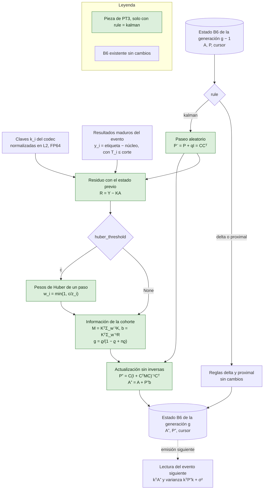

# Regla kalman de B6 con ruido de cohorte correlacionado (PT3)

Estado a 10 de octubre de 2026: **implementado y comprobado sin entrenar**. El resultado experimental está pendiente, porque el bloqueo de aprendizaje impide emitir las predicciones del núcleo y estimar las varianzas. Tarea [#455](https://github.com/GonxKZ/mars-titan/issues/455). La motivación, el control y la regla de decisión están en las [propuestas posteriores a Titans](../research/post-titans-proposals.md#pt3-corrección-madura-bayesiana-con-ruido-de-cohorte-correlacionado).

## Qué hace

B6 es una matriz A de clave por valor que corrige la predicción de Titans-MAC con resultados maduros ([memoria asociativa madura](mature-associative-memory.md)). Sus reglas delta y proximal tratan cada etiqueta de una cohorte como evidencia independiente y usan un paso fijo η. La regla `kalman` trata A como el estado de un modelo lineal dinámico. Guarda además una covarianza P compartida por las columnas de valor, de modo que la ganancia de cada dirección de clave depende de la incertidumbre acumulada en esa dirección. Antes de cada cohorte A deriva con un paseo aleatorio, y los resultados de una misma cohorte comparten un componente común con correlación ϱ, así que una sesión con miles de activos no cuenta como miles de observaciones independientes.

La regla vive en `AssociativeMemory` (`src/mars_titan/memory/associative_memory.py`) y se declara con `AssociativeMemoryConfig("kalman", kalman=KalmanNoise(...))`. `MatureCorrection` y `FinancialSession` la usan sin cambios de contrato, y la variante MARS-TITAN la acepta como valor de `associative_memory` con la ablación A12 de la [declaración de ampliaciones](../../configs/titans/mars-titan-extensions.json). No tiene parámetros entrenables, no usa gradientes y trabaja en CPU y FP64 como las otras dos reglas.

## Flujo de datos y de estado

**Entradas permitidas.** Las mismas que B6: las claves estables del codec de cada decisión y los resultados ya maduros de un evento, con `decision_at < available_at ≤ cutoff`. El valor escrito es la etiqueta menos la predicción del núcleo, nunca la predicción emitida. La regla no recibe pesos declarados. Los de Huber se calculan dentro de la escritura con el estado previo.

**Orden temporal.** La emisión de un evento lee A de la generación anterior. Al resolver los resultados maduros del evento, la escritura aplica primero el paseo aleatorio y después la información de toda la cohorte de una vez. El cursor canónico (disponibilidad, decisión e identificador) rechaza entregas repetidas o fuera de orden igual que en las otras reglas.

**Estado que cambia.** A y P, el contador de resultados y el cursor, una vez por escritura con resultados. Una cohorte vacía devuelve la misma memoria y no aplica el paseo aleatorio. `export` añade P y su huella a los campos de siempre, y `restore` comprueba forma, simetría exacta, definición positiva y huella.

**Qué apaga el interruptor.** Las reglas delta y proximal recorren exactamente el código anterior y conservan su identidad, su exportación y su salida. Sin `associative_memory` en la variante no hay B6. Las dos cosas están comprobadas con huellas capturadas antes del cambio.

## Ecuaciones, fuentes, módulos y pruebas

La notación sigue la de la [memoria asociativa madura](mature-associative-memory.md) y, para A como memoria lineal, la del [núcleo de Titans](titans-memory-core.md): una cohorte de n resultados tiene claves K ∈ ℝ^{n×d} con filas k_iᵀ, valores Y ∈ ℝ^{n×m} y estado A ∈ ℝ^{d×m}. P ∈ ℝ^{d×d} es la covarianza de cada columna de A.

**(K1) Modelo lineal dinámico.** Filtro de Kalman (Kalman, 1960) y modelo lineal dinámico (West y Harrison, 1997), con un efecto temporal aleatorio común a la cohorte como en los datos de panel (Baltagi, 2021). La combinación para cohortes maduras de B6 es adaptación propia:

$$
A_g=A_{g-1}+\Omega_g,\quad \operatorname{vec}\Omega_g\sim\mathcal N(0,\,I_m\otimes qI_d),\qquad Y_g=K_gA_g+E_g,\quad E_g^{(j)}\sim\mathcal N(0,\Sigma),\qquad \Sigma=\sigma^2\big[(1-\varrho)I+\varrho\mathbf 1\mathbf 1^\top\big],
$$

con A_0 de columnas independientes N(0, p0 I). Módulos `KalmanNoise` y `AssociativeMemory`. Pruebas `test_kalman_is_a_new_identity_without_rate_or_forgetting` y `test_impossible_noise_is_rejected`.

**(K2) Inversa cerrada del ruido de cohorte.** Álgebra estándar (Sherman y Morrison) que hace innecesario formar Σ:

$$
\Sigma^{-1}=\frac{1}{\sigma^2(1-\varrho)}\big(I-g\,\mathbf 1\mathbf 1^\top\big),\qquad g=\frac{\varrho}{1-\varrho+n\varrho}.
$$

Prueba `test_closed_form_inverse_of_the_equicorrelated_noise`.

**(K3) Actualización en forma de información.** Forma estándar del filtro. La factorización sin inversas explícitas es una elección de implementación propia:

$$
P^-=P+qI=CC^\top,\quad M=K^\top\Sigma^{-1}K,\quad b=K^\top\Sigma^{-1}(Y-KA),\qquad P^+=C\,(I+C^\top MC)^{-1}C^\top,\quad A^+=A+P^+b .
$$

Con I + CᵀMC = LLᵀ y T = L⁻¹Cᵀ, P⁺ = TᵀT y A⁺ = A + Tᵀ(Tb). TᵀT se simetriza con su traspuesta, porque con d = 64 el producto de BLAS no sale simétrico bit a bit y la restauración exige simetría exacta. M y b cuestan O(nd²) a partir de KᵀK y Kᵀ1, y la factorización O(d³). Módulo `AssociativeMemory._kalman`. Prueba `test_information_update_matches_the_dense_covariance_form`, que compara con la forma de covarianza y ganancia de Kalman, G = P⁻Kᵀ(KP⁻Kᵀ + Σ)⁻¹, con Σ densa y la covarianza de Joseph, en FP64.

**(K4) Recorte de Huber ponderado.** Los pesos ψ(z)/z = min(1, c/|z|) proceden de Huber (1964). Aplicarlos en un solo paso con el residuo estandarizado por la varianza predictiva previa, y la forma cerrada ponderada, son derivación propia:

$$
z_i=\frac{\lVert y_i-A^\top k_i\rVert}{\sqrt{k_i^\top P^-k_i+\sigma^2}},\qquad \Sigma_w^{-1}=W^{1/2}\Sigma^{-1}W^{1/2}=\frac{1}{\sigma^2(1-\varrho)}\Big(W-g\,\sqrt w\sqrt w^{\top}\Big).
$$

Equivale a inflar la varianza de las filas atípicas, Σ_w = W^{−1/2}ΣW^{−1/2}, y conserva el coste de (K3). Pruebas `test_information_update_matches_the_dense_covariance_form` con una fila atípica y `test_a_large_huber_threshold_is_the_unweighted_rule_bit_for_bit`.

**(K5) Casos de referencia.** Con un resultado por cohorte, Σ⁻¹ se reduce a 1/σ² y la regla es el filtro de Kalman escalar para cualquier ϱ. Con q = 0 y ϱ = 0, dos cohortes seguidas dan la posterior de una regresión ridge con todas las filas, de precisión I/p0 + KᵀK/σ², es decir RLS por bloques. Pruebas `test_one_outcome_per_cohort_is_the_scalar_kalman_filter` y `test_zero_correlation_and_process_noise_is_block_rls_with_its_prior`.

**(K6) Tamaño efectivo de una cohorte.** Derivación propia a partir de (K2), igual al efecto de diseño de un muestreo por conglomerados. Con n claves iguales a k,

$$
M=\frac{n}{\sigma^2\,(1+(n-1)\varrho)}\,kk^\top\ \le\ \frac{1}{\sigma^2\varrho}\,kk^\top ,
$$

así que una sesión aporta como mucho 1/ϱ observaciones de su componente común. Prueba `test_cohort_correlation_limits_the_information_of_identical_keys` con n = 1, 4, 64 y 4.096.

**(K7) Crecimiento de la covarianza.** Derivación propia. Como P⁺ ⪯ P⁻ = P + qI en el orden de Loewner, tras t cohortes λ_max(P_t) ≤ p0 + qt. La cota se alcanza en una dirección que ninguna clave excita. La propuesta pedía acotar ese crecimiento o declararlo, y aquí se declara: con q = 10⁻⁵ σ² y unas 5.000 cohortes de 2000 a 2019, la varianza de una dirección no excitada sube 0,05 σ², la mitad de p0 = 0,1 σ². Prueba `test_covariance_grows_at_most_linearly_in_unexcited_directions`.

**(K8) Lectura y varianza predictiva.** Estándar: la corrección es kᵀA y su varianza para un resultado nuevo kᵀPk + σ². No suma el q del paseo que precederá a la siguiente cohorte. Módulos `AssociativeMemory.read` y `AssociativeMemory.variance`. Prueba `test_write_order_and_read_purity`.

## Por qué podría ayudar y por qué podría no hacerlo

En el mercado las etiquetas maduran por cohortes de miles de activos a la vez y los residuos de una sesión siguen correlacionados aunque el objetivo reste la beta. Con la regla proximal una sesión de 4.000 activos pesa como 4.000 observaciones independientes y puede arrastrar A hacia el shock común de ese día. Con ϱ = 0,05 la misma sesión cuenta como unas 20 observaciones de su componente común. La covarianza además da una ganancia mayor en direcciones de clave poco vistas y menor en las ya conocidas, que es lo que una regla de paso fijo no puede hacer, y la varianza predictiva puede servir para calibrar la corrección.

Puede no ayudar porque la señal es muy débil. Si el residuo no tiene estructura lineal estable en las claves del codec, cualquier corrección persigue ruido y lo mejor es no corregir. RLS con un η bien elegido puede ser casi equivalente a la regla proximal. Un q grande persigue ruido y un q pequeño no sigue los cambios. Las varianzas σ², ϱ y q se estiman con la ventana de entrenamiento y pueden no valer en la de evaluación.

## Control con el que se descarta

La [declaración del brazo](../../configs/evaluation/kalman-associative-comparison.json) fija, antes de ejecutar nada, cuatro brazos con las mismas predicciones, claves, cohortes y madurez: Titans-MAC `mac_online` sin corrección, B6 proximal como control directo, B6 kalman y la alternativa trivial con ϱ = 0. σ² y ϱ se estiman por momentos con los residuos de entrenamiento de cada ventana, p0 = 0,1 σ² y q = κ σ² con κ elegido entre 10⁻⁶ y 10⁻⁵ en las ventanas de 2005 a 2013. La regla conserva PT3 si el límite superior del 95 % de la diferencia relativa de MAE por sesión frente a B6 proximal es negativo, o si no supera +0,1 % y la cobertura del intervalo ±1,645 desviaciones predictivas de la corrección queda entre el 85 % y el 95 %, y además conserva al menos la mitad de la ganancia con una sesión más de retraso (D3). Se abandona si empeora más de un 0,1 % o si la ganancia desaparece con el retraso. Si ϱ = 0 iguala a PT3, la correlación de cohorte no aporta. Nada se ha ejecutado.

## Comprobaciones

| Propiedad | Prueba |
| --- | --- |
| Delta y proximal sin cambios: salida, estado exportado, identidad y variante | `test_delta_and_proximal_keep_their_outputs_states_and_identities`, con huellas capturadas en `42e7dbca` antes de añadir la regla |
| Identidad nueva sin η ni λ, y declaraciones imposibles rechazadas | `test_kalman_is_a_new_identity_without_rate_or_forgetting`, `test_invalid_rule_declarations_are_rejected` y `test_impossible_noise_is_rejected` |
| Inversa cerrada de Σ | `test_closed_form_inverse_of_the_equicorrelated_noise` |
| Forma de información igual a la forma densa de covarianza, con y sin Huber | `test_information_update_matches_the_dense_covariance_form` |
| Huber con umbral alto idéntico bit a bit a la regla sin recorte | `test_a_large_huber_threshold_is_the_unweighted_rule_bit_for_bit` |
| Filtro escalar y RLS por bloques | `test_one_outcome_per_cohort_is_the_scalar_kalman_filter` y `test_zero_correlation_and_process_noise_is_block_rls_with_its_prior` |
| Tamaño efectivo de la cohorte | `test_cohort_correlation_limits_the_information_of_identical_keys` |
| Covarianza simétrica, definida positiva y con el crecimiento declarado | `test_covariance_grows_at_most_linearly_in_unexcited_directions` |
| Orden de carga y lectura sin efectos | `test_write_order_and_read_purity` |
| Causalidad y madurez: inmaduras, repetidas o con pesos rechazadas sin cambiar el estado | `test_immature_repeated_or_weighted_cohorts_are_rejected_without_changing_the_state` y `test_labels_of_a_later_cohort_do_not_change_earlier_reads` |
| Recuperación exacta de A, P y cursor, y rechazo de estados alterados | `test_recovery_restores_matrix_covariance_and_cursor_exactly` |
| Corrección madura y variante con d = 64 y simetría exacta tras BLAS | `test_mature_correction_and_variant_accept_the_kalman_rule` |
| Brazo declarado sin ejecutar | `test_comparison_arm_is_declared_with_its_control_and_rule_but_not_executed` |
| Sesión financiera con oráculo, causalidad y corte antes de publicar | `test_kalman_rule_follows_the_same_session_contract_and_recovers_its_covariance` en `tests/memory/test_financial_session_associative.py`, que necesita `MARS_TITAN_EPISODIC_NATIVE` |

Las pruebas están en `tests/memory/test_kalman_associative_memory.py`. El aislamiento entre activos y sesiones lo da el contrato de B6: A es común a la variante por diseño y cada escritura devuelve una memoria nueva sin tocar la anterior. La prueba de la sesión financiera no se ha ejecutado en este equipo porque falta el enlace nativo compilado y se omite sin él.

La mutación dirigida aplicó 19 defectos de uno en uno en una copia aislada, tras comprobar que las pruebas importaban la copia: anular g, quitar n de g, quitar o escalar el paseo aleatorio, olvidar los pesos de Huber en la evidencia, tomar su raíz, estandarizar sin σ² o con P posterior, quitar 1 − ϱ de la escala, quitar el término de correlación de la información, no simetrizar P, invertir el signo de A, usar el residuo sin restar la lectura, restaurar sin huella o sin simetría, y alterar las identidades de kalman, delta y proximal o la varianza predictiva. Las pruebas detectan los 19 ([recibo](../../reports/engineering/kalman-associative-memory-mutations-20261010.json)). La mutación que quita la simetrización sobrevivió al principio, porque todas las pruebas usaban d ≤ 4 y ahí TᵀT sale simétrica. Una prueba con d = 64 la detecta. Es una selección dirigida, no una campaña completa de mutación.

## Coste medido sin entrenar

Medido el 10 de octubre de 2026 con `benchmarks/associative_memory_cost.py` dentro de `memslot light`, en un AMD Ryzen 9 8945HS con PyTorch 2.14.0+cu130 en CPU, dos hilos, d = 64 y m = 1, tres calentamientos y veinte repeticiones ([recibo](../../reports/engineering/kalman-associative-memory-cost-20261010.json)). La carga media del equipo era de 29,7 al empezar por otras sesiones, así que los percentiles 95 son ruidosos. Claves y valores sintéticos con semilla fija, solo para fijar formas.

| Resultados por evento | Delta p50 (ms) | Proximal p50 (ms) | Kalman p50 / p95 (ms) | Kalman con Huber p50 (ms) | Varianza kalman p50 (ms) |
| ---: | ---: | ---: | ---: | ---: | ---: |
| 16 | 0,43 | 0,21 | 0,56 / 6,75 | 0,55 | 0,04 |
| 256 | 3,62 | 0,42 | 0,78 / 0,86 | 0,78 | 0,14 |
| 1.024 | 15,90 | 2,27 | 1,49 / 2,01 | 1,78 | 0,37 |
| 8.192 | 130,95 | 8,35 | 12,60 / 24,83 | 17,03 | 2,83 |

La escritura kalman cuesta lo mismo que la proximal en orden de magnitud y bastante menos que la delta en cohortes grandes. El estado exportado pasa de 512 bytes a 33.280 por la covarianza de 64 × 64. Con estas cifras no hay un cuello de botella que justifique optimizar. No se midieron energía ni GPU, porque B6 trabaja en CPU por diseño.

## Desviaciones y límites

- La medida de una cohorte se aplica al estado actual y no al de cada decisión. Con el paseo aleatorio, el error de esa aproximación está acotado por el ruido de proceso acumulado durante el retraso, como declaraba la propuesta.
- El paseo aleatorio se aplica una vez por escritura con resultados, no por sesión transcurrida. Una cohorte vacía no añade q.
- Los pesos de Huber se calculan en un solo paso con el residuo previo y no se iteran hasta converger.
- La propuesta daba q ∈ {10⁻⁶, 10⁻⁵} sin unidad. La escala del residuo solo se conoce al estimar σ², así que esos valores pasan a ser fracciones de σ², q = κ σ², igual que la tasa de PT2 pasó a ser relativa a su escala.
- La propuesta no fijaba p0. La declaración usa p0 = 0,1 σ² antes de ver datos y el brazo principal no usa Huber.
- Los estimadores por momentos de σ² y ϱ no están implementados. Se escribirán con la integración, usando solo residuos de la ventana de entrenamiento.

## Pendiente sin medir

- El efecto predictivo, la cobertura de la varianza predictiva y la regla de decisión, bloqueados porque no hay predicciones de la campaña.
- La emisión de B6 en el recorrido cronológico por ventanas, pendiente también para las reglas delta y proximal.
- La prueba en la sesión financiera con el enlace nativo, que debe ejecutarse donde esté compilado.

## Referencias

- Baltagi, B. H. (2021). *Econometric analysis of panel data* (6.ª ed.). Springer. https://doi.org/10.1007/978-3-030-53953-5
- Fentazi, M. R., Ameur, M. y Ksentini, A. (2026). *Training on the future: A delay-aware audit of test-time adaptation for time-series forecasting* (arXiv:2610.12232v1). https://arxiv.org/abs/2610.12232v1
- Huber, P. J. (1964). Robust estimation of a location parameter. *The Annals of Mathematical Statistics, 35*(1), 73–101. https://doi.org/10.1214/aoms/1177703732
- Kalman, R. E. (1960). A new approach to linear filtering and prediction problems. *Journal of Basic Engineering, 82*(1), 35–45. https://doi.org/10.1115/1.3662552
- West, M. y Harrison, J. (1997). *Bayesian forecasting and dynamic models* (2.ª ed.). Springer. https://doi.org/10.1007/b98971
