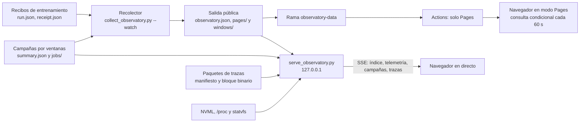
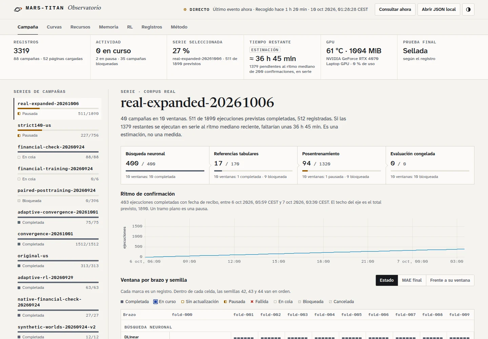
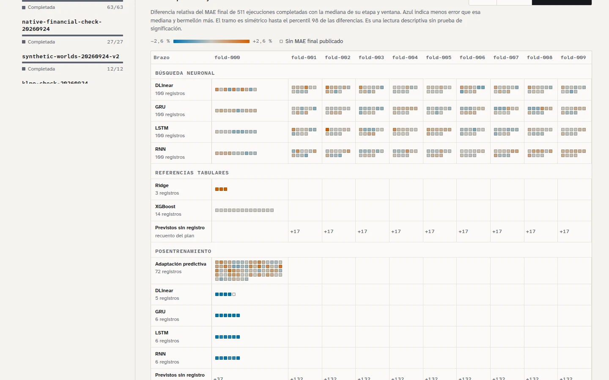
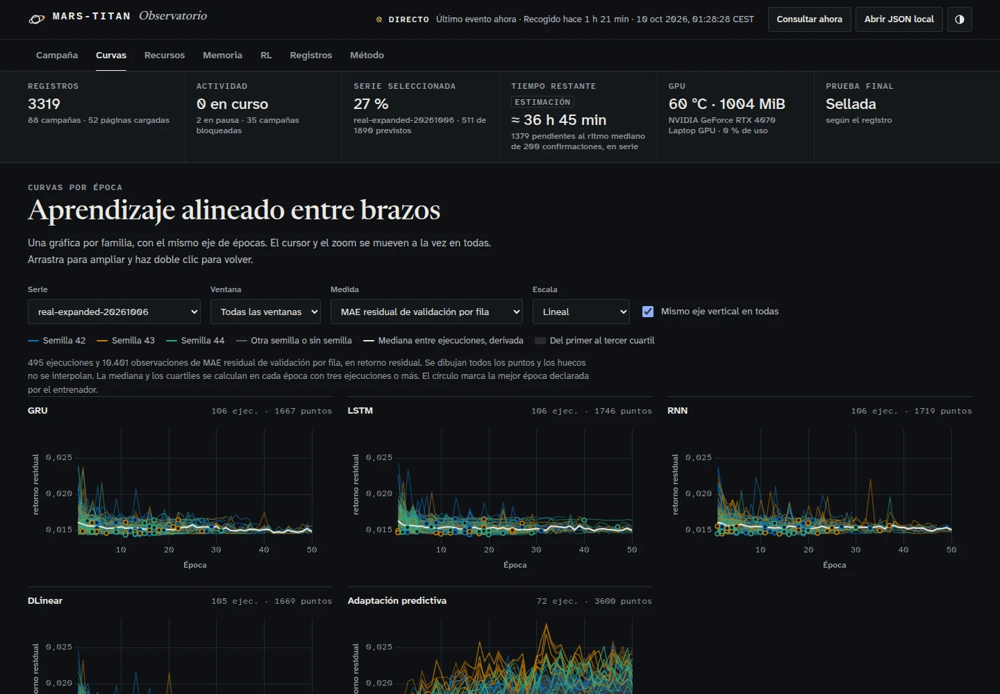
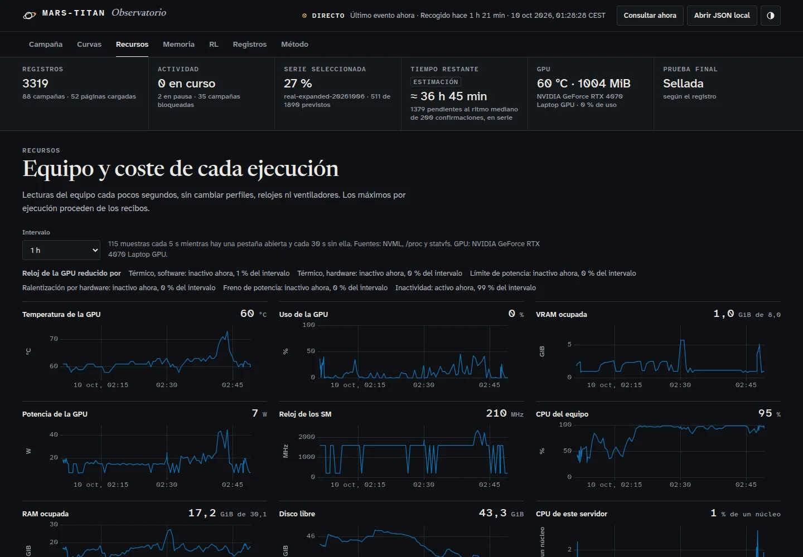
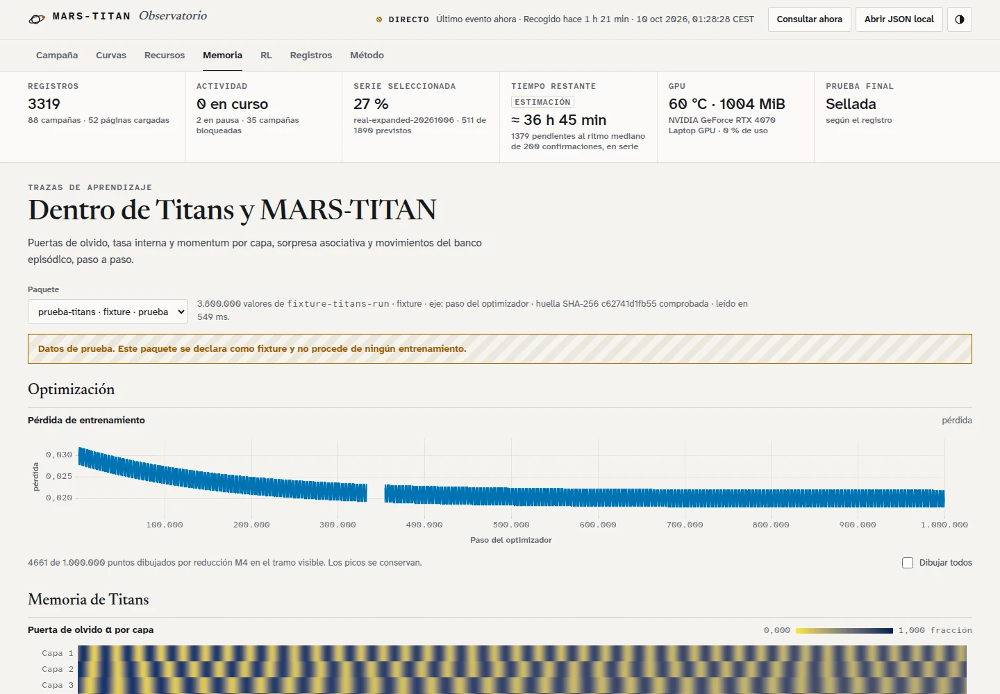
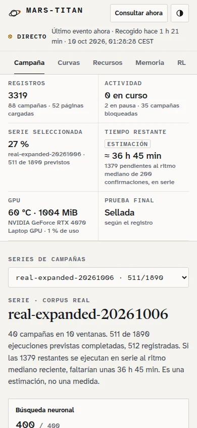

# Observatorio local de MARS-TITAN

El [recolector de campañas](campaign-observatory.md) añade lectura incremental de
los informes existentes e historial paginado con el contrato de versión 2. La página
y su modo en directo se describen en la sección siguiente. Las posteriores documentan
el exportador manual de versión 1, que sigue disponible para estados individuales.

El observatorio permite consultar el estado de las ejecuciones sin abrir sus datos ni sus checkpoints. El exportador de `scripts/export_observatory.py` transforma estados agregados locales en una instantánea JSON pública. No entrena modelos, no calcula resultados científicos, no abre registros completos ni publica archivos en Internet.

La interfaz puede existir antes que el entrenador. Mientras no haya estados registrados, la salida contiene el catálogo de modelos, `source_status: "no_runs_registered"` y una lista vacía de ejecuciones. No se generan métricas, curvas o entrenamientos de demostración como si fueran observaciones reales.

La [página pública](https://gonxkz.github.io/mars-titan/) quedó desplegada mediante [PR #73](https://github.com/GonxKZ/mars-titan/pull/73). El [despliegue de Pages](https://github.com/GonxKZ/mars-titan/actions/runs/35396836916) terminó correctamente y se comprobaron sus cinco archivos por SHA-256 frente a la versión local. La vista pública se revisó en escritorio y móvil, sin errores de ejecución. El estado inicial contiene cero ejecuciones y nueve modelos planificados.

## Página y modo en directo

La página de `site/` se rehízo en #451 a partir de una [auditoría previa](observatory-ux-audit.md) sobre el historial real. La misma interfaz funciona en dos modos que comparten código y contrato de datos.

- **Pages.** Lee los datos estáticos de la rama `observatory-data`. El índice se consulta cada 60 segundos con `If-None-Match` y `If-Modified-Since`, y una respuesta 304 no descarga ni redibuja nada. Las páginas del historial se nombran por su huella, así que cada una se descarga una sola vez. Las matrices de las campañas por ventanas también, y solo se pide la de la campaña elegida. La barra superior muestra la antigüedad de la última recogida con su zona horaria.
- **Directo en local.** `scripts/serve_observatory.py` sirve el mismo sitio y empuja eventos SSE con el índice, la telemetría del equipo, el estado de las campañas por ventanas y los paquetes de trazas. Solo lee sus fuentes y por defecto escucha en `127.0.0.1`.



### Arranque y límites del servidor local

```bash
uv run --locked python scripts/serve_observatory.py \
  --public-dir RUTA_DE_LA_SALIDA_PUBLICA_DEL_RECOLECTOR \
  --config configs/observatory/campaigns.json \
  --campaign A=RUTA_DE_UNA_CAMPAÑA_POR_VENTANAS \
  --traces-dir RUTA_DE_LOS_PAQUETES_DE_TRAZAS
```

Todas las fuentes son opcionales. Para seguir el recolector que ya está en marcha basta con apuntar `--public-dir` a su salida pública. `--config` añade las campañas por ventanas que declara la configuración del recolector, con sus rutas relativas a `--root` (por defecto, el repositorio). Con la configuración actual son las cuatro etapas de A y de A v2, las ocho que admite el servidor. El servidor no toma su bloqueo ni el de las campañas y no escribe en ninguna de las carpetas que lee. La orden imprime la dirección, por defecto `http://127.0.0.1:8765/`, y termina con `Ctrl+C`. Escuchar fuera del bucle local exige `--allow-remote`.

El servidor acepta cuatro clientes SSE y 24 conexiones. Envía como máximo dos eventos por segundo y cliente, y si una fuente cambia varias veces entre dos envíos solo manda la última versión. El latido es de 15 segundos y una pestaña cerrada libera su plaza como máximo en el siguiente. Con el límite de clientes alcanzado responde 503 y la página vuelve a la consulta condicional del índice. La telemetría se toma cada 5 segundos con clientes y cada 30 sin ellos. El anillo guarda 17.280 muestras (24 horas a 5 segundos) y una pestaña nueva recibe las últimas 4.320. Los límites de lectura son 8 MiB por JSON, 256 MiB por paquete de trazas, 4 MiB por evento y 20.000 trabajos por campaña. La política de seguridad no admite scripts ni estilos de otros orígenes, tampoco estilos en línea.

La telemetría procede de consultas de lectura a NVML, de `/proc` y de `statvfs`. Incluye temperatura, uso, memoria, potencia, reloj y motivos de reducción del reloj de la GPU, además de CPU, carga, RAM, swap, disco libre y la CPU del propio servidor. No fija relojes, perfiles de energía ni ventiladores. Una lectura que falla se publica como ausencia, nunca como cero.

Una campaña por ventanas se lee desde su `summary.json` y la carpeta `jobs/` con `observatory/window_campaigns.py`, el mismo módulo que usa el recolector para Pages. Sirve para las cuatro etapas de la campaña con máscaras: base, adaptadores, ablación y políticas. Un trabajo con carpeta `attempt-*` o `run` y sin recibo se muestra como «intento sin confirmar», que no equivale a un proceso vivo. La fecha de modificación de cada recibo, o del `selection.json` en las selecciones de la cadena, aproxima su confirmación y alimenta el ritmo y el tiempo restante, que la página rotula siempre como estimación. La página dibuja una campaña cada vez, elegida en su selector y guardada en la URL (`matriz=`), porque la de adaptadores de A tiene 312 filas. En directo se abre por defecto la campaña que llega por SSE, que sustituye a la publicada con el mismo nombre. El [seguimiento de campañas](campaign-observatory.md#campañas-por-ventanas-de-a-y-a-v2) describe las fuentes, el coste y la publicación.

### Despliegue sin cortar la publicación actual

La página lee el formato actual del recolector y trata como opcionales los campos que añade #451, así que puede promocionarse a `main` antes de cambiar el recolector. Un índice sin `window_campaigns` no muestra campañas por ventanas. El workflow de Pages copia entonces los módulos de `site/`, `vendor/` y `fonts/`, y también `windows/` y `traces/` si la rama de datos los contiene. El recolector en marcha usa una configuración privada, así que al sustituirlo hay que añadirle las ocho fuentes `window_campaign` de `configs/observatory/campaigns.json`. Su primera publicación retira de `observatory-data` las páginas que el índice ya no enumera.

La extensión del recolector cambia el contenido de casi todas las páginas y con ello sus huellas. La primera publicación tras el cambio sustituye las páginas una vez. Con los 3.319 registros del 10 de octubre, la salida pública pasó de 12,1 MB a 20,4 MB en las mismas 51 páginas. Si se conserva el estado del recolector, los registros cuyas fuentes siguen presentes se reconstruyen con los campos nuevos en la primera recolección, y los que ya no tienen fuente mantienen su forma anterior y se ven con esas medidas ausentes. Antes de sustituir el proceso en marcha conviene ejecutar el recolector nuevo con otro estado y otra salida, sin `--publish-checkout`, y comparar ambas salidas. Solo un recolector puede publicar en el checkout de `observatory-data`.

### Trazas de aprendizaje

Las trazas de #448 pueden tener millones de puntos. Un paquete separa un manifiesto JSON pequeño de un bloque binario con columnas little-endian alineadas a 8 bytes, y el navegador crea vistas tipadas sobre ese bloque sin copiarlo. El bloque se nombra por su huella, la página comprueba el SHA-256 antes de dibujar y NaN codifica una observación ausente que nunca se interpola. El manifiesto declara procedencia (`measured` o `fixture`), unidad del eje, cadencia del registro y, si existe, el paso en el que el productor agotó su presupuesto. Un paquete `fixture` lleva un aviso visible en toda la vista.

`scripts/export_learning_traces.py` convierte la carpeta del registrador de `mars_titan.learning_traces` en un paquete. Cada combinación de métrica, grupo de parámetros, estadístico y fase pasa a ser una serie por paso. Las normas por grupo de parámetros se quedan en optimización y el resto se ordena por el prefijo de la métrica o del grupo (`memory` a Titans, `policy` a RL, etc.). La orden no modifica la carpeta de origen:

```bash
uv run --locked python scripts/export_learning_traces.py \
  --traces RUTA_DEL_REGISTRADOR --output RUTA_DE_LOS_PAQUETES \
  --name NOMBRE --run-id RUN_ID --attempt-id ATTEMPT_ID --model-id MODEL_ID
```

Los ganchos del entrenador que llenan el registrador pertenecen a #448. Hasta que existan, la vista de memoria solo puede mostrar paquetes de prueba rotulados como tales.

### Decisiones de visualización

- **Campaña.** Una matriz de ventana × brazo × semilla responde qué está en marcha y cuánto falta. Cada celda se colorea por estado, por MAE final de validación con la escala secuencial cividis o por su diferencia relativa con la mediana de su ventana con una escala divergente de dos tonos y gris en el centro. Al lado, el ritmo de confirmaciones a lo largo del tiempo y el tiempo restante estimado con la mediana de las últimas 200 confirmaciones.
- **Curvas.** Múltiplos pequeños por familia con el mismo eje de épocas, cursor y zoom enlazados, y la opción de compartir también el eje vertical. La mediana y el intervalo entre cuartiles se calculan en cada época con tres ejecuciones o más. El círculo marca la mejor época declarada por el entrenador. Entrenamiento y validación nunca comparten un segundo eje.
- **Recursos.** Series temporales de GPU, CPU, RAM y disco con ventanas de 15 minutos a 24 horas, una franja con los motivos de reducción del reloj de la GPU y dos dispersiones con todo el historial: memoria frente a duración en escala logarítmica y caudal por modelo.
- **Series largas.** Las líneas se dibujan con uPlot 1.6.32 en canvas. Cuando una serie supera el ancho disponible se reduce con M4 (Jugel et al., 2014), que conserva primero, último, mínimo y máximo de cada columna de píxeles y devuelve índices de la serie original. El rótulo declara cuántos puntos se dibujan de cuántos, la casilla «Dibujar todos» quita la reducción y el cursor lee siempre el valor exacto.
- **Procedencia.** Cada ejecución abre un detalle con su página publicada, las huellas del recibo y de la configuración y sus medidas con unidad. Las estimaciones y las fases reservadas se rotulan como tales.
- **Forma.** Atkinson Hyperlegible Next y Mono para texto y cifras, Newsreader para los titulares, temas claro y oscuro con sus propios tonos, texto de al menos 12 píxeles, teclado completo, estado en la URL y movimiento solo cuando no se pide movimiento reducido. Las escalas usan cividis (Nuñez et al., 2018) y la paleta de Okabe e Ito, legibles con las deficiencias de color habituales.

Referencias de esta sección:

- Jugel, U., Jerzak, Z., Hackenbroich, G. y Markl, V. (2014). M4: A visualization-oriented time series data aggregation. *Proceedings of the VLDB Endowment, 7*(10), 797-808. https://doi.org/10.14778/2732951.2732953
- Nuñez, J. R., Anderton, C. R. y Renslow, R. S. (2018). Optimizing colormaps with consideration for color vision deficiency to enable accurate interpretation of scientific data. *PLOS ONE, 13*(8), e0199239. https://doi.org/10.1371/journal.pone.0199239
- Okabe, M. e Ito, K. (2008). *Color Universal Design (CUD): How to make figures and presentations that are friendly to colorblind people*. https://jfly.uni-koeln.de/color/

### Capturas

Las capturas se tomaron el 10 de octubre de 2026 con el servidor local sobre una salida del recolector con 3.319 registros reales y la telemetría del portátil en ese momento. La vista de memoria muestra un paquete de prueba de un millón de puntos, rotulado como tal, porque todavía no hay trazas de entrenamiento.









### Medidas

Las medidas se tomaron el 10 de octubre de 2026 con `site/tests/benchmark-browser.mjs` en un AMD Ryzen 9 8945HS de 16 hilos, con el perfil de energía de bajo consumo, Chrome 153.0.8010.47 sin interfaz y sin GPU (`--disable-gpu`), Playwright 1.63.0 y Node 24.21.0. El índice era una salida del recolector con 3.319 registros. El equipo tenía otras cargas en marcha, así que las cifras orientan y no se pueden repetir exactamente. El porcentaje de CPU se refiere a un núcleo.

| Medida | Valor observado |
| --- | --- |
| Lectura y comprobación SHA-256 de un paquete con tres series de un millón de puntos y una matriz de 4 × 200.000 | 427 ms |
| Primer dibujo de cada serie con M4 | 63, 13 y 13 ms |
| Mapa de calor de 800.000 celdas | 26 ms |
| Ampliaciones con M4 (de 2.612 a 5.000 puntos dibujados) | de 0,3 a 22 ms |
| Paso a todos los puntos | 97 ms |
| Ampliaciones sin reducción (de 5.001 a un millón de puntos) | de 0,3 a 78 ms |
| Memoria JavaScript de la pestaña con el paquete cargado | 136 MiB |
| CPU de la pestaña en reposo, modo Pages | 0,13 % |
| CPU de la pestaña en reposo, directo con la vista de campaña | 0,43 % |
| CPU de la pestaña con telemetría cada 5 s en la vista de recursos | 0,63 % |
| CPU del servidor local con una pestaña | 0,02 a 0,03 % |
| CPU del servidor local sin pestañas | 0,10 % |

Cada ventana de CPU duró 60 segundos. En modo Pages hubo dos peticiones al índice y una respondió 304. Con la copia del formato actual del recolector, sin los campos nuevos, la página cargó los 3.319 registros y sus 51 páginas en 0,8 a 1,8 segundos desde un servidor local, sin errores y sin desbordamiento horizontal a 390 píxeles. La auditoría previa midió 0,11 % de CPU en reposo para la página anterior, que dibujaba mucho menos.

La pestaña oculta no dibuja. Los cambios se agrupan en un único fotograma por lote, la URL se escribe como máximo cada 250 ms y las vistas ocultas no se redibujan al cambiar el tamaño de la ventana.

### Pruebas de la página

```bash
node --test site/tests/*.test.mjs
node site/tests/observatory-browser.mjs RUTA/playwright/index.mjs [CARPETA_DE_CAPTURAS]
OBSERVATORY_PYTHON="uv run --locked python" node site/tests/live-browser.mjs RUTA/playwright/index.mjs
OBSERVATORY_PYTHON="uv run --locked python" node site/tests/benchmark-browser.mjs RUTA/playwright/index.mjs [CARPETA_PUBLICA] [SEGUNDOS]
uv run --locked pytest tests/tooling/test_observatory_live_server.py tests/tooling/test_observatory_learning_traces.py
```

Las pruebas unitarias cubren contrato, reducción M4, escalas, formato, estado en la URL, paquetes de trazas y las estructuras derivadas. `observatory-browser.mjs` imita Pages con 304 y recorre consulta condicional, reintento tras un 503, URL, teclado, fase reservada, CSV, texto hostil, importación local, temas, movimiento reducido y anchos de 320 a 1440 píxeles. `live-browser.mjs` arranca el servidor real y comprueba SSE, actualización de campañas e índice, límite de clientes y liberación de plazas. Las pruebas de Python cubren rutas permitidas, validadores, límites, desconexiones, ausencia de GPU y la conversión de trazas. Todas se ejecutan en local y ninguna en GitHub Actions. `benchmark-browser.mjs` escribe un paquete de un millón de puntos en la carpeta temporal del sistema, por lo que conviene apuntar `TMPDIR` a un disco si esa carpeta está en memoria.

## Uso manual

Desde la raíz del repositorio:

```bash
uv run --locked python scripts/export_observatory.py \
  --input-dir artifacts/runs \
  --output site/data/observatory.json
```

`--output` es obligatorio. La entrada predeterminada es `artifacts/runs`, dentro de un directorio excluido de Git. Se leen únicamente archivos `artifacts/runs/<run_id>/status.json`, sin recorrer subdirectorios adicionales ni seguir enlaces simbólicos. Una fuente todavía inexistente produce el estado sin ejecuciones. Un archivo presente pero inválido provoca un error.

La orden usa la biblioteca estándar de Python y el entorno gestionado por uv. No requiere PyTorch, CUDA, dependencias adicionales, conexión de red ni un servicio instalado. La generación y la publicación son acciones separadas. Generar este JSON no ejecuta Git, no hace un push y no activa GitHub Actions. La primera integración se realiza manualmente.

El exportador utiliza descriptores de archivo POSIX y está comprobado en Linux. No se declara compatibilidad con Windows sin una implementación y una verificación específicas. El frontend es independiente de esa plataforma y se ejecuta en el navegador.

## Contrato privado de entrada

Cada `status.json` contiene un objeto con `schema_version: 1` y tres identificadores obligatorios: `run_id`, `attempt_id` y `model_id`. `run_id` debe coincidir con el nombre del directorio. Los identificadores públicos admiten letras ASCII, dígitos, puntos, guiones y guiones bajos, empiezan por letra o dígito y tienen hasta 96 caracteres. No deben contener información personal, secretos o rutas.

El catálogo admitido es B0, B1, B2, B3, B6, M0, M1, M2 y M3. B0-B3 y B6 son referencias, M0-M2 son ablaciones y M3 identifica la propuesta compacta. La pertenencia al catálogo no significa que un modelo esté implementado o evaluado.

Los demás campos son opcionales. Una observación desconocida se conserva como `null`. Un estado conocido debe pertenecer a `queued`, `running`, `paused`, `completed`, `failed` o `cancelled`. Las fases admitidas son `prepare`, `train`, `validation`, `calibration`, `test` y `evaluation`. Un texto diferente no se convierte en desconocido, se rechaza como dato inválido.

El siguiente fragmento ilustra el contrato, no una ejecución realizada:

```json
{
  "schema_version": 1,
  "run_id": "run-example",
  "attempt_id": "attempt-01",
  "model_id": "B1",
  "variant_id": "ridge-example",
  "status": null,
  "phase": null,
  "heartbeat_at": null,
  "started_at": null,
  "updated_at": null,
  "completed_steps": null,
  "total_steps": null,
  "epoch": null,
  "max_epochs": null,
  "seed": null,
  "fold": null,
  "comparison_contract": {
    "target": "target-version",
    "universe": "universe-version",
    "splits": "splits-version",
    "evaluation_regime": "policy-version"
  },
  "metrics": {},
  "history": [],
  "checkpoint": {"step": null, "saved_at": null, "resumable": null}
}
```

Las fechas necesitan zona horaria y se normalizan a UTC. No se aceptan fechas futuras respecto a la exportación. El inicio, la actualización y los puntos del historial deben conservar un orden coherente. Esto exige que el reloj del productor y el del exportador estén sincronizados.

Los contadores son enteros no negativos que puedan representarse exactamente en JavaScript. El progreso no puede superar el total declarado. La época no puede superar el máximo y el paso del checkpoint no puede ir por delante del progreso confirmado. `checkpoint.resumable: true` exige un paso y una fecha observados, incluido el paso cero si corresponde a un guardado real. La ausencia de cualquiera de esos datos impide anunciar capacidad de recuperación.

El productor entrega el historial agregado del intento y la fase actuales. Cada punto necesita `step` y `recorded_at`, con pasos estrictamente crecientes. Puede incluir `loss` y `mae`. Si incluye `attempt_id` o `phase`, deben coincidir con la raíz. Al reanudar, el productor cambia `attempt_id` y comienza una curva separada. El exportador no mezcla archivos anteriores ni reconstruye curvas a partir del registro privado.

`comparison_contract` contiene versiones o huellas estables del target, universo, particiones y régimen de evaluación. El exportador calcula `comparison_group` a partir de esos cuatro campos, el fold y la fase. Si falta el contrato, el fold o la fase, el grupo es `null`. Una etiqueta `comparison_group` recibida en la fuente se ignora. Esto permite impedir clasificaciones de MAE o Rank IC entre tareas distintas, aunque el productor sigue siendo responsable de que esas identidades describan los experimentos reales.

## Salida pública y reserva del test

La identidad del régimen de evaluación debe resolver también agregaciones, ventanas, unidades y protocolo de medida. Por ejemplo, MAE por sesión no se mezcla con MAE global por fila. Una medida RSS no se etiqueta como PSS y una latencia solo de la cabeza no se compara con una ruta que incluye codificación. Los parámetros propios de una variante no sustituyen la identidad del protocolo común.

La salida v1 contiene `schema_version`, `project`, `generated_at`, `source_status`, `poll_interval_seconds`, `stale_after_seconds`, `models`, `runs` y `notes`. La consulta sugerida es cada 60 segundos y la antigüedad de referencia es 180 segundos. El catálogo solo contiene identificador, nombre y clase de cada modelo.

Cada ejecución exporta su identidad, intento, modelo, variante, estado, fase, fechas, progreso, época, semilla, fold, grupo de comparación, métricas, historial, resumen del checkpoint y `test_released`. Las métricas permitidas son:

| Campo | Significado y validación |
| --- | --- |
| `mae`, `mse` | Valores finitos no negativos, sin calcularlos de nuevo. |
| `loss` | Valor finito con signo. Una NLL de densidad continua puede ser negativa. Su definición pertenece al experimento. |
| `rank_ic` | Valor finito entre -1 y 1. |
| `coverage_80`, `coverage_95` | Proporciones entre 0 y 1, no porcentajes de 0 a 100. |
| `latency_p50_ms`, `latency_p95_ms`, `latency_p99_ms` | Latencias no negativas en milisegundos. |
| `vram_peak_mib`, `ram_peak_mib` | Memoria observada no negativa en MiB. |
| `elapsed_seconds`, `samples_per_second` | Tiempo y caudal observados no negativos. |

Una métrica ausente se publica como `null`, nunca como cero. Los booleanos no se aceptan como números. El exportador descarta campos adicionales en la raíz, las métricas, el historial y el checkpoint. No copia mensajes de error, rutas, notas privadas, tokens ni contenido de entrenamiento. No interpreta código o variables incluidos en el JSON.

Las fases `test` y `evaluation` permanecen selladas por defecto. La segunda también se protege porque puede contener el resumen del test final. Una fase desconocida oculta igualmente sus métricas. En estos casos, todos los valores de `metrics` son `null`, `history` es una lista vacía y `test_released` es `false`. Una marca `test_released: true` en la fuente no concede permiso.

Solo una decisión explícita permite ejecutar:

```bash
uv run --locked python scripts/export_observatory.py \
  --input-dir artifacts/runs \
  --output site/data/observatory.json \
  --release-test
```

La opción libera únicamente las fases reservadas de ejecuciones en estado `completed`, `failed` o `cancelled`. Si alguna ejecución reservada sigue activa, en pausa, en cola o sin estado conocido, la exportación falla y conserva la instantánea anterior. Esta opción se usa después del cierre científico y la decisión de divulgar resultados. No sirve para seguir el rendimiento parcial del test durante la selección. La herramienta comprueba la opción y el estado, pero no acredita por sí misma esa decisión científica.

La interfaz debe separar estado declarado y salud observada. Un `running` con `heartbeat_at` ausente o antiguo no demuestra actividad actual. El exportador conserva el estado declarado y añade una advertencia de salud de texto fijo. La interfaz debe mostrar actividad no confirmada o estado antiguo. No debe inventar `paused`, sustituir datos desconocidos por ceros o afirmar que un proceso está vivo solo porque la exportación es reciente.

## Límites y publicación íntegra

La instantánea no es el archivo maestro. El exportador conserva el intento actual de cada ejecución seleccionada. MT-031 deberá guardar todos los intentos y eventos en el registro privado, aunque el resumen visible cambie. Si la campaña supera el límite de ejecuciones, se preparará un directorio de estados seleccionados para `--input-dir`, por ejemplo por campaña o periodo, sin borrar ni mover los originales para satisfacer el límite. La utilidad falla ante exceso en vez de ocultar filas silenciosamente. El frontend puede mostrar varios intentos de un resumen agregado válido, pero esta primera utilidad no reconstruye ese archivo desde los logs completos.

Los límites predeterminados son 128 ejecuciones, 256 KiB por estado, 500 puntos públicos por historial, 8 MiB de salida y cinco segundos de presupuesto de procesamiento. La profundidad máxima del JSON es 16 y se inspeccionan como máximo cuatro veces el límite de ejecuciones en entradas directas del directorio. Se rechazan claves JSON duplicadas, archivos especiales y enlaces simbólicos. No se leen los logs completos.

`--max-runs`, `--max-file-bytes` y `--max-output-bytes` permiten reducir los límites. `--timeout-seconds` admite un valor positivo de hasta 30 segundos. El presupuesto se comprueba durante el procesamiento y antes del reemplazo. No constituye una garantía de respuesta ante un sistema de archivos bloqueado por el sistema operativo.

La salida debe estar fuera del directorio de estados privados. Los componentes de las rutas se abren sin seguir enlaces. El exportador valida todos los estados antes de escribir, crea un temporal en el directorio de destino, sincroniza sus bytes y reemplaza el nombre final atómicamente. Después sincroniza el directorio. Ante un dato inválido o un límite excedido conserva la instantánea previa. Los temporales se limpian si una operación falla.

La salida se ordena por identidad de ejecución e intento y sus claves JSON se ordenan de forma estable. Con la misma entrada y fecha de exportación, el resultado es idéntico. El productor también debe publicar su `status.json` de forma atómica para evitar que una lectura coincida con una escritura parcial.

## Límite de los automatismos de GitHub

El repositorio solo versiona `.github/workflows/pages.yml`, dedicado a publicar esta web. Las pruebas y los entrenamientos siguen siendo locales. No hay configuración de actualizaciones de Dependabot y su API confirma que las actualizaciones de seguridad están deshabilitadas.

La comprobación del 19 de septiembre de 2026 detectó además los workflows dinámicos `Dependabot Updates` y `Dependency Graph`. GitHub rechazó desactivarlos mediante el endpoint de Actions con HTTP 422. Esto no demuestra que se estén ejecutando en ese instante, pero impide afirmar que todos los automatismos ajenos a Pages estén desactivados.

GitHub documenta que los repositorios Python con el grafo habilitado pueden ejecutar [trabajos internos de Dependabot](https://docs.github.com/en/code-security/concepts/supply-chain-security/dependency-graph-data). Su [guía de ajustes de repositorios públicos](https://docs.github.com/en/repositories/managing-your-repositorys-settings-and-features/enabling-features-for-your-repository/managing-security-and-analysis-settings-for-your-repository) incluye el grafo entre las funciones permanentemente habilitadas. MT-068 permanece pendiente de una decisión sobre esta limitación de la plataforma. La web sigue publicada, pero no se amplía la autorización de Actions ni se cambia la visibilidad del repositorio por suposición.

## Integración futura con MT-031

MT-031 mantiene el registro completo de eventos, la persistencia y las identidades. Su callback entrega un resumen pequeño a una cola acotada. Un consumidor fuera del camino de entrenamiento actualiza `status.json` con los últimos valores confirmados y el historial de la fase e intento actuales. Si hay saturación, puede sustituir un resumen pendiente por otro más reciente. Eso no autoriza a descartar eventos científicos del registro privado.

El callback no debe ejecutar `cuda.synchronize()` ni `.item()` en cada batch para alimentar la web. Debe reutilizar las métricas obtenidas en los puntos de registro ya previstos, limitar la frecuencia y separar la serialización y exportación de la GPU. El heartbeat puede actualizarse desde un componente ligero sin fabricar progreso. El historial público acotado no sustituye al historial científico completo.

No se introduce un segundo formato de checkpoint. `checkpoint` solo informa del paso, fecha y capacidad de reanudación declarados por MT-065. La página no puede validar ni restaurar esos pesos. Tampoco se requiere un servicio Go, una cola remota o una instalación permanente para este seguimiento local.

## Verificación realizada

La publicación pasó 109 pruebas Python del repositorio, incluidas 55 del exportador, y 21 pruebas JavaScript. El reproductor del benchmark añade tres pruebas de determinismo, integración y registro de fallos, para un total de 112 pruebas Python. La prueba real de navegador ejercitó importación, filtros, CSV, teclado, móvil, impresión, recuperación de errores, caducidad y límites. Las correcciones de contrato se contrastaron mediante CLI real a Node y a navegador, no solo con fixtures independientes.

El [diagnóstico de complejidad y cobertura](../../reports/observatory-quality.json) registra la huella del exportador, Radon 6.0.1 y coverage.py 7.16.1. La cobertura de sentencias observada es del 87,38 % y la de ramas del 86,07 %. La estimación CRAP usa cobertura de sentencias por función, no cobertura de caminos base. El máximo observado de esa variante es 24,03. Es una señal para orientar revisión, no una garantía de corrección ni una medición de rendimiento. Las invocaciones de CLI se prueban en subprocesos, pero no están instrumentadas en esa captura de cobertura del proceso principal.

Las pruebas de `tests/tooling/test_observatory.py` ejercitan la API y la CLI sobre directorios temporales. Cubren ausencia de ejecuciones, campos permitidos, reserva del test, estados inválidos, fechas, progreso, valores finitos, grupos de comparación, cambios de intento, tamaño, profundidad, enlaces y conservación del archivo anterior. Una prueba ejecuta la CLI y pasa su JSON a `validateSnapshot` de `site/state.mjs` con Node.js, incluyendo datos desconocidos, pérdida con signo y test reservado. Node.js es necesario para esa verificación de integración, pero no para ejecutar el exportador. Las fixtures permanecen en directorios temporales y no se publican. Las pruebas se ejecutan con:

```bash
uv run --locked pytest tests/tooling/test_observatory.py
```

Se probaron tres mutaciones dirigidas sobre copias temporales del módulo. Desactivar el sellado provocó tres fallos, copiar el diccionario privado produjo un fallo de filtración y omitir la validación de estados y fases provocó dos fallos. La implementación original permaneció intacta. Esta comprobación fue dirigida y no equivale a ejecutar una campaña con mutmut.

## Benchmark reproducible del exportador

La medida de referencia está en [observatory-benchmark.json](../../reports/observatory-benchmark.json). Identifica comando, commit, versiones de Python y sistema, CPU, hashes del exportador, generador y fixture, límites e intentos fallidos. Sustituye las medidas preliminares basadas en ficheros temporales no reconstruibles, que permanecen en el historial de Git.

Para repetir el procedimiento desde la revisión registrada:

```bash
uv run --locked python scripts/benchmark_observatory.py
```

El [reproductor](../../scripts/benchmark_observatory.py) genera 32 estados con 500 puntos cada uno. La generación es determinista, con fecha fija y sin RNG ni semilla aleatoria. Ejecuta cinco CLI reales, captura el RSS de esos hijos antes de consultar metadatos mediante otros procesos y elimina la fixture temporal. Un intento fallido se registra y no se convierte en tiempo de una exportación válida.

La ejecución registrada sobre `ce4cee89756f4b74ff4ae98db38f18364ab3cad8`, con fuentes medidas sin cambios, observó una mediana de 0,1140 segundos, máximo RSS hijo de 32.000 KiB y salida de 1.319.283 bytes. No hubo intentos fallidos en esa medida. Se usaron CPython 3.12.14, Linux x86-64 con kernel 7.0.0-31-generic y AMD Ryzen 9 8945HS. Los tiempos incluyen arranque Python y exportación, no la comprobación posterior del JSON.

No se fija el gobernador de CPU ni se controla temperatura o carga concurrente, y no se purga la caché entre repeticiones. Por ello no se promete repetir exactamente los tiempos ni se comparan como mejora frente a fixtures anteriores distintas. La medida no representa entrenamiento, latencia del predictor o rendimiento de GPU. El efecto de la telemetría durante un entrenamiento corresponde a MT-031.
