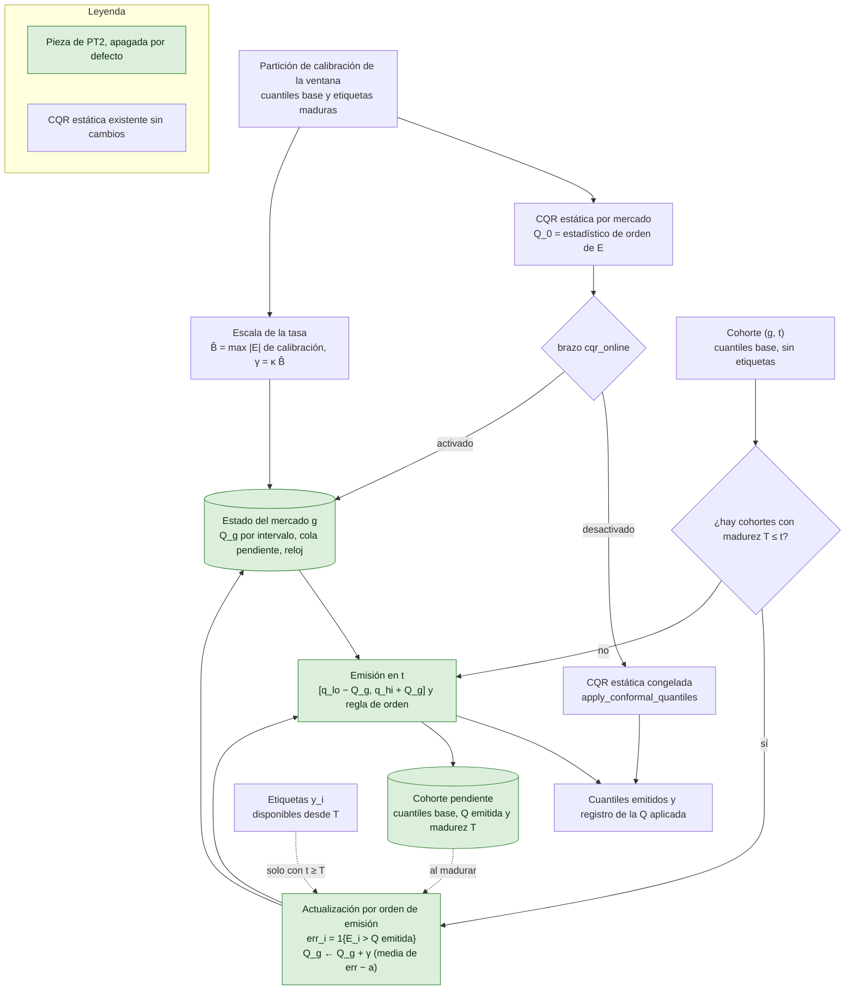

# Calibración conformal en línea con etiquetas maduras (PT2)

Estado a 10 de octubre de 2026: **implementado y comprobado sin entrenar**. El resultado experimental está pendiente, porque el brazo necesita predicciones que el bloqueo de aprendizaje todavía no permite emitir. Tarea [#454](https://github.com/GonxKZ/mars-titan/issues/454). La motivación, el control y la regla de decisión están en las [propuestas posteriores a Titans](../research/post-titans-proposals.md#pt2-calibración-conformal-en-línea-con-etiquetas-maduras).

## Qué hace

La comparación calibra los cuantiles con una CQR estática por mercado: se ajusta en los tres meses de calibración de cada ventana y queda congelada durante los doce meses de evaluación ([métricas y calibración común](../research/metrics.md)). PT2 parte de esa misma corrección y la mueve después de cada cohorte madura. Una cohorte es el conjunto de predicciones de un mercado con el mismo instante de predicción. Si la cohorte quedó fuera del intervalo más de lo nominal, la corrección sube y el intervalo siguiente se ensancha. Si quedó dentro más de lo nominal, baja.

El componente es `OnlineConformal` en `src/mars_titan/calibration/online_conformal.py`. No tiene parámetros entrenables, no toca la memoria de Titans ni el predictor y no usa GPU. Trabaja sobre cuantiles ya emitidos, así que la mediana y el MAE no cambian. `replay_online_conformal` recorre un panel en orden temporal y es la función que usaría la comparación por ventanas.

## Flujo de datos y de estado

**Entradas permitidas.** Para arrancar, las filas de la partición de calibración de la ventana, como la CQR estática. Al emitir, solo los cuantiles base de la cohorte. Al madurar, las etiquetas de esa cohorte y nada más. Las etiquetas nunca llegan al calibrador antes de su madurez, porque `replay_online_conformal` las entrega únicamente al madurar la cohorte.

**Orden temporal.** En cada instante t de un mercado, primero se aplican, en el orden en que se emitieron, las cohortes cuya madurez T cumple T ≤ t. Después se emite la cohorte de t con la corrección resultante. Una etiqueta disponible justo en t se puede usar en t, con la misma convención que `available_at ≤ prediction_at` en las cohortes del corpus. La madurez de una cohorte es la mayor `target_available_at` de sus filas, así que ninguna fila aporta su etiqueta antes de que estén todas.

**Estado que cambia.** Por mercado e intervalo, la corrección vigente Q_g y la suma de errores medios, que solo sirve de diagnóstico. Por mercado, la cola de cohortes pendientes con sus cuantiles base, la corrección emitida y su madurez, el reloj del mercado y el número de cohortes maduras. El estado de un mercado nunca lee el de otro. `export` devuelve todo con una huella SHA-256 y `restore` lo valida antes de reconstruir.

**Qué apaga el interruptor.** Sin el brazo `cqr_online`, la comparación sigue llamando a `apply_conformal_quantiles` con el registro estático, cuyo código no cambia. Con κ = 0 el componente queda encendido pero inmóvil y cada emisión coincide bit a bit con la CQR estática. Las dos cosas están comprobadas.

## Ecuaciones, fuentes, módulos y pruebas

PT2 no toca la memoria, así que no usa la notación del [núcleo de Titans](titans-memory-core.md). Sigue la de la [CQR estática](../research/metrics.md): para la fila i de un mercado g y el intervalo central de cobertura nominal 1 − a con extremos q_lo,i y q_hi,i, y_i es el objetivo y E_i la puntuación. Con los niveles de la cabeza, el intervalo del 80 % usa 0,1 y 0,9 (a = 0,2) y el del 95 % usa 0,025 y 0,975 (a = 0,05). m indexa las cohortes maduras de un mercado en el orden en que se emitieron.

**(C1) Puntuación y corrección inicial.** CQR de Romano, Patterson y Candès (2019), fuente publicada, ya implementada en `fit_conformal_quantiles`:

$$
E_i=\max\big(q_{lo,i}-y_i,\ y_i-q_{hi,i}\big),\qquad Q_0=E_{(\lceil (n+1)(1-a)\rceil)}\ \text{en la calibración}.
$$

Módulo `OnlineConformal.start`. Prueba `test_start_takes_the_static_correction_and_the_declared_rate_scale`.

**(C2) Emisión.** Igual que la CQR estática, con la corrección vigente en lugar de la congelada:

$$
\big[\,q_{lo}-Q_g,\ q_{hi}+Q_g\,\big],
$$

seguida de la regla de orden del proyecto, que ensancha un extremo hacia la mediana o hacia el intervalo interior si cruzaría alguno de ellos. Módulo `OnlineConformal.emit`, que reutiliza `apply_conformal_quantiles` con un registro de un solo mercado. Pruebas `test_one_matured_cohort_moves_each_correction_by_its_equation` y `test_zero_rate_reproduces_the_static_cqr_bit_for_bit`.

**(C3) Actualización por cohorte madura.** El seguimiento de cuantiles es la ecuación 7 de Angelopoulos, Candès y Tibshirani (2023), que contiene ACI (Gibbs y Candès, 2021) como caso particular, y su uso con errores retrasados procede de Wang y Hyndman (2024). La media por cohorte de mercado y el uso de la corrección guardada al emitir son adaptación propia:

$$
\mathrm{err}_i=\mathbf 1\{E_i>\hat Q_m\},\qquad \bar e_m=\frac{1}{|m|}\sum_{i\in m}\mathrm{err}_i,\qquad Q_g\leftarrow Q_g+\gamma\,(\bar e_m-a),
$$

donde Q̂_m es la corrección con la que se emitió la cohorte m, no la vigente al madurar. Con E_i = Q̂_m la fila cuenta como cubierta, igual que en la CQR estática. Módulo `OnlineConformal.mature`. Pruebas `test_one_matured_cohort_moves_each_correction_by_its_equation`, `test_errors_use_the_correction_emitted_with_the_cohort` y `test_late_correction_differs_from_the_correction_in_force`.

**(C4) Escala de la tasa.** Angelopoulos et al. (2023) fijan en la práctica la tasa como una fracción de la mayor puntuación de una ventana móvil. Aquí la ventana es la partición de calibración y queda fija, una adaptación propia que mantiene γ constante:

$$
\gamma=\kappa\,\hat B,\qquad \hat B=\max_{i\in\text{calibración}}|E_i|,\qquad \kappa\in[0,1].
$$

El valor absoluto evita una tasa negativa si todas las puntuaciones de calibración son negativas, que ocurre con intervalos base demasiado anchos. Módulo `OnlineConformal.start`. Pruebas `test_start_takes_the_static_correction_and_the_declared_rate_scale` y `test_rate_scale_uses_the_absolute_score_when_intervals_are_too_wide`.

**(C5) Banda de la corrección con retraso.** Derivación propia que adapta la demostración de la Proposición 1 de Angelopoulos et al. (2023) y del Corolario 1 de Wang y Hyndman (2024) a cohortes y a un punto de partida arbitrario. Supuestos: |E_i| ≤ b en calibración y evaluación, las cohortes maduran en el orden de emisión y en cada emisión hay como mucho d cohortes pendientes además de la nueva. Sea R_k la corrección tras k maduraciones, con R_0 = Q_0 ∈ [−b, b]. Entonces, para todo k,

$$
-b-\gamma(1+d)\,a\ \le\ R_k\ \le\ b+\gamma(1+d)(1-a).
$$

*Demostración.* Si R_k > b, sea j < k el último índice con R_j ≤ b. Un paso sube como mucho γ(1 − a), así que R_{j+1} ≤ b + γ(1 − a). Cada cohorte m entre j + 2 y k se emitió con Q̂_m = R_{k_m}, donde k_m ≥ m − 1 − d por el límite de pendientes. Si k_m ≥ j + 1, entonces Q̂_m > b ≥ E_i para todas sus filas, ē_m = 0 y R baja γa. Solo las cohortes con k_m ≤ j pueden subir, y eso exige m ≤ j + 1 + d, así que son como mucho d. Por tanto R_k ≤ b + γ(1 − a) + dγ(1 − a). La cota inferior es simétrica con ē_m = 1 cuando Q̂_m < −b. ∎

**(C6) Cobertura a largo plazo.** Consecuencia directa de (C5), porque la recurrencia es un integrador de errores, R_M − R_0 = γ Σ_m (ē_m − a):

$$
\Big|\frac1M\sum_{m=1}^{M}(\bar e_m-a)\Big|\ \le\ \frac{2b+\gamma(1+d)}{\gamma M}.
$$

Con d = 0 y partida en cero se recupera el (b + η)/(ηT) de la Proposición 1 original. La garantía es marginal por mercado e intervalo y promediada por cohortes. No es condicional por activo, por sesión ni por régimen, y b solo existe si las puntuaciones están acotadas, algo que una cola gruesa puede hacer muy grande. Prueba `test_long_run_coverage_gap_respects_the_delayed_bound`, con retrasos d = 0, 1 y 3, con y sin cambio de escala, y que comprueba también la banda de (C5) en todas las correcciones emitidas.

**(C7) Cobertura emitida.** Derivación propia inmediata. La regla de orden solo ensancha, así que el intervalo emitido contiene a [q_lo − Q̂_m, q_hi + Q̂_m] y su tasa de fallo nunca supera la media de err_i. La cota de (C6) es por tanto un límite superior para la infracobertura de lo emitido. Prueba `test_long_run_coverage_gap_respects_the_delayed_bound`.

**(C8) Causalidad y madurez.** Contrato del proyecto, no ecuación de una fuente. Una cohorte solo madura en un instante t ≥ T, en el orden de emisión, una sola vez y con un reloj del mercado que no retrocede. Una emisión no puede ser anterior a una actualización ya aplicada. Pruebas `test_future_and_immature_labels_do_not_change_earlier_emissions`, `test_a_cohort_matures_only_when_all_its_labels_are_available`, `test_labels_available_at_the_prediction_instant_are_used`, `test_operations_follow_the_market_clock` y `test_invalid_operations_are_rejected_without_changing_the_state`.

## Por qué podría ayudar y por qué podría no hacerlo

En el mercado la volatilidad cambia dentro de un año. En 2008 y en marzo de 2020 la escala de los rendimientos se multiplicó en pocas semanas, y una corrección ajustada en los tres meses anteriores a la evaluación no puede seguirla. Con etiquetas a una sesión, PT2 corrige la cobertura de cada mercado con un retraso de días, y en años tranquilos puede estrechar intervalos que la CQR estática dejaría demasiado anchos. Su coste es mínimo y no exige reentrenar nada.

Puede no ayudar por varios motivos. Llega siempre tarde a un salto, porque la etiqueta del día del salto madura después, y la garantía es de largo plazo, así que no protege la sesión que más importa. Los errores de una cohorte están muy correlacionados entre activos por los shocks comunes, de modo que ē_m salta a menudo entre 0 y 1 y la corrección puede oscilar. Una corrección por mercado no arregla una mala cobertura concentrada en activos pequeños o en un sector. Y B̂ depende del trimestre de calibración: con una crisis dentro, la tasa será grande y los intervalos volátiles, y con un trimestre tranquilo la adaptación será lenta.

## Control con el que se descarta

La [declaración del brazo](../../configs/evaluation/online-conformal-comparison.json) fija, antes de ejecutar nada, tres brazos sobre las mismas predicciones y filas: el control `cqr_static`, la innovación `cqr_online` y una alternativa trivial `cqr_monthly_refit` que recalcula la CQR estática cada 21 sesiones con las filas maduras de los últimos tres meses. κ se elige entre 0,005 y 0,02 en las ventanas con evaluación entre 2005 y 2013 y se mantiene fijo de 2014 a 2023. La regla conserva PT2 si reduce al menos un 25 % la desviación media absoluta de la cobertura respecto al nominal por año y mercado, con un intervalo del 95 % que excluye cero, y el interval score emparejado por sesión no empeora más de un 1 %. Se abandona si el interval score empeora más de un 1 % o si la desviación no baja. Si la recalibración mensual iguala a PT2, el seguimiento por cohortes no aporta sobre una alternativa más simple. Nada se ha ejecutado.

## Comprobaciones

| Propiedad | Prueba |
| --- | --- |
| La CQR estática no cambia | `test_static_cqr_path_is_unchanged`, con la huella del ajuste y la aplicación capturada en `42e7dbca` antes de añadir PT2 |
| Con κ = 0, salida idéntica bit a bit a la CQR estática | `test_zero_rate_reproduces_the_static_cqr_bit_for_bit` sobre dos mercados y retraso de dos sesiones |
| Corrección inicial, escala y objetivo a exactos | `test_start_takes_the_static_correction_and_the_declared_rate_scale` y `test_rate_scale_uses_the_absolute_score_when_intervals_are_too_wide` |
| Ecuación de actualización a mano, con empate E = Q | `test_one_matured_cohort_moves_each_correction_by_its_equation` |
| Errores con la corrección emitida | `test_errors_use_the_correction_emitted_with_the_cohort` y `test_late_correction_differs_from_the_correction_in_force` |
| Cota de largo plazo con retraso y banda de la corrección | `test_long_run_coverage_gap_respects_the_delayed_bound` |
| Mediana intacta y cuantiles ordenados | `test_long_run_coverage_gap_respects_the_delayed_bound` |
| Reacción a un cambio de escala que la CQR estática no sigue | `test_tracking_reacts_to_a_scale_shift_that_static_cqr_cannot_follow` |
| Causalidad: etiquetas futuras o inmaduras no cambian emisiones anteriores | `test_future_and_immature_labels_do_not_change_earlier_emissions`, `test_a_cohort_matures_only_when_all_its_labels_are_available` y `test_labels_available_at_the_prediction_instant_are_used` |
| Aislamiento entre mercados e independencia del orden entre ellos | `test_markets_and_their_interleaving_are_isolated` |
| Recuperación exacta desde el estado exportado | `test_recovery_from_the_exported_state_is_exact` |
| Estado exportado como copia y rechazo de estados alterados | `test_exported_state_is_a_copy_and_tampering_is_rejected` |
| Rechazos sin cambiar el estado: inmadura, fuera de orden, repetida, forma, NaN, mercado, cola llena, reloj y test de 2024 | `test_invalid_operations_are_rejected_without_changing_the_state` y `test_operations_follow_the_market_clock` |
| Declaraciones imposibles | `test_invalid_declarations_are_rejected` y `test_undefined_static_corrections_cannot_start_the_tracking` |
| Brazo declarado sin ejecutar, con el control igual a la calibración de la comparación | `test_comparison_arm_is_declared_with_its_control_and_rule_but_not_executed` |

Las pruebas están en `tests/calibration/test_online_conformal.py`. Las secuencias son explícitas y con semilla fija y no ajustan ningún modelo. PT2 no tiene parámetros entrenables ni gradientes, así que la comparación con diferencias finitas no se aplica. Tampoco tiene tensores en GPU.

La mutación dirigida aplicó 19 defectos de uno en uno en una copia aislada, tras comprobar que las pruebas importaban la copia: invertir el signo, quitar la escala de la tasa, medir el error con la corrección vigente, usar la cobertura nominal en lugar de a, contar E = Q como fallo, quitar el valor absoluto de la escala, comprobar la madurez contra la fecha de predicción, madurar fuera de orden, emitir antes de una actualización aplicada, sumar en lugar de promediar, restaurar sin comprobar la huella, calcular a en coma flotante, no usar en la réplica las etiquetas disponibles en el mismo instante, madurar la cohorte con su primera fila, perder la suma de errores, restaurar una cola desordenada, emitir con una corrección distinta de la registrada, avanzar el reloj antes de validar y madurar con un reloj que retrocede. Las pruebas detectan los 19 ([recibo](../../reports/engineering/online-conformal-calibration-mutations-20261010.json)). Es una selección dirigida, no una campaña completa de mutación.

## Coste medido sin entrenar

Medido el 10 de octubre de 2026 con `benchmarks/online_conformal_cost.py` dentro de `memslot light`, en un AMD Ryzen 9 8945HS con dos hilos para OpenMP, MKL y OpenBLAS, Python 3.12.14 y NumPy 2.5.3 ([recibo](../../reports/engineering/online-conformal-calibration-cost-20261010.json)). La máquina tenía otras sesiones en marcha, con una carga media de 14,8 al empezar, así que los tiempos son una cota superior razonable y no una medida aislada. Los cuantiles y objetivos son sintéticos con semilla fija y solo fijan las formas: un año de 252 sesiones, dos mercados y tres meses de calibración. Mediana de cinco repeticiones.

| Caso | Filas evaluadas | Réplica en línea | CQR estática (aplicar) | Emisión p50 / p95 | Maduración p50 / p95 | Memoria NumPy máxima |
| --- | --- | --- | --- | --- | --- | --- |
| 128 activos, madurez 1 sesión | 64.512 | 0,075 s | 0,008 s | 291 / 417 µs | 81 / 135 µs | 10,9 MB |
| 128 activos, madurez 5 sesiones | 64.512 | 0,077 s | 0,006 s | 286 / 476 µs | 78 / 128 µs | 10,9 MB |
| 4.200 activos, madurez 1 sesión | 2.116.800 | 1,32 s | 0,81 s | 2.220 / 2.855 µs | 159 / 227 µs | 355 MB |

El arranque cuesta 3,5 ms con 128 activos y 0,12 s con 4.200. Exportar y restaurar el estado cuesta menos de un milisegundo, y la cola pendiente ocupa 51 kB con madurez a cinco sesiones y 128 activos. La réplica en línea es entre 9 y 12 veces más lenta que aplicar la CQR estática con 128 activos, porque cada cohorte repite la validación de `apply_conformal_quantiles`, pero el total por ventana anual sigue por debajo de 0,1 s. Con esas cifras no hay un cuello de botella que justifique optimizar. No se ha medido energía ni GPU, porque el componente no la usa.

## Desviaciones y límites

- La propuesta escribía γ ∈ {0,005, 0,02} sin unidad. La implementación usa γ = κ B̂ y esos valores pasan a ser fracciones κ de la escala de cada mercado e intervalo. El artículo usa 0,1 B̂ por defecto con puntuaciones individuales. Con medias de cohorte de decenas o cientos de activos el error medio es menos ruidoso, y se mantienen los valores declarados.
- La propuesta describía la alternativa trivial como recalibrar una vez al año, pero la CQR estática de la comparación ya se recalibra en cada ventana anual. La alternativa declarada es una recalibración mensual con filas maduras, que todavía no está implementada.
- La escala B̂ se fija con la calibración y no con una ventana móvil, para que γ sea constante y la cota (C6) se aplique sin cambios.
- La réplica exige que las cohortes de un mercado maduren en el orden de emisión. Con el mismo horizonte para todas las filas es lo natural. Si una cohorte posterior madurase antes, esperaría a la anterior.
- El panel de predicciones de la comparación no lleva `target_available_at`. La integración en `walk_forward_comparison` debe leerlo de la vista de cada ventana y queda pendiente.
- La corrección no pasa de una ventana a la siguiente. Cada ventana parte de su propia CQR estática.

## Pendiente sin medir

- El efecto sobre la cobertura y el interval score, la elección de κ y la regla de decisión, bloqueados porque no hay predicciones de la campaña.
- La integración en la comparación por ventanas y la alternativa trivial de recalibración mensual.
- La cobertura en los eventos declarados de 2008, 2020 y 2022.

## Referencias

- Angelopoulos, A. N., Candès, E. J. y Tibshirani, R. J. (2023). Conformal PID control for time series prediction. *Advances in Neural Information Processing Systems, 36*, 23047–23074. https://doi.org/10.52202/075280-1000
- Gibbs, I. y Candès, E. (2021). Adaptive conformal inference under distribution shift. *Advances in Neural Information Processing Systems, 34*. https://proceedings.neurips.cc/paper/2021/hash/0d441de75945e5acbc865406fc9a2559-Abstract.html
- Romano, Y., Patterson, E. y Candès, E. (2019). Conformalized quantile regression. *Advances in Neural Information Processing Systems, 32*.
- Wang, X. y Hyndman, R. J. (2024). *Online conformal inference for multi-step time series forecasting* (arXiv:2410.13115v2). https://arxiv.org/abs/2410.13115v2
