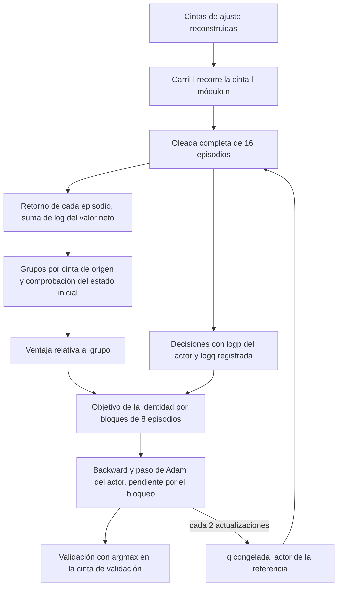
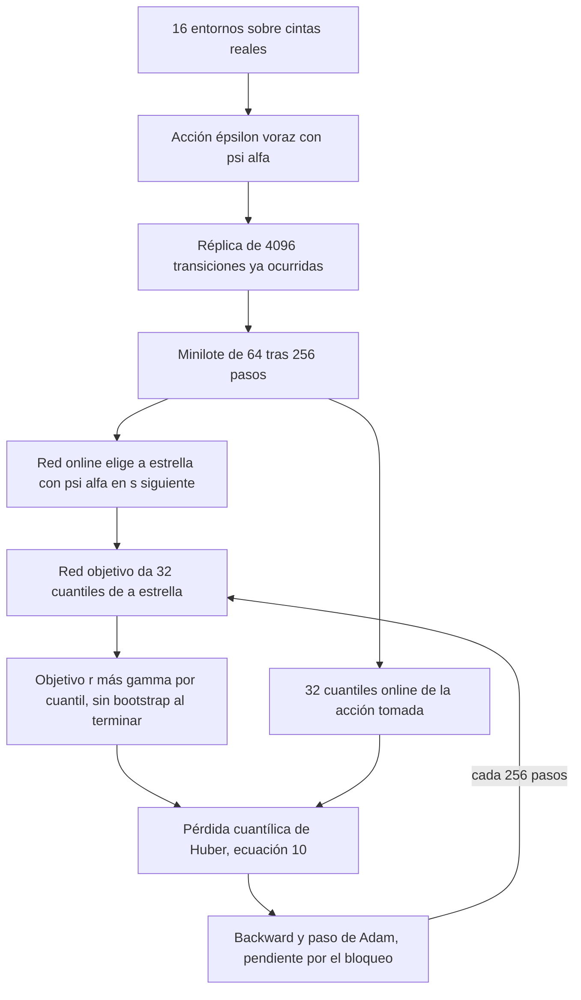

# Variedad de algoritmos de refuerzo sobre las cintas reales

Este documento recoge la revisión de fuentes, la revisión adversarial y la implementación de
los algoritmos de refuerzo que se añaden junto a KLPO terminal, los tres controles PPO y Double
DQN. Se implementan cuatro objetivos relativos al grupo (GRPO, Dr. GRPO, DAPO en su variante
estática y GSPO) sobre las mismas oleadas de KLPO, y dos cabezas cuantílicas de valor (QR-DQN y
QR-DQN con CVaR inferior) sobre la recogida de Double DQN. El resto de candidatos revisados se
descarta con su motivo. Ninguna política se ha entrenado. El bloqueo de aprendizaje sigue
vigente y todas las comprobaciones se hacen con forward, pérdidas y backward, sin pasos de
optimizador. Las cifras de coste describen cálculo y nunca calidad de una política.

## Contrato común del entorno

Todos los brazos comparten el entorno de la etapa RL descrito en
[políticas nativas sobre cintas reconstruidas](native-policy-real-tapes.md). Hay seis acciones
discretas de exposición, la recompensa de cada sesión es el logaritmo del valor neto con costes
y las cintas son las reconstruidas por ventana walk-forward a partir de la edición histórica,
con 16 entornos, 262.144 transiciones por ajuste, semillas 42, 43 y 44, selección
`ruin_count_then_mean_liquidated_log_growth` en validación y evaluación con costes de 0, 5, 10
y 20 puntos básicos. Ningún brazo nuevo crea trayectorias, precios ni recompensas. Las pruebas
unitarias usan tensores y cintas escritas en la prueba solo para contrastar ecuaciones y nunca
para ajustar una política.

Los objetivos de grupo se ejecutan con `mars-titan-klpo` y el tipo de configuración
`native_group_relative`. La configuración tiene exactamente los campos de KLPO terminal y solo
cambian el tipo, el objetivo y el controlador, de modo que recogida, carriles, cadencia de la
referencia, bloques de gradiente, Adam, presupuesto en oleadas completas y selección son los
mismos. Las cabezas cuantílicas se ejecutan con `mars-titan-ppo` en el esquema 4 con las
variantes `qr_dqn` y `qr_dqn_cvar`, con la réplica, el calentamiento, la red objetivo, la
exploración y el presupuesto de Double DQN.

## Fuentes revisadas

Las versiones y fechas son las de arXiv y los enlaces de código apuntan al commit revisado.
Una licencia ausente en el repositorio se indica como tal. Ninguna implementación copia código
de terceros. Todas son propias a partir de las ecuaciones y reutilizan ATen y las validaciones
del proyecto.

| Algoritmo | Fuente y versión | Código revisado | Licencia | Decisión |
| --- | --- | --- | --- | --- |
| GRPO | [DeepSeekMath, arXiv 2402.03300v3](https://arxiv.org/abs/2402.03300v3) (v1 de 5 de febrero de 2024, v3 de 27 de abril de 2024), ecuaciones 3 y 4 | [deepseek-ai/DeepSeek-Math@b8b0f8ce](https://github.com/deepseek-ai/DeepSeek-Math/tree/b8b0f8ce093d80bf8e9a641e44142f06d092c305) solo evalúa. Como implementación de terceros se revisó [huggingface/trl@72cf37df](https://github.com/huggingface/trl/tree/72cf37df714d3183e8e96ec391d474b26eaa30b6) | MIT y Apache 2.0 | Implementado como `grpo_outcome_v1` |
| Dr. GRPO | [Understanding R1-Zero-Like Training, arXiv 2503.20783v2](https://arxiv.org/abs/2503.20783v2) (6 de octubre de 2025, COLM 2025) | [sail-sg/understand-r1-zero@dfca49dd](https://github.com/sail-sg/understand-r1-zero/blob/dfca49dd460ee7cc8e4a5a162c876a7fd6993b87/train_zero_math.py#L286-L308) y [sail-sg/oat@86970662](https://github.com/sail-sg/oat/tree/869706620a35ec5304fa80a0c74f0c566cc2bc57) | MIT y Apache 2.0 | Implementado como `dr_grpo_outcome_v1` |
| DAPO | [DAPO, arXiv 2503.14476v2](https://arxiv.org/abs/2503.14476v2) (20 de mayo de 2025, NeurIPS 2025), ecuación 8 | [BytedTsinghua-SIA/DAPO@33fe3176](https://github.com/BytedTsinghua-SIA/DAPO/tree/33fe3176f0bb212588e84fc8ccf50dd554975144), receta en [verl-project/verl-recipe@242c73fc](https://github.com/verl-project/verl-recipe/tree/242c73fcadf331e7214c4b48f67423f45239cea8) y [verl@fc72e2f3](https://github.com/volcengine/verl/blob/fc72e2f384212470868a9928b62baedb9bcc3ff0/verl/trainer/ppo/core_algos.py#L1140-L1206) | Sin licencia en el repositorio de DAPO, Apache 2.0 en verl | Implementado como `dapo_outcome_static_v1`, sin muestreo dinámico ni castigo de longitud |
| GSPO | [Group Sequence Policy Optimization, arXiv 2507.18071v2](https://arxiv.org/abs/2507.18071v2) (28 de julio de 2025), ecuaciones 5 a 7 | [verl@fc72e2f3](https://github.com/volcengine/verl/blob/fc72e2f384212470868a9928b62baedb9bcc3ff0/verl/trainer/ppo/core_algos.py#L1545-L1621), incorporado en el merge [b75b1f0b](https://github.com/volcengine/verl/commit/b75b1f0bf1dbff60f004795eac845446da32a22d) | Apache 2.0 | Implementado como `gspo_outcome_v1` |
| «GRPO++» | Sin definición canónica. [Song y Zheng, arXiv 2505.21178](https://arxiv.org/abs/2505.21178) combina GRPO, clip-higher, muestreo dinámico y bonificación de entropía con un repositorio que ya no existe, y [arXiv 2510.01236](https://arxiv.org/abs/2510.01236) usa otra ventaja binaria | No verificable | No aplica | Descartado por falta de fuente única |
| A2C | [A3C, arXiv 1602.01783v2](https://arxiv.org/abs/1602.01783v2) (ICML 2016) | [openai/baselines@ea25b9e8](https://github.com/openai/baselines/tree/ea25b9e8b234e6ee1bca43083f8f3cf974143998/baselines/a2c) | MIT | Descartado, coincide con PPO de una época |
| IMPALA (V-trace) | [arXiv 1802.01561v3](https://arxiv.org/abs/1802.01561v3) (28 de junio de 2018) | [google-deepmind/scalable_agent@6c0c8a70](https://github.com/google-deepmind/scalable_agent/blob/6c0c8a701990fab9053fb338ede9c915c18fa2b1/vtrace.py#L164-L280) | Apache 2.0 | Descartado, sin retraso entre actor y aprendiz |
| SAC discreto | [arXiv 1910.07207v2](https://arxiv.org/abs/1910.07207v2) (18 de octubre de 2019) y [Zhou et al., arXiv 2209.10081](https://arxiv.org/abs/2209.10081) | [p-christ/Deep-Reinforcement-Learning-Algorithms-with-PyTorch@4835bac8](https://github.com/p-christ/Deep-Reinforcement-Learning-Algorithms-with-PyTorch/tree/4835bac8557fdacff1735eca004e35ea5a4b7443) | MIT | Descartado, se mantiene condicionado |
| QR-DQN | [arXiv 1710.10044v1](https://arxiv.org/abs/1710.10044v1) (27 de octubre de 2017, AAAI 2018), ecuación 10 y algoritmo 1 | [google/dopamine@5873f549](https://github.com/google/dopamine/blob/5873f5494ee0c2d7c016d0ab2ad530354fec59d0/dopamine/jax/agents/quantile/quantile_agent.py#L39-L114) | Apache 2.0 | Implementado como `qr_dqn` |
| IQN y CVaR | [arXiv 1806.06923v1](https://arxiv.org/abs/1806.06923v1) (14 de junio de 2018), sección 4 | [google/dopamine@5873f549](https://github.com/google/dopamine/blob/5873f5494ee0c2d7c016d0ab2ad530354fec59d0/dopamine/jax/agents/implicit_quantile/implicit_quantile_agent.py#L143-L182) | Apache 2.0 | IQN descartado. La medida CVaR se aplica a QR-DQN como `qr_dqn_cvar` |
| CVaR en gradiente de política | [Tamar et al., arXiv 1404.3862v4](https://arxiv.org/abs/1404.3862v4) y [CPPO, IJCAI 2022](https://github.com/yingchengyang/CPPO/tree/4067310a5bde462059457c74dc4a3a3bdac25e18) | Código de CPPO revisado | MIT | Descartado |
| CQL, IQL y Decision Transformer | [CQL v3](https://arxiv.org/abs/2006.04779v3), [IQL v1](https://arxiv.org/abs/2110.06169v1) (ICLR 2022), [DT v2](https://arxiv.org/abs/2106.01345v2) | [CQL@d67dbe9c](https://github.com/aviralkumar2907/CQL/tree/d67dbe9cf5d2b96e3b462b6146f249b3d6569796), [IQL@09d70024](https://github.com/ikostrikov/implicit_q_learning/tree/09d700248117881a75cb21f0adb95c6c8a694cb2), [DT@e2d82e68](https://github.com/kzl/decision-transformer/tree/e2d82e68f330c00f763507b3b01d774740bee53f) | CQL sin licencia en la raíz, MIT en IQL y DT | Descartados |

## Revisión adversarial

La pregunta para cada candidato es qué aporta frente a KLPO y PPO en este entorno, qué
contraejemplo lo debilita, qué alternativa trivial lo iguala, qué riesgo de fuga temporal tiene
y cuánto cuesta. Un candidato que no aporta un contraste propio se descarta aunque sea popular.

| Candidato | Qué aporta | Contraejemplo u objeción | Alternativa trivial | Riesgo de fuga | Decisión |
| --- | --- | --- | --- | --- | --- |
| GRPO | Línea base por estado inicial con la media del grupo, sin crítico. KLPO no usa línea base y PPO usa un crítico aprendido | Con grupos de 5 o 6 episodios la media y la desviación son ruidosas. Un grupo plano da ventaja nula y no aporta señal | REINFORCE con línea base constante, que no separa estados iniciales | El grupo se fija por carril antes de recoger. La ventaja usa el resultado completo solo al cerrar la oleada | Se implementa |
| Dr. GRPO | Quita la división por la desviación, que amplifica grupos casi planos, y la división por longitud | La corrección de longitud apenas actúa porque todos los episodios de una cinta tienen la misma longitud | GRPO con épsilon grande en el denominador | Igual que GRPO | Se implementa como control de la normalización |
| DAPO estático | Recorte asimétrico (clip-higher) y media por decisión de toda la oleada | Sin muestreo dinámico ni castigo de longitud solo queda el recorte asimétrico, y con longitudes iguales la media por decisión casi coincide con la de GRPO | GRPO sin KL con recorte 0,2 y 0,28 | Igual que GRPO | Se implementa con identidad propia que declara lo que falta |
| GSPO | Cociente de secuencia con recorte estrecho en lugar de cociente por decisión | En la primera oleada de cada referencia el actor coincide con q y su gradiente es el de GRPO. Solo difiere en la segunda | GRPO con recorte más estrecho por decisión | Igual que GRPO | Se implementa |
| «GRPO++» | Sin contenido propio fuera de lo anterior | No existe una definición citable | GRPO con clip-higher y entropía | No aplica | Descartado |
| A2C | Actualización de una época sin recorte | Con el cociente igual a uno su gradiente es el de PPO, y la prueba `ppo_at_unit_ratio_is_policy_gradient` lo comprueba | PPO con una época y lote completo | Ninguno nuevo | Descartado |
| IMPALA (V-trace) | Corrección fuera de política entre actores y aprendiz | Aquí no hay actores remotos ni retraso. En política V-trace se reduce al objetivo de n pasos (sección 4.1, ecuación 2) | GAE de PPO | Ninguno nuevo | Descartado |
| SAC discreto | Sumas sobre acciones y reutilización con réplica | Zhou et al. documentan fallos de la temperatura con acciones discretas. La entropía objetivo de 0,98 log 6 favorece políticas casi uniformes frente a recompensas diarias pequeñas | Double DQN con exploración épsilon | Ninguno nuevo | Descartado, sigue condicionado |
| QR-DQN | Distribución del retorno por acción en lugar de su media | Con N pequeño las colas son gruesas y los cuantiles pueden cruzarse | Double DQN, que estima la misma media | La réplica solo guarda transiciones ya ocurridas | Se implementa |
| QR-DQN con CVaR | Actuar con la media de la cola inferior, una preferencia por el riesgo explícita | El CVaR de la distribución estimada no es el riesgo de la cartera fuera de muestra | Double DQN con penalización fija de varianza | Igual que QR-DQN | Se implementa |
| IQN | Cuantiles muestreados y medidas de riesgo continuas | Coste N por N' por transición. En el artículo, CVaR(0,1) perdió rendimiento | QR-DQN con átomos fijos | Igual que QR-DQN | Descartado |
| CVaR en gradiente de política | Optimizar la cola de retornos | Dentro de un grupo la dispersión procede del muestreo de la política y no del mercado. Entre pocas cintas la cola es el peor año | Seleccionar con el recuento de ruinas, que ya hace la etapa | Ninguno nuevo | Descartado |
| CQL, IQL y DT | Aprendizaje fuera de línea desde datos fijos | Hay simulador, así que no existe el problema fuera de línea. Las referencias deterministas cubren mal las acciones, y DT falla en entornos estocásticos (Paster et al. 2022, teorema 2.1, y Brandfonbrener et al. 2023) | Clonar la referencia | Un conjunto fijo invita a seleccionar con información posterior | Descartados |

## Objetivos relativos al grupo

### Grupo y estado inicial

Los carriles recorren las cintas de ajuste igual que KLPO, con la regla
`train_tape_index_is_lane_modulo_train_tapes`. Todos los episodios de una cinta parten de la
misma primera sesión y de la misma caja inicial, así que forman un grupo
(`episodes_from_the_same_train_tape_v1`). Con 16 entornos y tres cintas de ajuste los grupos
tienen 6, 5 y 5 episodios. `mars-titan-klpo` rechaza una configuración con menos de dos
carriles por cinta, y la declaración de la etapa lo comprueba antes, también para la
sensibilidad de ventanas en expansión, que comparte los brazos. Con 16 entornos caben como
máximo 8 cintas de ajuste, así que esa sensibilidad, declarada hoy con un máximo de 16, debe
bajar a 8 si los objetivos de grupo entran en la etapa. `group_wave` comprueba además, bit a
bit, que todos los episodios de un grupo tienen la misma primera observación y rechaza grupos de
un solo episodio.

La referencia q es la política que recogió la oleada. Hace de política antigua del cociente y
de referencia del KL, igual que el muestreador de KLPO. Con la cadencia de dos actualizaciones
por referencia, la primera oleada de cada referencia es en política y la segunda no, que es
donde recorte y cociente de secuencia se separan.

### Ecuaciones

Para un grupo $\mathcal{G}$ de episodios $i$ con resultado
$R_i=\sum_{t} r_{i,t}$ (gamma igual a uno), $|o_i|$ decisiones muestreadas y cociente por
decisión $\rho_{i,t}=\pi_\theta(a_{i,t}\mid s_{i,t})/q(a_{i,t}\mid s_{i,t})$, las ventajas son

$$\hat A_i^{\text{GRPO}}=\frac{R_i-\operatorname{mean}_{\mathcal G}(R)}{\operatorname{std}_{\mathcal G}(R)+\epsilon},\qquad \hat A_i^{\text{Dr}}=R_i-\operatorname{mean}_{\mathcal G}(R),$$

con desviación muestral, porque DeepSeekMath no fija el estimador, y $\epsilon=10^{-6}$. GRPO
(DeepSeekMath, ecuaciones 3 y 4) minimiza

$$\mathcal L^{\text{GRPO}}=-\frac{1}{B}\sum_i\frac{1}{|o_i|}\sum_t\Big[\min\big(\rho_{i,t}\hat A_i,\operatorname{clip}(\rho_{i,t},1-\varepsilon,1+\varepsilon)\hat A_i\big)-\beta\Big(\frac{q}{\pi_\theta}-\log\frac{q}{\pi_\theta}-1\Big)_{i,t}\Big],$$

con $\beta=0{,}04$ y $\varepsilon=0{,}2$. Dr. GRPO sustituye $1/|o_i|$ por una constante $1/L$
con $L=256$, el máximo de decisiones de un episodio, y no lleva KL. DAPO (ecuación 8) divide por
el total de decisiones de la oleada y recorta con $1-0{,}2$ y $1+0{,}28$:

$$\mathcal L^{\text{DAPO}}=-\frac{1}{\sum_i|o_i|}\sum_i\sum_t\min\big(\rho_{i,t}\hat A_i,\operatorname{clip}(\rho_{i,t},1-\varepsilon_{\text{low}},1+\varepsilon_{\text{high}})\hat A_i\big).$$

GSPO (ecuaciones 5 a 7) usa el cociente de secuencia $s_i=\exp\big(\tfrac{1}{|o_i|}\sum_t\log\rho_{i,t}\big)$:

$$\mathcal L^{\text{GSPO}}=-\frac{1}{B}\sum_i\min\big(s_i\hat A_i,\operatorname{clip}(s_i,1-3\cdot10^{-4},1+4\cdot10^{-4})\hat A_i\big).$$

$B$ cuenta todos los episodios de la oleada. Un episodio sin decisiones conserva su puesto en
$B$ y aporta peso cero. La pérdida se calcula por bloques de 8 episodios con pesos fijados sobre
la oleada completa, de modo que la suma de los bloques es la pérdida de la oleada.

### Correspondencia con el código y las pruebas

| Pieza | Código | Prueba |
| --- | --- | --- |
| Ventajas por grupo y rechazo de grupos de uno | `group_advantages` en [`group_relative.cpp`](../../native/src/group_relative.cpp) | `rl_variety` contra la [referencia NumPy FP64](../../native/tests/rl_variety_reference.py) y `advantages_stay_within_their_group` |
| Agregación de cada identidad | `group_episode_weights` | Pesos de la referencia y [`test_rl_variety_reference.py`](../../tests/simulation/test_rl_variety_reference.py) |
| Cociente, recorte, KL k3 y cociente de secuencia | `group_relative_loss` | Pérdida y gradiente respecto a los logits del actor contra la referencia, con NaN, infinito y acciones centinela en el padding |
| Constantes publicadas | `published_group_objective` | `rejections` en `rl_variety` |
| Grupos por cinta, estado inicial y oleada completa | `group_wave` y `group_block_loss` en [`group_waves.cpp`](../../native/src/group_waves.cpp) | [`group_waves_tests.cpp`](../../native/tests/group_waves_tests.cpp) |
| Controlador e identidad | `KlpoLearningConfig::group` en [`klpo_learning.cpp`](../../native/src/klpo_learning.cpp) | `identities_keep_klpo_intact` y las pruebas existentes de KLPO |
| Configuración de la etapa | `native_group_relative` en [`klpo_experiment.cpp`](../../native/src/klpo_experiment.cpp), `klpo_config` en [`native_policy_runs.py`](../../src/mars_titan/simulation/native_policy_runs.py) y la comprobación de carriles en [`policy_plan.py`](../../src/mars_titan/simulation/policy_plan.py) | `test_group_arms_share_the_klpo_waves_and_binary`, `test_group_objectives_reject_lonely_lanes_and_unknown_identities` y el caso `group_lonely_sensitivity_lanes` |

### Desviaciones respecto a las fuentes

1. Una decisión de exposición hace el papel de un token y un episodio completo el de una
   respuesta. La recompensa de resultado es el crecimiento logarítmico neto del episodio. No
   hay verificador ni recompensa binaria.
2. La política antigua y la referencia del KL son la misma q. GRPO usa una referencia separada
   y fija. Aquí se conserva la de KLPO para que la comparación solo cambie el objetivo.
3. Hay una actualización por oleada. DeepSeekMath describe una sola actualización por
   exploración y GSPO usa varios minilotes por lote recogido.
4. DeepSeekMath no publica el recorte de GRPO. Se fija en 0,2, el valor de Dr. GRPO y DAPO.
5. El estimador k3 del KL es el de DeepSeekMath. [Zhang et al., arXiv 2505.17508](https://arxiv.org/abs/2505.17508)
   señalan que le falta el peso de importancia fuera de política y DeepSeek-V3.2 lo corrige. Se
   conserva la forma original y la corrección queda documentada como alternativa.
6. DAPO pierde el muestreo dinámico, que exige repetir grupos hasta que no sean planos y
   rompería el presupuesto común, y el castigo de longitud, que no tiene sentido con episodios de
   longitud fija. Por eso su identidad es `dapo_outcome_static_v1`.
7. Los grupos tienen 5 o 6 episodios y no 16 o 64 como en los artículos. Su tamaño lo fija el
   número de cintas de ajuste y no es un hiperparámetro libre.

## QR-DQN y CVaR inferior

La cabeza cuantílica sustituye los seis valores Q de Double DQN por $N=32$ cuantiles por acción
en los niveles $\hat\tau_i=(2i+1)/(2N)$. La pérdida por transición sigue la ecuación 10 y el
algoritmo 1 de QR-DQN, sin dividir por $\kappa$:

$$\mathcal L=\sum_{i=1}^{N}\frac{1}{N}\sum_{j=1}^{N}\big|\hat\tau_i-\mathbb 1\{u_{ij}<0\}\big|\,\mathcal H_\kappa(u_{ij}),\qquad u_{ij}=r+\gamma(1-d)\,\theta_j^{-}(s',a^\ast)-\theta_i(s,a),$$

con $\mathcal H_\kappa$ la pérdida de Huber y $\kappa=1$ (QR-DQN-1). La acción se puntúa con

$$\psi_\alpha(s,a)=\frac{1}{\alpha N}\sum_{i<\alpha N}\theta_i(s,a),$$

que es la media para $\alpha=1$ (`qr_dqn`) y la media de los 8 niveles inferiores para
$\alpha=0{,}25$ (`qr_dqn_cvar`). Si los cuantiles no se cruzan, $\psi_\alpha$ es exactamente el
CVaR al nivel $\alpha$ de la distribución que representa la cabeza, una mezcla uniforme de
deltas. Si se cruzan, es la media de los niveles inferiores por su $\tau$ y no por su valor
ordenado. La acción siguiente del objetivo la elige la red online con la misma $\psi_\alpha$ y
la valora la red objetivo, como en Double DQN. IQN (sección 4) define con la misma idea la
política que actúa con una medida de riesgo.

| Pieza | Código | Prueba |
| --- | --- | --- |
| Niveles, puntuación de riesgo, objetivos y pérdida | [`quantile_dqn.cpp`](../../native/src/quantile_dqn.cpp) | `rl_variety` contra la referencia FP64, con un cuantil cruzado y la rama lineal de Huber. Con κ = 1, [paridad con sb3-contrib 2.9.0](../../tests/simulation/test_quantile_huber_sb3_parity.py) del oráculo, de su archivo y del núcleo C++ |
| Cabeza, puntuación en `forward`, pérdida sin paso y checkpoint | `PpoPolicy::double_dqn_loss` y `action_quantiles` en [`ppo_policy.cpp`](../../native/src/ppo_policy.cpp) | [`qr_dqn_policy_tests.cpp`](../../native/tests/qr_dqn_policy_tests.cpp), con valores calculados a mano (1,75 con la media y 0,7421875 con alfa 0,5) |
| Variantes del esquema 4 | `value_variant` en [`policy_context.cpp`](../../native/src/policy_context.cpp) y `architecture_for` | `test_quantile_value_variants_are_declared_like_double_dqn` |

Las desviaciones son tres. QR-DQN usa 200 cuantiles en Atari y aquí se usan 32, una decisión
de coste que queda fijada en la identidad. El artículo elige la acción siguiente con la media de
la red objetivo y aquí se usa la selección doble de la línea Double DQN del proyecto. La
evaluación y la selección siguen usando el argmax de la puntuación con la que actúa cada
variante, de modo que `qr_dqn_cvar` se evalúa con su propia preferencia por el riesgo.

`quantile_huber_loss` de sb3-contrib 2.9.0 (grupo `reference`) sirve de referencia externa para
κ = 1, el valor que fija esa biblioteca. Con los puntos medios FP64 pasados en `cum_prob` y
lotes de una fila coincide con el archivo del oráculo en los casos `qr_mean` y `qr_cvar` y con
su función `quantile_huber` en un lote de 64 transiciones con 32 cuantiles y errores a los dos
lados de κ, con tolerancia 10⁻¹² en pérdidas y gradientes. En FP32 cumple la tolerancia de la
ruta FP32 de `rl_variety`, 10⁻⁹ + 10⁻⁵ veces la suma de los valores absolutos de los términos.
Las diferencias máximas fueron 3,5·10⁻¹⁸ frente al archivo y 1,2·10⁻¹⁴ en el lote de 64
transiciones, y en FP32 el peor elemento usó el 1,2 % de la tolerancia. Cuando
`rl_variety_tests` está compilado junto a `mars-titan-ppo`, la prueba escribe los valores de
sb3-contrib en una copia del archivo y el núcleo C++ los reproduce con su tolerancia de 10⁻¹²
relativa. Un control con una pérdida alterada en 10⁻⁹ relativo hace fallar al ejecutable. κ ≠ 1,
como el caso `qr_linear`, solo lo cubre el oráculo propio. Sin `cum_prob`, sb3-contrib calcula
los niveles en FP32, que son exactos con 32 cuantiles pero no con los 200 de Atari. La prueba no
usa los algoritmos ni los entornos de Stable-Baselines3.

## Trazas de aprendizaje

`group_relative_loss` y `KlpoLearningController::backward_ready` aceptan un destino opcional
de trazas. Con él, la oleada publica entropía, KL completo y k3 respecto a q, cociente medio,
mínimo y máximo, fracción recortada, media, desviación y extremos de las ventajas, número y
tamaño de los grupos, grupos planos y dispersión media de los retornos. Se calculan sin
gradiente después de la pérdida. Las pruebas exigen que pérdidas y gradientes sean idénticos
bit a bit con y sin traza y que acumular bloques dé la misma traza que un bloque único.

## Coste medido sin aprendizaje

`mars-titan-policy-benchmark` (en [`policy_collection.cpp`](../../native/benchmarks/policy_collection.cpp))
mide ahora también las piezas nuevas. La acción de 16 filas con copia de vuelta se mide para
las cuatro cabezas (PPO, Double DQN, QR-DQN y QR-DQN-CVaR). La pérdida de valor de un minilote
de 64 transiciones, con sus dos forwards sin gradiente y el backward, se calcula sobre pares
consecutivos capturados al recorrer la cinta con el ciclo fijo de acciones y con su recompensa
contable real. Los cuatro objetivos de grupo y el objetivo KLPO se miden sobre la misma oleada
recogida por el actor de referencia, por bloques de 8 episodios como el controlador, con una
pasada de calentamiento y cinco repeticiones, con traza y sin ella. Ninguna medida ejecuta Adam
y al terminar el medidor exige que las huellas de los parámetros no hayan cambiado.

Las cintas son las preparadas para la [etapa RL nativa](../../reports/engineering/rl-stage-native-20261009/README.md)
sobre `unadjusted-prices-20261009/edition-v1`, con 128 activos y observaciones de 770 valores.
Precios, sesiones y recompensas son reales. La columna de puntuaciones es un relleno que no
procede de ningún modelo, porque bajo el bloqueo ningún predictor ha publicado puntuaciones, así
que las cifras solo describen coste de cálculo. La oleada tiene 4.021 transiciones en 252 pasos
en EE. UU. y 3.878 en 243 en China. El [resumen estructurado](../../reports/engineering/rl-variety-20261010/summary.json)
guarda entorno, cargas, medianas, razones, concurrencia y proyección.

Otros agentes ocupaban la máquina durante las medidas, con cargas medias de 31 a 41 en las
ejecuciones de un proceso en CPU y de 22 a 36 en las de `cuda:0`, más del doble que en el
informe de la etapa nativa. Por eso los valores absolutos son más altos que los de ese informe y la
proyección solo usa las razones entre piezas medidas en la misma ejecución.

Mediana de tres ejecuciones de cada p50, intercalando EE. UU. y China:

| Medida | CPU EE. UU. | CPU China | `cuda:0` EE. UU. | `cuda:0` China |
| --- | ---: | ---: | ---: | ---: |
| Acción de Double DQN (µs) | 179 | 172 | 719 | 459 |
| Acción de QR-DQN (µs) | 181 | 194 | 933 | 544 |
| Acción de QR-DQN-CVaR (µs) | 184 | 222 | 856 | 512 |
| Pérdida y backward de Double DQN, 64 filas (µs) | 1.348 | 1.325 | 2.212 | 1.611 |
| Pérdida y backward de QR-DQN, 64 filas (µs) | 2.931 | 2.906 | 2.864 | 2.938 |
| Pérdida y backward de QR-DQN-CVaR, 64 filas (µs) | 3.090 | 3.083 | 3.102 | 2.822 |
| Objetivo KLPO de la oleada (ms) | 56,5 | 52,5 | 41,1 | 53,5 |
| Objetivo GRPO (ms) | 60,9 | 49,3 | 41,2 | 47,1 |
| Objetivo Dr. GRPO (ms) | 56,5 | 57,1 | 44,3 | 44,4 |
| Objetivo DAPO estático (ms) | 59,3 | 53,6 | 52,8 | 40,4 |
| Objetivo GSPO (ms) | 63,2 | 61,9 | 37,6 | 53,5 |
| Oleada KLPO completa (s) | 0,18 | 0,20 | 0,35 | 0,34 |
| `VmHWM` del proceso (MiB) | 479 | 479 | 1.335 | 1.335 |

La cabeza cuantílica tiene 65.984 parámetros frente a 53.894 de Double DQN, porque su última
capa produce 192 valores en lugar de 6. En CPU su pérdida cuesta entre 2,19 y 2,33 veces la de
Double DQN (mediana de las razones emparejadas por ejecución) y en `cuda:0` entre 1,30 y 1,73
veces, ya que compara 32 por 32 pares de cuantiles en cada transición. La acción cuesta entre
1,03 y 1,32 veces en CPU y entre 1,15 y 1,30 veces en `cuda:0`, por la capa mayor y la
reducción de la puntuación de riesgo. Los objetivos de grupo cuestan lo mismo que el objetivo KLPO
dentro del ruido, con razones entre 0,92 y 1,20, ya que reutilizan sus decisiones y solo cambian
ventajas, pesos y recorte. Con cinco repeticiones la traza no muestra un coste distinguible del
ruido (razones entre 0,96 y 1,41 respecto a KLPO, en los dos sentidos). Las huellas de la
oleada coinciden en todas las repeticiones de cada dispositivo y difieren entre CPU y `cuda:0`,
como ya documentó la etapa nativa.

### Ocho procesos en CPU

Se intercalaron tres rondas de un proceso y de ocho procesos simultáneos sobre las cintas de EE.
UU., con carga media de 17 a 24. La aceleración agregada es ocho veces el tiempo del proceso
aislado dividido por la mediana de los ocho. Todos los procesos produjeron la misma huella de
oleada que el proceso aislado.

| Pieza | Aceleración con 8 procesos (mediana) | Mínimo y máximo de las tres rondas |
| --- | ---: | ---: |
| Oleada KLPO completa | 5,3 | 5,2 y 5,3 |
| Pérdida de Double DQN | 5,0 | 5,0 y 5,2 |
| Pérdida de QR-DQN | 4,2 | 4,0 y 4,7 |
| Pérdida de QR-DQN-CVaR | 5,1 | 3,5 y 5,2 |
| Objetivo KLPO | 4,5 | 4,2 y 5,2 |
| Objetivos de grupo (mediana de los cuatro) | 4,7 | 4,0 y 5,0 |

La pérdida cuantílica escala algo peor que la de Double DQN. Una explicación plausible, que no
se ha comprobado con contadores del hardware, es que su minilote mueve más datos por núcleo y
compite más por la caché compartida.

### Proyección sobre la etapa A

`native_policy_hours` aplica los tiempos medidos al plan de la etapa A, con los tiempos comunes
del informe de la etapa nativa y los campos nuevos (`qr_dqn_*` y
`group_objective_transition_seconds`) escalados con las razones emparejadas de esta medida. Para
las dos variantes cuantílicas se usa la razón mayor de las dos. Cada brazo nuevo entra en el
nivel de algoritmos con 144 ajustes. El paso de Adam sigue sin medirse, así que todas las horas
son una cota inferior. Cada 100 µs por paso de Adam añaden 1,05 h a cada brazo de valor, que
hace 37.711.872 pasos, y 0,0003 h a cada brazo de grupo, que hace 9.036.

| Brazo | CPU, un proceso (h) | `cuda:0`, un proceso (h) | CPU, 8 procesos (h, estimadas) |
| --- | ---: | ---: | ---: |
| KLPO terminal (792 ajustes) | 2,67 | 3,92 | |
| Cada brazo PPO | 0,85 | 1,67 | |
| Double DQN | 13,05 | 22,98 | |
| GRPO, Dr. GRPO o DAPO estático | 0,49 | 0,71 a 0,72 | 0,11 |
| GSPO | 0,52 | 0,71 | 0,11 |
| QR-DQN o QR-DQN-CVaR | 29,89 | 34,71 | 7,1 |

| Conjunto de brazos | CPU, un proceso (h) | `cuda:0`, un proceso (h) | CPU, 8 procesos (h, estimadas) |
| --- | ---: | ---: | ---: |
| Etapa A actual, con las cinco referencias | 18,3 | 32,0 | 3,6 |
| Con GRPO, Dr. GRPO y GSPO | 19,8 | 34,1 | 3,9 |
| Con esos tres y el par QR-DQN | 79,6 | 103,5 | 18,1 |
| Con los seis brazos nuevos | 80,1 | 104,3 | 18,3 |

Las horas con ocho procesos dividen la parte de cada brazo por la aceleración medida de su pieza
dominante (la oleada para la etapa actual, como en el informe de la etapa nativa, los objetivos
de grupo y la pérdida cuantílica) y suponen que el resto escala igual. No se midió QR-DQN con
varios procesos bajo MPS en `cuda:0`.

## Propuesta de brazos para la campaña

KLPO terminal sigue como brazo principal en el nivel completo, con todos los predictores, y las
cinco referencias no cambian. La propuesta solo afecta al nivel de algoritmos, que hoy tiene los
tres controles PPO y Double DQN con dos predictores. No modifica la configuración de la etapa,
que otras tareas están rediseñando, y queda como decisión del protocolo.

| Brazo | Qué contrasta | Control que permite descartarlo | Coste añadido | Propuesta |
| --- | --- | --- | --- | --- |
| `grpo_outcome` | Línea base del grupo, normalización por desviación, recorte y KL k3 frente a KLPO sobre oleadas idénticas | KLPO terminal con las mismas oleadas, semillas y selección | 0,5 h en CPU y 0,7 h en `cuda:0` | Entra |
| `dr_grpo_outcome` | Quitar la normalización por desviación y por longitud | GRPO | 0,5 h y 0,7 h | Entra |
| `gspo_outcome` | Cociente de secuencia frente al cociente por decisión | GRPO | 0,5 h y 0,7 h | Entra |
| `dapo_outcome_static` | Recorte asimétrico y media por decisión de la oleada | GRPO | 0,5 h y 0,7 h | Implementado, fuera de la campaña principal. Con episodios de igual longitud y sin muestreo dinámico se reduce casi a GRPO sin KL |
| `qr_dqn` | Pérdida distribucional con la misma decisión por la media | Double DQN | 29,9 h en CPU, 34,7 h en `cuda:0` y unas 7 h con 8 procesos | Bloque secundario, solo junto a `qr_dqn_cvar` |
| `qr_dqn_cvar` | Preferencia explícita por la cola inferior al actuar | `qr_dqn` | Igual que `qr_dqn` | Bloque secundario, solo junto a `qr_dqn` |

Los tres objetivos de grupo cuestan juntos unas 2,2 h en `cuda:0` con un trabajo cada vez, menos
del 7 % de la etapa actual, y se pueden incluir sin desplazar otros trabajos. Su entrada exige
bajar a 8 el máximo de la sensibilidad de ventanas en expansión, como se explica arriba.

El par cuantílico es caro. Con el protocolo actual (`cuda:0` y un trabajo cada vez) lleva la
etapa A de 32 h a unas 104 h como cota inferior, un 15 % de un presupuesto de pared de cuatro
semanas (672 h) que también debe cubrir los predictores. Con ocho procesos en CPU la etapa
completa quedaría en unas 18 h, pero ese cambio de dispositivo cambia las identidades de las
ejecuciones y sigue pendiente de decisión en el protocolo. La propuesta es incluir el par solo
si la etapa pasa a varios procesos o si el presupuesto lo permite tras los predictores, y en
ese caso los dos brazos juntos. Un `qr_dqn_cvar` solo frente a Double DQN mezclaría el efecto de
la pérdida distribucional con el de la preferencia por el riesgo y no permitiría atribuir una
diferencia a ninguno de los dos.

Cada brazo se juzga con el mismo informe de la etapa que KLPO, con contrastes emparejados por
sesión e intervalos por bloques. Un brazo cuyo contraste con su control incluya el cero no
aporta evidencia a favor de su componente, y así debe registrarse, sin repetir el ajuste con
otra configuración.

## Mutación dirigida

Se aplicaron defectos de uno en uno, compilando y ejecutando las pruebas afectadas, con la
fuente restaurada siempre al terminar. En los objetivos de grupo fallan los nueve: agrupar sin
la cinta de origen, no comprobar el estado inicial, promediar los bloques en lugar de sumarlos,
pesar el cociente de secuencia de la traza por decisiones, quitar el objetivo de la identidad,
recortar DAPO de forma simétrica, admitir un carril por cinta, propagar unos en lugar de los
pesos al dispersar los episodios y aceptar un retorno descontado. En QR-DQN fallan los nueve:
actuar con la media en `forward`, usar κ igual a 2, sumar la pérdida en lugar de promediarla,
no guardar alfa en el checkpoint, elegir la acción siguiente con la red objetivo, desplazar los
niveles de cuantil, dividir la Huber por κ, olvidar la variante CVaR en la lista de variantes y
quitar de la huella la geometría de la cabeza. Este último no compilaba en su primera forma
porque dejaba una función sin uso, y se reescribió para que la función devuelva siempre una
cadena vacía. En la declaración de la etapa fallan los
tres defectos de la comprobación de carriles: exigir un carril por cinta, mirar solo la regla
principal y no comprobar nada.

## Sanitizadores y análisis estático

Con ASan y UBSan (preset `native-ppo-asan-ubsan`, LibTorch sin CUDA), CTest pasa 29 de 29
pruebas sin las tres que ejecutan Adam y sin avisos de los sanitizadores, incluidas
`rl_variety`, `qr_dqn_policy`, `group_waves` y todas las de KLPO. clang-tidy con la
configuración del proyecto no da avisos en las fuentes nuevas y cambiadas, incluido el medidor.

## Pruebas y comprobaciones

Ninguna prueba ejecuta pasos de optimizador. Las CTest `ppo_policy`, `ppo_training` y
`ppo_gru_packing`, que sí los ejecutan, no se lanzaron.

| Comprobación | Resultado |
| --- | --- |
| `rl_variety`, `qr_dqn_policy` y `group_waves` | Pasan |
| Causalidad de las oleadas de grupo (`collection_before_a_session_ignores_later_prices`) | Alterar el último cierre de una cinta no cambia observaciones, acciones ni recompensas anteriores, y el objetivo se rechaza mientras la oleada está incompleta |
| Causalidad de QR-DQN | No cambia la recogida ni la réplica de Double DQN. Su objetivo solo usa la recompensa, la observación siguiente ya ocurrida y el cierre de cada transición, comprobado contra la referencia FP64 |
| CTest en Release sin las tres pruebas con Adam | 29 de 29 |
| CTest con ASan y UBSan sin las tres pruebas con Adam | 29 de 29 |
| Pruebas Python de plan, rendimiento, etapa, lanzador, cintas nativas, referencia FP64, informe, datos reales, cintas por ventana y referencias de cartera, con los binarios de esta compilación | 372 pasan, incluidas las 6 de humo sobre la edición real |
| Mutación dirigida | 21 de 21 defectos detectados (9 de grupo, 9 de QR-DQN y 3 de la declaración) |
| clang-tidy | Sin avisos |

## Pendiente

1. Todo lo que aplica pasos de Adam sigue bloqueado: las tres CTest con Adam, el coste del paso
   de Adam en cada motor y cualquier ajuste de los brazos nuevos. QR-DQN añade 37.711.872 pasos
   de Adam por brazo, los mismos que Double DQN, y su coste es la incógnita principal de la
   proyección.
2. Los ganchos de traza (`GroupObjectiveTrace` y `GroupWaveTrace`) están probados con paridad
   bit a bit, pero el ejecutor nativo todavía no los escribe. Conectarlos al registrador de
   trazas de aprendizaje queda dentro de #448, junto con las etiquetas de los modelos nuevos en
   el observatorio.
3. La entrada de los brazos en la configuración de la etapa, con el máximo de la sensibilidad
   de ventanas en 8, y la decisión de dispositivo corresponden al protocolo de la campaña.
4. QR-DQN no se ha medido con varios procesos bajo MPS en `cuda:0`.
