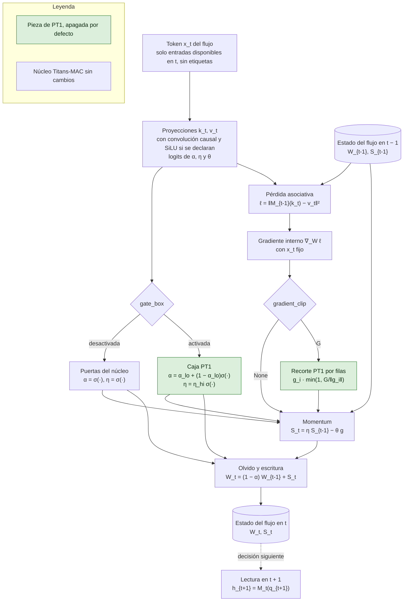

# Memoria de Titans acotada y contractiva (PT1)

Estado a 10 de octubre de 2026: **implementado y comprobado sin entrenar**. El resultado experimental está pendiente, porque el bloqueo de aprendizaje impide el piloto y la comparación. Tarea [#453](https://github.com/GonxKZ/mars-titan/issues/453). La motivación y la regla de decisión están en las [propuestas posteriores a Titans](../research/post-titans-proposals.md#pt1-memoria-de-titans-acotada-y-contractiva) y la matemática propia en el [certificado de contracción](../research/titans-memory-certificate.md).

## Qué hace

PT1 añade a la memoria neuronal de Titans dos piezas que se activan por separado con `MemoryStability`:

1. **Caja de puertas.** El olvido α no puede bajar de un suelo α_lo y el momentum η no puede superar un techo η_hi. El paso θ conserva su techo θ_max. Para la memoria lineal, el certificado demuestra que dentro de la caja (1/500, 3/10, 1/10) existe una función de Lyapunov común, así que el estado rápido se contrae para cualquier secuencia de claves y puertas.
2. **Escritura recortada.** Cada fila del gradiente asociativo se reescala para que su norma no supere G antes de entrar en el momentum. Con cualquier profundidad, esto acota el momentum y los pesos rápidos por una cantidad que solo depende de θ_max, G, η_hi y α_lo.

Las dos piezas viven en `NeuralMemory` (`src/mars_titan/models/titans/neural_memory.py`) y se declaran en `MemoryConfig.stability` (`config.py`). El predictor financiero las expone como `FinancialConfig.memory_stability` (`financial.py`), con la misma regla que `gate_bias`: solo aparecen en la identidad si se declaran y figuran en las cuatro variantes para que el emparejamiento desde `mac_online` compare configuraciones completas.

## Flujo de datos y de estado

**Entradas permitidas.** Las mismas que la memoria de Titans: el token fusionado de la decisión, construido con entradas disponibles en su corte. PT1 no lee etiquetas, errores financieros ni información de otros flujos.

**Orden temporal.** En cada observación de `mac_online`, la lectura usa M_{t−1}, después se calculan las puertas, el gradiente interno, su recorte, el momentum y el olvido. El estado W_t solo se lee en la decisión siguiente del mismo flujo.

**Estado que cambia.** Los pesos rápidos W y el momentum S de cada flujo, una vez por observación y solo en `mac_online`. `mac_frozen` y `mac_disabled` no escriben memoria, así que PT1 solo cambia en ellos la identidad, no el cálculo. PT1 no añade estado nuevo ni parámetros: la caja reparametriza las mismas proyecciones y el recorte no tiene memoria.

**Composición con las proyecciones de la sección 4.4.** PT1 se combina con SiLU, la convolución causal de núcleo 4 y la norma L2 de consultas y claves sin tocarlas. Las proyecciones calculan k_t y v_t con sus ventanas por flujo y PT1 solo cambia después las puertas y el gradiente. Como la norma L2 se aplica tras la convolución y SiLU, las claves siguen siendo unitarias y el certificado de la memoria lineal conserva su hipótesis. La cota (P5) no depende de las claves. La identidad compuesta lleva las claves de los dos componentes sin colisión y el estado añade solo las ventanas causales de las proyecciones.

**Qué apaga el interruptor.** `memory_stability=None` (por defecto) recorre exactamente el código anterior y deja la identidad sin cambios. `gate_box=False` conserva las puertas del núcleo y `gradient_clip=None` omite el recorte. Una declaración sin ninguna de las dos se rechaza.

## Ecuaciones, fuentes, módulos y pruebas

La notación es la del [núcleo de Titans](titans-memory-core.md): para un flujo y una observación x, A, e y t son las proyecciones de las puertas, W la matriz de cada capa de la memoria, S su momentum y ℓ la pérdida asociativa.

**Núcleo (fuente publicada).** Ecuaciones 1 a 3 de Titans (Behrouz et al., 2025), con el olvido por filas de salida que ya fijaba el núcleo:

$$
\alpha=\sigma(Ax),\qquad \eta=\sigma(ex),\qquad \theta=\theta_{max}\,\sigma(tx),
$$
$$
S_t=\eta_t S_{t-1}-\theta_t\,\nabla_W\ell(W_{t-1};x_t),\qquad W_t=(1-\alpha_t)W_{t-1}+S_t .
$$

**(P1) Caja de puertas.** Derivación propia a partir del Teorema 4 del certificado, que necesita puertas en una caja fija:

$$
\alpha=\alpha_{lo}+(1-\alpha_{lo})\,\sigma(Ax+b_\alpha),\qquad \eta=\eta_{hi}\,\sigma(ex+b_\eta),\qquad \theta=\theta_{max}\,\sigma(tx+b_\theta).
$$

Módulo `NeuralMemory._gates`. Pruebas `test_gates_stay_inside_the_box_for_any_input` y la comprobación CUDA.

**(P2) Bias de las puertas dentro de la caja.** Extensión propia de la [inicialización con bias](titans-gate-initialization.md). Con semivida h, α_0 = 1 − 2^{−1/h} y

$$
b_\alpha=\operatorname{logit}\frac{\alpha_0-\alpha_{lo}}{1-\alpha_{lo}},\qquad b_\eta=\operatorname{logit}\frac{\eta_0}{\eta_{hi}},\qquad b_\theta=\operatorname{logit}\frac{\theta_0}{\theta_{max}} .
$$

Exige α_0 > α_lo y η_0 < η_hi. Módulo `GateBias.logits`. Prueba `test_box_bias_reproduces_the_declared_initial_rates_and_rejects_impossible_ones`.

**(P3) Recorte por filas.** El recorte por norma es una técnica estándar. Aplicarlo a cada fila del gradiente asociativo antes del momentum es propio:

$$
\operatorname{clip}_G(g)_i=g_i\,\min\!\Big(1,\frac{G}{\lVert g_i\rVert_2}\Big),\qquad S_t=\eta_t S_{t-1}-\theta_t\,\operatorname{clip}_G\!\big(\nabla_W\ell(W_{t-1};x_t)\big).
$$

Módulos `clip_rows` y `NeuralMemory.update`. Pruebas `test_row_clip_scales_long_rows_to_the_limit_and_leaves_the_rest_exactly` y `test_gradients_match_finite_differences_in_fp64`.

**(P4) Equivalencia con Huber en la memoria lineal.** La pérdida de Huber como sesgo atencional procede de Yaad, en MIRAS (Behrouz et al., 2026). La equivalencia exacta es derivación propia. Con una capa, clave unitaria y residuo r = Wk − v, el gradiente es 2 r kᵀ y

$$
\operatorname{clip}_G(2\,r\,k^\top)_i=\nabla_{w_i}\,2\,H_{G/2}(r_i),\qquad H_\delta(r)=\begin{cases}r^2/2,&|r|\le\delta\\ \delta\,(|r|-\delta/2),&|r|>\delta.\end{cases}
$$

Prueba `test_depth_one_clip_is_the_gradient_of_a_huber_loss_with_half_the_limit`.

**(P5) Cota del estado con cualquier profundidad.** La idea de acotar mediante olvido procede de la modificación σ del control adaptativo (Ioannou y Kokotovic, 1984). La cota para esta recurrencia es la Proposición 5 del certificado, derivación propia. Para cada fila i de cada matriz:

$$
\lVert s_i\rVert\le\max\Big(\lVert s_i(0)\rVert,\ \bar s\Big),\qquad \bar s=\frac{\theta_{max}\,G}{1-\eta_{hi}},\qquad \lVert w_i\rVert\le\max\Big(\lVert w_i(0)\rVert,\ \frac{\bar s}{\alpha_{lo}}\Big).
$$

Prueba `test_state_stays_inside_the_bound_of_proposition_5` en FP64 con una y dos capas, que también comprueba que sin PT1 las mismas entradas superan la cota, y la comprobación CUDA en FP32.

**(P6) Contracción en la memoria lineal.** Teoremas 4 y 6 del certificado, derivación propia. Para una capa sin LayerNorm, con puertas dentro de la caja (1/500, 3/10, 1/10), el estado conjunto (W, S) se contrae con ρ = 0,9997 en la norma P_0 ⊗ I, también con la escritura recortada. `MemoryStability.certified_box` indica si una caja declarada está contenida en una certificada. Pruebas `test_certified_box_lookup_follows_the_certificate` y el [verificador del certificado](../../reports/research/check_titans_memory_certificate.py). **No hay certificado para la memoria de dos capas con LayerNorm de la campaña.** En ella PT1 solo garantiza la cota (P5) y la estabilidad efectiva debe medirse con el diagnóstico D5.

## Por qué podría ayudar y por qué podría no hacerlo

En el mercado, una sesión con un salto de precios o un resultado trimestral produce sorpresas asociativas muy grandes. Sin cota, una sola escritura puede mover los pesos rápidos de un activo durante muchas sesiones y la truncación 8 del entrenamiento nunca ve las consecuencias a largo plazo. Además, el certificado muestra que con las puertas actuales existen secuencias admisibles que amplifican el estado aunque cada paso sea estable. PT1 convierte esas dos fragilidades en garantías: escrituras acotadas en todos los casos y contracción en la memoria lineal.

Puede no ayudar por tres motivos. Las puertas aprendidas quizá nunca visiten la región peligrosa con datos reales, y entonces PT1 solo restringe. η_hi = 0,3 reduce la persistencia del momentum y α_lo = 1/500 limita la semivida a unas 346 sesiones, de modo que si la utilidad de la memoria dependía de amplificaciones transitorias o de horizontes más largos, PT1 la perdería. Y la garantía de contracción no cubre la memoria de dos capas que usa la campaña.

## Control con el que se descarta

La [declaración del brazo](../../configs/evaluation/titans-memory-stability-comparison.json) fija, antes de ejecutar nada, tres brazos sobre la receta de 2000 con `mac_online`: el control de la receta, PT1 y una alternativa trivial con las mismas tasas iniciales que PT1 pero sin caja ni recorte. La regla conserva PT1 si el límite superior del intervalo del 95 % de la diferencia relativa de MAE por sesión no supera +0,2 % y el percentil 95 del MAE en los eventos declarados no empeora más de un 1 %. Si la alternativa trivial iguala a PT1, la caja y el recorte no aportan nada sobre el cambio de inicialización. Nada se ha ejecutado.

## Comprobaciones

| Propiedad | Prueba |
| --- | --- |
| Apagado idéntico bit a bit al núcleo previo en FP32 (salida, estado y gradientes de memoria y predictor) | `test_disabled_component_keeps_fp32_outputs_gradients_and_state_bit_for_bit` con huellas de CPU capturadas en `42e7dbca`, y la comprobación CUDA con las de `cuda:0` |
| Identidad nueva solo si se declara, mismos parámetros iniciales | `test_declared_component_is_a_new_identity_with_the_same_parameter_draws` |
| Composición con las proyecciones de la sección 4.4: sin PT1 coincide bit a bit con el núcleo de #474, la identidad compuesta une las claves de ambos y el estado y los pesos se recuperan | `test_component_composes_with_the_section_4_4_projections` |
| Forma, tipo y rango de las puertas | `test_gates_stay_inside_the_box_for_any_input` |
| Declaraciones imposibles rechazadas | `test_invalid_declarations_fail_before_building_a_module` |
| Causalidad: perturbar el futuro no cambia el pasado | `test_future_perturbation_does_not_change_past_outputs_or_states` |
| Aislamiento entre activos y entre sesiones | `test_flows_do_not_share_state_and_sessions_are_independent` |
| Gradientes frente a diferencias finitas en FP64 | `test_gradients_match_finite_differences_in_fp64` con `gradcheck`, filas recortadas y sin recortar lejos del punto no derivable |
| Recuperación desde checkpoint | `test_recovery_from_an_exported_state_continues_bit_for_bit` y rechazo de estados y pesos de otra configuración |
| Receta, emparejamiento y backward con la cabeza de cuantiles | `test_recipe_declaration_pairing_and_quantile_backward_with_the_component` |
| Brazo declarado sin ejecutar | `test_comparison_arm_is_declared_with_its_control_and_rule_but_not_executed` |

Las pruebas están en `tests/models/titans/test_memory_stability.py` y las trazas compartidas con la comprobación CUDA en `memory_stability_traces.py`. La comprobación CUDA `tests/models/titans/cuda_memory_stability_check.py` se ejecuta a mano dentro de una plaza `memslot gpu`.

La mutación dirigida aplicó 21 defectos de uno en uno en una copia aislada, tras comprobar que las pruebas importaban la copia. Dieciocho afectan a PT1 por sí sola: quitar el suelo de α o el techo de η, aplicar la caja con solo el recorte declarado, no recortar, recortar por encima de 2G, olvidar G al reescalar, recortar columnas, construir o validar los bias sin invertir la caja, invertir solo la sigmoide de α o de η, admitir una η inicial fuera de la caja, omitir PT1 de la identidad de la memoria o del predictor, no pasar PT1 del predictor a la memoria, invertir la comparación del certificado y admitir una declaración vacía. Otros tres imitan errores posibles al combinar PT1 con las proyecciones de la sección 4.4: recortar solo cuando no hay ventanas causales, conservar en `update` las puertas del núcleo y guardar PT1 bajo la clave de las proyecciones en la identidad. Las pruebas detectan los 21 ([recibo](../../reports/engineering/titans-memory-stability-mutations-20261010.json)). Durante el desarrollo, la prueba de los bias detectó un defecto real del mismo tipo que el mutante M08: la memoria construía los bias sin pasar la caja. Es una selección dirigida, no una campaña completa de mutación.

## Coste medido sin entrenar

Medido el 10 de octubre de 2026 en dos fases, como exige el uso compartido de la GPU ([recibo](../../reports/engineering/titans-memory-stability-cost-20261010.json)). En la primera, `benchmarks/titans_memory_stability_cost.py prepare` leyó en CPU, dentro de `memslot heavy`, las entradas reales de los ocho primeros eventos del tramo de ajuste de la vista US de `fold-012` para 128 flujos presentes en todos ellos, sin guardar etiquetas. En la segunda, `measure` reservó `memslot gpu` y ejecutó para cada brazo declarado un forward con grafo por los ocho eventos y un backward con objetivo nulo, solo para dar forma a la pérdida. No hubo optimizador ni pasos, y la prueba comprueba que los parámetros no cambian. Fue una pasada de calentamiento y cinco repeticiones en una RTX 4070 Laptop de 8 GB, con PyTorch 2.14.0+cu130, FP32 sin TF32 y dos hilos de CPU, con otras sesiones usando la máquina.

| Brazo | Forward p50 (s) | Backward p50 (s) | Memoria máxima reservada | Filas recortadas al inicio |
| --- | ---: | ---: | ---: | ---: |
| Control `titans_mac_online` | 0,104 | 0,064 | 454,1 MB | sin recorte |
| PT1 | 0,103 | 0,062 | 485,0 MB | 1,05 % |
| Alternativa trivial (mismas tasas iniciales) | 0,107 | 0,067 | 454,1 MB | sin recorte |

La diferencia de tiempo entre brazos queda dentro de la dispersión de las repeticiones del control, que van de 0,086 a 0,106 s en el forward, así que no se puede atribuir a PT1 ni un coste ni un ahorro. La memoria sube 30,9 MB, un 6,8 %, por los tensores del recorte que el grafo conserva para el backward. Con G = 4 y los pesos iniciales, PT1 recorta el 1,05 % de las filas del gradiente asociativo, una cifra que cambiará durante el ajuste y que no se ha medido con pesos entrenados.

La comprobación CUDA ([recibo](../../reports/engineering/titans-memory-stability-cuda-20261010.json)) dio la paridad bit a bit sin PT1 con las huellas de `cuda:0` capturadas antes del cambio, tanto con las proyecciones lineales como con las de la sección 4.4 frente al núcleo de #474. Con PT1 activa, dos ejecuciones CUDA dieron los mismos bits y las diferencias máximas entre CPU y CUDA fueron de 2,3e-6 en la lectura de la memoria, 1,3e-4 en sus gradientes y 1,2e-7 en los cuantiles del predictor. Con PT1 y las proyecciones de la sección 4.4 a la vez fueron de 1,2e-6, 1,4e-4 y 2,4e-7. Todas quedan dentro de la tolerancia FP32 declarada. La caja y la cota de la Proposición 5 se cumplen también en la GPU.

## Desviaciones y límites

- La propuesta no fijaba G. Se declara G = 4 antes de ver datos. Con LayerNorm la salida de la memoria tiene escala unitaria por coordenada y, en la memoria lineal con clave unitaria, G = 4 equivale a Huber con δ = 2. La memoria de dos capas no tiene esa equivalencia exacta.
- La caja exige η inicial menor que 0,3, así que el brazo PT1 usa η_0 = 0,15 en lugar del 0,5 de la receta. Por eso la alternativa trivial comparte esa inicialización.
- La propuesta describía la alternativa trivial como reducir `theta_max`. `FinancialConfig` no lo expone y reducir solo θ_0 cambiaría dos cosas a la vez, así que la alternativa declarada aísla la caja y el recorte del cambio de inicialización.
- El recorte actúa sobre cada fila de cada matriz de la memoria. Con dos capas no equivale a Huber sobre la salida.

## Pendiente sin medir

- El efecto predictivo, la regla de decisión y el piloto, bloqueados por el aprendizaje.
- La fracción de pasos que las puertas aprendidas pasarían fuera de la caja sin PT1 (D2) y el exponente de Lyapunov de la memoria de dos capas (D5).
- La fracción de filas recortadas durante el ajuste. Solo se registra la del primer recorrido con los pesos iniciales.
- El coste en la escala completa de la campaña, con `accumulation_rows` y miles de flujos por evento. La medida usa 128 flujos y ocho eventos.
- El coste de PT1 junto a las proyecciones de la sección 4.4. La medida de coste usa la receta con proyecciones lineales y la composición solo se ha comprobado en exactitud.

## Referencias

- Behrouz, A., Razaviyayn, M., Zhong, P. y Mirrokni, V. (2026). It's all connected: A journey through test-time memorization, attentional bias, retention, and online optimization. *The Fourteenth International Conference on Learning Representations*, 131306–131333.
- Behrouz, A., Zhong, P. y Mirrokni, V. (2025). Titans: Learning to memorize at test time. *Advances in Neural Information Processing Systems, 38*, 113506–113543. https://doi.org/10.52202/085713-3786
- Ioannou, P. A. y Kokotovic, P. V. (1984). Instability analysis and improvement of robustness of adaptive control. *Automatica, 20*(5), 583–594. https://doi.org/10.1016/0005-1098(84)90009-8
