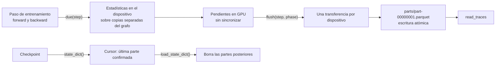

# Trazas de aprendizaje

La comparación de la campaña mide el resultado final de cada modelo. Estas trazas sirven para entender qué ha aprendido y por qué una pieza ayuda o no: si las puertas de la memoria de Titans se saturan, si el olvido borra todo en pocas sesiones, si los gradientes de un grupo de parámetros se apagan o si un adaptador apenas se mueve del padre. Se siguen en [#448](https://github.com/GonxKZ/mars-titan/issues/448).

Este documento describe el núcleo ya implementado en `src/mars_titan/learning_traces/`. Los ganchos en cada entrenador, el posentrenamiento y la RL se añadirán cuando se integren las ramas abiertas que tocan esos archivos.

## Contrato

**Cadencia.** `TraceConfig(every, max_bytes)` fija cada cuántos pasos se registra. `due(step)` solo compara enteros, así que decidir si toca registrar no sincroniza la GPU.

**Estadísticas.** Para cada tensor se calculan, en float64 y sobre los valores finitos, media, desviación típica, mínimo, máximo, máximo absoluto, norma L2 y fracción de valores finitos. Se trabaja sobre `detach()`, sin generadores aleatorios ni cambios en el tensor observado. Sin valores finitos, todas las estadísticas valen NaN salvo la fracción, de modo que una divergencia queda registrada como tal.

**Volcado.** Las estadísticas pendientes se copian al host con una sola transferencia por dispositivo. Cada volcado escribe una parte Parquet numerada con el esquema `step`, `phase`, `metric`, `group`, `stat`, `value`. El formato largo permite añadir métricas sin cambiar el esquema.

**Presupuesto.** Si una parte haría superar `max_bytes`, no se escribe. El registrador queda agotado y el manifiesto guarda el paso en el que ocurrió. No hay recortes silenciosos.

**Recuperación.** El checkpoint guarda el número de la última parte confirmada y los bytes escritos. Al reanudar se borran las partes posteriores y se comprueba que las confirmadas siguen ahí con el mismo tamaño. Así no hay eventos duplicados ni perdidos tras un corte.

## Parámetros por grupos

`group_parameters` reparte los parámetros entrenables por prefijos de nombre, por ejemplo `memory.` para los pesos de la memoria neuronal. Cada parámetro cae en un único grupo, y los que no coinciden con ningún prefijo van a `other`. `record_gradients` registra la norma L2 del gradiente y de los pesos de cada grupo.

La razón de actualización de un grupo es

$$
r_t = \frac{\lVert W_t - W_{t-1} \rVert_2}{\lVert W_{t-1} \rVert_2},
$$

y `UpdateProbe` solo copia los pesos anteriores en los pasos que tocan registro. Con modelos de pocos millones de parámetros, esa copia ocupa unas decenas de megabytes.

## Garantía de no interferencia

La prueba `test_traces_do_not_change_gradients_or_the_random_state` hace una pasada hacia delante y hacia atrás de un modelo con dropout, con y sin trazas. Exige gradientes idénticos bit a bit y el mismo estado del generador aleatorio. Las pruebas no ejecutan ningún optimizador. Los pesos solo cambian a mano en la prueba de la razón de actualización.

## Pendiente

- Ganchos en los entrenadores de referencias, Titans-MAC, MARS-TITAN, CM-v1, posentrenamiento y RL, con la paridad bit a bit de cada familia en CPU y en `cuda:0`.
- Trazas internas de Titans (puertas de olvido, tasa interna y momentum por capa, pérdida asociativa, normas de los pesos rápidos y masa de atención) y del banco episódico.
- Sobrecoste medido con las formas reales de la campaña.
- Análisis: curvas alineadas entre brazos, deriva de representaciones con CKA y sondas lineales del estado de memoria. El observatorio en directo mostrará estas trazas.
