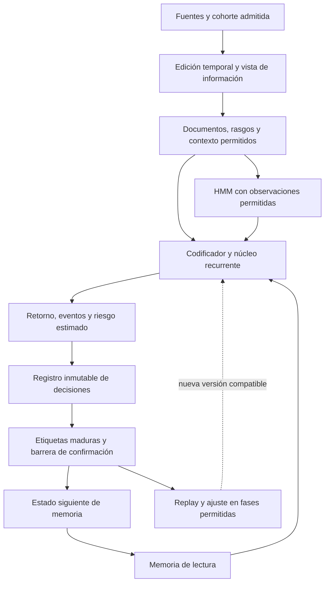

# Integración de memoria, atención y aprendizaje en MARS-TITAN

La auditoría original del 4 de octubre de 2026 inspeccionó `96cab3616f78e6713b451b01437c816ba7bd010b`. La corrección arquitectónica del 8 de octubre conserva ese inventario y adopta la [separación entre GRU, Transformer, Titans-MAC y ampliaciones](titans-mac-architecture.md). La revisión del 9 de octubre distingue el inventario histórico que sigue del [estado tras las integraciones de ese día](#estado-tras-las-integraciones-del-9-de-octubre). La [GRU histórica](../../native/candidate_historical.md) tiene comprobaciones CPU/CUDA del módulo y el [consumidor financiero](../engineering/financial-session-v2.md) integra Titans-MAC, banco y recuperación. Titans-MAC, la GRU episódica, MARS-TITAN y el factorial de CM-v1 tienen ya entrenadores cronológicos con entrada por ventana walk-forward, comprobados sin pasos de optimizador. No se han entrenado estas variantes y la trayectoria sobre la edición histórica completa sigue pendiente.

La [correspondencia de modificaciones](titans-mac-architecture.md#correspondencia-de-las-modificaciones-de-integración) del 9 de octubre relaciona cada propuesta de esta revisión con su punto de inserción sobre Titans-MAC, su nivel de implementación, su control y su evidencia. La [variante con ampliaciones](titans-mac-architecture.md#variante-mars-titan-con-ampliaciones) las declara como componentes desactivables, todos apagados y sin ejecutar.

## Decisión arquitectónica

El punto principal de integración debe ser el **ciclo de decisión, registro y maduración**, con una vista de información común antes de sus consumidores. Dentro de ese ciclo, el modelo calcula representaciones y predicciones, la memoria ofrece lecturas de una instantánea y un planificador separado decide qué experiencias utilizar durante entrenamiento. La coordinación pertenece a cada ejecución, no a un servicio adicional ni a un bloque neuronal que asuma todas las responsabilidades.

La capacidad no cabe en un único punto de attention, encoder o FFN. La selección de documentos necesita actuar antes de que se pierda su identidad por agregación. El régimen necesita un orden temporal coherente. El replay pertenece al recorrido de aprendizaje. La utilidad de una predicción solo puede medirse después de recibir su resultado. Los adaptadores necesitan declarar qué parámetros modifican y qué estados invalidan.

Esta es la integración recomendada por los contratos encontrados. No se afirma haber medido un óptimo global de MAE, latencia o memoria. Esa selección requiere ejecutar los contrastes descritos después. La arquitectura original permanece como referencia y las ampliaciones se identifican por separado.

## Inventario del 4 de octubre de 2026

| Parte | Estado comprobado en código | Consecuencia |
| --- | --- | --- |
| Preparación y admisión | Fuentes, huellas, fechas, cohortes y exclusiones en `data/`. | Reutilizar su procedencia. La presencia de un archivo no acredita una modalidad admisible. |
| Representaciones | MiniLM multilingüe y ResNet18 congelados, con caché por contenido y versión. | Compartir artefactos inmutables compatibles. No confundir caché de embeddings con memoria aprendida. |
| Referencias predictivas | `MultimodalReference`, RNN, LSTM, GRU y DLinear, además de Ridge y boosting. | Son controles implementados. La GRU se reinicia en cada ventana de entrada. |
| Adaptación predictiva | Corrección residual, continuación neuronal, MAE, pérdida esperada, REINFORCE y KLPO. | Sus objetivos y padres están definidos. No equivalen a una memoria persistente del candidato. |
| Particiones | Vistas con entrenamiento, validación, calibración y evaluación. Test final reservado. | Conservar los cortes y su identidad en cualquier recorrido nuevo. |
| Entorno predictivo ordenado | `CausalPredictionEnv` y `ParquetCohortSource`, con etiquetas diferidas. | Aportan contratos útiles, pero la ruta ordenada actual admite solo entrenamiento y validación. |
| Núcleo nativo | Ejecutables C++20 para simulación y políticas, HMM, memoria episódica, replay y checkpoints. | Hay componentes reutilizables, con semántica financiera concreta. |
| Candidato | Especificación de memoria global, pesos rápidos y K = 1, 2 o 4. | No existe todavía su entrenador ni una evaluación propia. |

La inspección cubre responsabilidades y conexiones relevantes. No certifica ausencia de defectos en todo el repositorio. No se han abierto pesos ni datos experimentales para obtener estas conclusiones.

## Estado tras las integraciones del 9 de octubre

El inventario anterior describe el código del 4 de octubre. Las PR integradas en `develop` el 9 de octubre, hasta `debaeeed`, cubren ya las seis responsabilidades del recorrido temporal para la [campaña desde 2000](training-campaign-2000.md). Todas se han comprobado con pruebas que llegan hasta el paso del optimizador sin aplicarlo, casi siempre en CPU, y las [comprobaciones CUDA del 9 de octubre](../../reports/engineering/cuda-checks-20261009/README.md) repitieron en `cuda:0` las de los entrenadores y sesiones. La edición histórica y sus objetivos residuales ya están [verificados](../../reports/data/historical-edition-v3-targets-20261009.json), pero ningún recorrido se ha ejecutado con aprendizaje.

| Responsabilidad | Implementación integrada | Pendiente |
| --- | --- | --- |
| Resolver la vista | Política `historical_masked_2000_v1` con cinco bits de presencia en todas las familias ([#372](https://github.com/GonxKZ/mars-titan/pull/372), [#373](https://github.com/GonxKZ/mars-titan/pull/373), [#386](https://github.com/GonxKZ/mars-titan/pull/386)) y vistas del [protocolo walk-forward v2](walk-forward-2000.md) ([#375](https://github.com/GonxKZ/mars-titan/pull/375)) | Terminar las vistas reales, en preparación sobre la edición verificada, con los lectores que saltan grupos Parquet vacíos ([#416](https://github.com/GonxKZ/mars-titan/pull/416)). La vista reducida todavía no llega a la ruta de Titans-MAC |
| Cohortes cronológicas | Lector de observaciones por bloques de activos e instante ([#377](https://github.com/GonxKZ/mars-titan/pull/377)), índices por tramo de la GRU episódica ([#395](https://github.com/GonxKZ/mars-titan/pull/395)) y entorno predictivo con ventanas walk-forward ([#390](https://github.com/GonxKZ/mars-titan/pull/390)) | Medir el caudal real con los primeros trabajos de la campaña A. La memoria por tramo ya se ha medido en `cuda:0` |
| Predicción sin efectos ocultos | Inferencia cronológica congelada y política de memoria común: cada tramo parte del estado inicial y calienta con 12 meses de entradas sin etiquetas ([#396](https://github.com/GonxKZ/mars-titan/pull/396)) | La ventana y el traslado de la GRU episódica coinciden en CPU y `cuda:0`. Los de Titans-MAC no tienen comprobación CUDA propia |
| Conservar decisiones | Predicciones por fila de validación, calibración y evaluación con cinco cuantiles, recibos por trabajo y recibos de ventana con la cota de la última etiqueta usada ([#381](https://github.com/GonxKZ/mars-titan/pull/381), [#390](https://github.com/GonxKZ/mars-titan/pull/390), [#391](https://github.com/GonxKZ/mars-titan/pull/391)) | Recibos reales, que solo existirán al ejecutar la campaña |
| Resultados maduros | Etiquetas aplicadas al madurar, error de la predicción emitida en M1 y M2 y corrección asociativa B6 escrita solo con resultados maduros ([#376](https://github.com/GonxKZ/mars-titan/pull/376), [#389](https://github.com/GonxKZ/mars-titan/pull/389), [#399](https://github.com/GonxKZ/mars-titan/pull/399)) | Emitir B6 en el recorrido por ventanas. [M3](../engineering/m3-write-policy.md) ya está definida y conectada ([#410](https://github.com/GonxKZ/mars-titan/pull/410), [#412](https://github.com/GonxKZ/mars-titan/pull/412)) |
| Confirmar el estado completo | Checkpoints con modelo, optimizador, RNG, cursor, pesos rápidos, cola, banco y selección, con el mejor estado aparte de dos de recuperación ([#377](https://github.com/GonxKZ/mars-titan/pull/377), [#389](https://github.com/GonxKZ/mars-titan/pull/389), [#399](https://github.com/GonxKZ/mars-titan/pull/399)) | Recuperación tras pasos reales, bloqueada por la protección del aprendizaje |

La [correspondencia de modificaciones](titans-mac-architecture.md#correspondencia-de-las-modificaciones-de-integración) detalla cada propuesta de esta revisión con su punto de inserción. La columna de estado de la [tabla de variantes](#variantes-y-orden-de-contraste) resume la misma situación.

## Recorrido actual y fronteras que cambian la decisión

La preparación conserva precios y noticias por activo, hechos contables, referencias de gráficos y contexto macro. `materialize_cohort_asset` transforma las entradas y `CorpusDataset` las alinea con supervisión y particiones. El predictor neuronal recibe exclusivamente `inputs`. Los lectores internos también contienen objetivos para entrenamiento y métricas, que no deben llegar a una futura puerta de lectura.

Con contexto de 64 sesiones, ratios contables activados y 140 indicadores macro, las formas predeterminadas son precios 64 × 5, noticias 384, gráficos 512, fundamentales 45 y macro 420. Son 1.681 valores aplanados por muestra. Los dos últimos bloques incluyen nivel, presencia y antigüedad. El manifiesto concreto gobierna las dimensiones, no esta cuenta de valores predeterminados.

Se han encontrado seis fronteras materiales:

1. **Agregación textual.** `_text_window` promedia los documentos admitidos de cinco sesiones. Una atención posterior ya no puede seleccionar sus identidades individuales. La caché conserva vectores por documento completo, pero no por fragmento de tokens.
2. **Sustitución macro.** `CorpusDataset._blocks` sustituye el vector macro mediante `TemporalInputs.lookup`. Una máscara aplicada solo al Parquet anterior podría quedar anulada por esa sustitución.
3. **Predicción del padre.** `PairedInputs` y `PredictiveDataset` la añaden como característica. `LinearResidualPolicy.forward` vuelve a sumarla a la corrección. Un padre completo reintroduciría información retirada a un alumno supuestamente reducido.
4. **Orden de lotes.** `CorpusDataset` mezcla activos y grupos, también al evaluar. Es compatible con las referencias sin estado persistente, pero no con avanzar un HMM o una memoria entre llamadas.
5. **Predicciones reconstruidas.** Las exportaciones del padre se generan después de seleccionar su checkpoint. No son automáticamente pronósticos que se emitieron en cada fecha histórica antes de conocer su resultado.
6. **Estado de evaluación.** La evaluación existente reutiliza objetos que hoy no conservan memoria entre lotes. Añadir estado dentro de `forward` introduciría arrastre entre recorridos si no se controla explícitamente.

Son límites para una ampliación, no pruebas de fuga en los modelos actuales. Su corrección exige contratos en datos, ejecución y evaluación, además de cambios en la red.

## Arquitectura propuesta

El retorno del estado siguiente representa una decisión posterior. No permite escribir entre dos activos de la misma cohorte ni incorporar etiquetas futuras. Las flechas de ajuste de parámetros solo están activas en entrenamiento o en una variante online expresamente registrada.

La composición necesita seis responsabilidades pequeñas: resolver la vista, proporcionar cohortes cronológicas, calcular predicciones sin efectos ocultos, conservar decisiones, entregar resultados maduros y confirmar el estado completo. La memoria, el filtro, las cabezas y el muestreador conservan sus algoritmos propios. Un único objeto no debe conocer formatos de noticias, pérdidas PPO, reglas de cartera y política de selección científica.

El HMM consume las observaciones permitidas del corte, no etiquetas futuras. Su estado para la cohorte se prepara una sola vez y queda fijado para todos sus activos. La memoria supervisada conserva la barrera posterior al pronóstico. Ambos estados se confirman coherentemente para que una recuperación no vuelva a avanzar el filtro sobre la misma observación.

## Vista de información y conservación de documentos

Una vista identifica fuentes permitidas, variables, retardos, máscaras, edades, transformaciones, representación, normalizadores y dependencias. Se resuelve antes de ejecutar el modelo y se aplica después de obtener la edición temporal efectiva. En el lector actual, el primer control sobre tensores puede actuar antes de los `yield` de `CorpusDataset.batches`, después de los reemplazos macro. Una ruta nueva podría evitar materializar columnas innecesarias desde el principio, siempre que conserve la misma admisión.

La retirada de una fuente incluye sus derivadas y rutas indirectas. Quitar precios y conservar un gráfico generado con ellos no demuestra ausencia de información de precios. Quitar el valor de un indicador y conservar su edad aún comunica información de publicación. El padre, el HMM, la memoria, el router y el calibrador reciben la misma vista declarada. No se relajan globalmente los contratos actuales de cuatro modalidades.

Para seleccionar artículos se propone un índice lateral con identidad de registro, activo, contenido, disponibilidad, procedencia y clave de embedding. `NewsWindows.between` y los Parquet de noticias permiten reconstruir las ventanas. Los vectores compatibles presentes en `EmbeddingCache` pueden reutilizarse sin volver a codificar el documento. La atención por fragmentos de tokens necesitaría otra materialización, porque sus vectores se descartan al promediar.

Hay que distinguir documento, mención, acontecimiento y experiencia predictiva. El `event_id` actual incluye símbolo, contenido, URL y fecha. No identifica universalmente un mismo acontecimiento entre activos. Un documento puede compartir embedding entre varias asociaciones válidas. Sus efectos sobre distintos activos siguen teniendo etiquetas diferentes. La deduplicación de evidencia no debe eliminar esas diferencias.

Conservar documentos individuales tampoco garantiza mejora. La media puede ser suficiente para una tarea y más barata. El contraste mantendrá la misma ventana disponible y contará documentos únicos examinados, seleccionados y codificados.

## Tres escalas de estado y un recorrido temporal

Los parámetros compartidos, los pesos rápidos y su momentum, los parámetros persistentes de Titans, el banco episódico y el estado de trabajo tienen ciclos distintos. La memoria persistente del artículo es aprendida e independiente de la entrada y permanece fija al evaluar. La memoria neuronal se adapta con su objetivo asociativo explícito. El banco conserva episodios elegibles y el HMM información filtrada permitida. El estado de trabajo se descarta al terminar una predicción, aunque haya realizado varios refinamientos. La sorpresa asociativa y el error financiero maduro no se sustituyen entre sí.

Cada ejecución tendrá identidad de modelo, fold, vista, representación, pesos, política y protocolo. Puede compartir archivos y rasgos inmutables con otra ejecución compatible. No compartirá memoria selectiva, optimizer, RNG o utilidad acumulada entre modelos independientes. Compartir un codificador entrenable entre cabezas de un solo modelo multitarea es otra decisión, no un ahorro neutral entre comparadores.

Se conserva la convención del protocolo original: en t se construye una instantánea, se predicen todos los activos con el estado previo, se conservan las salidas y después se aplican los resultados anteriores ya maduros. Su efecto comienza en la siguiente decisión. El orden de aplicación es canónico e independiente del orden de carga. La entrega del entorno predictivo actual al avanzar el reloj no reproduce por sí sola esa convención. Necesita un adaptador que controle cuándo el consumidor aplica los resultados.

El lector ordenado se extendería en una edición independiente a entrenamiento, validación, calibración y evaluación, heredando límites verificados. No se utilizaría el orden mezclado como una secuencia temporal artificial. Los microlotes dividirían trabajo dentro de una cohorte, sin crear nuevas sesiones.

Cada ventana de evaluación reinicia memoria y estado interno conforme al protocolo. El calentamiento utiliza únicamente un prefijo permitido. La inicialización de calibración y evaluación, y cualquier continuidad entre ellas, quedan identificadas y comprobadas. No se hereda estado por reutilizar accidentalmente un objeto. Si se estudia continuidad prequential, será una variante separada con su propio registro y las mismas condiciones entre competidores.

## Decisiones, maduración y recuperación

La predicción conservada debe incluir muestra, tarea, horizonte, corte, vista, checkpoint, versión de estado, política de lectura, K y salida emitida. El error de sorpresa utiliza esa salida, no una predicción recalculada con pesos posteriores. Una comparación de dos rutas necesita que ambas hayan calculado su pronóstico antes de conocer el resultado y debe pagar el coste de las dos.

Se distinguen identidad de feedback e identidad de exposición. El feedback corresponde a una decisión, objetivo, horizonte y revisión de etiqueta. Su aplicación se confirma una vez por consumidor. Una exposición de replay es una visita intencional a un dato ya maduro y puede repetirse. Deduplicar ambas por la misma clave impediría aprender o duplicaría efectos tras una recuperación.

La cola contiene objetivos con maduraciones independientes. Un retorno puede estar confirmado y una etiqueta de evento a cinco sesiones seguir desconocida. La maduración más tardía no sustituye la principal ni elimina su fila válida. Una revisión es una nueva versión de evidencia, no otro acontecimiento independiente. La política decide si se fija una versión, se aplica una revisión explícita o se prepara otra edición. No se deshace un paso de Adam restando un gradiente antiguo.

La barrera de recuperación abarca cursor confirmado, predicciones, cola, efectos aplicados, memoria, filtros, parámetros, optimizador y RNG. Los archivos provisionales no se convierten en estado válido hasta publicar el manifiesto coherente. Esto ofrece recuperación local de la ejecución, sin introducir una promesa de entrega exactamente una vez a sistemas externos.

El token `PreparedMemoryWrite` confirma una escritura de un banco y una generación. No es una transacción de cohorte completa. Preparar varias escrituras para el mismo banco desde una generación y confirmarlas después invalidaría las restantes tras la primera. La memoria global necesita construir secuencialmente el estado siguiente y publicarlo bajo una barrera exterior. El doble estado y su serialización cuentan en memoria.

## Recurrencia, autoaprendizaje y exploración de representaciones

El primer bucle propuesto mantiene pesos y memoria de lectura fijos mientras refina un estado z:

$$
z^{(0)}=g(h),\qquad z^{(k+1)}=F_\theta(z^{(k)},h,M_t).
$$

K = 1, 2 y 4 son contrastes distintos. Una ruta puede volver a ponderar los mismos episodios o recuperar otros desde la misma instantánea. En el segundo caso también cambia el acceso a evidencia. Se igualarán episodios únicos y candidatos examinados cuando la pregunta sea solo el valor del cálculo adicional. No se escribirá memoria dentro de ese bucle.

Una puerta posterior podría decidir cuánto cálculo gastar a partir de información observable y de utilidad aprendida con pronósticos temporales de desarrollo. No usará el error futuro actual. El número de parámetros compartidos puede permanecer fijo mientras aumentan operaciones y activaciones. Una variación pequeña de z no certifica que el pronóstico sea correcto.

El segundo bucle actualiza estado persistente con feedback maduro. La regla delta y la variante proximal ya derivadas son comparadores separados. El tercero actualiza parámetros mediante entrenamiento o replay programado. Una adaptación autosupervisada sobre entradas observadas constituye un cuarto modo posible, con objetivo y presupuesto propios. No se mezcla con evaluación congelada por llamarla aprendizaje en inferencia.

Una prueba autosupervisada podría ocultar una parte de una ventana ya observada y pedir reconstruirla desde la vista permitida. La parte ocultada sería un objetivo interno del pasado, no una cotización futura disponible antes de tiempo. Se compararía con pesos congelados y con un ajuste sencillo del mismo presupuesto. Mejorar reconstrucción puede reforzar ruido o relaciones irrelevantes para el retorno. La decisión seguiría dependiendo del MAE temporal. Los pronósticos del propio modelo no se convierten en hechos verificados al volver a introducirlos en el bucle.

Para estudiar qué información utiliza el modelo se propone registrar una muestra acotada de representaciones, consultas, episodios recuperados y salidas por K. Las sondas se ajustan con datos de desarrollo y se evalúan fuera de su ajuste. Que una variable sea decodificable desde una activación no demuestra que determine la decisión. Se requieren intervenciones o ablaciones controladas en copias de la misma instantánea, sin contaminar el recorrido principal. Una neurona aislada no recibe automáticamente una interpretación económica.

La autoevaluación estima riesgo de error o utilidad de otra operación. Se evalúan discriminación, calibración y efecto de su política. No se equipara con experiencia subjetiva ni con pericia humana general. Los antecedentes de metacognición, recurrencia y replay motivan pruebas, no esa atribución.

## Postentrenamiento y adaptadores

El primer control es la salida del padre congelado. Le siguen la continuación supervisada y la corrección residual implementadas. Hay una distinción concreta: la corrección lineal se inicializa a cero y su centro reproduce al padre, pero la mediana de la rejilla de 21 valores no reproduce necesariamente su salida continua. Para permitir conservar realmente al padre, se compara su salida original como alternativa explícita y se fija la misma definición de métrica. La época cero de una política discretizada no se presenta automáticamente como identidad con ese padre.

La adaptación más localizada para la memoria modificaría consulta y salida, conservando codificadores y claves estables. Así se cambia qué se recupera o cómo se utiliza sin invalidar todos los embeddings. Modificar el codificador, la proyección de claves o la definición de la vista exige reconstruir o migrar el estado compatible. Las dimensiones iguales no acreditan compatibilidad semántica.

Una adaptación de bajo rango mantiene la matriz base W congelada y puede escribirse como

$$
W'=W+UV,\qquad U\in\mathbb R^{d_{out}\times r},\quad
V\in\mathbb R^{r\times d_{in}}.
$$

Los parámetros entrenables adicionales son $r(d_{in}+d_{out})$, frente a $d_{in}d_{out}$ de ajustar la matriz completa. W sigue almacenada. La reducción de parámetros entrenables no garantiza menor tiempo: añade productos y gestión. En una cabeza pequeña, el adaptador puede ahorrar poco o incluso añadir más parámetros que un ajuste directo. El rango, la colocación y la pérdida se contrastan. [LoRA, Hu et al., ICLR 2022](https://openreview.net/forum?id=nZeVKeeFYf9) es el antecedente de esta factorización, sin trasladar sus resultados de lenguaje a retornos financieros.

El punto de adaptación se elige también por sus dependencias. Ajustar solo la cabeza invalida sus predicciones cacheadas. Ajustar consulta o lectura invalida resultados dependientes de esa lectura, pero puede conservar los rasgos base y claves congeladas. Ajustar fusión o un codificador invalida las representaciones y estados que dependan de ellos. Un adaptador pequeño puede tener un coste de reconstrucción grande si se coloca antes de una memoria persistente. Esa es otra razón para contrastar primero consulta y salida.

Se priorizan tres comparaciones: corrección residual frente a continuación supervisada, adaptación de consulta/salida frente a claves congeladas y un replay espaciado con el mismo multiconjunto de exposiciones. Un adaptador de bajo rango entra donde su cuenta de parámetros y el perfil justifiquen el contraste. La pérdida esperada exacta sobre las 21 acciones maduras es un control necesario frente a estimadores de gradiente con muestreo.

La destilación mantiene separado el profesor completo del estudiante reducido. El alumno directo con esas mismas entradas es otro control. La información del profesor y su coste cuentan. La media inducida por una pérdida cuadrática de destilación no es necesariamente la mediana que minimiza MAE.

La adaptación online de pesos, el metaaprendizaje de una inicialización o un objetivo autosupervisado requieren otro protocolo. Sus episodios de desarrollo respetan el tiempo, y cualquier consulta usada para aprender una regla de actualización deja de ser una evaluación independiente. No se añaden objetivos de preferencias humanas que el dataset no contiene. PPO y Double DQN financieros conservan su recompensa y su comparativa separadas.

Se guardan mejor estado y estado de reanudación con funciones distintas. Seleccionar unos pesos antiguos junto al último banco o al último optimizador no restaura el mejor modelo. El checkpoint debe guardar la combinación compatible o una reconstrucción determinista acreditada. La paciencia cuenta evaluaciones completas, y los controles emparejados conservan igualdad de actualizaciones o se clasifican como otro estudio de coste.

## Ruido, hechos verificables y eventos públicos

Se distinguen corrupción de datos, incertidumbre predictiva y cambio de distribución. Un evento raro auténtico puede contener señal y no debe eliminarse por su magnitud. La limpieza conserva el original, registra exclusiones y no utiliza futuro para decidir qué observaciones se suavizan. Una pérdida resistente o un HMM no sustituyen procedencia, unidades, calendario y revisión de datos.

El sistema separará hechos observados, predicciones y explicaciones. Los hechos tienen referencias y fecha de disponibilidad. Los eventos futuros se expresan como estimaciones, no como noticias verificadas. Una explicación generada no puede convertirse en una etiqueta verdadera, fuente de escritura o demostración de que el modelo utilizó ese razonamiento. Las salidas numéricas se validan en forma, finitud, unidades y horizonte. Esos controles reducen afirmaciones sin evidencia, pero no garantizan ausencia de error predictivo.

La extensión de eventos distingue ocurrencia, contenido y efecto financiero. Una fecha de calendario conocida no prueba anticipación del contenido. Se plantean líneas empresariales y macroeconómicas, políticas y sociales, y una versión compartida. El MAE residual sigue siendo primario. Las pérdidas auxiliares usan etiquetas maduras y máscaras propias. Desconocido no equivale a negativo.

Un proceso de eventos dependiente del historial necesita observación y exposición acreditadas. Un hueco afecta también al estado posterior. El modelo inicial debería ser discreto y compararse con calendario y tasas históricas. HMM, duración explícita y procesos puntuales son alternativas cuya complejidad debe justificarse. Compartir cabezas no demuestra haber aprendido una distribución conjunta calibrada.

## Justificación matemática de dónde intervenir

**Antes de una agregación irreversible.** Considérense dos conjuntos de vectores escalares E: (1,−1) y (0,0), igualmente probables. Ambos tienen media cero. Si el objetivo ilustrativo es $Y=\max E$, observar la media obliga a usar la misma predicción para Y = 1 y Y = 0, con MAE óptimo 0,5. Observar E permite MAE cero. El ejemplo no es financiero, pero demuestra que ninguna red posterior recupera en general lo que la media eliminó. Conservar documentos antes de agregar abre esa posibilidad. No demuestra que el objetivo real necesite esa información.

**El orden de las escrituras es parte del algoritmo.** Para una actualización $T_u(A)=\rho A+u$,

$$
T_v(T_u(A))-T_u(T_v(A))=(1-\rho)(v-u).
$$

En general no conmutan. Con $\rho=0.5$, A = 0, u = 1 y v = 2, los resultados son 2,5 y 2. El orden de activos no debe decidir esa diferencia. El orden canónico y la publicación por cohorte pertenecen al ejecutor, no a una optimización interna del MLP.

**Una entrega duplicada tampoco es neutra.** Aplicar dos veces la misma escritura produce

$$
T_u(T_u(A))=\rho^2A+(\rho+1)u,
$$

que difiere de una aplicación. Por ello la recuperación une estado del consumidor y cursor de feedback. El replay intencional tiene otra identidad y otro contador.

**La estabilidad se controla en la regla que modifica memoria.** Para la referencia delta

$$
A^+=(1-\lambda)A+\eta k(v-A^\top k)^\top,
$$

la diferencia entre dos estados con las mismas entradas cumple $D^+=[(1-\lambda)I-\eta kk^\top]D$. Con $0\leq\lambda\leq1$, una condición suficiente de no expansión es $0\leq\eta\|k\|^2\leq2-\lambda$. Por eso normalización, tasa y olvido deben comprobarse donde se escribe, no solo en la cabeza que lee. La [derivación completa](memory-mathematics.md) distingue no expansión, contracción y acotación del estado. Ninguna de ellas garantiza menor MAE ni cubre automáticamente puertas dependientes del propio estado.

**Los microlotes necesitan un denominador global.** Con pérdidas 1, 1 y 9, la media de cohorte es $11/3$. Promediar primero un microlote de dos y otro de uno, y darles el mismo peso, produce 5. Para varias tareas,

$$
L=\sum_j\lambda_j\frac{\sum_i m_{ij}\ell_{ij}}{D_j},\qquad
D_j=\sum_i m_{ij}.
$$

El denominador se fija antes de fragmentar y el término se omite si $D_j=0$. Cambiar número de pasos de Adam, dropout o orden de reducciones no conserva automáticamente la trayectoria aunque la fórmula escalar sea la misma.

**La recurrencia requiere un criterio distinto del acierto.** Si $F$ es una contracción de constante q < 1 y $z^*$ es su punto fijo,

$$
\|z^{(k)}-z^*\|\leq\frac{q}{1-q}\|z^{(k)}-z^{(k-1)}\|.
$$

La cota controla distancia al punto fijo bajo ese supuesto. No relaciona $z^*$ con el retorno verdadero. Una puerta basada solo en cambio latente puede detenerse de forma estable y equivocada. Se necesita una señal de utilidad validada, junto con un máximo de pasos.

**El valor del cálculo tiene que compensar su coste.** Para rutas de utilidad estimada u y coste c, una política puede elegir K maximizando $\widehat u_K-\lambda c_K$, con información observable y parámetros fijados en desarrollo. Las etiquetas de utilidad se obtienen después de emitir las rutas. Si se ejecutan todas para crear ese objetivo, se registra ese trabajo. No se considera gratuita una comparación contrafactual que no se calculó.

**Reducir señales exige una prueba de calidad.** Para información reducida $\mathcal F\subseteq\mathcal G$, el riesgo Bayes óptimo de MAE con $\mathcal G$ no puede ser mayor. Una red finita con menos entradas puede generalizar mejor por estimación y regularización, pero no existe garantía de conservar calidad ante cualquier evento. La comparación utiliza un margen de no inferioridad previo y audita todas las rutas, incluida la del padre.

## Cuentas de recursos y condiciones de mejora

Las siguientes cifras son aritmética de formas, no mediciones de RAM, VRAM o velocidad:

| Objeto | Supuestos | Valores calculados |
| --- | --- | --- |
| Entrada de referencia | 1.681 valores FP32 por fila | 6.724 bytes por fila y 840,5 KiB para B = 128 |
| Documento codificado | 384 valores FP32 | 1.536 bytes por documento, sin metadatos ni almacenamiento SQLite |
| Banco candidato | E = 8.192, base 256, clave 128, FP32 | 12 MiB de vectores por banco, antes de índices, etiquetas, cachés y copias |
| Doble estado del banco | Dos copias de los vectores anteriores | 24 MiB, antes del resto del estado |
| Puntuaciones de lectura | B = 128, E = 8.192, FP32 | 4 MiB si se materializa la matriz completa |
| Producto de consulta | B = 128, E = 8.192, clave 128 | 268.435.456 operaciones contando producto y suma por separado |
| Bajo rango en la fusión 64 × 320 | r = 4, W congelada | 1.536 parámetros entrenables frente a 20.480 de ajustar la matriz. Los pesos base siguen almacenados |
| Bajo rango en 1 × 64 | r = 1, W congelada | 65 parámetros entrenables frente a 64. No supone una reducción en esa cabeza |

El núcleo financiero actual tiene otras formas. Para A = 16 activos y C = 11 campos de contexto, con contexto adaptativo habilitado y sin concatenar la ventana, `PolicyContext` produce 207 entradas. `ppo_window` concatena 16 posiciones y produce 3.312. Una historia [256,16,207] FP32 ocupa 3,234375 MiB por copia. Un snapshot episódico lleno de 1.024 entradas ocupa 576 KiB en sus tensores. El banco mantiene además una caché residente FP64 de claves de 512 KiB y otras estructuras. No se trasladan esas cifras al banco candidato de 8.192 entradas.

En los episodios adaptativos actuales, el límite de 256 observaciones y el reinicio por episodio permiten como máximo 255 recuerdos por banco. Ese uso no demuestra selección bajo saturación de la capacidad 1.024 ni conservación del banco episódico entre episodios. Los parámetros y el replay de entrenamiento tienen otros ciclos. Las pruebas unitarias de la estructura y la utilidad empírica de una memoria llena son evidencias distintas.

Para un ejemplo de cálculo adaptativo con 100 decisiones, 70 en K = 1, 20 en K = 2 y 10 en K = 4 suman 150 aplicaciones del bloque, frente a 400 para K = 4 fijo y 100 para K = 1 fijo. El ahorro de aplicaciones frente a K = 4 es 62,5 %. No es una aceleración observada. El coste de routing, reordenación y lotes pequeños puede reducirlo o eliminarlo.

El tiempo real de una cohorte se aproxima mejor por

$$
T=T_{datos}+T_{codificacion}+T_{puerta}
+\sum_{k=1}^{K_{max}}T_{bloque}(B_k)
+T_{indices}+T_{publicacion},
$$

donde $B_k$ es el lote todavía activo. No basta multiplicar la media de K por una latencia medida con otro tamaño. Si una optimización acelera una fracción p del tiempo por un factor s, el límite de Amdahl es $1/[(1-p)+p/s]$. Sin p medido no hay estimación defendible de aceleración total.

La preparación y la admisión comunes tampoco desaparecen porque una vista reducida deje de consumir sus tensores. Parquet comprimido necesita decodificación. Recortar posiciones de una lista después de leerla no reduce los bytes ya leídos. Para afirmar ahorro de adquisición o codificación hay que evitar realmente ese trabajo y contabilizar el coste de producir la cohorte común.

## Reutilización nativa y límites de concurrencia

La nueva ruta intensiva se propone como un recorrido C++20 autónomo sobre LibTorch y las bibliotecas existentes. Python puede preparar ediciones y servir de referencia de corrección, sin imponer un cruce por activo o transición. El [frontend C++ de PyTorch](https://docs.pytorch.org/cppdocs/frontend.html) ofrece autograd, módulos, optimizadores y serialización. Su disponibilidad no prueba que una traducción por sí sola acelere el cálculo tensorial.

`MarkovFilter` es reutilizable cuando coincidan entradas y parámetros. Su contrato hace filtrado, no ajuste ni suavizado. El patrón de preparación y confirmación y las comprobaciones de identidad también son reutilizables. `PolicyContext`, `PpoPolicy`, GAE y el replay de acciones mantienen semántica financiera. Sus observaciones incluyen acción y recompensa y no deben convertirse en rasgos del predictor residual.

El filtro aplica una transición por llamada, no por tiempo transcurrido. Avanzarlo una vez por activo o por titular cambiaría la dinámica de mercado. La unidad será la cohorte definida por el reloj del experimento. Si se necesita otro tratamiento de intervalos irregulares, se registra como otro modelo.

La memoria nativa actual tiene un propietario por lane y no promete acceso concurrente. `query_prepared` modifica temporalmente una fila de su caché antes de restaurarla. No se convierte en consulta paralela segura porque su interfaz sea `const`. El banco global candidato necesitaría lectores de una instantánea realmente inmutable y un único escritor, o una versión nueva del contrato comprobada. La identidad del activo tampoco puede ser el índice accidental de un microlote, que alteraría RNG y ámbito.

Las consultas y pérdidas se agrupan en operaciones de biblioteca. Los vectores permanecen residentes cuando compense y los índices y buffers tienen límites. Se evalúan números de trabajadores sin sobresuscribir BLAS, lectores y runtime. Con una GPU no se añade infraestructura distribuida. La secuencia no requiere un kernel propio de multiplicación, lector Parquet o nuevo optimizador.

El entrenador nativo actual no deshace en general un paso parcial de Adam. Ante esos fallos invalida la continuación hasta restaurar un estado confirmado. La integración mantiene esa regla. Confirmar el manifiesto requiere completar las operaciones de dispositivo que afectan al estado, sin sincronizar innecesariamente cada primitiva.

## Variantes y orden de contraste

| Variante | Cambio aislado | Dónde actúa | Estado a 9 de octubre |
| --- | --- | --- | --- |
| Referencias actuales | Sin memoria persistente entre ventanas | Recorridos existentes, conservados | Preparadas para la edición con máscaras y declaradas en las campañas A y B, sin ejecutar |
| MARS-TITAN original | Banco global y lectura K fija, según especificación | Nuevo ciclo cronológico con barrera | GRU episódica y lector de MARS-TITAN con entrenador y ventana walk-forward, en la declaración ampliada de la campaña A y sin copiar a su configuración |
| Memoria asociativa | Delta o proximal, como alternativas identificadas | Actualización de estado maduro | Conectada como corrección B6 sobre Titans-MAC sin banco. Falta emitirla por ventanas |
| Atención documental | Selección de artículos frente a media | Índice de documentos antes de agregar | [Índice documental](../engineering/document-index.md) implementado. Falta la selección dentro del modelo |
| Replay programado | Orden o prioridad con presupuesto comparable | Planificador de entrenamiento | `ReplaySchedule` sin enlace Python ni conexión con Titans-MAC |
| Adaptador de consulta/salida | Actualización pequeña con claves estables | Modelo y versión de estado compatibles | Matriz v2 de adaptadores por ventana registrada en la campaña, sin ejecutar |
| Eventos auxiliares | Cabezas separadas o compartidas | Representación, etiquetas y pérdidas por objetivo | No incorporada |
| Vista reducida | Fuentes o variables eliminadas en todas las rutas | Datos, padre, memoria, HMM y calibrador | Controles existentes en las referencias. No llega a Titans-MAC |
| Cálculo adaptativo | Elección de K tras referencias fijas | Estado de trabajo y asignación por cohorte | Solo K fijo 1, 2 o 4, con un modo que reutiliza los episodios de la primera lectura |

No se ejecutará su producto cartesiano. Primero se comprueban identidad, cronología y recuperación con una referencia sencilla. Después se integra el candidato original y se estudia un mecanismo cada vez. Una combinación ampliada se justifica por resultados individuales y una interacción pequeña previamente registrada, no por acumular componentes recientes.

## Pruebas y criterio de decisión

La aceptación exige invariancia al sufijo futuro, al orden de activos y al fraccionamiento físico bajo el paso lógico declarado. Se prueba cambiar una señal retirada y comprobar que ninguna ruta la consume. La misma entrada con memoria diferente no puede reutilizar una predicción cacheada sin incluir esa diferencia en su identidad.

Se interrumpe antes y después de emitir, entregar feedback, preparar escrituras y publicar. La recuperación debe conservar los pendientes por objetivo y la diferencia entre entrega única y replay repetido. Una memoria con encoder distinto se rechaza aunque su forma coincida. Un banco saturado se evalúa con cambios y regreso de contextos, no solo con episodios que nunca llenan su capacidad.

Los parámetros, estado inicial y política de evaluación se reconstruyen en cada comparación. La selección puede conservar el padre. Las etiquetas auxiliares no cambian la población principal. El test final sigue cerrado. Las incertidumbres se comparan por sesiones, con dependencia temporal y sin tratar semillas como mercados independientes.

La decisión de conservar un mecanismo combina MAE temporal, calibración, coste total, latencia y memoria. El presupuesto y el margen relevante se fijan antes de evaluar. La fidelidad numérica, la exactitud de hechos y el error predictivo son criterios diferentes. Ninguna cota de estabilidad o prueba de formato garantiza acierto sobre un evento humano futuro.

En esta revisión se ejecutaron 24 pruebas existentes de contratos, sin entrenamientos: maduración, recuperación de cola y RNG, rechazo de desbordamiento, exposiciones emparejadas, cursores, métricas por sesión, fronteras temporales, selección y fallos de escritura de checkpoints. Pasaron sin fallos ni omisiones. Su alcance es el de esos componentes, no el candidato futuro. El [registro de comprobación y cálculos](../../reports/research/system-integration-20261004.json) conserva casos, revisión de código, huellas y supuestos de las cuentas anteriores. No se han medido aceleraciones de las modificaciones propuestas.

## Fuentes y evidencia local

La revisión reutiliza los antecedentes verificados de [memoria y adaptación](neuroarchitecture-review.md), [atención y práctica](attention-replay-review.md), [eventos y señales](event-signal-comparison.md) y sus catálogos. Titans, TTT, MIRAS, ATLAS, Gated Attention y Mixture-of-Recursions aportan mecanismos con objetivos y escalas distintos. Se mantienen sus límites de transferencia. La contribución de esta entrega es situarlos en las rutas y contratos reales del repositorio.

Localizaciones de la inspección en la versión indicada:

- [Representaciones y caché](https://github.com/GonxKZ/mars-titan/blob/96cab3616f78e6713b451b01437c816ba7bd010b/src/mars_titan/data/embeddings.py), `EmbeddingCache` y `FrozenEncoders`.
- [Agregación de noticias](https://github.com/GonxKZ/mars-titan/blob/96cab3616f78e6713b451b01437c816ba7bd010b/src/mars_titan/data/cohort_samples.py), `_text_window` y `_rows`.
- [Lectura efectiva y macro](https://github.com/GonxKZ/mars-titan/blob/96cab3616f78e6713b451b01437c816ba7bd010b/src/mars_titan/training/corpus_inputs.py), `_blocks` y `batches`.
- [Predictor actual](https://github.com/GonxKZ/mars-titan/blob/96cab3616f78e6713b451b01437c816ba7bd010b/src/mars_titan/models/baselines/multimodal.py), `MultimodalReference.encode`.
- [Padre y entradas del adaptador](https://github.com/GonxKZ/mars-titan/blob/96cab3616f78e6713b451b01437c816ba7bd010b/src/mars_titan/posttraining/inputs.py), `PairedInputs`, y [corrección residual](https://github.com/GonxKZ/mars-titan/blob/96cab3616f78e6713b451b01437c816ba7bd010b/src/mars_titan/models/predictive_adaptation.py).
- [Evaluación existente](https://github.com/GonxKZ/mars-titan/blob/96cab3616f78e6713b451b01437c816ba7bd010b/src/mars_titan/posttraining/heldout.py), `evaluate_partition` y `run_evaluation`.
- [Cohortes ordenadas](https://github.com/GonxKZ/mars-titan/blob/96cab3616f78e6713b451b01437c816ba7bd010b/src/mars_titan/environments/corpus_source.py) y [entrega de resultados maduros](https://github.com/GonxKZ/mars-titan/blob/96cab3616f78e6713b451b01437c816ba7bd010b/src/mars_titan/environments/prediction.py).
- [Memoria nativa](https://github.com/GonxKZ/mars-titan/blob/96cab3616f78e6713b451b01437c816ba7bd010b/native/src/episodic_memory.cpp), `prepare_write`, `commit` y `query_prepared`.
- [Contexto financiero](https://github.com/GonxKZ/mars-titan/blob/96cab3616f78e6713b451b01437c816ba7bd010b/native/src/policy_context.cpp), y [filtro HMM](https://github.com/GonxKZ/mars-titan/blob/96cab3616f78e6713b451b01437c816ba7bd010b/native/include/mars_titan/markov_filter.hpp).
- [Recuperación de referencias](https://github.com/GonxKZ/mars-titan/blob/96cab3616f78e6713b451b01437c816ba7bd010b/src/mars_titan/training/checkpoints.py) y [contrato del candidato](../engineering/checkpoint-recovery.md).
