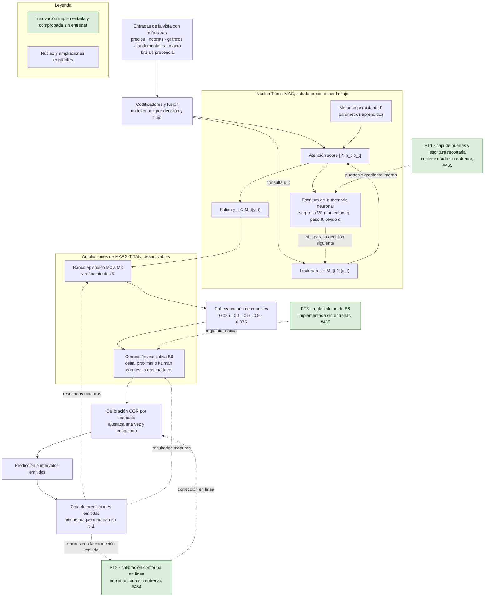

# Referencias Transformer, Titans-MAC y ampliaciones de MARS-TITAN

La comparación conserva el candidato GRU con banco episódico y añade una referencia Transformer compacta, una adaptación financiera identificable de Titans-MAC y MARS-TITAN con ampliaciones desactivables sobre ese núcleo. Cada arquitectura tendrá identidad, configuración y estado propios. Cambiar el codificador y añadir memoria son intervenciones distintas. No se presupone que el Transformer o Titans reduzcan el error.

La referencia bibliográfica es [Titans: Learning to Memorize at Test Time, NeurIPS 2025](https://proceedings.neurips.cc/paper_files/paper/2025/file/a4ca07aa108036f80cbb5b82285fd4b1-Paper-Conference.pdf), de Ali Behrouz, Peilin Zhong y Vahab Mirrokni. La adaptación al objetivo residual y a FinMultiTime pertenece a este proyecto. No constituye una reproducción de los resultados del artículo.

El [recibo de fuentes](../../reports/research/titans-mac-source-audit-20261008.json) fija versiones, hashes de los PDF, ecuaciones y discrepancias comprobadas. La inspección de una implementación no oficial no equivale a incorporarla ni ejecutarla. La [revisión de implementaciones públicas](titans-reference-implementations.md) no encontró código de los autores y compara numéricamente la memoria del núcleo con `lucidrains/titans-pytorch`, ejecutada en un entorno aislado sin incorporarla al repositorio.

## Arquitecturas y estado comprobado

| Referencia | Función | Estado revisado el 9 de octubre de 2026 |
| --- | --- | --- |
| GRU con banco episódico | Conservar el candidato previo y sus controles de escritura | [Componente C++20 integrado](../../native/candidate.md) y [adaptador histórico con máscaras](../../native/candidate_historical.md), con pruebas CPU/CUDA, gradientes y recuperación del módulo. La [conexión cronológica y el banco 128×256](../engineering/gru-financial-sessions.md) tienen pruebas CPU y una comprobación CUDA superada el 9 de octubre. El [entrenador cronológico](../engineering/candidate-chronological-trainer.md) está comprobado sin pasos de optimizador en CPU y en `cuda:0`, con su memoria medida en `cuda:0` ([resumen](../../reports/engineering/cuda-checks-20261009/README.md)). No entrenado. |
| Transformer compacto | Aislar el cambio de codificador con proyecciones, fusión y cabeza comunes | [Referencia integrada](../engineering/compact-transformer-reference.md), con pruebas CPU/CUDA y paridad de los modos anteriores. Sin resultados predictivos propios. |
| Titans-MAC adaptado | Atención cercana, memoria neuronal actualizable y memoria persistente aprendida | [Núcleo](../engineering/titans-memory-core.md), [adaptador](../engineering/titans-financial-adapter.md) y [consumidor cronológico](../engineering/financial-session-v2.md) integrados, con pruebas técnicas CPU/CUDA. El [entrenador cronológico](../engineering/titans-chronological-trainer.md) está comprobado sin pasos de optimizador en CPU y, en su pasada de ajuste, en `cuda:0`, con la memoria por tramo medida en `cuda:0`. La [inicialización con bias declarado de las puertas](../engineering/titans-gate-initialization.md) evita el colapso de la memoria rápida en fixtures. `FinancialConfig` la expone y las recetas cronológicas la declaran para la campaña. La [memoria con residual y LayerNorm](../engineering/titans-mac-output-scale.md) de la sección 3.3 es un componente desactivable que activa la receta de la campaña desde 2000, con las recetas v1 intactas. La [ventana walk-forward](../engineering/titans-chronological-trainer.md#ventana-walk-forward) escribe predicciones por fila. Sin entrenamiento ni trayectoria histórica completa ejecutada. |
| MARS-TITAN sobre Titans-MAC | Incorporar las modificaciones acordadas mediante componentes desactivables | El consumidor conecta banco, lectura y estados con M0/M1 y [M2 con tres índices 50/25/25](../engineering/mature-error-write-policy.md). M2 tiene una comprobación CUDA focal FP32/FP64, K=1, B_mem=4 y C apagado, que en la repetición del 9 de octubre solo pasaba con el binario cuya huella fijaba la prueba. Desde [#418](https://github.com/GonxKZ/mars-titan/pull/418) la prueba comprueba el binario realmente cargado y pasa con el enlace de `develop`. K repite la lectura sin multiplicar actualizaciones de MAC. [M3](../engineering/m3-write-policy.md) reutiliza esos tres índices con una puntuación de error, anomalía y relevancia, comprobada en CPU y en `cuda:0`. La consolidación M sobre M2 continúa pendiente. El [entrenador del lector episódico](../engineering/mars-titan-extensions.md#entrenador-del-lector-episódico) lo ajusta sobre `mac_online` congelado, comprobado sin pasos de optimizador en CPU y en `cuda:0`. La [correspondencia de modificaciones](#correspondencia-de-las-modificaciones-de-integración) fija el nivel de cada ampliación y la [variante declarada](#variante-mars-titan-con-ampliaciones) sus componentes desactivables. |
| CM-v1 | Contrastar C y M sobre una referencia concreta, sin sustituirla | [C local de MAC](../experiments/mars_titan_cm_v1/mac_local_control.md), selector M y codec comprobados. El consumidor integra retenciones configurables. El [factorial](../experiments/mars_titan_cm_v1/factorial.md) declara B y sus cuatro brazos, con la penalización C en el ajuste del núcleo, que acumula por bloques de flujos con el mismo gradiente que el tramo completo. Comprobado sin pasos de optimizador en CPU y, para los núcleos B y B+C, en `cuda:0`. Pendiente el estudio científico. Desactivada por defecto. |

Estos nombres describen brazos del estudio. No renombran checkpoints ni convierten una referencia anterior en Titans. El valor de `baseline_id` de cada contraste debe señalar una configuración ejecutable y fijada. La elección de una nueva arquitectura para B crea otro contraste B, B+C, B+M y B+C+M, conservando los manifiestos anteriores.

El consumidor congelado requiere `fastpath=False` explícito y guarda ese ajuste en su identidad. Su banco v2 separa la semilla de los hashes completos del corpus. La guía registra el fallo FP64 de la ruta fusionada, la dependencia futura del RNG v1 y sus correcciones, sin reinterpretar las comprobaciones históricas ni atribuir mejoras predictivas.

## Correspondencia con Titans-MAC

La memoria neuronal representa una función parametrizada por pesos rápidos, no una lista de episodios. Para una entrada observada se obtienen claves y valores mediante proyecciones. La pérdida asociativa y la actualización corresponden a las ecuaciones (2) y (3):

$$\ell(M_{t-1};x_t)=\|M_{t-1}(k_t)-v_t\|_2^2,$$
$$S_t=\eta_t S_{t-1}-\theta_t\nabla_M\ell(M_{t-1};x_t),\qquad M_t=(1-\alpha_t)M_{t-1}+S_t.$$

La implementación debe declarar las formas y la aplicación de las puertas dependientes de la entrada. No basta una tasa fija o una regla delta sin momentum para identificar este núcleo. El artículo no fija la forma funcional, el bias ni la inicialización de `α`, `η` y `θ`. Sin bias, `α` empieza cerca de 0,5 y la memoria de dos capas tiende a lecturas nulas. La identidad con `gate_bias` fija las tasas iniciales para entrada nula y conserva la dependencia de la entrada. Es una decisión propia, analizada en la [inicialización de las puertas](../engineering/titans-gate-initialization.md). Las proyecciones y la atención pertenecen al ajuste externo. La actualización interna modifica los pesos rápidos y su momentum con el objetivo asociativo.

MAC recupera información desde el estado previo, la incorpora con los parámetros persistentes al contexto de atención, actualiza memoria con la salida de atención y combina ambas salidas. La sección 3.1 y las ecuaciones (7–10) especifican este recorrido. Los parámetros persistentes de la ecuación (6) se aprenden durante el ajuste externo y permanecen fijos durante inferencia.

Hay una discrepancia de orden que debe quedar visible: la ecuación (7) de las actas escribe `[P; S; h]`, mientras que la figura 4a presenta `[P; h; S]`, como la ecuación (22) del [preprint v1](https://arxiv.org/abs/2501.00663v1). La convención de implementación propuesta es `[P; h; S]`. Debe conservarla en configuración y pruebas, sin mezclar las dos versiones.

La máscara necesita una comprobación adicional. Si `h_j` se obtiene consultando con `S_j`, ya contiene una dependencia de esa entrada. Una máscara triangular sobre la secuencia concatenada no impide por sí sola que `S_i` lea un `h_j` construido desde una entrada posterior. Las salidas por token necesitan una máscara cruzada compatible con esos índices. Una salida emitida únicamente al terminar el segmento debe declarar esa granularidad y no presentarse como causal para prefijos incompletos. La prueba perturbando entradas futuras distingue ambos contratos. La [tabla de ecuaciones](../engineering/titans-mac-equations.md) relaciona cada ecuación con su función y su prueba, y declara las desviaciones de la adaptación financiera.

## Estados y disponibilidad

| Estado | Contenido | Política de actualización |
| --- | --- | --- |
| Parámetros compartidos | Codificadores, proyecciones, atención, fusión y cabeza | Ajuste externo autorizado. Congelados durante cada tramo de evaluación. |
| Pesos rápidos | Parámetros de la red de memoria neuronal y momentum asociativo | Actualización interna explícita con entradas disponibles. No usa la etiqueta financiera pendiente. |
| Memoria persistente de Titans | Parámetros aprendidos independientes de la entrada | Ajuste externo. Fijos durante inferencia. No son episodios recuperables. |
| Banco episódico | Episodios reales, identidad, representación, disponibilidad y predicción emitida | Admisión y retención separadas. El error financiero solo se incorpora al madurar el resultado. |
| Estado de trabajo | Activaciones, consulta y refinamientos de una predicción | Se descarta al terminar esa predicción. |
| Cola pendiente y cursor | Predicciones emitidas, etiquetas aún no utilizables y posición confirmada | Confirmación temporal recuperable. No participa en recuperación ni consolidación antes de ser elegible. |
| Memoria asociativa A (ampliación) | Matriz de clave por valor, contador y cursor de resultados aplicados | Solo cambia con etiquetas maduras, después de emitir, en orden canónico. No toca pesos rápidos ni banco. |
| Estado del régimen (ampliación) | Probabilidades filtradas y cursor del filtro | Avanzaría una vez por cohorte con observaciones permitidas, antes de predecir. Propuesto, sin conexión. |

Cada recorrido debe declarar cómo se inicializan, reinician, arrastran y guardan los pesos rápidos. El estado por activo o flujo no puede depender del orden de los activos en el lote. Todas las predicciones de una misma sesión parten del snapshot publicado para esa sesión. Una adaptación local a entradas observadas debe ser explícita y no propagar efectos entre activos por el orden de ejecución.

La sorpresa asociativa es una cantidad del objetivo de memoria. El error financiero maduro se calcula contra la predicción realmente emitida. No son intercambiables ni comparten automáticamente escalas o reglas de escritura. K = 1, 2 y 4 cuenta los refinamientos de MARS-TITAN sobre el contexto definido. No cuenta las actualizaciones internas de la memoria de Titans.

La serialización debe conservar parámetros compartidos, pesos rápidos, momentum, memoria persistente, banco episódico, cola, cursor, representación, RNG y configuración. Los grafos de autograd del pasado no forman parte del estado persistido. La política de diferenciación distingue el ajuste externo de la actualización interna y debe verificarse con gradientes, no mediante una desconexión indiscriminada.

## Controles de los brazos sin ampliaciones

| Componente | Inserción o responsabilidad | Control necesario |
| --- | --- | --- |
| Cuatro modalidades y macro | Representaciones comunes, máscaras explícitas y fusión con información disponible | Mismas filas, catálogos, objetivo residual y cortes en todos los brazos de la edición. |
| Codificador Transformer | Reemplazo identificado del codificador temporal, con la fusión y cabeza comparables | GRU previa y Transformer sin memoria neuronal. |
| Memoria neuronal | Lectura y actualización interna de Titans-MAC | Misma atención y parametrización pertinente con actualización congelada, y control sin memoria identificado. |

Los identificadores M0–M3 de las políticas de escritura se conservan. En cualquier adaptación que ya tenga memoria neuronal debe indicarse expresamente qué memoria desactiva una ablación. No se puede presentar la retirada del banco episódico como retirada de toda la memoria de Titans.

Una mejora aparente puede proceder del codificador, del número de parámetros, de la exposición a datos o del tiempo adicional. Se registran esos costes por separado y se distinguen igualdad de actualizaciones e igualdad de cómputo. No se amplía retrospectivamente una búsqueda solo para favorecer un brazo.

## Correspondencia de las modificaciones de integración

Esta sección relaciona cada propuesta de la [revisión de integración](system-integration.md) con su punto de inserción sobre Titans-MAC. El estado se comprobó en el código de `develop` del 9 de octubre de 2026 (8ffb95aa), no solo en la documentación, y se actualizó ese mismo día al conectar B6 con las ventanas walk-forward y declarar los brazos de A5 y A10. Las filas F2, F3 y F5 recogen tres fronteras del recorrido actual que señala el documento de integración y que no tenían fila propia. Las [decisiones de integración](system-integration.md), la [revisión de ampliaciones](neuroarchitecture-review.md) y la [referencia episódica](candidate-architecture.md) conservan las propuestas y reglas anteriores.

Se usan cinco niveles. Ninguno implica el siguiente.

| Nivel | Significado |
| --- | --- |
| N1 | Propuesta, sin código propio. |
| N2 | Componente aislado, sin conexión con el consumidor de MARS-TITAN. |
| N3 | Conectado a `FrozenFinancialConsumer`, a `FinancialSession` o a una ventana walk-forward sobre `FinancialPredictor`. |
| N4 | Comprobado técnicamente en ese consumidor, con pruebas CPU y CUDA cuando se indica. |
| N5 | Experimento ejecutado. Ninguna modificación alcanza este nivel. |

Una propuesta sin punto de inserción justificado o sin un control que permita descartarla queda como no incorporada. No se añade un módulo para completar la tabla. La «relación con el núcleo» indica si la modificación cambia el cálculo de Titans-MAC o actúa antes o después de él.

### Inserción y estado

| ID | Modificación (sección de la revisión) | Inserción sobre Titans-MAC (archivo, función, tensor y momento) | Relación con el núcleo | Estado que lee o modifica | Interruptor | Nivel |
| --- | --- | --- | --- | --- | --- | --- |
| I01 | Ciclo de decisión, registro inmutable y maduración (Decisión arquitectónica, Decisiones y maduración) | `FinancialSession.step` sobre el `Executor` nativo de `cohort_execution`. Prepara todo el evento con la generación anterior, emite `Prediction{id, generation, value}`, resuelve después los resultados maduros y publica una generación | Envuelve al núcleo sin cambiar su cálculo | Cola pendiente, cursor, generación y predicciones emitidas | Ninguno. Es el contrato común de todos los brazos con estado | N4. Falta la aceptación sobre todas las fases históricas |
| I02 | Vista común antes de los consumidores (Arquitectura propuesta) | `FinancialInputSpec(source_sha256, view_sha256)` compartida por predictor, codec y verificador de prefijos. `TitansBinding.check` rechaza fuentes distintas al construir la sesión | Fija las entradas del núcleo | Identidad de entradas | Ninguno | N4 para predictor y codec. Padre, régimen y calibrador no están conectados |
| I03 | Vista reducida (Variantes y orden de contraste) | `ViewDataset` delante de `prepare_observation_index` en `memory/financial_observations.py`, que hoy exige un `CorpusDataset` exacto. Retira valores, máscaras y edades en los cinco bloques antes de cualquier consumidor | Cambia las entradas del núcleo sin cambiar sus formas | Entradas. Invalida tokens, pesos rápidos, claves del codec y predicciones guardadas | Vista completa, que devuelve los mismos valores | N2 |
| I04 | Lecturas de una instantánea común (Decisión arquitectónica) | `TitansBinding.snapshot` crea un `EpisodeSnapshot` con el banco confirmado antes del primer bloque. Todos los activos, bloques y pasos K leen esa copia, con `cutoff` y `context_id` del evento | Posterior a MAC | Banco episódico en lectura | Sin lector no hay instantánea | N4 |
| I05 | Banco episódico y lectura posterior a MAC (MARS-TITAN original, banco y lectura K fija) | Lectura: `FrozenFinancialConsumer.prepare` llama a `apply_episodic_readout` sobre `working_state` [flujos, 64] y aplica la cabeza del núcleo. Escritura: `FinancialSession._resolve` con `TitansBinding.propose`, después de emitir | Posterior a MAC. No modifica pesos rápidos, atención ni memoria persistente | Banco 64×64 con hasta 1.024 episodios y parámetros del lector | `readout=None` reproduce el núcleo. `mode="no_bank"` conserva el refinador con lectura cero (M0) | N4. El [entrenador del lector](../engineering/mars-titan-extensions.md#entrenador-del-lector-episódico) está implementado sin ejecutar. El banco de 8.192 episodios con claves 128 y base 256 solo existe en la GRU |
| I06 | Error financiero de la predicción emitida, utilidad medida tras el resultado (Decisiones y maduración) | `FinancialSession._resolve` calcula `label − issued_prediction` con la salida del registro nativo y la entrega a `MatureErrorBank` | Independiente. Usa la predicción emitida, no la sorpresa asociativa | Admisión del banco | `admission` m0, m1, m2 o m3. M3 añade anomalía y relevancia calculadas con las entradas de la decisión y escalas del tramo de entrenamiento | N4. M2 con CUDA focal FP32/FP64, K=1, B_mem=4 y C apagado. M3 solo en CPU |
| I07 | Refinamientos K = 1, 2 y 4 (Recurrencia, primer bucle) | `EpisodicReadout.forward` aplica K lecturas y pasos sobre el estado de trabajo tras una única preparación MAC. Con `episode_selection="first_read"` los pasos siguientes atienden los episodios de la primera lectura | Posterior a MAC. No cuenta actualizaciones de memoria | Estado de trabajo, que se descarta | `refinements`, con K=1 principal, y `per_step` como selección | N4 en CPU. La comprobación CUDA de M2 solo cubre K=1. La del entrenador del lector coincide con CPU con K = 4 por paso y con `first_read`, pero la del módulo (`cuda_episodic_readout_check.py`) todavía no cubre `first_read`. Brazo `mars_titan_m1_k4_first_read` (A10) declarado en la campaña ampliada |
| I08 | Cálculo adaptativo de K y autoevaluación (Recurrencia, Valor del cálculo) | Puerta por flujo antes de `EpisodicReadout.forward` (archivo del núcleo, excluido de esta tarea), con lote activo B_k decreciente y parámetros fijados en desarrollo | Posterior a MAC | Estado de trabajo y asignación de K | K fijo | N1 |
| I09 | Régimen filtrado (Arquitectura propuesta, Tres escalas de estado) | Paso nuevo en `FinancialSession._prepare_event`, antes de crear la instantánea, con observaciones de mercado disponibles hasta el corte. Su posterior se guardaría en la generación y entraría como contexto antes de `self.fusion` en `FinancialPredictor.prepare` (excluido) o como partición del banco en `TitansBinding.bank` | Cambia la entrada de la fusión o el banco | Estado del filtro, una transición por cohorte | Sin régimen | N2 para el HMM. `MarkovFilter` C++20 solo sirve al contexto PPO, sin enlace Python, y sus parámetros por fold necesitan un ajuste bloqueado. La regla observable de volatilidad y tendencia, sin ajuste, está conectada como enrutamiento de B6 (I11, A13 y A14) con N4 en CPU |
| I10 | Selección de documentos antes de agregar (Vista de información y conservación de documentos) | Datos: `DocumentIndex.batches(asset_id, start, end)` con los límites de `_text_window`, en un tensor [B, D, 384] con máscara y disponibilidad. Modelo: sustituir la media que recibe `self.encoders["news"]` en `FinancialPredictor.prepare` (excluido) | Sustituye una entrada del núcleo | Representación de noticias. Invalida tokens y pesos rápidos. El codec del banco conserva la media salvo declaración nueva | Media de la ventana. Pesos uniformes deben reproducirla | N2 |
| I11 | Memoria asociativa delta o proximal (Recurrencia, segundo bucle) | Lectura en `FinancialSession._prepare_event` tras la preparación del núcleo, con `row.key_inputs` normalizada en L2 y la A de la generación anterior. Escritura en `FinancialSession._resolve` con `MatureFeedback` y valor `label − predicción del núcleo` | Posterior a la cabeza del núcleo | Matriz A y núcleo de cada pendiente en la generación | Componente ausente. Con A = 0 la lectura es cero | N4 en la sesión sin banco y en las [ventanas walk-forward](../engineering/mars-titan-extensions.md#corrección-b6-en-las-ventanas-walk-forward), con las mismas emisiones bit a bit. Brazos `mars_titan_b6` y `mars_titan_b6_bias` declarados en la campaña ampliada |
| I12 | Replay programado (Postentrenamiento y adaptadores) | Entrenador cronológico tras aplicar las etiquetas maduras de cada tramo, con `ReplaySchedule.prepare` y `commit`. `training/financial_run.py` está excluido de esta tarea | Ajuste de parámetros compartidos, solo en entrenamiento | Parámetros, optimizador y cursor del calendario | Sin replay | N2. Calendarios C++20 sin conexión |
| I13 | Adaptadores de consulta, salida y bajo rango (Postentrenamiento y adaptadores) | Sobre el padre seleccionado: `head`, `mac.query_projection` y `mac.attention.out_proj`, `fusion.0`. En MARS-TITAN, `query_projection` y `value_projection` del lector | Modifica parámetros del núcleo o del lector tras seleccionar el padre | Parámetros compartidos. Invalidan predicciones guardadas, salidas de atención o representaciones según el punto | Padre congelado | N1 para Titans y el lector, declarados como pendientes en la matriz. N2 con `AdapterControl` sintético |
| I14 | Retorno con riesgo estimado: cuantiles y calibración (Arquitectura propuesta) | `FinancialConfig.head="quantile_head_v1"` y `apply_episodic_readout` con la misma cabeza. Calibración común fuera del modelo | Cabeza común a todos los brazos, no es una ampliación | Parámetros de la cabeza | Cabeza escalar | N4 para la cabeza en el entrenador, con paso CUDA sin optimizador. Calibración N2 |
| I15 | Destilación (Postentrenamiento y adaptadores) | Profesor MARS-TITAN completo y alumno Titans-MAC con K=1, con salidas del profesor solo de tramos permitidos | Entrenamiento separado | Parámetros del alumno | Sin destilación | N1 |
| I16 | Eventos auxiliares (Ruido, hechos verificables y eventos públicos) | Cabezas sobre `working_state` con pérdidas y máscaras propias | Posterior a MAC | Parámetros de cabezas auxiliares | Sin cabezas | No incorporada |
| I17 | Adaptación autosupervisada (Recurrencia, cuarto modo) | Modo de ajuste separado sobre ventanas ya observadas | Ajuste de parámetros | Parámetros | Pesos congelados | No incorporada |
| I18 | Sondas de representaciones e intervenciones (Recurrencia) | Registro acotado de representaciones, consultas, episodios y salidas por K sobre copias de la instantánea | Análisis posterior | Ninguno del recorrido principal | Sin registro | No incorporada |
| I19 | Continuidad prequential entre fases (Tres escalas de estado) | Reinicio o arrastre de pesos rápidos y banco entre calibración y evaluación | Estado del núcleo y del banco | Pesos rápidos y banco | Reinicio por fase | N1. La política común se fija en #363 |
| I20 | C y M de CM-v1 | C sobre la transición rápida de MAC antes del lector y M como retención `anchored` del banco | C mide el núcleo. M actúa sobre el banco | Diagnóstico C y banco | `local_control=None` y retención original | N4 como composición técnica. Es la variante independiente de #293, no forma parte de esta |
| F2 | Sustitución macro (Recorrido actual, frontera 2) | `CorpusDataset._blocks` no aplica `TemporalInputs.lookup` al bloque macro con la política con máscaras, que lee valor, presencia y antigüedad de la edición. El contrato temporal se sigue consultando para la elegibilidad de las etiquetas | Fija las entradas del núcleo | Entradas macro | Ninguno. La comparación estricta conserva la sustitución | N4 en las vistas con máscaras |
| F3 | Predicción del padre como característica (Recorrido actual, frontera 3) | El padre de MARS-TITAN es el Titans-MAC `mac_online` de la misma vista y semilla. `_parent` rechaza un padre de otra vista y la ventana B6 exige que su especificación de entrada sea compatible con la del tramo medido. B6 suma la corrección a la predicción del núcleo recalculada, no a una exportación | Posterior al núcleo | Ninguno nuevo | Sin vista reducida (I03) no existe un alumno con menos información que el padre | N4 en las ventanas de MARS-TITAN. La etapa de políticas y los adaptadores no se revisan aquí |
| F5 | Predicciones reconstruidas (Recorrido actual, frontera 5) | Las ventanas de MARS-TITAN no leen las exportaciones del padre. Recalculan sus predicciones en orden cronológico con el checkpoint elegido, y el banco y A solo reciben errores de predicciones emitidas en el mismo recorrido antes de madurar su etiqueta | Envuelve al núcleo | Banco y A | Ninguno | N4. La validación es posterior a la selección del padre en todos los brazos. La evaluación es posterior a toda selección |

### Objetivo, control y evidencia

| ID | Objetivo predictivo que ayuda a contrastar | Control que permitiría descartarla | Evidencia actual | Issues |
| --- | --- | --- | --- | --- |
| I01 | Requisito de validez. Sin él cualquier efecto de memoria podría proceder de información futura | Invariancia al sufijo futuro, al orden de activos y a los bloques físicos | [Sesión](../../tests/memory/test_financial_session.py), [M2](../../tests/memory/test_financial_session_m2.py), [ejecución de cohortes](../engineering/cohort-execution.md) | #21, #217, #23 |
| I02 | Requisito de validez de las comparaciones | Rechazo de un codec de otra vista antes de abrir la sesión | `test_codec_from_another_view_is_rejected_before_creating_a_session` en la [sesión](../../tests/memory/test_financial_session.py), añadida con esta correspondencia. El rechazo de un prefijo de otra fuente no tiene prueba propia en la ruta Titans | #21, #23 |
| I03 | No inferioridad con menos información, con margen fijado antes de evaluar | Vista completa con paridad exacta y auditoría de todas las rutas, incluida la del padre | [Vistas](../../tests/data/test_information_views.py), [entradas](../../tests/training/test_information_inputs.py), [guía](../engineering/information-views.md) | #214, #28 |
| I04 | Requisito de validez de las lecturas | Instantánea futura rechazada al corte de la decisión | [Consumidor](../../tests/models/titans/test_frozen_financial.py), [lector](../../tests/models/titans/test_episodic_readout.py) | #21 |
| I05 | ¿Recuperar episodios maduros similares reduce el MAE residual de Titans-MAC con la misma información? | Titans-MAC con `readout=None`, M0 `no_bank` con el mismo presupuesto de ajuste y M1 a igual capacidad | [Consumidor](../../tests/models/titans/test_frozen_financial.py), [sesión](../../tests/memory/test_financial_session.py), [CUDA](../../tests/memory/cuda_financial_session_check.py), [guía](../engineering/episodic-financial-readout.md) | #18, #23 |
| I06 | ¿Seleccionar por error maduro conserva episodios más útiles que el reservorio a igual capacidad y escrituras? ¿Añadir anomalía y relevancia mejora esa selección? | M1 uniforme con la misma capacidad física y las ofertas contadas. Para M3, M2 con las mismas ofertas, cupos y búsqueda | [M2](../../tests/memory/test_financial_session_m2.py), [CUDA](../../tests/memory/cuda_mature_error_check.py), [guía](../engineering/mature-error-write-policy.md), [M3](../../tests/memory/test_financial_session_m3.py), [guía M3](../engineering/m3-write-policy.md) | #19 |
| I07 | ¿El cálculo adicional sobre la misma información reduce el error? | K=1 con lecturas emparejadas y el modo `first_read`, que atiende en cada paso los episodios de la primera lectura. Así K=4 no examina más episodios únicos que K=1 | [Una actualización MAC por K](../../tests/models/titans/test_frozen_financial.py), [selección por paso](../../tests/models/titans/test_episodic_readout.py) | #56 |
| I08 | Igual MAE con menos aplicaciones del bloque | K fijo y asignación aleatoria con el mismo cómputo medio. La utilidad procede de rutas emitidas y su coste se registra | Ninguna | #56 |
| I09 | ¿Un estado de mercado filtrado mejora la predicción o la recuperación? ¿Repartir B6 por un régimen observable mejora al mismo reparto por mes? | Sin régimen, reglas observables de volatilidad y tendencia, y banco global a igual capacidad. Para el enrutamiento de B6, el reparto por mes con la misma capacidad y las mismas cohortes sin clasificar | [Filtro](../../native/tests/markov_filter_tests.cpp), [entornos](../engineering/batched-rl-environments.md), [diseño](markov-regimes.md), [regla](../../src/mars_titan/memory/regimes.py), [pruebas](../../tests/memory/test_regimes.py) y [declaración](../../configs/evaluation/regime-routing-comparison.json) | #20 |
| I10 | ¿La identidad de cada documento aporta información que la media elimina? | Media con la misma ventana, contando documentos únicos examinados y codificados | [Índice](../../tests/data/test_document_index.py) y [guía](../engineering/document-index.md). La consulta tardó 451 ms en p50 con 64×128 sobre un índice sin partición por activo | #17, #213 |
| I11 | ¿Una corrección lineal escrita con errores maduros reduce el MAE de la predicción congelada? | Titans-MAC sin componente, corrector de sesgo con la coordenada constante del codec como única clave, M1 con las mismas etiquetas, delta frente a proximal con η y λ comunes | [Pruebas](../../tests/memory/test_associative_memory.py) y [guía](../engineering/mature-associative-memory.md) | #392, #27, #28 |
| I12 | ¿El orden de las exposiciones cambia la calidad con el mismo multiconjunto? | Calendarios `uniform`, `recent` y `spaced` con exposiciones, lotes y actualizaciones iguales | [Guía](../engineering/replay-schedules.md) | #55, #215 |
| I13 | ¿Una adaptación localizada iguala a la continuación completa con menos parámetros entrenables? | Padre congelado, corrección lineal y continuación completa | [Matriz](../../configs/posttraining/adapter-matrix-v1.json), [pruebas](../../tests/posttraining/test_adapter_matrix.py), [control nativo](../engineering/adapter-controls.md) | #364, #216 |
| I14 | Calibración de la incertidumbre, sin cambiar la población principal | Cabeza escalar L1 con el mismo presupuesto | [Titans](../../tests/models/titans/test_financial_quantiles.py), [entrenador](../../tests/training/test_financial_run_quantiles.py), [guía](../engineering/quantile-head.md) | #22 |
| I15 | ¿Un alumno barato conserva la calidad del profesor? | Alumno directo con las mismas entradas y el profesor, con su coste | Ninguna | #57 |
| I16 a I18 | Véase el apartado siguiente | Sin control ejecutable definido | Ninguna | Ninguna |
| I19 | Efecto de arrastrar estado entre fases | Reinicio por fase con las mismas condiciones en todos los brazos | Ninguna | #363 |
| I20 | Efecto de C y M sobre una B fijada | Factorial B, B+C, B+M y B+C+M con paridad de ambos apagados | [Especificación](../experiments/mars_titan_cm_v1/specification.md) | #293 |
| F2 | Requisito de validez de las máscaras | Una sustitución forzada con valores imposibles no debe llegar a ningún bloque macro | `test_masked_reader_never_substitutes_the_macro_block` en la [ventana B6](../../tests/training/test_mars_titan_correction.py) | #20 |
| F3 | Requisito de validez de la comparación | Padre de otra vista, semilla, variante o control C rechazado antes de crear la salida | `test_parent_must_be_the_completed_mac_online_window_of_the_view` en la [ventana B6](../../tests/training/test_mars_titan_correction.py) | #20 |
| F5 | Requisito de validez del banco y de A | Alterar etiquetas o entradas posteriores no cambia emisiones anteriores. Con η = 0 la ventana reproduce el padre recargado | [Paridad B6](../../tests/memory/test_mars_titan_correction_parity.py), [ventana B6](../../tests/training/test_mars_titan_correction.py), [sesión del lector](../../tests/memory/test_mars_titan_session_parity.py) | #20 |

### Propuestas no incorporadas

Los eventos auxiliares (I16) carecen de un conjunto de etiquetas de eventos con observación y exposición acreditadas. Sin esas etiquetas no hay pérdida auxiliar con máscara propia ni control posible. La adaptación autosupervisada (I17) requiere un protocolo de desarrollo y ajuste separado de la evaluación congelada, que la revisión no fija y el bloqueo impide ejecutar. Las sondas (I18) son un análisis posterior a un entrenamiento y no cambian el predictor. Ninguna de las tres recibe issue ni componente hasta que cumpla el criterio de inserción y control.

### Componentes que no entran en la campaña A

La revisión adversarial de los componentes sin conexión buscó fugas, dependencia del orden, coste y alternativas más sencillas. Solo B6 (I11) y los episodios de la primera lectura (I07, A10) superaron esa revisión con un control ejecutable y se conectaron como modelos. Después entró de I09 la regla observable sin ajuste, como enrutamiento de B6 con su control de calendario (A13 y A14), mientras el HMM sigue fuera. Los demás quedan como no incorporados en la campaña A. No son resultados negativos. Son decisiones de alcance con su motivo y el trabajo que permitiría retomarlos.

| ID | Motivo | Evidencia | Trabajo que lo habilitaría | Control de descarte |
| --- | --- | --- | --- | --- |
| I03 | Cambia las entradas del núcleo. Exige un padre Titans-MAC propio ajustado con la vista reducida en cada ventana, no un componente sobre el padre congelado. Con la configuración actual de A serían 180 ajustes más, los mismos que `titans_mac_online` | `prepare_observation_index` exige un `CorpusDataset` exacto. [Vistas](../../tests/data/test_information_views.py) con paridad en datos | Índice de observaciones sobre `ViewDataset` con paridad exacta con la vista completa, margen de no inferioridad declarado y brazo Titans-MAC con la vista | Vista completa |
| I09 (HMM) | `MarkovFilter` no tiene enlace Python y sus parámetros por ventana necesitan un ajuste propio en el tramo de entrenamiento. Como contexto antes de la fusión cambia las entradas del núcleo y exige su propio padre. Como partición del banco solo tiene sentido si A2 muestra valor del banco | [Filtro](../../native/tests/markov_filter_tests.cpp) y [diseño](markov-regimes.md) | Enlace Python, ajuste por ventana con posterior filtrada (nunca suavizada), prueba de causalidad y modelo propio | Sin régimen, reglas observables de volatilidad y tendencia y banco global a igual capacidad |
| I10 | Sustituye la entrada de noticias del núcleo y exige su propio padre. La consulta de documentos tardó 451 ms en p50 con 64×128 sobre un índice sin partición por activo, así que materializar [B, D, 384] para cada decisión de la campaña no tiene coste medido | [Índice](../../tests/data/test_document_index.py) y [guía](../engineering/document-index.md) | Partición del índice por activo, tensores materializados por vista con coste medido, paridad de pesos uniformes con la media y brazo propio | Media de la misma ventana |
| I12 | Actúa sobre el ajuste de parámetros compartidos. En el entrenador cronológico el orden de exposición es el temporal, que necesita la memoria rápida de `mac_online`: volver a exponer un bloque pasado exige su estado rápido en ese instante o recalcular el prefijo. Los calendarios C++20 no tienen enlace Python | [Calendarios](../engineering/replay-schedules.md) | Definir la unidad de repetición de un entrenador con estado, por ejemplo tramos completos con memoria rápida reiniciada, y su control | Mismo multiconjunto de exposiciones, lotes y actualizaciones |
| I08 | Sin código. Solo tiene sentido si A4 y A10 muestran que el cálculo adicional reduce el error. Su puerta necesita parámetros fijados en desarrollo, otra selección sobre validación | Ninguna | Resultados de A4 y A10 y una puerta con su presupuesto de cálculo | K fijo y asignación aleatoria con el mismo cálculo medio |
| I15 | Sin código. Necesita un profesor MARS-TITAN elegido en cada ventana, es decir, resultados de la campaña | Ninguna | Profesor elegido y salidas del profesor solo de tramos permitidos | Alumno directo con las mismas entradas |
| I19 | Se decide como protocolo común, no como brazo: la memoria rápida, el banco y A empiezan de nuevo en cada tramo medido, con su calentamiento. Arrastrar el estado haría depender calibración y evaluación del recorrido de validación y rompería la repetición exacta de un tramo interrumpido y de los traslados | `memory_policy` de cada ventana y pruebas de reanudación de [Titans-MAC](../../tests/training/test_titans_walk_forward.py), del [lector](../../tests/training/test_mars_titan_walk_forward.py) y de [B6](../../tests/training/test_mars_titan_correction.py) | Una política de arrastre común a todos los brazos con estado, declarada en #363 | Reinicio por tramo |

La matriz de adaptadores (I13) sigue en su propia tarea (#364 y #216) y no forma parte de los brazos de esta variante.

El orden de incorporación siguió el valor de cada pregunta para el objetivo predictivo y su coste. B6 responde a la segunda vía de memoria del documento con un control fuerte (el corrector de sesgo con las mismas etiquetas) y no ajusta parámetros, así que cada trabajo solo predice los tres tramos medidos (0,68 horas de GPU por trabajo con la clave del codec y 0,33 con la constante, medidas en una ventana). Los episodios de la primera lectura separan en A4 más cálculo de más evidencia, pero cuestan lo mismo que un lector K = 4 (8.649 horas de GPU en A frente a 8.413), así que su entrada queda pendiente de decidir con ese coste a la vista. Régimen, vista reducida y selección de documentos cambian las entradas del núcleo y costarían cada uno una familia Titans-MAC adicional, por lo que quedan para una decisión posterior con ese coste a la vista. K adaptativo y destilación dependen de resultados que todavía no existen. El replay programado necesita antes una definición compatible con el estado cronológico.

### Requisitos transversales de la revisión

| Requisito | Dónde se cumple | Nivel |
| --- | --- | --- |
| Orden canónico de escrituras y publicación por cohorte | Ejecutor nativo y `FinancialSession`. La memoria asociativa repite la regla con su cursor | N4 |
| Identidad de feedback distinta de la de exposición | Feedback con revisión cero en el ejecutor. Exposición propia en `ReplaySchedule` | N4 y N2 |
| Barrera de recuperación del estado completo | Una generación por evento con pesos rápidos, banco, cola y cursor | N4 |
| Denominador global en microlotes | El entrenador de Titans calcula una sola pérdida sobre las etiquetas maduras del tramo. La acumulación por bloques de Titans, de la GRU y de la penalización C de CM-v1 conserva ese denominador | Comprobado sin pasos de optimizador |
| Mejor estado separado del de recuperación | Entrenadores cronológicos de Titans y de la GRU | Comprobado sin pasos de optimizador |
| Un único escritor del banco y lectores de una instantánea | La sesión publica una generación y el lector usa copias | N4 |

## Variante MARS-TITAN con ampliaciones

La variante parte del brazo Titans-MAC `mac_online` con su receta cronológica y añade componentes desactivables. La [declaración](../../configs/titans/mars-titan-extensions.json) tiene todos los componentes apagados y estado `declared_not_executed`. No describe un modelo entrenado ni una combinación elegida. Cada componente declara si está conectado. El [constructor de la variante](../engineering/mars-titan-extensions.md) solo construye combinaciones de los conectados y rechaza los demás con su motivo.

### Componentes

| Componente | Valores | Apagado | Fase en la que actúa | Nivel |
| --- | --- | --- | --- | --- |
| `episodic_bank` (I04 a I06) | `m0_no_bank`, `m1`, `m2`, `m3` | `readout=None` y admisión m0 | Evaluación y entrenamiento del lector | N4 |
| `refinements` (I07) | 1, 2, 4 | 1. Solo existe con banco | Preparación de cada predicción | N4 en CPU |
| `refinement_episodes` (I07) | `first_read` | `per_step`. Solo existe con K mayor que 1 | Preparación de cada predicción | N4 en CPU |
| `associative_memory` (I11) | `delta`, `proximal` y `kalman` (PT3), con clave del codec, constante o enrutada por régimen observable o por mes (I09) | Ausente. No se combina con el banco | Evaluación en `FinancialSession` y, con delta y proximal, en las ventanas walk-forward | N4. La ventana también se comprobó en `cuda:0`. `kalman` todavía no tiene ventana |
| `document_selection` (I10) | `attention` | Media de la ventana | Entradas | N2 |
| `regime_context` (I09) | `filtered_hmm` | Ausente | Entradas o banco | N2 |
| `information_view` (I03) | Identidad de una vista reducida | Vista completa | Entradas | N2 |
| `adaptive_refinements` (I08) | Puerta declarada | Ausente | Preparación | N1 |
| `replay_schedule` (I12) | `uniform`, `recent`, `spaced` | Ausente | Entrenamiento | N2 |
| `adapters` (I13) | Brazos de la matriz de adaptadores | Ausente | Postentrenamiento | N1 |

CM-v1 queda fuera porque es la tercera variante, con su propia B. La cabeza de cuantiles es común a todos los brazos. Destilación y las propuestas no incorporadas no forman parte de la variante.

### Identidad y paridad

Cada combinación tiene una identidad propia: la huella SHA-256 del JSON canónico que reúne la identidad del brazo Titans-MAC de partida y la configuración de los componentes activos. Con todos apagados el conjunto de componentes activos está vacío y la combinación no crea otro brazo. Es exactamente Titans-MAC `mac_online`, con el mismo checkpoint, el mismo consumidor (`readout=None`, admisión m0, `local_control=None`) y la misma identidad. No se entrena una copia para presentarla como variante.

La paridad está comprobada por componente. `readout=None` reproduce exactamente la predicción del núcleo (`test_none_composition_is_exact_and_warmup_only_returns_state` y `test_none_preserves_the_existing_prediction_and_never_calls_the_head`). `local_control=None` conserva la identidad anterior. La validación del entrenador coincide con la sesión M0 sin lector (`test_validation_pass_matches_the_frozen_session`). La memoria asociativa vacía lee cero y la sesión con B6 emite en el primer evento lo mismo que el núcleo. La variante completa construida desde la declaración con todo apagado reproduce la sesión `mac_online` en contrato, emisiones, pesos rápidos, cola, banco y RNG (`test_all_disabled_session_is_exactly_the_mac_online_session`).

### Estados y orden dentro de cada evento

Los estados siguen la tabla de [estados y disponibilidad](#estados-y-disponibilidad). Cada componente debe guardar su estado en la generación del evento y no escribir en el estado de otro. El banco, A y la ruta de cada predicción pendiente ya lo hacen. La vista y el filtro HMM tendrán que hacerlo al conectarse. Dentro de un evento con corte t el orden es fijo:

1. Validar el evento, el corte y las pruebas de prefijo, y cargar la generación confirmada g−1.
2. Calcular la ruta del régimen observable una vez por mercado con las ventanas del evento, si la clave de B6 está enrutada. El filtro HMM, sin conectar, avanzaría aquí una vez con observaciones disponibles hasta t.
3. Crear la instantánea del banco y fijar la A de g−1. Son las mismas para todos los activos, bloques y pasos K.
4. Para cada bloque en orden canónico de flujos, `FinancialPredictor.prepare` construye el token con las entradas de la vista, lee la memoria neuronal desde M_{t−1}, aplica la atención con la memoria persistente y actualiza M_t una vez por observación en `mac_online`. Después llegan los K refinamientos sobre la instantánea sin escribir memoria, la cabeza y la lectura asociativa.
5. Registrar cada predicción emitida en la cola, con la parte del núcleo separada si existe corrección asociativa.
6. Resolver los resultados que maduran en t, en orden canónico, contra la predicción emitida. Proponer sobre copias las escrituras del banco y de A.
7. Publicar la generación g de forma atómica. Su efecto empieza en el evento siguiente.

Las actualizaciones de parámetros compartidos, el replay y los adaptadores solo ocurren en entrenamiento o postentrenamiento, nunca dentro de la sesión congelada.

### Qué aporta el banco frente a la memoria neuronal

La memoria neuronal de Titans es paramétrica y propia de cada flujo. Se escribe en cada observación con la sorpresa asociativa entre proyecciones del token, sin ver ninguna etiqueta, y olvida mediante α. Comprime la historia de entradas de ese activo.

El banco episódico es global para la fase y no paramétrico. Solo se escribe con resultados maduros y guarda el valor de la etiqueta junto a claves fijas del codec. Permite recuperar lo que ocurrió en contextos parecidos de otros activos y fechas. Esa información de resultados no llega nunca a los pesos rápidos de Titans. Por eso apagar el banco no retira la memoria neuronal, y `mac_disabled` o `mac_frozen` no retiran el banco. La memoria asociativa A ocupa un punto intermedio: también usa resultados maduros, pero los comprime en una aplicación lineal.

### Matriz mínima de ablaciones

Cada fila cambia un único componente respecto de su referencia. No se ejecuta el producto cartesiano. Una combinación se justifica solo con resultados individuales y una interacción pequeña registrada antes de evaluar.

| Contraste | Referencia | Qué aísla |
| --- | --- | --- |
| A1 | Titans-MAC | M0 `no_bank`: parámetros y cálculo del refinador sin contenido de memoria |
| A2 | A1 | M1 con K=1: contenido de los episodios maduros |
| A3 | A2 | M2 con la misma capacidad física: selección por error maduro |
| A4 | A2 | K=2 y K=4: cálculo adicional, con reselección de episodios en cada paso |
| A5 | Titans-MAC | Memoria asociativa proximal con la clave del codec (`mars_titan_b6`) y su corrector de sesgo (`mars_titan_b6_bias`) con η y λ comunes. La regla delta queda conectada sin brazo, porque depende del orden de los activos dentro de cada cohorte |
| A6 | Titans-MAC | Selección de documentos frente a la media de la misma ventana |
| A7 | Titans-MAC | Contexto de régimen. La partición del banco por régimen solo después de A2 |
| A8 | Titans-MAC | Vista reducida frente a la completa, con margen de no inferioridad previo |
| A9 | Brazo ajustado | Calendarios de replay con el mismo multiconjunto de exposiciones |
| A10 | A4 | Episodios de la primera lectura (`mars_titan_m1_k4_first_read`): el mismo K sin examinar más episodios únicos que K=1 |
| A11 | A3 | M3 con la misma capacidad, cupos y ofertas: anomalía y relevancia añadidas al error maduro |
| A13 | A5 | Corrector de sesgo con un compartimento por régimen observable (`mars_titan_b6_regime`) frente al mismo corrector repartido por mes (`mars_titan_b6_calendar`), con la misma capacidad y las mismas cohortes sin clasificar |
| A14 | A5 | Matriz del codec por régimen observable (`mars_titan_b6_regime_banks`) frente a la misma matriz repartida por mes (`mars_titan_b6_calendar_banks`) |

El presupuesto es igual en cada contraste: mismas filas, ventanas y purga de #363, mismas semillas, mismo número de actualizaciones y misma regla de parada. La capacidad física del banco y los candidatos examinados se igualan donde corresponda. Se registran parámetros, operaciones, bytes y tiempo. La incertidumbre se calcula por sesiones con dependencia temporal.

### Estado de la implementación

El [entrenador cronológico del lector](../engineering/mars-titan-extensions.md#entrenador-del-lector-episódico) ajusta solo el lector con el padre Titans-MAC seleccionado y congelado y construye el banco en cada recorrido. Así el núcleo coincide con el del modelo Titans-MAC y A1 separa parámetros de contenido. Tiene entrada por ventana, traslado para B y registro opcional en la campaña, todo comprobado en CPU sin pasos de optimizador, y su ajuste sin pasos coincide en CPU y `cuda:0` con M1 y M3. Los trece modelos conectados (M0, M1, M2, M3, M1 con K = 2 y 4, M1 con K = 4 y episodios de la primera lectura, B6 con la clave del codec y con la clave constante, y las cuatro B6 [enrutadas por régimen o por mes](../engineering/mars-titan-extensions.md#enrutamiento-de-b6-por-régimen)) tienen productor y forman parte de la declaración ampliada de la campaña A. B6 tiene su propia [ventana walk-forward](../engineering/mars-titan-extensions.md#corrección-b6-en-las-ventanas-walk-forward), sin lector ni ajuste de parámetros, que emite bit a bit lo mismo que `FinancialSession`. El constructor de la variante también está implementado.

### Pendiente antes de poder ejecutarla

- La decisión sobre los [componentes que no entran en la campaña A](#componentes-que-no-entran-en-la-campaña-a), con su coste a la vista.
- La copia de la sección `mars_titan` a la configuración de A, con los recuentos del diseño conjunto de #363. Según el [coste medido](../engineering/mars-titan-extensions.md#coste-medido-de-los-brazos-nuevos), los dos brazos B6 suman 181 horas de GPU en A y `mars_titan_m1_k4_first_read` 8.649, por lo que la entrada de este último queda pendiente de decidir.
- El levantamiento del bloqueo de aprendizaje. La edición histórica desde 2000 y sus objetivos ya están verificados, pero no se ha ejecutado ningún ajuste ni comparación.

## CM-v1 y revisión matemática

C debe analizar la actualización completa del estado pertinente. En Titans, los pesos rápidos y el momentum evolucionan juntos. Restringir la matriz que transforma una clave no controla automáticamente esa evolución, las puertas ni el acoplamiento con la atención. Una estimación local del Jacobiano sigue siendo un diagnóstico. Las cotas de un operador fijo no se trasladan a productos variables sin una condición adicional.

M selecciona representantes de episodios elegibles del banco externo. No comprime ni sustituye implícitamente la memoria paramétrica de Titans. Las heurísticas de medoids conservan su nombre y sus límites. La geometría de los episodios y el MAE predictivo son objetivos distintos.

Cada modificación propia debe declarar una hipótesis, un mecanismo, sus supuestos, un coste medible y un control que permita descartarla. La revisión adversarial buscará fuga temporal, dependencia del orden, pérdida de episodios raros, olvido por contracción, incompatibilidad de representaciones y ventajas debidas a más datos o ajuste. Una derivación propia se identifica como tal y no se convierte en un resultado del artículo.

Las pruebas técnicas deben cubrir ecuaciones, gradientes, inmutabilidad del estado de entrada, aislamiento entre recorridos, perturbación del futuro, recuperación de la siguiente predicción y paridad al desactivar ampliaciones. El núcleo MAC, el Transformer y el estimador C ya tienen comprobaciones CUDA acotadas y documentadas. Los caminos de integración nuevos necesitan sus propias verificaciones. No se atribuye aceleración a C++ o CUDA sin una comparación medida.

La edición con todos los datos utilizables desde 2000, con [ausencias explícitas](../data/historical-input-masks.md), y sus objetivos residuales están verificados, y la comparación estricta permanece separada. El bloqueo vigente sigue impidiendo entrenamientos, postentrenamientos, pilotos y evaluaciones científicas. La implementación y las pruebas técnicas no levantan ese bloqueo ni acreditan una mejora predictiva.

## Innovaciones posteriores a Titans

La [revisión de la memoria posterior a Titans](post-titans-memory-review.md) dejó tres [propuestas](post-titans-proposals.md) para el núcleo de la campaña. Cada una es un componente desactivable, desactivado por defecto y con identidad propia. El diagrama sitúa su punto de inserción sobre el núcleo Titans-MAC y las ampliaciones de MARS-TITAN. Las líneas continuas son el recorrido de una decisión y las discontinuas el estado que pasa a la decisión siguiente o los resultados que maduran después de emitir.

El banco y B6 no se combinan en la misma variante, como fija la declaración de MARS-TITAN. PT1 actúa dentro de la escritura de la memoria neuronal y cambia el núcleo, así que exige reentrenar Titans-MAC. PT2 y PT3 trabajan sobre predicciones ya emitidas y solo usan resultados maduros.

**PT1. Memoria de Titans acotada y contractiva** ([#453](https://github.com/GonxKZ/mars-titan/issues/453)). Implementada y comprobada sin entrenar como `memory_stability`, desactivada por defecto, con ecuaciones, pruebas y coste en [su documento](../engineering/titans-memory-stability.md). Resultado experimental pendiente.

**PT2. Calibración conformal en línea con etiquetas maduras** ([#454](https://github.com/GonxKZ/mars-titan/issues/454)). Implementada y comprobada sin entrenar como `OnlineConformal`, con κ = 0 idéntica a la CQR estática y sin integrar todavía en la comparación por ventanas. Ecuaciones, pruebas y coste en [su documento](../engineering/online-conformal-calibration.md). Resultado experimental pendiente.

**PT3. Regla de Kalman con ruido de cohorte correlacionado en B6** ([#455](https://github.com/GonxKZ/mars-titan/issues/455)). Implementada y comprobada sin entrenar como `rule="kalman"` de B6, con las reglas delta y proximal idénticas a las anteriores y declarada como ablación A12. Ecuaciones, pruebas y coste en [su documento](../engineering/kalman-associative-memory.md). Resultado experimental pendiente.
