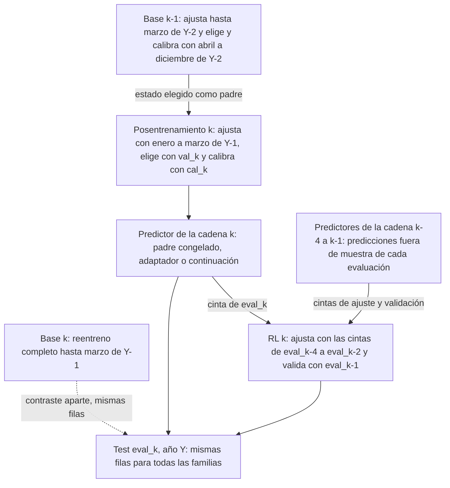

# Validación walk-forward v2 de la edición desde 2000

Revisión del 9 de octubre de 2026. Este documento fija el protocolo temporal con el que se entrenarán y compararán todas las familias sobre la [edición histórica con máscaras](../data/historical-temporal-views.md). Incluye el [protocolo conjunto v3](#protocolo-conjunto-v3-de-la-campaña-a-v2), decidido ese mismo día para la campaña A v2. Describe un diseño y sus comprobaciones técnicas. No contiene resultados predictivos, no se ha ejecutado ningún entrenamiento con él y el test de 2024 sigue cerrado. Corresponde a la etapa 4 de la [campaña sobre la edición desde 2000](training-campaign-2000.md) y a [#363](https://github.com/GonxKZ/mars-titan/issues/363).

## Por qué hace falta otra versión

Los protocolos históricos actuales (`historical-masked-us-walk-forward.json` y `historical-masked-cn-walk-forward.json`) copian las diez ventanas mensuales de la campaña estricta y solo adelantan el comienzo del ajuste a 2000. Su primera validación empieza en diciembre de 2022. Toda la historia nueva entra únicamente como entrenamiento y la selección depende de dos meses de validación. Esos archivos no se modifican y conservan exactamente sus ventanas, como comprueban las pruebas de paridad.

La versión 2 recorre la historia con ventanas de evaluación anuales. Cada ventana entrena con todo el pasado disponible desde 2000, valida en el tramo final de ese pasado y evalúa el año siguiente completo. Así cada año desde el primero con historia suficiente cuenta como periodo fuera de muestra y la selección usa seis meses de validación.

## Cortes de cada ventana

Para un año evaluado Y, los tramos son intervalos cerrados por la izquierda y abiertos por la derecha:

| Tramo | Intervalo | Función |
| --- | --- | --- |
| Ajuste | [2000-01-01, (Y−1)-04-01) | Pesos, normalizadores y cualquier transformación ajustable |
| Validación | [(Y−1)-04-01, (Y−1)-10-01) | Selección de configuración, de época y parada |
| Calibración | [(Y−1)-10-01, Y-01-01) | Intervalos y abstención, para los métodos que la necesiten |
| Evaluación | [Y-01-01, (Y+1)-01-01) | Comportamiento fuera de muestra de la regla ya seleccionada |

El paso entre ventanas es de doce meses y la última evalúa 2023. Las fechas desde 2024 se marcan `test_reserved` en todas las ventanas. Los seis meses de validación y los tres de calibración son los que ya proponía el [protocolo](protocol.md#particiones-ajuste-y-calibración). El precio es que el ajuste termina nueve meses antes de la evaluación. Volver a ajustar con validación y calibración incluidas duplicaría el coste y dejaría la parada sin un tramo independiente, así que no se hace.

Las configuraciones son `configs/evaluation/historical-masked-us-walk-forward-v2.json`, `historical-masked-cn-walk-forward-v2.json` y `historical-masked-joint-us-walk-forward-v2.json`. Tienen `schema_version=2`, `purge="label_interval"` y un bloque `selection` con la regla de parada. Si una ventana se usa para decidir el modelo definitivo, forma parte del desarrollo y no sustituye al test final.

## Primer año evaluado

El primer año no depende de la fecha nominal de inicio sino de la primera etiqueta madura. El objetivo residual necesita 126 pares de rendimientos observados dentro de las últimas 252 sesiones. Con los primeros precios el 3 de enero de 2000 en US y el 4 de enero de 2006 en CN, la primera etiqueta posible cae en la sesión 126, el 30 de junio de 2000 en US y el 14 de julio de 2006 en CN. Los activos que empiezan después tienen su propio calentamiento y simplemente aportan filas más tarde.

El protocolo exige al menos tres años de etiquetas maduras antes de la primera validación, como establece el [protocolo de investigación](protocol.md#particiones-ajuste-y-calibración). La primera validación que cumple esa condición en abril es la de 2004 para US y la de 2010 para CN. `minimum_train_months` traduce la regla a meses nominales desde 2000 (42 en US y 114 en CN y en el protocolo conjunto), y una prueba comprueba que un año antes ya no se cumpliría.

| Brazo | Años evaluados | Ventanas | Archivos |
| --- | --- | ---: | --- |
| US | 2005 a 2023 | 19 | `historical-masked-us-walk-forward-v2.json` |
| CN | 2011 a 2023 | 13 | `historical-masked-cn-walk-forward-v2.json` |
| US+CN | 2011 a 2023 | 13 | `historical-masked-joint-us-walk-forward-v2.json` y `historical-masked-cn-walk-forward-v2.json` |
| US+CN v3 (campaña A v2) | 2005 a 2023, CN solo cuenta desde 2011 | 19 | `historical-masked-us-walk-forward-v2.json` y `historical-masked-joint-cn-walk-forward-v3.json` |

## Mercados sin filas en una ventana

Las ventanas conjuntas empiezan cuando los dos mercados tienen etiquetas en los cuatro tramos con la historia mínima. El contrato v2 no admite un mercado vacío. La preparación rechaza antes de publicar cualquier ventana con un tramo sin filas en algún mercado y nombra la ventana, el mercado y el tramo. La alternativa de admitir CN vacío con una ponderación por mercado declarada se descarta por cinco motivos:

1. En 2005 el brazo conjunto tendría exactamente las filas del brazo US, y en 2006 y 2007 a CN le faltaría al menos el tramo de ajuste. Costaría casi lo mismo que el brazo US y no diría nada sobre la agrupación de mercados.
2. Entre 2008 y 2010 CN tendría todos los tramos, pero con menos de tres años de ajuste propio. La diferencia mezclaría el efecto de agrupar con el de una historia insuficiente.
3. Con un mercado vacío la media entre mercados no está definida. Renormalizar el peso cambia el estimando de una ventana a otra sin que lo decida el diseño.
4. Los consumidores existentes exigen filas en todos los tramos (`has_all_partitions` y recuentos positivos). Mantener esa invariante evita cambiar código de otras áreas.
5. No se pierde historia de ajuste. Las ventanas conjuntas siguen entrenando con todas las filas US desde 2000 y todas las filas CN desde 2006.

La ponderación entre mercados de las ventanas que sí se evalúan se declara en [métricas](metrics.md) y es la misma para todos los modelos.

La comparación declara además un análisis secundario por presencia de noticias y fundamentales, fijado el 9 de octubre de 2026 antes de cualquier resultado. Es descriptivo, no interviene en la selección ni en la parada de ningún brazo y no cambia la métrica principal. Su definición está en [métricas](metrics.md#estratos-por-presencia-de-modalidades).

El mismo 9 de octubre de 2026, también antes de cualquier resultado, se declaró como análisis secundario la ablación de modalidades en inferencia: el estado elegido de cada brazo vuelve a predecir la evaluación con noticias, fundamentales o ambos ausentes, sin reentrenar ni recalibrar. Está definida en [métricas](metrics.md#ablación-de-modalidades-en-inferencia) y no se ha ejecutado.

Los protocolos US y conjunto comparten cortes. Las ventanas conjuntas coinciden fecha a fecha con las ventanas US de 2011 a 2023, aunque sus identificadores empiezan en `fold-000`. Una comparación entre el brazo US y el conjunto sobre filas US se hace con esas trece ventanas, emparejadas por el intervalo de evaluación y no por el identificador.

Esta sección describe el protocolo conjunto v2, que conserva la campaña A original. La campaña A v2 lo sustituye por el [protocolo conjunto v3](#protocolo-conjunto-v3-de-la-campaña-a-v2), que admite China vacía en las ventanas donde no cuenta.

## Protocolo conjunto v3 de la campaña A v2

### Decisión

El 9 de octubre de 2026, antes de cualquier resultado, el autor decidió cambiar el diseño de la campaña A. Todas las familias entrenan un único modelo conjunto US+CN con un protocolo nuevo que empieza como US, con la primera validación en abril de 2004 y 19 ventanas hasta 2023. China entra en el ajuste en cuanto tiene filas, pero sus métricas solo cuentan en las ventanas que cumplen su propia historia mínima. Tres familias entrenan además modelos separados de US y de CN como controles, para contrastar en cada mercado el modelo conjunto con el separado. La [campaña](training-campaign-2000.md#campaña-a-v2-con-modelo-conjunto) recoge el resto del diseño. Es una decisión de diseño previa a cualquier resultado, no una conclusión.

### Cortes y filas de China

`configs/evaluation/historical-masked-joint-cn-walk-forward-v3.json` es el protocolo US v2 con `market="CN"`. La unión exige que los dos protocolos solo difieran en el mercado, así que US+CN usa `historical-masked-us-walk-forward-v2.json` para US y este archivo para CN. Las ventanas conjuntas coinciden fecha a fecha con las de US, con los mismos identificadores.

Las filas de China en las seis primeras ventanas salen de los objetivos `targets-v3` con la misma regla que las vistas (ajuste, validación, calibración y evaluación):

| Ventana | Validación desde | Filas CN | Cuenta para CN |
| --- | --- | --- | --- |
| `fold-000` | 2004-04 | 0 / 0 / 0 / 0 | No |
| `fold-001` | 2005-04 | 0 / 0 / 0 / 46.902 | No |
| `fold-002` | 2006-04 | 0 / 22.097 / 24.394 / 103.042 | No |
| `fold-003` | 2007-04 | 70.136 / 52.657 / 26.715 / 112.310 | No |
| `fold-004` | 2008-04 | 177.275 / 56.079 / 28.845 / 118.266 | No |
| `fold-005` | 2009-04 | 290.577 / 61.352 / 28.969 / 122.072 | No |
| `fold-006` a `fold-018` | 2010-04 a 2022-04 | Las mismas que `fold-000` a `fold-012` de CN v2 | Sí |

China aporta filas de ajuste desde `fold-003` y de validación desde `fold-002`. En las ventanas que no cuentan para China, esas filas entran en el ajuste y en la selección por validación del modelo conjunto, porque son pasado disponible. La selección mira el MAE de validación de todas las filas de la vista, como en cualquier otro ámbito.

### Elegibilidad por mercado

Una ventana conjunta cuenta para un mercado si sus cuatro tramos son idénticos a los de alguna ventana del protocolo propio de ese mercado (`splits.eligible_folds`). Para China el protocolo propio es CN v2, con 114 meses de historia mínima, así que cuentan `fold-006` a `fold-018` (2011 a 2023). US cuenta en las 19.

Las predicciones de China en las ventanas no elegibles se generan y se conservan, pero quedan fuera de la calibración común y de todas las métricas (`predicted_and_kept_excluded_from_calibration_and_metrics`). La comparación cuenta las filas excluidas en cada ventana, brazo y tramo (`excluded_rows`). Se descartó marcarlas y evaluarlas aparte, porque serían años con menos de tres años de etiquetas de China y mezclarían el efecto de agrupar con el de una historia insuficiente, el segundo motivo del apartado anterior.

La preparación admite tramos vacíos de un mercado solo en sus ventanas no elegibles y los declara en el informe (`empty_folds_allowed`). `has_all_partitions` exige filas en los cuatro tramos de cada mercado elegible en la ventana, y el informe de la unión guarda los mercados elegibles de cada ventana y la huella del protocolo que fija la elegibilidad. Así se responden los motivos anteriores: el contraste con los controles separados mide el efecto de agrupar, China no cuenta con historia insuficiente, la media entre mercados no se renormaliza porque las filas de China excluidas no entran en ninguna métrica, los consumidores siguen exigiendo filas donde se mide y no se pierde historia de ajuste.

La vista agregada US+CN mezcla años solo con US (2005 a 2010) y años con los dos mercados. Por eso el contraste principal del diseño se hace por mercado, con las vistas US y CN del ámbito conjunto, y la vista agregada es descriptiva.

### Comparación con los controles separados

La [comparación conjunta](../../configs/evaluation/historical-masked-2000-joint-comparison.json) tiene versión 5, con un bloque `joint_design`. Conserva los brazos, las métricas contrastadas, las familias y la cartera larga y corta de la versión 4 de la [comparación principal](../../configs/evaluation/historical-masked-2000-comparison.json), declarados el 9 de octubre antes de cualquier predicción, y la cartera aplica las mismas exclusiones por mercado y ventana que las métricas. El ámbito US+CN compara todos los brazos, también el [control en línea](../engineering/transformer-online-control.md) `transformer_compact_online` y sus familias `online_learning` y `memory_vs_online_learning`, que la versión 4 añadió el 10 de octubre. Los ámbitos US y CN comparan cada control separado (`transformer_compact`, `titans_mac_online` y `mars_titan_m1`) con el mismo brazo del modelo conjunto restringido a las filas de ese mercado, publicado como brazo prestado `<brazo>_joint`. La familia `joint_vs_separate` declara el delta del conjunto menos el separado, con el separado como base, y hereda el remuestreo por bloques de días y el máximo estudentizado de las demás familias.

Las ventanas se emparejan por intervalos idénticos: `fold-k` de US con `fold-k` del conjunto y `fold-k` de CN con `fold-(k+6)`. Las filas y los objetivos del brazo prestado deben coincidir exactamente con los del control, y la huella de la vista conjunta de cada ventana queda en el manifiesto de fuentes. Cada semilla se resume por separado y los contrastes usan la media sesión a sesión de las semillas. Ridge y XGBoost tienen una sola semilla y entran con su serie.

## Walk-forward por etapas de la campaña A v2

### Decisión y principio

El 9 de octubre de 2026, antes de cualquier resultado, el autor eligió para la campaña A v2 un walk-forward por etapas, la «Opción 1 + control» registrada en [#437](https://github.com/GonxKZ/mars-titan/issues/437). El principio es que ninguna etapa ajusta pesos con filas cuyos objetivos ya usó la etapa anterior para ajustar los suyos, y que el año evaluado no lo ve ninguna etapa antes de su test. Todo se hace con datos reales de la edición, sin filas sintéticas, remuestreadas ni aumentadas, y con las mismas filas y divisiones para todas las familias. La [campaña v2](../../configs/baselines/historical-masked-campaign-a-v2.json) lo declara en `walk_forward_stages` con un único valor admitido (`training/campaign_chain.py`) y exige el orden ventana a ventana. Es una decisión de diseño previa a cualquier resultado, no una conclusión.

### Roles de cada ventana

Para la ventana k, con evaluación en el año Y, los tramos son los de la sección anterior: `train_k` = [2000, abr Y-1), `val_k` de abril a septiembre de Y-1, `cal_k` de octubre a diciembre de Y-1 y `eval_k` el año Y, todos con purga por intervalo de etiqueta.

| Rol | Parte de | Ajusta con | Elige con | Calibra con | Predice |
| --- | --- | --- | --- | --- | --- |
| Base | Inicialización nueva | `train_k` | `val_k` | `cal_k` | `eval_k` |
| Posentrenamiento (k ≥ 1) | Estado elegido de la base en k-1 | Filas de `train_k` con decisión en [ene Y-1, abr Y-1) | `val_k`, con el padre elegible en la época 0 | `cal_k` | `eval_k` |
| Predictor de la cadena | Candidatos del posentrenamiento, o la base en la ventana 0 | Nada | `val_k` | `cal_k` | `eval_k` |
| RL anclada en k | Política nueva | Cintas de `eval_{k-4}` a `eval_{k-2}` | Cinta de `eval_{k-1}` | | Cinta de `eval_k` |
| Test | | | | | `eval_k`, igual para todas las familias |

El padre del posentrenamiento es el estado elegido de la base en la ventana k-1 para el mismo brazo y semilla, el ganador de la búsqueda o el finalista. Ese padre ajustó sus pesos hasta marzo de Y-2 y usó abril a diciembre de Y-2 para elegir época y calibrar. Esos nueve meses ya influyeron en el padre por selección y calibración, así que tampoco entran en el ajuste nuevo. Las filas nuevas son las del tramo `train` de la vista k con decisión entre el final de `cal_{k-1}` y el final de `train_k` (`campaign_chain.posttraining_rows`), unos tres meses. Su etiqueta madura antes del final de `train_k` por la purga de la vista, y toda etiqueta del padre madura antes de su primera decisión, así que la purga queda en los dos extremos. La ventana 0 no tiene padre ni posentrenamiento. El padre no es el predictor de la cadena de k-1, para que las adaptaciones no se acumulen de un año a otro y cada contraste parta del mismo tipo de estado.

### Predictor de la cadena

Los candidatos de la ventana k ≥ 1 son el padre congelado (la base k-1 trasladada a la ventana k), cada caso de la matriz de adaptadores y la continuación completa del padre con las filas nuevas. La regla `chain_validation_score_v1` elige el menor `score` de validación de la ventana k, con la misma definición y las mismas filas que la selección de la base. Un candidato solo sustituye al padre congelado con una mejora estricta (mejora mínima declarada 0) y los empates entre los demás se resuelven por el identificador del trabajo. En la ventana 0 el predictor de la cadena es el estado elegido de la base. Ese predictor es el que alimenta la RL.

El reentreno completo de la ventana k (la base k) no es candidato. La cadena mide cuánto aporta adaptar un estado con datos que no vio. Si el reentreno pudiera ganar, se mezclarían dos preguntas, adaptar o volver a entrenar desde cero, y la entrada de la RL cambiaría de naturaleza de una ventana a otra según quién ganase. La comparación base k frente a cadena k se informa aparte, como otro contraste emparejado sobre las mismas filas de `eval_k`, con las mismas métricas y las semillas resumidas igual que en el resto de la comparación. La [declaración de la comparación de A v2](../../configs/posttraining/historical-masked-adapter-comparison-a-v2.json) lo hace con la familia `versus_base_retrain`, y `posttraining/stage_comparison.py` rechaza la comparación de una campaña por etapas que no contraste la cadena y el reentreno. Las predicciones de la cadena de cada ventana y semilla son las del trabajo que eligió su `selection.json`, tras comprobar la huella de su recibo.

### RL con las tres evaluaciones anteriores

La política anclada en k ajusta con las cintas reales reconstruidas de las tres evaluaciones anteriores a su validación (`eval_{k-4}` a `eval_{k-2}`), valida con la de `eval_{k-1}` y evalúa con la de `eval_k`. La regla se declara como `fixed_prior_evaluations_v1` y la primera política es la de la quinta ventana de cada mercado. La aplica `window_tapes.policy_windows` al planificar las cintas, y `policy_plan.load_stage` exige a las políticas de una campaña por etapas esa regla con tres ventanas (`campaign_chain.policy_rule`) y el predictor de la cadena. El 10 de octubre, antes de cualquier resultado, se descartó como diseño principal la ventana en expansión con todas las evaluaciones anteriores. Exigir historia en todas las cintas sesga el universo de la política hacia las empresas antiguas: según el recuento de la etapa de políticas, deja 1.593 candidatos frente a 3.284 en EE. UU. y 533 frente a 718 en China. Además, KLPO admite como mucho 16 cintas. La expansión (`expanding_prior_evaluations_v1`) queda como sensibilidad declarada y desactivada, con su propia identidad en la etapa de políticas. Las dos reglas empiezan en la misma ventana. La etapa de políticas de A v2 se declara en el ámbito conjunto, con trabajos por mercado en las ventanas en las que cada mercado es elegible, así que la primera política de CN es la de la conjunta `fold-010` y ajusta con `fold-006` a `fold-008`. Cada trabajo lee la cadena de ese mismo ámbito, con la lista de `policy_plan.predictor_reads`. Como la etapa de adaptadores da cadena en el ámbito conjunto a los 22 predictores de las políticas ([#483](https://github.com/GonxKZ/mars-titan/pull/483)), no hace falta que una política lea la cadena de otro ámbito y no se añade la opción `chain_scope` que se propuso para ello. `check_staged` exige que cada trabajo dependa de la selección de la cadena de su ámbito en cada ventana que lee y rechaza la de otro ámbito, y el calendario exige que esa selección exista en el plan. `check_stage` y `run_stage` de las dos etapas aplican también `check_staged` a su propio plan (`check_design`). Cada cinta lleva las predicciones fuera de muestra del predictor de la cadena de su propia ventana, cuyo recibo declara la última etiqueta usada (`labels_used_until`) calculada con las etiquetas reales de sus vistas. Ningún predictor predice en una cinta filas con las que ajustó, eligió o calibró, porque esa etiqueta madura antes del inicio de su evaluación y toda decisión de la cinta es posterior.

### MARS-TITAN y el control en línea

MARS-TITAN pasa por las mismas etapas, filas y divisiones. Su diferencia está dentro del modelo: la memoria neuronal de Titans se actualiza en inferencia solo con entradas ya publicadas, el banco episódico solo admite errores cuya etiqueta ha madurado antes del instante de decisión y los refinamientos K = 1, 2 y 4 dan más vueltas sobre los mismos datos. La memoria llega a `eval_k` con el estado del final de su calentamiento declarado y nunca usa información posterior a cada decisión. Siguen declarados `mac_disabled`, `mac_frozen`, `mac_online`, `transformer_direct`, M0 a M3 y K = 1, 2 y 4.

El control `transformer_compact_online` parte del mismo estado elegido que `transformer_compact` en la ventana k. Durante `val_k`, `cal_k` y `eval_k` recibe las mismas etiquetas maduras que el banco de `mars_titan_m1`, en el instante en que maduran, y actualiza sus pesos con SGD según una regla declarada antes de ejecutar. Da un paso en cada instante de maduración con todas sus etiquetas, la cadencia de las escrituras del banco, y el tope `episodic_bank_writes` iguala la información: en cada tramo, las etiquetas usadas en pasos no superan las escrituras del banco en el mismo ámbito, ventana y semilla. La tasa se elige con el MAE de `val_k` entre 0, 1e-3, 1e-2, 1e-1 y 1 con la semilla 42, y 43 y 44 repiten la elegida. Se compara emparejado con `transformer_compact` congelado y con MARS-TITAN, para descartar que la mejora de MARS-TITAN venga solo de seguir aprendiendo. Su `labels_used_until` acota el estado fuera de línea. La causalidad de las actualizaciones dentro de `cal_k` y `eval_k` la comprueban las pruebas de su ejecutor, igual que las de MARS-TITAN.

### Cadena de etapas



### Contrato de los recibos y verificador de disjunción

Los recibos de la cadena viven bajo la salida de la etapa de posentrenamiento. `windows/<ámbito>/<ventana>/<brazo>__chain/seed-<s>/<mercado>.json` es un recibo walk-forward con el esquema exacto de [#390](https://github.com/GonxKZ/mars-titan/pull/390). Su `parent` identifica el trabajo elegido y la huella de su recibo confirmado. `selection.json`, en la misma carpeta, guarda la regla, los candidatos con su `score`, el elegido, el estado que conserva, las filas nuevas de ajuste con su huella y la huella de cada recibo de mercado. Se escribe el último y marca la confirmación. `campaign_chain.read_selection` exige la regla, la coherencia entre ventana, padre, candidatos y filas nuevas y que cada recibo de mercado conserve su huella, el trabajo elegido y la última etiqueta usada. La primera ventana publica la cadena con `selected.kind = "base"`.

`run_masked_campaign.py disjunction` (`training/chain_disjunction.py`) lee las vistas y, si se le dan, los recibos de la campaña base y de la cadena. No ajusta nada y demuestra con recuentos y huellas por identidad de fila (mercado, activo y fila de la muestra) que:

1. las filas nuevas del posentrenamiento de cada ventana no cortan las de ajuste, validación ni calibración de la vista del padre, y que toda etiqueta del padre madura antes de la primera decisión nueva,
2. cada recibo de la cadena declara una última etiqueta usada anterior a la primera decisión de su evaluación y no anterior a la maduración de la calibración de su ventana, la más tardía de las que fijan el estado,
3. las filas de test coinciden: una sola huella de evaluación por ventana en los recibos base, la misma huella por mercado en las ventanas de ámbitos distintos con los mismos tramos y el mismo número de filas en la cadena,
4. ninguna fila asignada a un tramo es de 2024, y cada una cae en su tramo con la etiqueta madura antes de su final.

Las filas fuera de todo tramo no entran en ninguna etapa. Que su objetivo sea nulo lo comprueba la verificación independiente de las vistas. El informe guarda por ventana las huellas de las filas nuevas y de la evaluación por mercado, los extremos de decisión y maduración, la huella del manifiesto de cada vista y los fallos. La orden termina con código 1 si encuentra alguno. Se ejecutará sobre las vistas de la edición v3.1 cuando estén preparadas y después sobre los recibos de cada ventana.

Con `walk_forward_stages` declarado, las etapas no se ejecutan sin ese informe (`--disjunction`). `chain_disjunction.require_report` exige que sea de la misma campaña, sin fallos, y que haya comprobado la huella del manifiesto de cada vista que la etapa va a usar. A la RL le exige además la huella de cada `selection.json` que va a leer, así que el informe debe ser posterior a las selecciones de su ventana. La comprobación va antes de crear la salida, y el resumen de cada ejecución o reanudación guarda la huella del informe que la autorizó. `rolling` calcula un informe nuevo antes de los adaptadores y antes de las políticas de cada ventana, lo guarda en `retention/disjunction/<ventana>-<fase>.json` y se detiene si registra fallos. Su coste con las vistas reales no está medido. La campaña base no lo exige: sus vistas tienen su propia verificación y ninguna etapa posterior usa sus resultados sin el informe sobre esas mismas vistas.

```bash
uv run --no-sync python scripts/run_masked_campaign.py disjunction \
  --campaign configs/baselines/historical-masked-campaign-a-v2.json \
  --views US+CN=<vistas v3.1>/US+CN --views US=<vistas v3.1>/US --views CN=<vistas v3.1>/CN \
  [--campaign-output <campaña>] [--posttraining <etapa de adaptadores>] \
  --workers 4 --output <informe de disjunción>
```

## Purga por el intervalo de cada etiqueta

Una fila pertenece a un tramo solo si su decisión está dentro del tramo y su etiqueta madura estrictamente antes del final, es decir, si el intervalo [`prediction_at`, `label_available_at`] cabe entero en [inicio, fin). El objetivo es el residual apertura-cierre de la sesión siguiente. Su entrada (`entry_at`) y su salida (`exit_at`) son la apertura y el cierre de esa sesión, posteriores a la decisión, y `label_available_at` es la última disponibilidad del activo y del factor. La tabla de etiquetas no guarda `entry_at` ni `exit_at`, pero ambos quedan dentro del intervalo usado, que es por tanto una cota conservadora de la purga.

La regla se aplica igual en ajuste, validación, calibración y evaluación. Una etiqueta que madura exactamente en la frontera se purga. La versión 2 elimina el margen fijo de una sesión. Para etiquetas de la sesión siguiente ese margen retiraba las mismas filas que la purga por intervalo, solo con otro motivo (`session_gap`), y una prueba lo comprueba en las diecinueve ventanas. La regla nueva no depende del horizonte y sigue siendo correcta si una etiqueta madura más tarde.

Las filas purgadas conservan el motivo `label_crosses_boundary`. Además, cada activo, cada vista y cada informe registran `purged_by_boundary` con el número de filas que cruzan el final de cada tramo, y la unión conjunta lo desglosa por mercado. Las entradas posteriores a la decisión, las incompletas y los motivos de exclusión del padre se conservan como antes. La etiqueta anual recuperada del corte de 2022 a 2023 nunca se admite en la versión 2, porque siempre queda al final de un tramo.

## Regla común de selección y parada

El bloque `selection` es idéntico en los tres archivos y se fija antes de preparar las vistas, igual que las semillas y la métrica primaria:

| Campo | Valor | Significado |
| --- | ---: | --- |
| `metric` | `session_mae` | MAE residual por sesión en el tramo de validación |
| `stopping` | `fixed_budget` | Se recorren todas las épocas y se conserva el mejor estado |
| `max_epochs` | 30 | Número de evaluaciones completas de cada ajuste |
| `patience` | 5 | Diagnóstico `plateau_epoch`, la época en la que habría parado una meseta |
| `min_delta` | 0,00001 | Mejora estricta necesaria para sustituir el mejor estado |

Son los valores de la [búsqueda histórica de referencias](../../configs/baselines/historical-masked-reference-search-us.json) (versión 4), que conserva las épocas, la paciencia y la mejora mínima de la [búsqueda temporal estricta](../engineering/strict-temporal-search.md) y sustituye su meseta por el presupuesto fijo. Con la misma población, el mismo lote y las mismas épocas, todos los brazos aplican el mismo número de actualizaciones, como exige la comparación emparejada. El sobreajuste se controla con la selección del mejor estado de validación, no cortando el presupuesto. Esta selección reduce el riesgo de quedarse con un estado sobreajustado, pero no lo elimina.

El esquema admite también `stopping="validation_plateau"` con `minimum_epochs`, que es el criterio de [#190](https://github.com/GonxKZ/mars-titan/issues/190). No se usa aquí porque haría que cada brazo se detuviera con un número distinto de actualizaciones, y eso sería otra comparación. Cambiar la regla exige publicar otro archivo con otra identidad antes de entrenar. La [parada temprana opcional](#parada-temprana-opcional) describe cómo lo hace una campaña, con una parada individual o conjunta.

La semántica es la del [selector existente](../engineering/masked-reference-runners.md#presupuesto-fijo-y-selección). Solo cuentan las evaluaciones completas, un empate no mejora, una mejora menor que `min_delta` tampoco, y una continuación incluye el padre como época 0 elegible. El estado del selector es un registro serializable, así que reanudar a mitad de la paciencia conserva la decisión. Las pruebas recorren secuencias de métricas fijadas con los dos modos, sin modelo ni pasos de optimizador.

La búsqueda temporal compara la regla del plan con la del protocolo, incluidos el modo y el mínimo, y rechaza cualquier diferencia. Los planes de versiones 2 y 3 equivalen a una meseta, así que solo sirven para los protocolos v1. Los ejecutores de Titans-MAC, MARS-TITAN y CM-v1 deben leer la regla con `stopping_rule(protocol)` cuando se conecten a estas vistas. Una parada independiente que cambie el número de actualizaciones se registra como otra comparación.

## Parada temprana opcional

El protocolo conserva el presupuesto fijo. Una campaña puede declarar además una sección `early_stop` antes de ver resultados. Esa sección solo sustituye el modo, la paciencia, la mejora mínima y las épocas mínima y máxima de los entrenadores neuronales, nunca la métrica. La regla efectiva viaja en cada caso planificado como `stopping_rule` y cambia la identidad de la receta y del trabajo, así que una salida de un modo no se reutiliza en otro. Sin la sección, la campaña, sus trabajos y sus identidades son los de antes. XGBoost conserva su meseta por rondas y Ridge no tiene épocas.

Hay dos modos, implementados en `training/selection.py` y en los entrenadores de las referencias, de Titans-MAC, del lector de MARS-TITAN y CM-v1 y de la GRU candidata:

- `validation_plateau` detiene cada ajuste en su primera meseta. Es la opción más barata, pero dos brazos emparejados pueden terminar con un número distinto de actualizaciones, y entonces la diferencia entre ellos mezcla el efecto del brazo con el del presupuesto.
- `joint_plateau` es la parada conjunta de un grupo de brazos emparejados. Ningún ajuste corta solo. Cada uno se detiene en su primera meseta, o al agotar el máximo si no la alcanza, en un estado confirmado en disco (`awaiting_joint_stop`) con su época de parada individual. Cuando todo el grupo ha llegado a ese punto, la época común es la mayor de esas paradas y cada ajuste continúa desde su checkpoint hasta exactamente esa época. Así todos aplican el mismo número de actualizaciones y de validaciones.

En los dos modos la selección del mejor estado es la misma que con presupuesto fijo. Solo cuentan las evaluaciones completas, la paciencia y la meseta forman parte del registro de selección que se guarda con cada checkpoint, una reanudación conserva la decisión y una continuación sigue incluyendo el padre como época 0 elegible. El mejor estado es el mejor entre las épocas recorridas, también las posteriores a la meseta de un ajuste conjunto. La época común queda fijada en el informe de la ejecución y una reanudación con otra época se rechaza antes de escribir nada.

### Grupos y época común

Un grupo se declara con los nombres de sus brazos y la época común `maximum_of_first_plateaus`. Dentro de un grupo, cada ajuste se empareja con los del mismo ámbito, ventana y semilla, con el caso de búsqueda en la misma posición o, en las semillas finalistas, con el caso elegido de cada brazo. Los brazos de un grupo comparten semilla de búsqueda y número de casos, ningún brazo parte de otro del mismo grupo y un brazo solo pertenece a un grupo. Además, cada contraste emparejado de la comparación (delta o factorial) entre brazos conectados sin relación de padre debe quedar dentro de un mismo grupo, para que ninguna diferencia dependa de presupuestos distintos.

En el plan, cada ajuste agrupado se divide en dos trabajos. La meseta (`plateau-...`) recorre el ajuste hasta su parada individual y escribe un recibo con esa época y una copia del informe, sin predicciones. La continuación conserva el identificador del ajuste, depende de las mesetas de todo su grupo, reanuda en la carpeta de la meseta y registra en su identidad la época común y las huellas de los recibos del grupo. Los trabajos quedan en un orden compatible con sus dependencias y la meseta no cuenta como un ajuste más.

Se eligió la mayor de las primeras mesetas porque ningún brazo se corta antes de su propio criterio y porque se calcula con trabajos independientes, que es como la campaña usa la GPU, de uno en uno. Las alternativas eran peores para esta comparación:

- La menor de las mesetas cortaría a los brazos que convergen más despacio, que pueden ser precisamente los de memoria, y sesgaría el contraste contra ellos.
- Una paciencia simultánea, en la que el grupo para cuando todos sus miembros llevan a la vez `patience` épocas sin mejorar, obligaría a ejecutar todos los miembros época a época en paralelo o con pausas en cada época. Además, una mejora tardía de un solo miembro alargaría todo el grupo sin límite claro.
- Una meseta de la media del grupo haría depender la parada de un brazo del error de los demás.

El coste de la elección es que los miembros que paran antes recorren épocas de más, y que el ajuste más lento del grupo fija el coste de todos.

### Valores propuestos y coste estimado

Los valores se toman de la regla ya declarada en el protocolo, no de los resultados: paciencia 5, mejora mínima 0,00001 y un máximo de 30 épocas. Se añade un mínimo de 5 épocas antes de contar la paciencia, que protege de una meseta muy temprana y en los historiales apenas cambia las paradas (17,34 frente a 17,35 épocas de media). La [simulación sobre historiales registrados](../../reports/engineering/early-stopping-history-20261009.json), hecha con [`scripts/simulate_early_stopping.py`](../../scripts/simulate_early_stopping.py), aplica la misma selección a los 160 ajustes desde cero de las referencias neuronales de la edición ampliada anterior (`data/interim/real-expanded-references-20261006`, 40 grupos con la misma ventana, ámbito, etapa, semilla y caso). Sus historiales terminan donde paró su regla original, así que un ajuste que necesitaría épocas posteriores queda censurado y no se le inventa un error. La pérdida relativa compara el MAE de validación del estado elegido con el mejor de las 30 primeras épocas.

| Paciencia | Épocas, individual | Épocas, conjunta | Pérdida media, individual | Pérdida media, conjunta | Pérdida máxima, conjunta | Censurados |
| ---: | ---: | ---: | ---: | ---: | ---: | ---: |
| 3 | 12,1 | 14,9 | 0,99 % | 0,56 % | 4,4 % | 2 |
| 5 | 17,4 | 22,1 | 0,42 % | 0,10 % | 1,5 % | 26 |
| 8 | 23,2 | 27,6 | 0,12 % | 0,02 % | 0,8 % | 79 |
| 10 | 25,7 | 29,0 | 0,03 % | 0 % | 0 % | 95 |

Con paciencia 5, la parada individual recorre de media 17,4 de las 30 épocas (mediana 17, percentil 90 de 24), un 58 % del presupuesto fijo, y la conjunta 22,1 (mediana 22, percentil 90 de 27), un 74 %. Como cada época incluye una pasada de ajuste y otra de validación, el coste de cómputo baja en la misma proporción: en torno a un 42 % con la parada individual y un 26 % con la conjunta, para cualquier número de filas por serie. La conjunta elige el mismo estado que las 30 épocas en 101 de los 134 ajustes no censurados y la individual en 75 de 160. La continuación conjunta añade una carga y una escritura de checkpoint por ajuste y conserva el estado de recuperación de la meseta hasta que termina su grupo.

Estas cifras son una estimación con limitaciones claras. Proceden de otra edición, de otras referencias, de una regla original con otra paciencia y de ajustes con TF32 activado en cuDNN, y no incluyen Titans-MAC, MARS-TITAN, CM-v1 ni la GRU candidata. El 16 % de los ajustes queda censurado con paciencia 5. La duración real de la campaña sigue sin medir. La parada temprana tampoco garantiza que no haya sobreajuste: solo limita las épocas que se recorren después de la última mejora de validación.

### Configuración preparada

[`historical-masked-campaign-a-joint-stop.json`](../../configs/baselines/historical-masked-campaign-a-joint-stop.json) es la campaña A con la parada conjunta, declarada antes de cualquier resultado y sin sustituir a la configuración de A. Solo cambian su nombre y la sección `early_stop`. Tiene tres grupos. El de codificadores y núcleos reúne la GRU, el Transformer compacto, la GRU candidata y los cuatro controles de Titans-MAC, porque la versión 4 de la comparación contrasta el Transformer con `transformer_direct`, la GRU con la GRU candidata y esta con `mac_online`. El de lectores episódicos reúne los seis modelos de MARS-TITAN y los cuatro modelos factoriales de CM-v1, porque M1 se contrasta con CM-v1 B. La campaña A v2 conjunta reutiliza estos grupos y todavía no declara `mars_titan_m1_k4_first_read`, así que el archivo no lo nombra. Quien declare ese modelo con la parada conjunta debe añadirlo a este grupo, porque A10 lo contrasta con K = 4, y el plan se detiene si falta. Los seis modelos B6 no tienen épocas y no pertenecen a ningún grupo. El tercero reúne los dos núcleos de CM-v1. Los modelos de MARS-TITAN no se agrupan con su padre Titans-MAC ni los de CM-v1 con sus núcleos, porque parten de ellos. Las demás referencias neuronales usan la meseta individual con los mismos valores. Con las secciones de A, el plan tiene los mismos 2.385 ajustes y 1.080 mesetas, porque la GRU candidata todavía no tiene entrenador en A. Con la declaración ampliada y el modelo de la primera lectura en el grupo de los lectores tendría 5.985 ajustes y 3.600 mesetas. La elección entre esta configuración y el presupuesto fijo sigue pendiente en [#363](https://github.com/GonxKZ/mars-titan/issues/363).

### Búsqueda tabular

Ridge prueba tres alfas y XGBoost doce configuraciones, frente a dos casos por brazo en las familias neuronales. Se mantiene esa asimetría y se considera conservadora: una búsqueda más amplia favorece a las referencias tabulares, así que solo puede hacer más difícil, no más fácil, que un brazo con memoria las supere.

## Estado y calentamiento por ventana

Cada ventana de la campaña base parte de una inicialización nueva con su semilla. No hereda pesos, optimizador, normalizadores ni calibrador de otra ventana. En la campaña A v2, el posentrenamiento de la ventana k parte del estado elegido de la base en k-1 y solo ajusta con filas que ese estado no usó, como se describe en el [walk-forward por etapas](#walk-forward-por-etapas-de-la-campaña-a-v2). Los pesos rápidos y el momentum de Titans, el banco episódico, la cola de etiquetas pendientes y el cursor se reinician al empezar cada ventana y al empezar cada pasada de validación, calibración o evaluación.

El calentamiento de los brazos con memoria usa solo las sesiones anteriores al comienzo del tramo que se va a medir y solo etiquetas con `label_available_at` anterior a ese comienzo. Su longitud es la misma para todos los brazos con memoria: 12 meses de entradas, sin etiquetas, limitados al origen del ajuste. Todos los ejecutores construyen sus fases con `training/walk_forward_phases.window_phases`. El [punto de entrada de Titans-MAC](../engineering/titans-chronological-trainer.md#ventana-walk-forward) y los núcleos de CM-v1 leen los meses de la receta de Titans-MAC, MARS-TITAN y los brazos de CM-v1 exigen las fases que registró su padre, y la [GRU candidata](../engineering/candidate-chronological-trainer.md#recorrido-y-orden-de-cada-evento) los declara en su receta con el mismo valor. En la candidata el calentamiento no cambia el estado, porque la GRU no lo conserva entre instantes y su banco solo admite etiquetas maduras, pero iguala la ventana de información observada. Una prueba recorre todas las ventanas de los protocolos de la comparación y comprueba que ninguna fase observa algo anterior al origen ni posterior al final de su tramo. La separación entre el checkpoint seleccionado y los de recuperación, con rotación acotada, sigue la [política de checkpoints](../engineering/checkpoint-recovery.md) y se coordina con [#67](https://github.com/GonxKZ/mars-titan/issues/67).

## Ventanas y filas nominales

La tabla da las fechas de cada ventana, las sesiones de validación, calibración y evaluación por mercado (calendarios XNYS y XSHG de `exchange_calendars`) y las filas nominales de ajuste en millones. Las filas nominales reparten por sesiones las ventanas de 64 precios de cada año del [censo de ventanas](../../reports/data/historical-price-windows-20261007.json). Son una cota superior, no objetivos válidos. Faltan los descuentos por calentamiento, sesión siguiente ausente y purga.

| Año evaluado | Fin del ajuste | Calibración | Sesiones US | Sesiones CN | Ajuste US | Ajuste CN | Ajuste US+CN |
| ---: | --- | --- | --- | --- | ---: | ---: | ---: |
| 2005 | 2004-04-01 | 2004-10-01 | 126 / 64 / 252 | No evaluado | 1,13 | | |
| 2006 | 2005-04-01 | 2005-10-01 | 128 / 63 / 251 | No evaluado | 1,46 | | |
| 2007 | 2006-04-01 | 2006-10-01 | 126 / 63 / 251 | No evaluado | 1,83 | | |
| 2008 | 2007-04-01 | 2007-10-01 | 126 / 64 / 253 | No evaluado | 2,23 | | |
| 2009 | 2008-04-01 | 2008-10-01 | 128 / 64 / 252 | No evaluado | 2,66 | | |
| 2010 | 2009-04-01 | 2009-10-01 | 127 / 64 / 252 | No evaluado | 3,12 | | |
| 2011 | 2010-04-01 | 2010-10-01 | 127 / 64 / 252 | 123 / 61 / 244 | 3,61 | 0,44 | 4,06 |
| 2012 | 2011-04-01 | 2011-10-01 | 127 / 63 / 250 | 126 / 60 / 243 | 4,14 | 0,57 | 4,71 |
| 2013 | 2012-04-01 | 2012-10-01 | 126 / 62 / 252 | 124 / 61 / 238 | 4,69 | 0,71 | 5,40 |
| 2014 | 2013-04-01 | 2013-10-01 | 128 / 64 / 252 | 121 / 61 / 245 | 5,26 | 0,86 | 6,12 |
| 2015 | 2014-04-01 | 2014-10-01 | 127 / 64 / 252 | 126 / 61 / 244 | 5,87 | 1,01 | 6,88 |
| 2016 | 2015-04-01 | 2015-10-01 | 127 / 64 / 252 | 126 / 61 / 244 | 6,54 | 1,16 | 7,70 |
| 2017 | 2016-04-01 | 2016-10-01 | 128 / 63 / 251 | 125 / 60 / 244 | 7,25 | 1,32 | 8,57 |
| 2018 | 2017-04-01 | 2017-10-01 | 126 / 63 / 251 | 125 / 60 / 243 | 8,01 | 1,48 | 9,50 |
| 2019 | 2018-04-01 | 2018-10-01 | 127 / 63 / 252 | 124 / 60 / 244 | 8,81 | 1,66 | 10,47 |
| 2020 | 2019-04-01 | 2019-10-01 | 127 / 64 / 253 | 125 / 61 / 243 | 9,67 | 1,82 | 11,48 |
| 2021 | 2020-04-01 | 2020-10-01 | 127 / 64 / 252 | 125 / 60 / 243 | 10,60 | 1,95 | 12,54 |
| 2022 | 2021-04-01 | 2021-10-01 | 127 / 64 / 251 | 124 / 61 / 242 | 11,58 | 2,13 | 13,71 |
| 2023 | 2022-04-01 | 2022-10-01 | 126 / 63 / 250 | 124 / 60 / 242 | 12,60 | 2,33 | 14,93 |
| Suma | | | | | 111,1 | 17,4 | 116,1 |

La validación empieza en la fecha de fin del ajuste y la evaluación el 1 de enero del año evaluado. Las filas nominales de validación por ventana están entre 0,16 y 0,52 millones en US, así que evaluar la validación en cada época añade alrededor de un 5 % de pasadas hacia delante que la cuenta siguiente no incluye.

## Coste y alternativas de presupuesto

La auditoría de preparación supone entre 15 y 22 minutos por época de una referencia GRU sobre unos 15,5 millones de filas. Es una hipótesis basada en caudales de ediciones anteriores, no una medida sobre esta edición. Equivale a entre 58 y 85 microsegundos por fila y época. Con presupuesto fijo, el coste de entrenar una familia con una configuración y una semilla es aproximadamente la suma, para cada ventana, de filas de ajuste por épocas por ese tiempo. Las cifras usan las filas nominales de la tabla y por eso sobrestiman algo.

| Alternativa | US | CN | US+CN |
| --- | ---: | ---: | ---: |
| A. Reentrenar todas las ventanas desde cero, 30 épocas | 53,7 a 78,8 h | 8,4 a 12,4 h | 56,2 a 82,4 h |
| B. Reentrenar desde cero cada tres años (US 7 ventanas, CN y US+CN 5), 30 épocas | 20,2 a 29,6 h | 3,3 a 4,8 h | 21,9 a 32,0 h |
| B. Reentrenar desde cero cada dos años (US 10 ventanas, CN y US+CN 7), 30 épocas | 28,6 a 41,9 h | 4,6 a 6,7 h | 30,4 a 44,6 h |
| C. Primera ventana completa con 30 épocas y continuación con 5 millones de filas por ventana | 2,0 a 2,9 h | 1,2 a 1,7 h | 2,9 a 4,3 h |
| D. Cada ventana desde cero con un presupuesto fijo de 20 millones de filas | 6,1 a 9,0 h | 4,2 a 6,2 h | 4,2 a 6,2 h |

Las cifras de A son coherentes con las 85 horas que estimó la auditoría para unas 19 ventanas y unos 130 millones de filas acumuladas. Con una meseta de mínimo 3 y paciencia 5, una ejecución plana se detendría en la época 8 y A bajaría como mínimo a unas 14 a 21 horas en US, a cambio de perder la igualdad de actualizaciones. Para toda la campaña hay que multiplicar por brazos y semillas. Con 20 brazos neuronales y tres semillas, una cifra solo ilustrativa, A supondría entre 3.200 y 4.700 horas en US, B cada tres años entre 1.200 y 1.800, C entre 120 y 175 y D entre 370 y 540. El caudal de Titans-MAC, MARS-TITAN y CM-v1 sobre esta edición no se ha medido y puede ser menor que el de la GRU.

El plan histórico de referencias ejecuta 50 trabajos por ventana. Con 19 ventanas serían 950 y con 13 serían 650, por encima del límite predeterminado de 512 que aplica `temporal_search`. B cada tres años los deja en 350 y 250. Un plan de versión 4 puede declarar otro límite con `max_runs`, entre 1 y 4.096, que queda en la huella del plan.

Cada alternativa responde a una pregunta algo distinta:

- **A** es la referencia del diseño. Cada ventana es un ajuste independiente que solo ve su pasado.
- **B** conserva esa semántica en un subconjunto fijado ahora, sin mirar resultados. Se declara con un protocolo v2 cuyo `step_months` es 36 o 24. Con paso 36, las ventanas conjuntas (2011, 2014, 2017, 2020 y 2023) son un subconjunto exacto de las ventanas US (2005, 2008, 2011, 2014, 2017, 2020 y 2023). La [variante B de la campaña](training-campaign-2000.md#variantes-de-presupuesto) reentrena esas mismas ventanas, pero evalúa también los años intermedios con el estado de la última ventana reentrenada, sin ajustarlo.
- **C** parte en cada ventana del estado seleccionado en la anterior, que solo ha visto datos previos a su propia validación. No hay fuga, pero el resultado de una ventana depende del camino anterior y las ventanas dejan de ser ajustes independientes. Las memorias se siguen reiniciando por ventana. El padre debe ser elegible como época 0 y el presupuesto de continuación es igual para todos los brazos. Es otra comparación y debe presentarse como tal.
- **D** mantiene ajustes independientes con el mismo número de actualizaciones en todas las ventanas, muestreando de toda la historia disponible. En la última ventana US equivale a 1,6 pasadas y en las primeras de CN a muchas más, así que su valor debe fijarse por comparación.

La orientación inicial era B con paso de 36 meses, que conserva la semántica del diseño con un tercio del coste de A y cabe en el límite de trabajos. El 9 de octubre de 2026 se eligió A con todas las familias, registrada en [#363](https://github.com/GonxKZ/mars-titan/issues/363), sin esperar al caudal medido: se prefirió que cada ventana entrene con todo su pasado disponible. Las cifras de coste de esta sección siguen siendo hipótesis. La duración real se medirá con los primeros trabajos y se registrará en la misma tarea, sin cambiar a B ni recortar filas en silencio.

## Uso

La preparación necesita la supervisión histórica verificada. La edición v3 y sus objetivos residuales se verificaron el 9 de octubre ([recibo](../../reports/data/historical-edition-v3-targets-20261009.json)) y las [vistas de la campaña A](#vistas-de-la-campaña-a) se prepararon y verificaron ese mismo día con `run_masked_campaign.py prepare`, descrito en el [plan de la campaña](training-campaign-2000.md#ejecución-y-recuperación). Para unas vistas conjuntas sueltas:

```bash
uv run --no-sync python -m mars_titan.training.joint_temporal_corpus \
  --parent <supervisión histórica> --output <vistas conjuntas v2> \
  --us-protocol configs/evaluation/historical-masked-joint-us-walk-forward-v2.json \
  --cn-protocol configs/evaluation/historical-masked-cn-walk-forward-v2.json \
  --input-policy historical_masked_2000_v1 --recover-annual-boundaries

uv run --no-sync python -m mars_titan.training.temporal_search \
  --config <plan de referencias de versión 4> --views <vistas conjuntas v2> --check
```

Las vistas de la campaña A v2 no se han generado. El 9 de octubre se aprobó regenerar la edición como v3.1, que recupera unos 1,58 millones de ventanas de precios rechazadas por redondeo OHLC (un 10 % más en US y un 4 % más en CN) y admite con máscara las sesiones sin datos en todo el mercado, como el 29 y el 30 de abril de 2019 en CN. Por eso los tres ámbitos (US+CN desde 2004 y los controles US y CN) se prepararán sobre la v3.1 y sus objetivos `targets-v3.1`, y no sobre la v3. Las vistas v3 de US y CN pasan la comprobación de la campaña A v2, pero la v3.1 las sustituye. Las órdenes reciben la edición como parámetro y no se ejecutarán hasta que la v3.1 esté verificada:

```bash
uv run --no-sync python scripts/run_masked_campaign.py prepare \
  --campaign configs/baselines/historical-masked-campaign-a-v2.json \
  --parent <edición v3.1>/targets-v3.1/manifest.json --output <vistas A v2>
uv run --no-sync python scripts/run_masked_campaign.py views \
  --campaign configs/baselines/historical-masked-campaign-a-v2.json \
  --views US+CN=<vistas A v2>/US+CN --views US=<vistas A v2>/US --views CN=<vistas A v2>/CN
uv run --no-sync python scripts/run_masked_campaign.py budget \
  --campaign configs/baselines/historical-masked-campaign-a-v2.json \
  --views US+CN=<vistas A v2>/US+CN --views US=<vistas A v2>/US --views CN=<vistas A v2>/CN \
  --write-counts <recuentos v3.1> --rate 16000 --epochs 10
```

Con las proporciones de la v3, las vistas ocuparían unos 17 GB (unos 9 GB las conjuntas, porque cada ventana guarda una fila por muestra de todos los activos) y tardarían unas 2,5 horas preparadas una tras otra, o algo menos de hora y media con los tres ámbitos en paralelo. Un verificador local independiente, adaptado del de la campaña A y parametrizado por la edición, recalcula las fronteras, comprueba fila a fila la purga y los objetivos de los tres ámbitos, recalcula la elegibilidad de China frente a la declarada y compara cada ventana conjunta con su gemela por mercado (US en las 19 y CN en las elegibles). Sobre vistas del corpus técnico termina sin fallos y detecta un objetivo alterado y una fila elegible perdida.

Los recuentos de filas de esta sección y de la [campaña](training-campaign-2000.md#campaña-a-v2-con-modelo-conjunto) salen de `targets-v3` y cambiarán con la v3.1. `budget --targets <objetivos v3.1>/labels --write-counts` los recalcula antes de preparar las vistas, y `budget --views` después.

Las pruebas de `tests/training/test_campaign_a_joint.py` comprueban la elegibilidad por intervalos idénticos, la unión con China vacía solo donde no cuenta y el rechazo en el resto, la exclusión de las filas no elegibles en calibración y evaluación con sus recuentos, el emparejamiento de los brazos prestados con su ventana y su vista y el rechazo de declaraciones ambiguas del diseño conjunto.

Nada de esto ejecuta modelos, pasos de optimizador ni evaluaciones científicas, ni genera objetivos reales. Los recuentos reales por ventana y mercado están en el [recibo de las vistas de la campaña A](../../reports/data/campaign-a-views-20261009.json).
