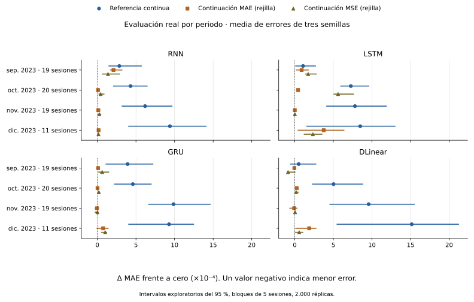
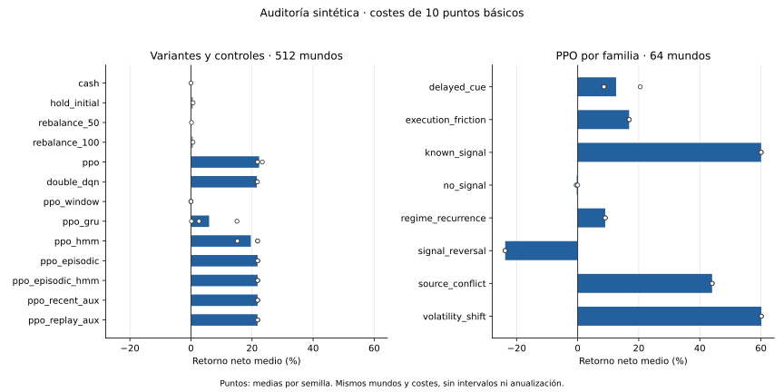

# Comparación de las campañas terminadas el 5 de octubre

La evaluación real no acredita una ventaja estable frente a predecir un retorno residual cero. La continuación MSE de DLinear obtiene la menor media descriptiva, 0,01470991 frente a 0,01471181 de cero, pero mejora en septiembre y empeora en los otros tres periodos. Muchas variantes RL conservan su política inicial. La mejora aparente de algunas frente al padre continuo procede de discretizar la predicción.

En la auditoría financiera sintética, PPO supera las reglas fijas en el promedio de los mundos, pero pierde en los escenarios de inversión de señal. Estas dos evaluaciones responden a preguntas distintas. Ninguna acredita rentabilidad histórica real ni superioridad del futuro candidato MARS-TITAN, que continúa sin implementar ni entrenar. El test final de 2024 permanece cerrado.

## Fuentes y población

Se conciliaron 160 casos de referencia, 68 tabulares, 528 ajustes y sus 756 evaluaciones congeladas. Los 160 primeros comprenden 64 referencias neuronales y 96 continuaciones supervisadas de cinco épocas. Se verificaron 1.512 archivos de predicciones de calibración y evaluación, con 947.946.963 bytes. Las identidades, métricas, etiquetas y claves de población coinciden. Las columnas de padre coinciden exactamente con sus predicciones archivadas.

La comparación incluye 688 estados seleccionados o continuados. Los otros 68 son candidatos de búsqueda no elegidos. El ganador de la búsqueda con semilla 42 sí se incluye, junto con los finalistas 43 y 44. Las [tablas por caso, método, ventana y contraste](campaign-comparison-20261005/evidence.json) conservan esta distinción. Los 216 ajustes de cobertura macro incompleta permanecen en la [revisión histórica](historical-validation-20261001.md).

La cohorte corresponde al brazo estadounidense con cuatro modalidades y 140 indicadores admitidos. Esta revisión comprueba su identidad y la población de las predicciones. No repite la verificación editorial de noticias ni convierte exclusiones anteriores en datos válidos. Todas las ventanas entrenan desde el 1 de noviembre de 2022, con historia creciente. No contienen varios años completos de entrenamiento.

| Ventana | Fin exclusivo de entrenamiento | Filas de entrenamiento | Validación | Calibración | Evaluación | Filas evaluadas | Sesiones evaluadas |
| --- | --- | ---: | --- | --- | --- | ---: | ---: |
| 000 | 1 jun. 2023 | 121.190 | jun.–jul. | ago. | sep. | 19.716 | 19 |
| 001 | 1 jul. 2023 | 141.272 | jul.–ago. | sep. | oct. | 20.839 | 20 |
| 002 | 1 ago. 2023 | 161.673 | ago.–sep. | oct. | nov. | 20.454 | 19 |
| 003 | 1 sep. 2023 | 187.246 | sep.–oct. | nov. | dic. | 11.653 | 11 |

La evaluación reúne 72.662 filas y 69 sesiones distintas. Las cuatro ventanas de evaluación no se solapan, pero comparten historia de entrenamiento. Calibración y validación de ventanas posteriores también pueden contener fechas evaluadas en ventanas anteriores. Por eso no se mezclan particiones ni se consideran los folds réplicas independientes. Los meses de la tabla son límites del protocolo, no promesas de disponer de todas sus sesiones. Diciembre tiene once sesiones admitidas y termina el día 22.

## Cálculo y comparaciones

El MAE primario promedia primero los activos de cada sesión y después las sesiones. Para cada método y ventana se promedian los errores de las semillas, sin promediar sus predicciones para crear un ensemble. La media descriptiva final da el mismo peso a cada ventana. El MAE por fila, el MSE y las cifras de cada semilla se conservan por separado en los CSV.

Las referencias neuronales repiten el entrenamiento seleccionado con tres semillas. Las 96 continuaciones originales parten del padre de su propia semilla. Los 528 ajustes posteriores utilizan el padre seleccionado con semilla 42 de cada familia y ventana. Sus semillas 42, 43 y 44 corresponden al ajuste. Por tanto, su columna `parent` es la referencia válida para medir el efecto de continuar. Restarles la media de las tres referencias entrenadas por separado daría otro contraste.

Las salidas primarias de esos 528 ajustes son medianas de una rejilla de 21 acciones. Esto también afecta a las continuaciones `neural_mae` y `neural_mse`. Se conservan cuatro diferencias: frente a cero, frente al padre continuo, frente a la política inicial discretizada y frente al centro continuo ajustado. La rejilla debe estar vinculada al manifiesto y al número de muestras de entrenamiento. Las predicciones de todos los casos con época seleccionada cero coinciden exactamente con la política inicial reconstruida.

Para la incertidumbre se remuestrean bloques móviles de sesiones completas, compartiendo los mismos índices entre métodos. Se usan 2.000 réplicas, semilla 42, percentiles 2,5 y 97,5 y longitud principal de cinco sesiones. Las longitudes uno, diez y veinte sirven como sensibilidad. Cuando la longitud alcanza el número de sesiones, el intervalo queda indefinido. No se fabrica un intervalo puntual ni se combina la incertidumbre de los folds.

El antecedente de este tipo de remuestreo es el trabajo de [Künsch (1989), The Jackknife and the Bootstrap for General Stationary Observations](https://people.math.ethz.ch/~hkuensch/papers/). Aquí no se ha demostrado estacionariedad ni cobertura nominal con ventanas de once a veinte sesiones. Los intervalos son exploratorios, calculados después de cerrar la campaña, sin corrección por comparar numerosos métodos ni por la selección anterior. No son una prueba confirmatoria de superioridad.

El IC de rangos es Spearman por sesión, con rangos medios para empates, siguiendo la [definición de `rankdata` de SciPy](https://docs.scipy.org/doc/scipy/reference/generated/scipy.stats.rankdata.html). Las sesiones con predicción constante o menos de tres activos quedan indefinidas. No se sustituyen por correlación cero. La dirección se calcula sobre objetivos no nulos y cuenta una predicción cero como desacierto. Su denominador difiere del porcentaje de predicciones no nulas.

## Resultados predictivos

| Familia o control | Salida | MAE de referencia | MAE tras continuación MAE | MAE tras continuación MSE |
| --- | --- | ---: | ---: | ---: |
| Cero | Constante | 0,01471181 | No aplica | No aplica |
| RNN | Referencia continua, continuaciones en rejilla | 0,015280 | 0,014773 | 0,014767 |
| LSTM | Referencia continua, continuaciones en rejilla | 0,015327 | 0,014839 | 0,014955 |
| GRU | Referencia continua, continuaciones en rejilla | 0,015403 | 0,014732 | 0,014757 |
| DLinear | Referencia continua, continuaciones en rejilla | 0,015468 | 0,014762 | 0,014710 |
| XGBoost | Continua | 0,014755 | No aplica | No aplica |
| Ridge | Continua | 0,171740 | No aplica | No aplica |

Son medias descriptivas de cuatro ventanas, con tres semillas salvo Ridge, que tiene una solución seleccionada por ventana. Las continuaciones de esta tabla son las posteriores, con techo de cincuenta épocas. Las originales de cinco épocas aparecen como `reference_mae` y `reference_mse` en las tablas completas. El MAE conserva las unidades del retorno residual.

DLinear con continuación MSE reduce el error medio de cero en 0,00000190, aproximadamente un 0,013 %. Su centro continuo tiene MAE 0,01475285, mayor que cero. La salida discreta es cero en el 97,24 % de las observaciones, usando la misma ponderación de sesiones y semillas. El IC medio de rangos definido es 0,00208. Estos resultados describen una predicción muy concentrada cerca de cero, no una evidencia de anticipación general de movimientos.

| Periodo | Diferencia de MAE, DLinear MSE menos cero | Intervalo exploratorio del 95 %, bloques de 5 |
| --- | ---: | --- |
| Septiembre | −0,00008742 | [−0,00009669, 0,00000837] |
| Octubre | 0,00001781 | [−0,00000401, 0,00005713] |
| Noviembre | 0,00000454 | [−0,00000412, 0,00001243] |
| Diciembre | 0,00005746 | [0,00000106, 0,00011105] |

La ventaja de la media depende de septiembre. Las otras longitudes de bloque conservan la falta de una mejora estable. Los intervalos no justifican declarar un ganador definitivo a partir de esta diferencia pequeña.

Los tres KLPO conservan el estado inicial en los cuatro padres neuronales y en XGBoost: 180 casos en total. Las seis modalidades residuales de XGBoost conservan su estado inicial en sus 72 casos. Su MAE 0,014714, frente a 0,014755 del padre continuo, procede de la rejilla. La diferencia frente a la política inicial es exactamente cero. Tampoco se puede interpretar la igualdad de resultados como una comparación del potencial de algoritmos que no llegaron a seleccionar un estado ajustado.

Ridge presenta un error mucho mayor fuera de muestra. KLPO exacto lo reduce hasta 0,017845, pero sigue por encima de cero. Esta reducción no acredita la calidad absoluta del resultado. Tampoco identifica por sí sola sobreajuste como causa. Se necesitaría separar extrapolación, escala de las variables, regularización y cambio de distribución antes de atribuirle un mecanismo.

## Parada, selección y presupuesto

Las 64 referencias neuronales pararon entre las épocas 20 y 65, antes del techo de cien. Los 56 ajustes XGBoost completaron 300 rondas, con estados seleccionados en las rondas 1, 5 o 18. Ridge utiliza una solución regularizada directa y no tiene un proceso de épocas al que aplicar esa paciencia.

Las 96 continuaciones originales completaron sus cinco épocas y 34 seleccionaron el estado inicial. Ese presupuesto fijo conserva su comparación emparejada. En los 528 ajustes posteriores, 503 pararon antes de cincuenta épocas y 25 alcanzaron ese techo. Se seleccionó la política inicial en 334 casos. Elegir el mejor estado por validación evita conservar un ajuste peor según ese criterio, pero no garantiza ausencia de sobreajuste a validación ni mejora en evaluación.

Los ajustes posteriores tienen una regla de parada común, pero no consumen el mismo número de actualizaciones. Esta es una comparación con selección adaptativa y presupuestos efectivos registrados, no un contraste estricto a igual cómputo. Las diferencias de tiempo activo tampoco son medidas de energía. La [edición de convergencia](../resources/convergence-verification-20261001.md) documenta la recuperación y la retención acotada de checkpoints.

## Auditoría financiera sintética

La campaña contiene 21 pilotos, 21 entrenamientos principales, seis auxiliares y 27 auditorías, todos terminados. El catálogo separa 256 mundos de entrenamiento, 128 de validación y 512 de auditoría. Hay ocho familias, con 64 mundos de auditoría por familia. Cada mundo contiene 16 activos y 256 sesiones. Los 27 estados congelados se evalúan a costes de 0, 10 y 25 puntos básicos, con 41.472 episodios y 10.575.360 decisiones registradas.

La revisión independiente verificó los hashes de 82.944 fragmentos de traza y reconstruyó retorno, caída máxima y costes. La mayor discrepancia fue inferior a 3,2 × 10⁻¹³. La rotación se reconstruyó de forma independiente solo a costes positivos. A coste cero falta en esas columnas el importe negociado necesario para ese cálculo. La comprobación usa trazas del mismo motor, no un segundo motor contable independiente.

Se añadieron seis controles C++20 sin aprendizaje, con 9.216 episodios completos. Utilizan el mismo catálogo, contabilidad, ranking, capital de 10.000 USD, límite de participación del 1 % y costes. Todos permanecen en efectivo durante las primeras 64 sesiones. La primera decisión elegible se ejecuta en la apertura siguiente. Esto corrige la comparación que habría resultado de utilizar una regla de compra desde el primer día del mundo.

| Variante a 10 puntos básicos | Retorno neto medio | Crecimiento logarítmico medio | Caída máxima media | Costes medios en USD |
| --- | ---: | ---: | ---: | ---: |
| Efectivo | 0,000000 | 0,000000 | 0,000000 | 0,000 |
| Comprar y conservar tras calentamiento | 0,006780 | −0,006432 | 0,108842 | 9,828 |
| Rebalancear al 50 % | 0,001735 | −0,001626 | 0,056620 | 5,204 |
| PPO | 0,223376 | 0,166091 | 0,098715 | 724,894 |
| Double DQN | 0,215944 | 0,162335 | 0,096883 | 708,351 |
| PPO con GRU | 0,059519 | 0,045953 | 0,060498 | 208,726 |
| PPO con memoria episódica | 0,218247 | 0,159289 | 0,106632 | 725,504 |
| PPO con HMM | 0,196086 | 0,146159 | 0,098530 | 657,327 |
| PPO con memoria episódica y HMM | 0,218253 | 0,159293 | 0,106632 | 725,495 |

Retorno y caída son fracciones del patrimonio. Son medias de mundos, sin anualizar ni concatenar sus trayectorias. Las semillas y costes comparten esos mundos. Las filas aprendidas promedian las tres semillas de política. Las reglas fijas tienen un resultado por mundo y coste. Las tablas completas incluyen todas las variantes, familias, semillas y costes, además de resúmenes de diferencias emparejadas por mundo. No se han calculado intervalos financieros en esta revisión.

PPO pierde un 23,74 % de media en `signal_reversal` a diez puntos básicos y un 0,30 % en `no_signal`, aunque gana un 60,09 % en `known_signal`. Su media conjunta pasa de 0,307985 sin costes a 0,223376 con diez puntos básicos y 0,109941 con veinticinco. El agregado favorable no elimina esos fallos ni demuestra adaptación a cualquier evento.

La variante de ventana coincide exactamente con efectivo en todos los mundos y costes. La GRU de semilla 43 coincide exactamente con rebalancear al 50 %. Sus nombres arquitectónicos no implican que estén utilizando de forma útil la información temporal.

El auxiliar reciente reproduce los resultados episódicos. El replay cambia el retorno medio a diez puntos básicos de 0,218247 a 0,218258. Esa diferencia pequeña no acredita una ventaja general de consolidación. La puerta de selección auxiliar mejoró sobre todo en la semilla 42, por lo que su media no debe interpretarse como una mejora uniforme.

Los 27 entrenamientos principales y auxiliares terminaron por paciencia. Consumieron 6.029.312 y 1.572.864 transiciones, respectivamente, además de 172.032 de pilotos. Los principales usaron entre 262.144 y 409.600 transiciones. Los auxiliares usaron 262.144 cada uno. La igualdad de transiciones entre auxiliares no equivale a igualdad de todas las actualizaciones de sus pérdidas adicionales. El tiempo activo registrado de las cuatro etapas suma 6.628,159 segundos. No es tiempo de calendario, energía ni tiempo exclusivo de kernels.

Los mundos solo simulan tres conceptos macro de los 140 del catálogo. Las comparaciones anteriores son pruebas sobre un generador conocido y sus reglas fijas son una referencia limitada. Sigue pendiente acreditar OHLC, acciones corporativas y tratamiento de cotizaciones para una simulación histórica real con posiciones persistentes.

## Código y alcance de las conclusiones

La [guía de reproducción](../../docs/engineering/campaign-comparison.md) describe la admisión, las tablas, los comandos y los límites de recursos. Las [pruebas y medidas de esta entrega](../resources/campaign-comparison-20261005.md) separan el análisis de predicciones, los controles C++20 y las comprobaciones de las campañas originales.

La evidencia favorece mantener cero, el padre continuo y la política inicial como controles separados. No respalda incorporar automáticamente los KLPO, la ventana recurrente, HMM o replay al futuro MARS-TITAN por su nombre o complejidad. Sus hipótesis necesitan contrastes que distingan uso efectivo de memoria, presupuesto y resistencia a inversión de señal. La arquitectura futura permanece en diseño y cualquier comparación confirmatoria necesita un protocolo fijado antes de abrir la reserva.
