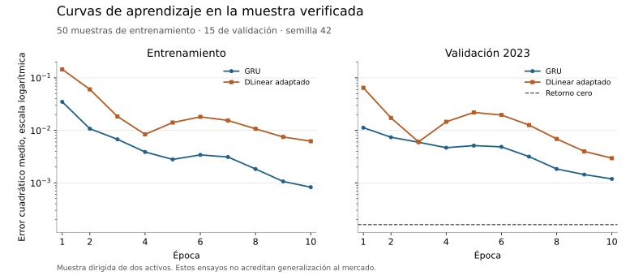

# DLinear adaptado a predicción residual multimodal

Fecha: 22 de septiembre de 2026.

DLinear se incorpora como referencia de bajo coste. Usa las mismas 64 sesiones
observadas, noticias completas revisadas, gráficos, hechos contables y contexto
macro que GRU. Ninguna entrada adicional procede del periodo que se predice.

## Correspondencia con la fuente

La implementación sigue la descomposición y los mapas compartidos de
[LTSF-Linear, versión 0c113668](https://github.com/cure-lab/LTSF-Linear/blob/0c113668a3b88c4c4ee586b8c5ec3e539c4de5a6/models/DLinear.py).
El núcleo usa una media móvil de 25 posiciones, con extremos replicados dentro
de la ventana. Para cada canal observado se calcula

$$
x^{\mathrm{trend}}=\operatorname{MA}_{25}(x),\qquad
x^{\mathrm{seasonal}}=x-x^{\mathrm{trend}},
$$

$$
z=W_s x^{\mathrm{seasonal}}+b_s+W_t x^{\mathrm{trend}}+b_t.
$$

Los dos mapas transforman 64 posiciones en un paso y se comparten entre los
cinco canales de precios. El nombre estacional identifica el residuo de la
descomposición, no acredita estacionalidad económica. La media móvil puede usar
posiciones posteriores a una posición interna, pero todas están observadas antes
de la decisión. No es un filtro causal posición a posición dentro de la ventana.

La adaptación proyecta los cinco valores resultantes a 32 dimensiones y los
combina con las proyecciones de las demás entradas. La cabeza no lineal produce
un retorno residual. Por tanto, el modelo completo no es el predictor lineal
multihorizonte del artículo. Conserva su núcleo temporal para comparar familias
bajo las mismas modalidades. El módulo mantiene la licencia y el aviso de los
autores, recogidos en [material de terceros](../../THIRD_PARTY_NOTICES.md).

## Configuraciones ejecutadas

Los ensayos usan semilla 42, AdamW, tasa `1e-4`, float32, lotes de 16, cuatro
hilos CPU y `cuda:0`. La GRU tiene 52.609 parámetros y la adaptación de DLinear
49.187. Cada época recorre las 50 muestras de entrenamiento. Las 15 de validación
pertenecen a 2023. Se mantienen cerrados los datos reservados de evaluación final.

| Modelo | Épocas | Ajuste | Proceso completo | Pico VRAM asignada | MAE de validación |
| --- | ---: | ---: | ---: | ---: | ---: |
| GRU | 3 | 0,263 s | 4,92 s | 76,39 MiB | 0,066048 |
| GRU | 10 | 0,384 s | 6,09 s | 76,39 MiB | 0,030086 |
| DLinear adaptado | 3 | 0,252 s | 4,72 s | 65,07 MiB | 0,074505 |
| DLinear adaptado | 10 | 0,354 s | 5,57 s | 65,07 MiB | 0,050972 |

La referencia de retorno cero obtiene MAE 0,009620. Ninguna configuración de esta
tabla la supera. Los dos presupuestos se conservan, sin elegir una ejecución
favorablemente ni presentarlos como evaluación final. El prefijo de tres épocas
de DLinear coincide exactamente en pérdidas con el ensayo de diez.

El MSE de entrenamiento agrega las pérdidas observadas durante los pasos de la
época. El de validación se calcula después de actualizar sus pesos. La figura
usa la misma escala logarítmica en ambos paneles. Las curvas proceden directamente
de los registros de [GRU](../resources/gru-10-probe.json) y
[DLinear](../resources/dlinear-10-probe.json), no de una interpolación de resultados.

El tiempo completo se midió con GNU time e incluye importaciones, preparación,
entrenamiento, validación, guardado y comprobación de recuperación. Los tiempos
de ajuste incluyen el primer paso y su calentamiento. La caché del sistema
operativo no se vació. Una auditoría de lectura del corpus permanecía activa.
Son observaciones individuales, no mediciones suficientes para afirmar un
speedup o proyectar linealmente el entrenamiento del universo completo.

El RSS máximo del proceso fue 1.431.372 KiB para DLinear de tres épocas,
1.439.476 KiB para DLinear de diez y 1.486.104 KiB para GRU de diez. No se ha
consumido toda la VRAM para aparentar utilización. El tamaño de la muestra es
demasiado pequeño para alimentar de forma sostenida la GPU.

## Evidencia y límites

Se conservan los informes de [tres épocas de DLinear](../resources/dlinear-3-probe.json),
[diez épocas de DLinear](../resources/dlinear-10-probe.json) y
[diez épocas de GRU](../resources/gru-10-probe.json). Cada ejecución guarda
checkpoints por época, predicciones por activo y decisión y huellas de código,
datos y configuración. El MAE del resumen se recalculó desde las predicciones
Parquet. La restauración reproduce las predicciones y el replay desde la primera
época reproduce exactamente los pesos finales.

Las pruebas incluyen aritmética independiente, mapas con pesos distintos,
aislamiento de canales y lotes, gradientes en todas las modalidades y exclusión
de una fila futura deliberadamente inválida. Las tres mutaciones elegidas se
detectaron: retirar el residuo, usar el primer extremo como último e intercambiar
los mapas temporales. La revisión independiente no encontró defectos de código
bloqueantes y sus dos mejoras de pruebas quedaron incorporadas.

La suite completa pasó 506 pruebas, sin omisiones. El núcleo DLinear tiene
21 sentencias y cuatro ramas cubiertas por Coverage.py 7.16.1. El
[registro de verificación](../resources/dlinear-quality.json) conserva
complejidad, CRAP, mutaciones y mediciones de proceso. La figura se revisó
renderizada para comprobar textos, escalas y leyendas.

El conjunto dirigido de dos activos no permite decidir qué familia generaliza
mejor. Las noticias verificables siguen limitando la intersección. Las siguientes
variantes deben conservar los originales y declarar pérdida, tasa de aprendizaje,
semilla y presupuesto. El postentrenamiento requiere otra ejecución identificada
y no puede usar la validación ni el test como etiquetas de ajuste.
