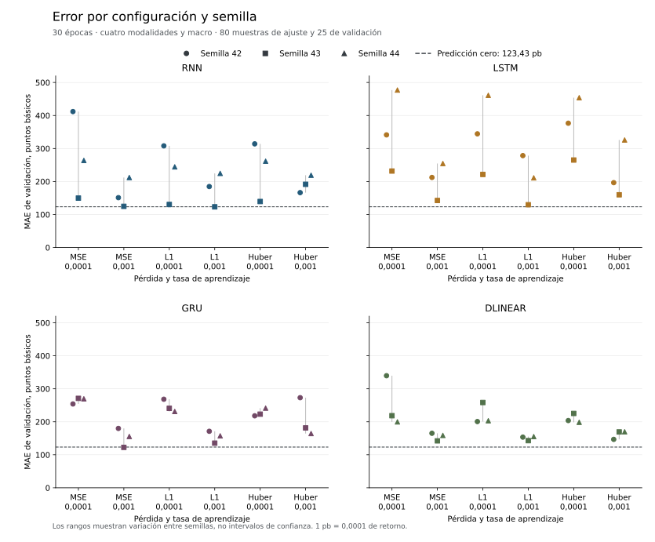

# Comparativa sobre 105 muestras multimodales

Se completaron 96 ejecuciones neuronales y cuatro controles tabulares el
22 de septiembre de 2026. Todas utilizan las mismas 80 muestras de entrenamiento
y 25 de validación, con precios, noticias, fundamentales, gráficos y contexto
macro. El [informe de datos](../data/verified-news-cohort-20260922.md) explica
la selección, las exclusiones y las ocho noticias incorporadas.

El control de predicción cero obtiene MAE 0,012343258. Tres ejecuciones neuronales
lo mejoran individualmente, pero ninguna media de configuración entre tres semillas
lo supera. Los tres intervalos exploratorios de diferencia frente a cero incluyen
el valor nulo. Los controles de Ridge y boosting tampoco mejoran ese MAE.
Estos resultados no acreditan una mejora predictiva general.

## Comparación con una receta fija

La tabla utiliza MSE, tasa 0,001 y 30 épocas en las cuatro familias. Esta receta
es también el origen predefinido de las continuaciones, no una selección del
mejor resultado de cada familia. MAE y RMSE son medias entre tres semillas.

| Modelo | MAE de ajuste final | MAE de validación | Desviación del MAE entre semillas | RMSE de validación |
| --- | ---: | ---: | ---: | ---: |
| RNN | 0,011099 | 0,016263 | 0,004480 | 0,020274 |
| LSTM | 0,011541 | 0,020312 | 0,005659 | 0,024745 |
| GRU | 0,010426 | 0,015268 | 0,002877 | 0,020007 |
| DLinear adaptado | 0,010705 | 0,015539 | 0,001187 | 0,019854 |

El control cero tiene MAE 0,012343 y RMSE 0,016339 sobre las mismas decisiones
de validación. No depende de la inicialización y no tiene una desviación entre
semillas que comparar con las redes.

Las [96 configuraciones y sus diagnósticos](../resources/expanded-reference-diagnostics.json)
incluyen pérdidas MSE, L1 y Huber, dos tasas, tres semillas y las continuaciones.
La [rejilla](../../configs/baselines/expanded-reference-variants.json) quedó fijada
antes de examinar estos resultados. Las [curvas por época](../resources/expanded-curves.csv)
conservan 2.280 filas, incluidos los intentos desfavorables.



Entre las configuraciones base, DLinear con L1 y tasa 0,001 presenta el menor MAE
medio, 0,015054. Se describe como mínimo observado dentro de la búsqueda, no como
un modelo seleccionado y validado para periodos nuevos.

## Resultados individuales y continuaciones

Las ejecuciones que quedan por debajo del MAE de cero son RNN con L1, tasa 0,001
y semilla 43 (0,012324324), GRU con MSE, tasa 0,001 y semilla 43 (0,012257443),
y la continuación L1 de esa GRU (0,011151364). Las dos últimas comparten pesos
de origen. No constituyen confirmaciones independientes.

Las diferencias frente a cero son aproximadamente −0,000019, −0,000086 y
−0,001192. Sus intervalos percentiles exploratorios al 95 % son
[−0,001546, 0,000784], [−0,004603, 0,002882] y [−0,003935, 0,000414].
Se usaron 2.000 remuestreos de bloques de cinco fechas, manteniendo juntas las
filas de cada fecha. El procedimiento no corrige la selección entre modelos
ni demuestra calibración de una predicción futura.

Las 24 continuaciones comparan L1 con MSE a igualdad de padre, tasa, semilla y
cinco épocas adicionales. L1 mejora el MAE en cuatro de los doce pares y lo
empeora en ocho. No se adopta el cambio de objetivo como mejora general. El
diagnóstico conserva diferencias frente al control de pasos y frente al padre.

## Controles tabulares

La [configuración tabular](../../configs/baselines/expanded-tabular-references.json)
fija tres regularizaciones de Ridge y la referencia de boosting ya existente.
Se comunican todos los ajustes. El [diagnóstico](../resources/expanded-tabular-diagnostics.json)
conserva predicciones, huellas, errores de ajuste y validación, desgloses por
activo e intervalos exploratorios frente a cero.

| Referencia | MAE de ajuste final | MAE de validación | RMSE de validación |
| --- | ---: | ---: | ---: |
| Ridge, α = 0,1 | 0,000007 | 0,015027 | 0,020432 |
| Ridge, α = 1 | 0,000069 | 0,015014 | 0,020408 |
| Ridge, α = 10 | 0,000626 | 0,014891 | 0,020185 |
| HistGradientBoosting | 0,004327 | 0,013204 | 0,017854 |

El ajuste casi exacto de Ridge no se mantiene en validación. Hay muchas más
características que observaciones y el error dentro de muestra no acredita
generalización. Ridge se ajusta en CUDA y predice mediante su implementación
NumPy. HistGradientBoosting utiliza CPU de forma explícita. No se interpreta
esa diferencia de implementación como una comparación aislada de hardware.

## Qué cambia al ampliar los datos

El error sobre 25 observaciones no se compara directamente con el de las 15
anteriores como si la dificultad fuese idéntica. El [contraste sobre fechas comunes](../resources/common-validation-diagnostics.json)
verifica las mismas claves y etiquetas de las 15 observaciones originales.
Compara las 96 parejas de ejecuciones correspondientes, sin volver a entrenar
ni modificar sus predicciones.

Para la receta fija MSE y tasa 0,001, el MAE medio sobre esas mismas 15 decisiones
cambia así:

| Modelo | Entrenado con 50 muestras | Entrenado con 80 muestras | Diferencia |
| --- | ---: | ---: | ---: |
| RNN | 0,013350 | 0,013833 | 0,000483 |
| LSTM | 0,015474 | 0,013959 | −0,001516 |
| GRU | 0,012049 | 0,011069 | −0,000980 |
| DLinear adaptado | 0,012509 | 0,011550 | −0,000959 |

Este contraste separa la composición de validación del cambio en las predicciones,
pero no identifica una causa económica ni el efecto puro de añadir noticias.
El entrenamiento cambia de empresas, cantidad de datos y número de actualizaciones.
La lectura mantiene su orden por activo y ventana, sin una permutación aleatoria
global. El efecto del orden requeriría otro contraste.

## Recursos y límites de las mediciones

La [verificación independiente](../resources/expanded-verification.json) recorre
las predicciones de los 100 ajustes. Recalcula MAE y MSE con `math.fsum`, comprueba
claves y etiquetas entre familias y verifica las 26 huellas comunes de datos.
La batería del repositorio volvió a superar 798 pruebas después de incorporar
la cohorte. La [calidad del código](../resources/recurrent-quality.json) conserva
cobertura, complejidad, CRAP y mutaciones de la implementación utilizada.

La campaña neuronal tardó 919,76 segundos de proceso completo. El ejecutor
registró 918,058 segundos dentro del proceso. El máximo externo de RSS fue
1.635.236 KiB y el máximo de memoria CUDA asignada durante las épocas fue
76,652 MiB. Los tiempos incluyen las comprobaciones, no solo optimización.

| Componente registrado | Segundos acumulados |
| --- | ---: |
| Preparación de cada ejecución | 284,16 |
| Entrenamiento de las trayectorias principales | 113,78 |
| Validación de las trayectorias principales | 90,05 |
| Guardado de puntos de control | 18,99 |
| Repetición para comprobar recuperación | 288,78 |

Estos componentes no cubren por sí solos todo el proceso. Quedan cargas,
predicciones finales, consultas de recursos y otros trabajos del ejecutor.
La preparación repetida y la comprobación de recuperación ocupan buena parte
del tiempo. Un cambio posterior debería medir la reutilización de etiquetas y
entradas inmutables antes de proponer kernels propios. No se ha atribuido una
aceleración a una optimización no ejecutada.

Los cuatro controles tabulares, con sus diagnósticos, tardaron 17,05 segundos.
Los registros externos de [la campaña neuronal](../resources/expanded-reference-campaign-process-time.txt)
y de [los controles tabulares](../resources/expanded-tabular-process-time.txt)
permiten distinguir proceso completo, ajuste y evaluación. La RAM histórica
del proceso no equivale a un pico independiente por modelo. Los percentiles
por época incluyen lectura, transferencia y paso sincronizado, no kernels aislados.

Hay 25 fechas de validación y ninguna con tres activos coincidentes. La correlación
transversal queda sin estimar. AMZN solo aparece en validación y MSFT solo en
entrenamiento. El contexto macro puede tener variables ausentes identificadas
por sus máscaras. Las noticias coinciden con páginas actuales, sin certificar
instantáneas históricas inmutables, y los codificadores mantienen sus límites
de preentrenamiento.

No se calculan métricas financieras de una estrategia inexistente ni calibración
de una distribución que estos regresores no producen. La evaluación confirmatoria,
la auditoría del corpus completo y MARS-TITAN siguen pendientes. Las 105 muestras
no representan todo FinMultiTime y repetirlas durante el ajuste no aumenta el
número de observaciones independientes.

## Reproducción de la campaña neuronal

Con la cohorte local preparada y el entorno del proyecto disponible, estas órdenes
utilizan un destino nuevo y conservan los resultados anteriores:

```bash
CUBLAS_WORKSPACE_CONFIG=:4096:8 OMP_NUM_THREADS=4 OPENBLAS_NUM_THREADS=4 \
uv run --no-sync python -m mars_titan.models.baselines.campaign \
  --config configs/baselines/expanded-reference-variants.json \
  --prepared data/processed/news-cohort-20260922 \
  --samples data/processed/news-cohort-samples-20260922/US \
  --output data/interim/expanded-reproduction

uv run --no-sync python -m mars_titan.models.baselines.analysis \
  --campaign data/interim/expanded-reproduction/summary.json \
  --output data/interim/expanded-reproduction-analysis.json
```
