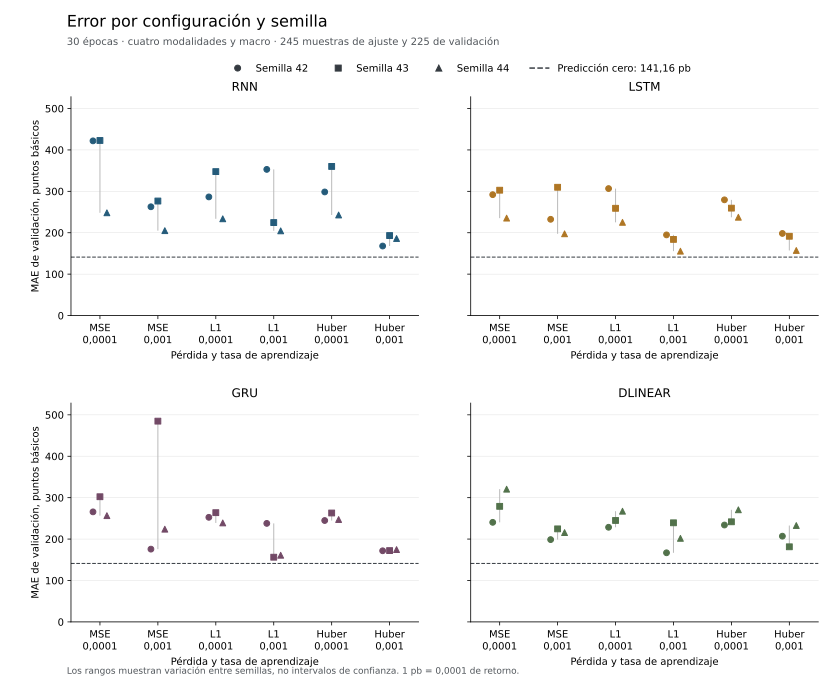
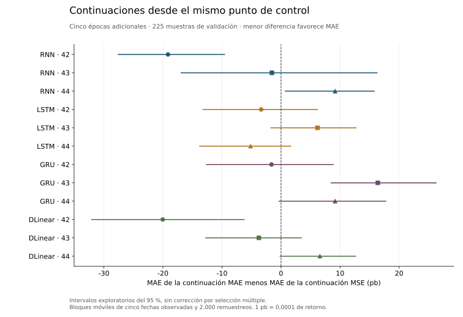

# Referencias sobre la edición de 470 muestras

La edición preparada al terminar la pasada editorial completó 96 ejecuciones
neuronales y cuatro ajustes tabulares. Incluye todas las empresas que conservan
muestras admitidas en esa instantánea, sin límite de activos. Ningún ajuste
mejora cero en MAE ni MSE de validación. No es la campaña sobre todo FinMultiTime.

## Población y ejecución

| Partición | Muestras | Empresas | Fechas observadas | Intervalo |
| --- | ---: | ---: | ---: | --- |
| Entrenamiento | 245 | 33 | 181 | 05/02/2018 a 09/11/2022 |
| Validación | 225 | 41 | 134 | 23/01/2023 a 15/12/2023 |

La unión contiene 66 empresas. Ocho aparecen en ambas particiones: AMT, CVX,
DECK, MNST, MSFT, NVDA, PYPL y XOM. De las 225 muestras de validación, 50
pertenecen a esas empresas y 175 a empresas ausentes del ajuste. La comparación
combina avance temporal y transferencia entre activos.

Cada muestra conserva precios, noticias completas verificadas, fundamentales
y un gráfico generado desde precios pasados. El contexto macro usa el catálogo
de 140 indicadores, con valores, máscaras y antigüedad. Los siete factores
empresariales derivados se incorporan cuando sus datos y unidades lo permiten.
No se rellenan ausencias con información futura ni se exige que los 140
indicadores estén observados en todas las fechas.

Las 72 configuraciones base combinan RNN, LSTM, GRU y DLinear, tres pérdidas,
dos tasas de aprendizaje y tres semillas. Cada una recorre las 245 muestras
durante 30 épocas. Las 24 continuaciones añaden cinco épocas desde los padres
MSE predefinidos, con AdamW nuevo. No se elige el padre por su validación.

La campaña neuronal duró 1.496,82 segundos, unos 24 minutos y 57 segundos entre
las marcas de inicio y cierre. Conserva pesos, optimizador, generadores, cursor
y predicciones. No se ejecutó MARS-TITAN ni se abrió el test final.

## Errores observados



Cero obtiene **MAE 0,01411633** y **MSE 0,00042239** en validación. El mínimo
neuronal de ambos errores corresponde a `lstm-mae-0.001-s44`, con MAE 0,01554842
y MSE 0,00047997. Ese mínimo describe la rejilla, no confirma la superioridad
de LSTM ni una mejora respecto al control.

| Control tabular | MAE de validación | MSE de validación | Tiempo de ajuste |
| --- | ---: | ---: | ---: |
| Ridge, alfa 0,1 | 0,033663 | 0,001817 | 0,752 s |
| Ridge, alfa 1 | 0,033283 | 0,001778 | 0,608 s |
| Ridge, alfa 10 | 0,030521 | 0,001505 | 0,608 s |
| HistGradientBoosting | 0,015884 | 0,000479 | 0,632 s |

Ridge utiliza CUDA e HistGradientBoosting utiliza CPU de forma explícita. Los
100 casos conservan las mismas claves y objetivos. MAE y MSE se recalculan desde
los Parquet y se contrastan con los recibos. Las curvas recogen las 2.280 épocas
neuronales, sin sumar las filas de distintas épocas como datos nuevos.

El diagnóstico conserva errores absolutos y cuadrados, sesgo, cuantiles del
error, R², acierto direccional, correlaciones, desgloses por empresa y mes,
variación entre semillas y diferencias pareadas por bloques de fechas. Solo
17 fechas de validación tienen tres o más activos. La correlación transversal
requiere además que ambas series no sean constantes. Esta cobertura no
representa un panel denso del mercado.

## Continuaciones y límites



Cambiar a MAE mejora el MAE frente a continuar con MSE en siete parejas y lo
empeora en cinco. La diferencia media es −0,60 puntos básicos y la mediana
−1,58 puntos básicos. Ninguna de esas continuaciones supera cero en validación.
Los intervalos del 95 % usan bloques móviles de cinco fechas observadas y
2.000 remuestreos. Son exploratorios y no corrigen selección múltiple.

La [cobertura editorial de esta instantánea](../data/editorial-pass-20260923.md)
explica por qué las cuatro fuentes presentes no producen miles de empresas
entrenables. China y el brazo conjunto siguen pendientes. La coincidencia con
una página editorial actual no demuestra por sí sola su versión histórica
inmutable. Los límites de preentrenamiento de los codificadores también se
mantienen y no quedan resueltos por entrenar más épocas.

Los resultados de esta edición no se mezclan con los de 405 o 295 muestras.
No se atribuyen las diferencias a una sola causa y no se extraen conclusiones
de rentabilidad a partir de errores residuales.

## Evidencia y reproducción

- [Diagnóstico y huellas de los artefactos](../resources/streaming-reference-diagnostics-post-scan-20260923.json).
- [Métricas de los 100 ajustes](../resources/verified-post-scan-20260923-metrics.csv).
- [Curvas de entrenamiento y validación](../resources/verified-post-scan-20260923-curves.csv).
- [Preparación de etiquetas y medición de recursos](../resources/residual-preparation.md).

La receta conserva las rutas de la edición anterior por defecto. Para seleccionar
esta edición y generar artefactos nuevos:

```bash
uv run --no-sync python reports/analysis/verified_edition_20260923.py \
  data/interim/post-scan-analysis-repeated \
  --campaign data/interim/reference-post-scan-20260923 \
  --tabular data/interim/tabular-post-scan-20260923 \
  --label post-scan-20260923
```

El análisis conserva el límite de 100.000 filas por partición del lector local.
No sustituye una futura evaluación por bloques de todo el corpus. Rechaza salidas
existentes e identificadores que puedan escapar del directorio. No permite
desactivar las comprobaciones mediante `python -O`.

La versión 3 del diagnóstico identifica cada fuente por su grupo neuronal o
tabular y su ruta relativa. Las campañas pueden estar fuera del repositorio sin
publicar rutas personales absolutas. También contrasta la rejilla con su receta
y rechaza listas incompletas o duplicadas, aunque sus contadores declaren 100
ajustes.

Las ocho pruebas de la receta incluyen resultados conocidos, rutas externas,
conservación de salidas y rechazo de campañas incompletas. La batería local
completa pasó con 1.060 pruebas, sin omisiones, en 78,88 segundos. La edición
anterior de 405 muestras se recalculó con la misma receta y conserva sus métricas
y diagnósticos, sin sustituir sus artefactos publicados.
