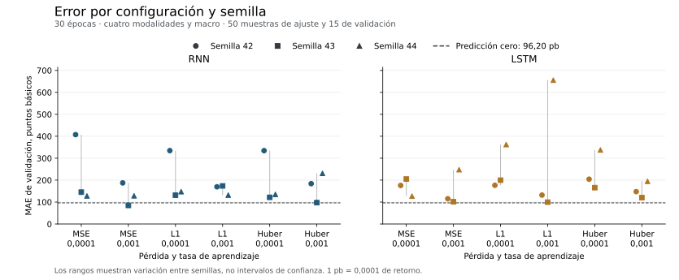

# RNN y LSTM sobre la muestra de referencia

Se completaron 48 ejecuciones el 22 de septiembre de 2026. Las dos familias
utilizan las mismas 50 muestras de entrenamiento y 15 de validación que las
referencias anteriores. Cada muestra conserva precios, noticias verificadas,
fundamentales, gráficos y contexto macro. La reserva final no se ha abierto.

Dos ejecuciones de RNN obtienen un MAE inferior al control de retorno cero.
Comparten la semilla 43 y una es continuación de la otra, por lo que no son dos
confirmaciones independientes. Sus intervalos exploratorios de diferencia frente
a cero incluyen el valor nulo. Ninguna media entre las tres semillas mejora el
MAE de cero, 0,009619968. LSTM tampoco lo mejora en ninguna ejecución individual.

## Configuraciones y resultados

La [configuración](../../configs/baselines/recurrent-variants.json) y el
[método](../../docs/engineering/recurrent-comparison.md) fijan pérdidas, tasas,
semillas, épocas y controles de continuación. La RNN tiene 50.113 parámetros y
la LSTM 53.857. Ambas tienen 32 unidades recurrentes. La comparación conserva
la fusión común y registra la diferencia de capacidad.

| Modelo | Pérdida | Tasa | MAE medio de validación | Desviación entre semillas |
| --- | --- | ---: | ---: | ---: |
| RNN | MSE | 0,0001 | 0,022687 | 0,015650 |
| RNN | MSE | 0,001 | 0,013350 | 0,005149 |
| RNN | L1 | 0,0001 | 0,020436 | 0,011297 |
| RNN | L1 | 0,001 | 0,015829 | 0,002312 |
| RNN | Huber | 0,0001 | 0,019701 | 0,011916 |
| RNN | Huber | 0,001 | 0,017069 | 0,006769 |
| LSTM | MSE | 0,0001 | 0,016927 | 0,003928 |
| LSTM | MSE | 0,001 | 0,015474 | 0,008067 |
| LSTM | L1 | 0,0001 | 0,024612 | 0,010112 |
| LSTM | L1 | 0,001 | 0,029574 | 0,031214 |
| LSTM | Huber | 0,0001 | 0,023583 | 0,009015 |
| LSTM | Huber | 0,001 | 0,015415 | 0,003758 |

Cada fila resume tres semillas con desviación muestral, no un intervalo sobre
periodos nuevos. El caso más variable de LSTM, L1 con tasa 0,001, va de
0,009961 a 0,065569. Una cifra media sin ese rango ocultaría su inestabilidad.



RNN con MSE, tasa 0,001 y semilla 43 obtiene MAE 0,008473144. Su continuación
con L1 obtiene 0,008054263. Las diferencias respecto a cero son aproximadamente
−0,001147 y −0,001566. Los intervalos percentiles exploratorios al 95 %, con
2.000 remuestreos de bloques de cinco fechas, son [−0,004287, 0,000447] y
[−0,004488, 0,000698]. No corrigen la selección entre configuraciones ni justifican
afirmar superioridad sobre el mercado.

## Continuaciones emparejadas

Las doce continuaciones parten de pesos MSE elegidos por una regla fija, no del
ganador de validación. L1 y MSE reciben cinco épocas adicionales con el mismo
origen, semilla y tasa. Se conserva un optimizador nuevo en ambos casos.

| Modelo | Semilla | Diferencia MAE, continuación L1 menos continuación MSE |
| --- | ---: | ---: |
| RNN | 42 | −0,000549 |
| RNN | 43 | −0,003351 |
| RNN | 44 | 0,000283 |
| LSTM | 42 | 0,001484 |
| LSTM | 43 | −0,000441 |
| LSTM | 44 | 0,000253 |

L1 mejora frente al control de pasos en tres pares y empeora en tres. El cambio
de objetivo no se adopta como mejora general. El análisis conserva también la
diferencia de cada continuación respecto a su padre y sus predicciones finales.

Las [curvas de las 48 ejecuciones](../resources/recurrent-curves.csv) conservan
1.140 filas por época. Separan el error de entrenamiento durante las actualizaciones
del error de validación después de cada época. Los errores de los pesos finales
sobre entrenamiento se guardan aparte en el diagnóstico.

## Evaluación disponible

El [diagnóstico completo](../resources/recurrent-diagnostics.json) verifica
huellas, claves, fechas, etiquetas y población común antes de calcular métricas.
Contiene los errores finales de entrenamiento y validación, MAE, MSE, RMSE,
sesgo, mediana, cuantiles 90, 95 y 99, máximo, R², Pearson, Spearman, signos y
mejora relativa frente al control. Incluye desgloses por activo y mes, variación
entre semillas, seis pares de continuación y recursos por ejecución y época.

Las 15 fechas de validación no tienen al menos tres activos coincidentes. La
correlación transversal diaria queda sin estimar y no se sustituye por la
correlación de filas agrupadas. Tampoco se inventan calibración probabilística,
intervalos predictivos, Sharpe o drawdown a partir de estos regresores puntuales.

Los pesos finales reproducen exactamente la ejecución continua tras restaurar
el checkpoint de la primera época. Las predicciones de entrenamiento y validación
coinciden con las del último checkpoint restaurado en las 48 ejecuciones.

La [verificación del código](../resources/recurrent-quality.json) registra 798
pruebas superadas, cobertura por sentencias y ramas, complejidad y CRAP con su
convención. Incluye las mutaciones dirigidas y los controles añadidos para impedir
cambios de cohorte y productos cartesianos fuera del presupuesto. El antiguo
perfilador de cargas sintéticas mantiene caminos sin cubrir en esta batería.
No se presenta esa cobertura como completa ni como garantía de ausencia de errores.

## Recursos y reproducción

La campaña completa tardó 227,92 segundos según el [registro de GNU time](../resources/recurrent-campaign-process-time.txt), incluidos inicio del
proceso, preparación, validación, puntos de control, comprobación de recuperación
y predicciones finales. El máximo RSS del proceso fue 1.547.780 KiB. No es un
pico aislado por modelo. El JSON distingue ese máximo histórico de las lecturas
por época, cuyo muestreo de RAM cada 0,25 segundos puede omitir picos breves.

El ejecutor registra 226,202 segundos dentro del proceso, sin su arranque ni la
impresión final. Su mayor lectura histórica de RSS es 1.469.932 KiB. Esta lectura
interna y la medición externa de GNU time se conservan por separado, sin
atribuir su diferencia a un modelo ni tratarlas como medidas intercambiables.

Los tiempos por paso incluyen lectura, transferencia y cálculo sincronizado.
No son medidas aisladas de kernels ni acreditan el rendimiento máximo del equipo.
Las opciones observadas fueron tensores float32, multiplicación matricial con
precisión `highest`, TF32 de CUDA desactivado y TF32 de cuDNN permitido.
No se cambiaron esas opciones para seleccionar resultados favorables.

Con los datos locales preparados, una reproducción utiliza un destino nuevo:

```bash
CUBLAS_WORKSPACE_CONFIG=:4096:8 OMP_NUM_THREADS=4 OPENBLAS_NUM_THREADS=4 \
uv run --no-sync python -m mars_titan.models.baselines.campaign \
  --config configs/baselines/recurrent-variants.json \
  --prepared data/processed/news-expansion-20260921 \
  --samples data/processed/company-samples-20260922-v3/US \
  --output data/interim/recurrent-reproduction

uv run --no-sync python -m mars_titan.models.baselines.analysis \
  --campaign data/interim/recurrent-reproduction/summary.json \
  --output data/interim/recurrent-reproduction-analysis.json
```

La muestra sigue siendo pequeña y dirigida, con ventanas que comparten noticias.
Más ejecuciones sobre ella no crean observaciones independientes. La ampliación
del corpus y la comparación confirmatoria permanecen separadas de estos ensayos.
MARS-TITAN no se ha entrenado.
