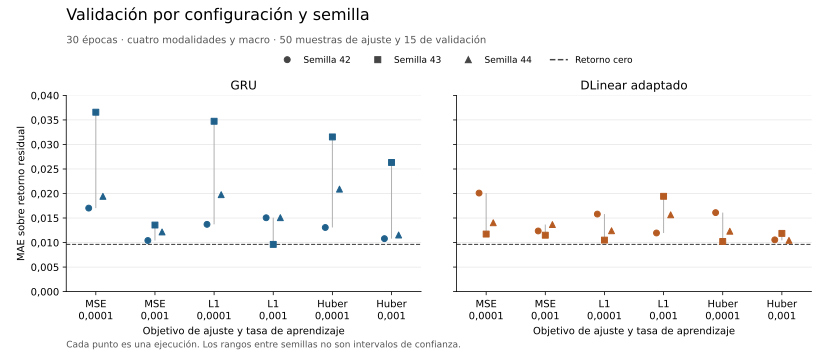

# Configuraciones y postentrenamiento de las referencias

Se completaron 48 ejecuciones el 22 de septiembre de 2026, sin fallos. Ninguna
supera el MAE de retorno cero, 0,009620, en las 15 muestras de validación.
Variar el objetivo, la tasa y la semilla reduce algunos errores, pero todavía
no aporta evidencia de señal predictiva útil sobre esta muestra.

## Comparación realizada

La [rejilla inicial](../../configs/baselines/reference-variants.json) contiene
36 ajustes: GRU y DLinear, pérdidas MSE, L1 y Huber, tasas `1e-4` y `1e-3`
y semillas 42, 43 y 44. Cada ajuste recorre 30 épocas, con lotes de 16,
AdamW, float32 y `cuda:0`. Huber utiliza delta 0,01 sobre el retorno residual.
La pérdida Huber es cuadrática cerca de cero y lineal fuera de su umbral,
según la [definición de PyTorch](https://docs.pytorch.org/docs/2.14/generated/torch.nn.HuberLoss.html).
Su valor no se compara directamente con MSE como si fueran la misma medida.

Cada configuración utiliza las mismas 50 muestras de ajuste hasta 2022 y las
mismas 15 decisiones de validación de 2023. DECK aporta diez observaciones de
validación y MNST cinco. La comparación conserva las cuatro modalidades y el
contexto macro. La reserva final no se ha abierto.

Se añadieron seis ajustes con L1 desde los modelos MSE con tasa `1e-3`, elegidos
por una regla fija. Otros seis [controles](../../configs/baselines/posttraining-controls.json)
continúan con MSE desde los mismos pesos. Ambas continuaciones tienen cinco
épocas, tasa `1e-4`, optimizador nuevo y semilla registrada. Así se distingue el
cambio de objetivo del simple efecto de añadir pasos de entrenamiento.

## Resultados por configuración

La tabla muestra media y rango del MAE entre tres semillas. No son intervalos
de confianza sobre el mercado.

| Modelo | Pérdida | Tasa | MAE medio | Mínimo | Máximo |
| --- | --- | ---: | ---: | ---: | ---: |
| GRU | MSE | 0,0001 | 0,024341 | 0,017023 | 0,036573 |
| GRU | MSE | 0,001 | 0,012049 | 0,010416 | 0,013570 |
| GRU | L1 | 0,0001 | 0,022735 | 0,013711 | 0,034731 |
| GRU | L1 | 0,001 | 0,013252 | 0,009622 | 0,015078 |
| GRU | Huber | 0,0001 | 0,021833 | 0,013070 | 0,031536 |
| GRU | Huber | 0,001 | 0,016223 | 0,010797 | 0,026330 |
| DLinear | MSE | 0,0001 | 0,015286 | 0,011731 | 0,020087 |
| DLinear | MSE | 0,001 | 0,012509 | 0,011496 | 0,013669 |
| DLinear | L1 | 0,0001 | 0,012905 | 0,010501 | 0,015805 |
| DLinear | L1 | 0,001 | 0,015680 | 0,011950 | 0,019430 |
| DLinear | Huber | 0,0001 | 0,012875 | 0,010218 | 0,016101 |
| DLinear | Huber | 0,001 | 0,010954 | 0,010446 | 0,011864 |

GRU es sensible a la inicialización con tasa `1e-4`. DLinear con Huber y tasa
`1e-3` muestra el menor MAE medio entre las configuraciones de DLinear medidas,
pero sigue por encima del retorno cero. El resultado de GRU con L1 más próximo
al control es 0,009622471, frente a 0,009619968. Redondearlo a cuatro decimales
ocultaría la diferencia. No se interpreta esa proximidad como superioridad.

## Postentrenamiento y control de pasos

La diferencia siguiente es MAE del ajuste adicional L1 menos MAE del control
adicional MSE. Un valor negativo favorece L1 en esa ejecución.

| Modelo | Semilla | MAE tras L1 | MAE tras MSE | Diferencia |
| --- | ---: | ---: | ---: | ---: |
| GRU | 42 | 0,010472 | 0,010543 | −0,000071 |
| GRU | 43 | 0,011443 | 0,012228 | −0,000784 |
| GRU | 44 | 0,013271 | 0,012208 | 0,001063 |
| DLinear | 42 | 0,011128 | 0,013340 | −0,002212 |
| DLinear | 43 | 0,011673 | 0,012825 | −0,001151 |
| DLinear | 44 | 0,018394 | 0,012038 | 0,006357 |

L1 mejora frente al control de pasos en cuatro de seis pares y empeora en dos.
Su media entre semillas no mejora la del control MSE en ninguna familia. No se
adopta como mejora general. Reutiliza las etiquetas de entrenamiento existentes,
no añade información ni genera nuevas observaciones financieras.

## Evidencia, recursos y alcance

El [registro inicial](../resources/reference-variants.json) y los
[controles](../resources/posttraining-controls.json) identifican cada ejecución.
El [análisis comprobado](../resources/reference-variants-analysis.json) incluye
MAE, MSE, RMSE, sesgo, error absoluto mediano y máximo, dirección residual y
96 desgloses por activo. Las [curvas por época](../resources/reference-variant-curves.csv)
conservan 1.140 filas. Se verificaron huellas y coincidencia de identificadores,
etiquetas y datos. MAE y MSE se recalcularon desde las predicciones Parquet.

Las 42 ejecuciones iniciales tardaron 220,20 segundos de proceso completo y
los seis controles 14,96 segundos. El pico RSS de esos procesos fue de
1.572.092 y 1.529.884 KiB respectivamente. El pico de memoria CUDA asignada
durante entrenamiento fue 76,40 MiB. El tiempo acumulado de ajuste registrado
por época fue 20,96 segundos. No equivale al coste total.

El coste completo incluye preparación, validación, checkpoints y replay de
comprobación. Hubo 57.000 visitas a muestras de entrenamiento en las trayectorias
principales y otras 54.600 en replay. Siguen siendo solo 50 muestras distintas,
no 111.600 observaciones independientes. Las predicciones se restauraron y los
pesos finales se reprodujeron exactamente en las 48 ejecuciones.

El postentrenamiento valida arquitectura, datos, etiquetas, código y pesos
antes de inicializar. Solo admite el ZIP sin compresión generado por el proyecto,
con límites de tamaño y entradas, carga `weights_only` y almacenamiento mapeado.
No se utiliza para cargar arbitrariamente modelos descargados. La suite completa
pasó 535 pruebas sin omisiones. Dos mutaciones dirigidas comprobaron el objetivo
y la validación de huellas. La revisión corrigió el riesgo de expansión de un
checkpoint comprimido y añadió casos de pesos corruptos sin modificación parcial.
El [registro de calidad](../resources/reference-variants-quality.json) conserva
las coberturas, complejidades y valores CRAP con su convención de cálculo.

La selección múltiple y la muestra dirigida impiden concluir que una familia
generalice mejor. No hay intervalos calibrados, rentabilidad simulada ni evidencia
de eficacia en otros regímenes. El siguiente aumento útil de escala depende de
la intersección de noticias verificadas con las demás fuentes. KLPO se mantiene
como [opción investigada](../../docs/references/klpo-review.md), no como método
ejecutado o mejora acreditada. MARS-TITAN no se ha entrenado.
