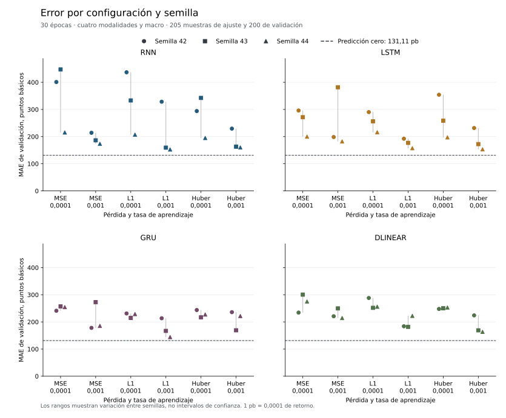
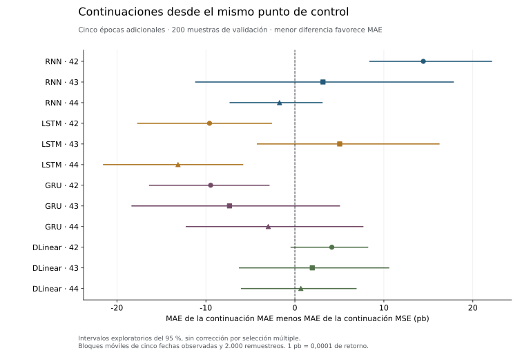

# Referencias sobre la edición ampliada de 405 muestras

La edición ampliada ha completado 96 ejecuciones neuronales y cuatro ajustes
tabulares. Ninguno mejora la predicción cero en MAE ni MSE de validación.
Se conservan todos los resultados, con cuatro modalidades y contexto macro.
MARS-TITAN no se ha entrenado y el test final permanece cerrado.

## Datos utilizados

| Partición | Muestras | Empresas | Fechas observadas | Intervalo |
| --- | ---: | ---: | ---: | --- |
| Entrenamiento | 205 | 26 | 170 | 05/02/2018 a 09/11/2022 |
| Validación | 200 | 36 | 124 | 23/01/2023 a 15/12/2023 |

Se prepararon 60 activos y 55 conservan muestras materializadas. Esos 55 forman
la unión de ambas particiones, no el número de empresas presentes en cada una.
Comparten AMT, CVX, DECK, MNST, MSFT, NVDA y PYPL. Las otras 29 empresas de
validación reúnen 155 de sus 200 muestras.

La instantánea de fuentes explica la diferencia respecto al universo previsto:

| Mercado | Instrumentos candidatos | Con las cuatro fuentes presentes | Con noticias completas admitidas y cuatro fuentes | Con muestras materializadas |
| --- | ---: | ---: | ---: | ---: |
| Estados Unidos | 4.784 | 2.639 | 60 | 55 |
| China | 892 | 810 | 0 | 0 |

La presencia de archivos no acredita su intersección temporal ni su procedencia.
Estos recuentos pertenecen a la instantánea utilizada, no al estado posterior de
la cola editorial. Las cinco exclusiones posteriores a preparar los 60 activos
no se sustituyen por modalidades inventadas. No se aplica un límite de empresas
para reducir el entrenamiento.

Se añaden 45 muestras de ajuste y 65 de validación a la
[edición anterior](verified-reference-study.md). Las claves y objetivos de las
filas comunes se mantienen. El universo y la cobertura siguen siendo reducidos
respecto a FinMultiTime. No son los miles de empresas de la campaña prevista.

La comprobación directa de los 200 Parquet de predicciones confirma igualdad de
claves y objetivos entre todos los modelos. No hay duplicados ni predicciones no
finitas. Las fechas de salida respetan las particiones declaradas.

## Variantes y errores

La rejilla conserva 72 casos base, con cuatro familias, tres pérdidas, dos tasas
de aprendizaje y tres semillas. Cada caso recorre las 205 filas de ajuste en
cada una de sus 30 épocas. Las 24 continuaciones realizan cinco épocas adicionales
desde los controles MSE predefinidos, con AdamW nuevo.



Cero obtiene **MAE 0,01311093** y **MSE 0,00032755** en validación. El menor MAE
neuronal observado es 0,01440595, en `gru-mae-0.001-s44`. El menor MSE es
0,00039762, en `rnn-post-mae-s44`. Son mínimos descriptivos de esta rejilla y ambos
siguen por encima del control cero.

| Control tabular | MAE de validación | MSE de validación | Tiempo de ajuste |
| --- | ---: | ---: | ---: |
| Ridge, alfa 0,1 | 0,024590 | 0,001004 | 0,620 s |
| Ridge, alfa 1 | 0,024400 | 0,000991 | 0,505 s |
| Ridge, alfa 10 | 0,023023 | 0,000894 | 0,512 s |
| HistGradientBoosting | 0,015339 | 0,000413 | 0,566 s |

Ridge se ajusta y predice en CUDA. HistGradientBoosting utiliza CPU de forma
explícita. Ambos consumen toda la población de esta edición. El error de retorno
no se presenta como porcentaje de aciertos ni como rendimiento de una cartera.

## Continuaciones



Continuar con MAE mejora su error frente a continuar con MSE en seis parejas y
lo empeora en seis. La diferencia media es **−1,24 puntos básicos** y la mediana
−0,53 puntos básicos. Las tres semillas de GRU mejoran en esa comparación y las
tres de DLinear empeoran. Es un resultado condicionado a estos padres y datos,
no una demostración general sobre la mejor pérdida de continuación.

Los intervalos son exploratorios, con bloques móviles de cinco fechas observadas
y 2.000 remuestreos. No corrigen selección múltiple y no son intervalos de retorno
predictivo. El diagnóstico conserva cada pareja y su checkpoint padre.

## Ejecución y alcance

La campaña neuronal duró **1.345,03 segundos**, unos 22 minutos y 25 segundos
entre sus marcas de inicio y cierre. Reutilizó etiquetas por activo y el ejecutor
recuperable. Cambiaron la población, el orden de lectura y el procedimiento de
comprobación de recuperación respecto a la campaña anterior. La diferencia de
tiempos no es una medida controlada de aceleración.

Cada checkpoint se publica tras comprobar su lectura. El motor tiene pruebas de
interrupción y continuidad exacta. En estos 96 casos no se repitió íntegramente
cada entrenamiento para verificar recuperación, por lo que no se les atribuye
esa comprobación realizada en la campaña anterior.

Nueve de las 124 fechas de validación tienen al menos tres activos. Solo esas
fechas pueden entrar en la correlación transversal, si tampoco hay series
constantes. Ese recuento no permite presentar el Rank IC como una evaluación
amplia de panel. Los desgloses por activo y mes son descriptivos.

Siguen pendientes la curación global, la procedencia necesaria en China y los
brazos chino y conjunto. No se han sustituido por repetir un experimento de
Estados Unidos. Tampoco se afirma rentabilidad, calibración probabilística o
superioridad de una arquitectura a partir de esta edición.

## Evidencia y reproducción

- [Diagnóstico completo, recursos y procedencia](../resources/streaming-reference-diagnostics-20260923.json).
- [Métricas de los 100 ajustes](../resources/verified-20260923-metrics.csv).
- [Curvas de las 2.280 épocas declaradas](../resources/verified-20260923-curves.csv).
- [Receta del análisis de esta edición](../analysis/verified_edition_20260923.py).
- [Contrato del ejecutor](../../docs/engineering/reference-campaign.md).

La receta comprueba recibos, huellas, población, fechas y errores desde los
artefactos locales, y limita su lectura a 100.000 filas por partición. No sustituye
la futura evaluación por bloques del corpus completo. Para repetir este análisis
se utiliza un directorio de salida sin resultados anteriores:

```bash
uv run --no-sync python reports/analysis/verified_edition_20260923.py \
  data/interim/reference-analysis-recomputed-20260923
```
