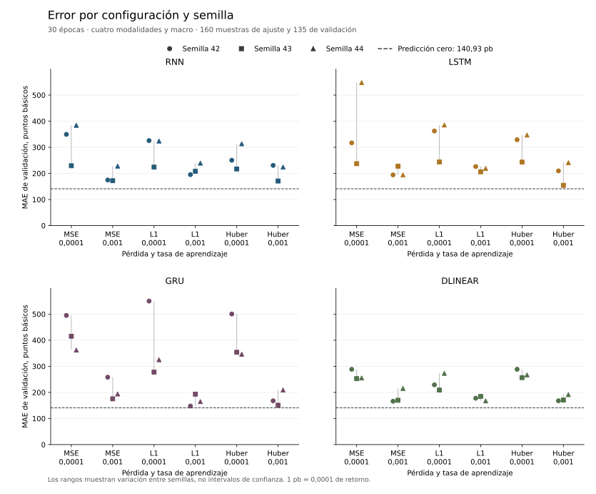
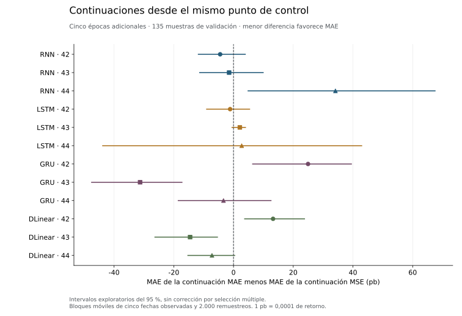

# Referencias sobre la edición verificada de 295 muestras

Se completaron 96 ejecuciones de RNN, LSTM, GRU y DLinear, más tres ajustes de
Ridge y un control HistGradientBoosting. Ninguno de los 100 ajustes mejora la
predicción cero en MAE o MSE de validación. Este resultado corresponde a la
edición verificada del 22 de septiembre de 2026, no al corpus completo.

La campaña neuronal contiene 72 entrenamientos de 30 épocas y 24 continuaciones
de cinco épocas. Sus checkpoints, predicciones y comprobaciones de restauración
se conservan localmente. MARS-TITAN no se ha entrenado y el test final permanece
cerrado.

## Población y objetivo

| Partición | Muestras | Empresas | Fechas con observaciones | Intervalo observado |
| --- | ---: | ---: | ---: | --- |
| Entrenamiento | 160 | 17 | 155 | 05/02/2018 a 09/11/2022 |
| Validación | 135 | 26 | 100 | 23/01/2023 a 12/12/2023 |

Las muestras conservan precios, noticias completas verificadas, fundamentales,
gráficos de ventanas pasadas y contexto macro. Todos los modelos utilizan las
mismas claves, fechas y etiquetas. La comparación directa de los 200 Parquet de
predicciones confirmó esa igualdad, sin duplicados ni valores no finitos.

Solo cinco empresas aparecen en ambas particiones: DECK, MNST, MSFT, NVDA y PYPL.
De las 135 muestras de validación, 30 pertenecen a esas empresas y 105 a empresas
ausentes del ajuste. La evaluación combina avance temporal y transferencia a
otros activos. No representa una validación temporal densa de las mismas empresas
ni permite atribuir un resultado a una sola de esas diferencias.

La etiqueta es el retorno de apertura a cierre de la siguiente sesión, ajustado
por el intercepto y la exposición al mercado estimados con datos anteriores.
La referencia cero predice un residual nulo. Los errores se calculan por muestra:

$$
\mathrm{MAE}=\frac{1}{N}\sum_{i=1}^{N}|\hat y_i-y_i|,
\qquad
\mathrm{MSE}=\frac{1}{N}\sum_{i=1}^{N}(\hat y_i-y_i)^2.
$$

Son errores de retorno residual. No equivalen a rentabilidad ni a porcentaje de
operaciones acertadas. Un punto básico representa 0,0001 de retorno.

## Configuraciones y resultados

Cada familia neuronal combina semillas 42, 43 y 44, pérdidas MSE, MAE y Huber y
tasas de aprendizaje 0,0001 y 0,001. Las representaciones se mantienen congeladas.
Los modelos reinician el estado recurrente en cada ventana de 64 sesiones.



Cero obtiene un MAE de **0,01409289** y un MSE de **0,00038999** en validación.
El menor MAE observado entre las configuraciones neuronales es 0,01476025, en
`gru-mae-0.001-s42`. Su MSE es 0,00041068. Ambos errores siguen por encima de cero.
Ese mínimo describe la rejilla observada y no selecciona un modelo confirmado.

Los [cuatro controles tabulares](tabular-corpus.md) también empeoran ambos errores
de validación frente a cero. La tabla completa de los 100 ajustes conserva error
de entrenamiento y validación, además de los desgloses según presencia previa
del activo en entrenamiento. En ajuste sí hay variantes con menor error que cero.

## Continuaciones emparejadas

Cada continuación parte del modelo base MSE con tasa 0,001 de su misma familia y
semilla. Se realizan cinco épocas adicionales, con AdamW nuevo y tasa 0,0001.
El control continúa optimizando MSE y la variante cambia a MAE. No se eligió el
padre por su resultado de validación.



Cambiar a MAE reduce el error frente a continuar con MSE en siete de las doce
parejas y lo aumenta en cinco. La diferencia media entre parejas es **+1,14 puntos
básicos**, ligeramente desfavorable a MAE. La mediana es −1,30 puntos básicos.
El recuento de siete mejoras no demuestra una mejora global ni superioridad de
esa pérdida.

Los intervalos de la figura usan bloques móviles de cinco fechas observadas,
2.000 remuestreos y percentiles del 95 %. Se conserva cada fecha con sus activos
y se mantiene la ponderación por fila. Las fechas observadas no constituyen un
calendario denso. Son intervalos exploratorios, condicionados a esta muestra y sin
corrección por la comparación de muchas configuraciones.

## Qué se ha evaluado y qué falta

El diagnóstico incluye MAE, MSE, RMSE, sesgo, mediana y cuantiles del error absoluto,
R², correlaciones agrupadas, acierto direccional, desgloses por activo y mes,
variación entre semillas y diferencias pareadas con remuestreo por fechas.
Los errores principales se recalcularon con sumas independientes sobre los Parquet,
además de contrastar los recibos y sus huellas.

En validación hay 65 fechas con una empresa y 35 con dos. Ninguna cumple el mínimo
de tres activos del cálculo de correlación transversal diaria. Por tanto, no se
presenta un Rank IC diario como si existiera un panel suficiente. La correlación
agrupada no lo sustituye.

Tampoco se calculan MAPE, calibración o puntuaciones probabilísticas que estas
salidas puntuales no permiten sostener. Las métricas financieras requieren una
estrategia con posiciones, ejecución y costes definida, que no forma parte de
este ensayo. Las huellas acreditan integridad y coherencia, no sustituyen la
verificación de las fuentes ni la auditoría histórica de los codificadores.

La campaña neuronal tardó 4.225,12 segundos dentro del ejecutor. Incluye preparación
de etiquetas, entrenamiento, validación, guardado, repetición de recuperación y
predicciones finales. No es solo tiempo de GPU ni incluye el arranque de Python.
El [lector y ejecutor por bloques](../resources/streaming-campaign.md) preparan
las etiquetas una vez y disponen de continuación operativa, sin exigir repetir
todo el ajuste para comprobar su recuperación.

La edición posterior contiene 205 muestras de entrenamiento y 200 de validación,
procedentes de 55 activos con muestras materializadas. Es otra población y sus
resultados deben mantenerse separados. La cobertura global, las fuentes chinas
y el brazo conjunto siguen pendientes. Ninguna de estas ediciones pequeñas se
presenta como el entrenamiento sobre todo FinMultiTime.

## Evidencia y reproducción

- [Diagnóstico completo de las 96 ejecuciones](../resources/verified-reference-diagnostics.json).
- [Métricas de los 100 ajustes](../resources/verified-20260922-metrics.csv).
- [Curvas de las 2.280 épocas declaradas](../resources/verified-20260922-curves.csv).
- [Recibo de población, comprobaciones y huellas](../resources/verified-20260922-receipt.json).
- [Controles tabulares](../resources/tabular-corpus-quality.json).
- [Configuración de las variantes](../../configs/baselines/expanded-reference-variants.json).

Los Parquet y pesos originales permanecen fuera de Git. El diagnóstico se puede
recalcular desde la campaña local con una salida nueva:

```bash
uv run --no-sync python -m mars_titan.models.baselines.analysis \
  --campaign data/interim/reference-edition-20260922/summary.json \
  --output data/interim/verified-reference-diagnostics-recomputed.json
```
