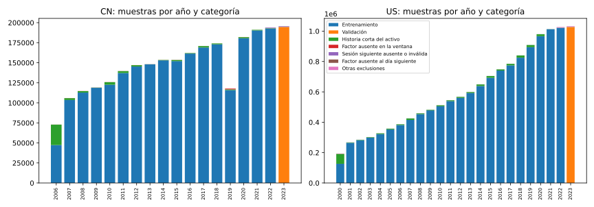
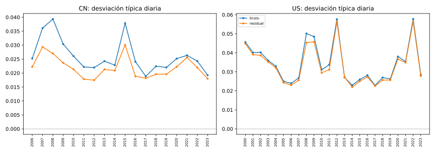
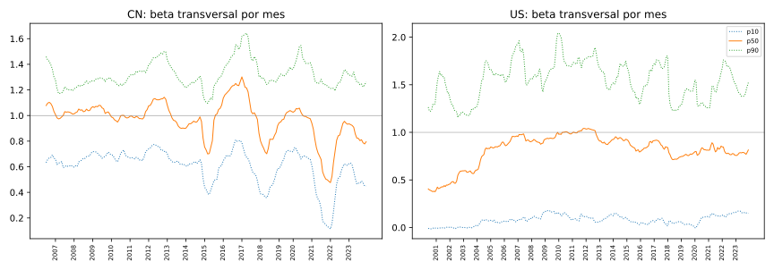
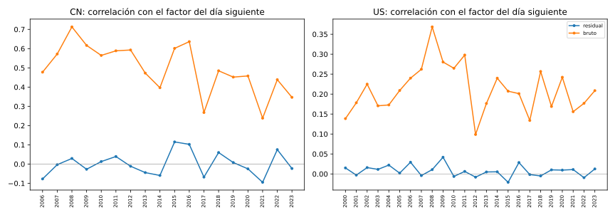

# Diagnóstico de la etiqueta residual

Tarea [#16](https://github.com/GonxKZ/mars-titan/issues/16) (MT-016, objetivo O2), 10 de octubre de 2026. Este informe revisa la cobertura, las colas, la estabilidad de alfa y beta y la exposición restante al mercado de la etiqueta residual `targets-v3`, construida sobre la edición histórica v3 desde 2000. Abarca entrenamiento (hasta 2022) y validación (2023). Es un diagnóstico de datos. No ajusta ningún modelo, no ejecuta pasos de optimizador y no abre la reserva de 2024. Los precios se filtran al 31 de diciembre de 2023 antes de calcular nada. Las etiquetas de la v3 no tienen filas de 2024, y si una edición las tuviera el diagnóstico exige que no lleven objetivo y solo las cuenta por su motivo.

La definición de la etiqueta está en el [protocolo](../../docs/research/protocol.md#reloj-de-decisión-y-objetivo) y en el [ejemplo del objetivo](../../docs/research/target-definition.md). Es el retorno apertura-cierre de la sesión siguiente menos alfa y beta por el retorno del factor en esa misma sesión. Alfa y beta salen de una regresión por mínimos cuadrados sobre las 252 sesiones anteriores, con al menos 126 pares cuyo cierre se conoce en la decisión. El factor es SPY en EE. UU. y el CSI 300 en China.

## Identidad de la ejecución

| Elemento | Valor |
| --- | --- |
| Informe | [`residual-diagnostics-v3-20261010.json`](residual-diagnostics-v3-20261010.json), SHA-256 `03b112560b39f53e6bd03fc5175f9f051de50263bdc3594be50de1999da8af41` |
| Declaración | [`configs/targets/residual-diagnostics-v1.json`](../../configs/targets/residual-diagnostics-v1.json), SHA-256 `d24d0f2e927c82dfa55b28bfd34509071c5288d24de101771ce1da999e0731c7` |
| Objetivos | `targets-v3/manifest.json`, SHA-256 `528dd13d1064caa98437676230dbf884cad062cde8b29db58004bd928637617b` |
| Edición | `encoded-history-v3-cpu-words/manifest.json`, SHA-256 `2fa8a0ea51eb14f87257c02576b40bcd1fca92e6b18809f9b744b78a1c571658` |
| Factor US | SPY de `prepared-accounting-v1`, SHA-256 `322d066eef284e9970a9d34ed5240b6528c0c46a59718ec531bc43365c2e41a0`, sin versiones contemporáneas verificadas |
| Factor CN | CSI 300 `price-factor-2006-2023-v16`, SHA-256 `b96cd9729f0d3fc9dc0144c9d676d4da6b91898ad8f482b32db3364afe2b3cbc`, sin versiones contemporáneas verificadas |
| Código | `residual_diagnostics.py` `beadbb128c17a5624742936820e3b5ab4f0559e94ecbcbc70b38d52504c49c21`, `residual_arrays.py` `d590c807…`, `budget_targets.py` `6dfe6f35…` (huellas completas en el informe) |
| Entorno | NumPy 2.5.3, pandas 3.0.6, PyArrow 25.0.1, CPU, 4 procesos |
| Coste | 1.546 s de reloj con el equipo compartido con otras cargas y 2,93 GB de memoria residente máxima en el proceso principal |
| Figuras | [`figures/v3/figures.json`](figures/v3/figures.json) guarda la huella del informe del que salen y la de cada figura |

## Qué se declaró antes de calcular

La [declaración](../../configs/targets/residual-diagnostics-v1.json) se confirmó en un commit propio antes de la primera ejecución. Fija la ventana principal (252 sesiones y 126 pares), tres sensibilidades, los umbrales de las colas (5, 10, 20 y 50 %), la cota de beta (±5), los umbrales de salto de beta entre sesiones contiguas (0,05, 0,1 y 0,25), los cuantiles, el número de extremos que se listan y el mínimo de 20 activos por sesión para la exposición diaria. Los umbrales son fijos y no se estiman con los datos.

Las sensibilidades son una ventana de 126 sesiones con 63 pares, una de 504 con 252 (el mismo mínimo relativo que la principal) y el retorno ajustado al mercado, que fija alfa en 0 y beta en 1 y no estima nada. El sector no se admite. El protocolo exige pertenencia sectorial histórica y una serie de comparación verificable, y la etiqueta `Sector` del CSV no lo acredita.

Tras la primera ejecución se añadieron dos recuentos descriptivos, `zero_beta` (betas exactamente nulas) y `zero_raw` (retornos brutos exactamente nulos), en un commit separado. No tienen umbral y no cambian ninguna categoría, sensibilidad ni selección. La segunda ejecución reproduce todos los demás campos del primer informe (SHA-256 `b3fee0fbc05cf5ef632ae593600762220735a574bd1d95294db130c94bd6f810`). Solo cambian los tiempos y la huella del módulo.

## Cómo se comprueba

El diagnóstico no confía en las etiquetas guardadas. Para cada activo vuelve a calcular el objetivo con las mismas funciones que generaron `targets-v3` (`residual_targets_array` y la alineación de `budget_targets`) a partir de los precios preparados y del factor, ambos comprobados por su huella. Las 16.782.019 etiquetas aceptadas coinciden bit a bit en objetivo y momento de maduración. También recalcula la partición de cada fila y su motivo de exclusión, y se detiene si alguno no coincide o si las categorías no suman los recuentos del manifiesto. Las causas que el manifiesto agrupa se separan de nuevo con los precios: la historia insuficiente del activo frente a la falta de pares con el factor, y la sesión siguiente ausente o con precio inválido frente al factor ausente al día siguiente.

Las 48 pruebas de `tests/data/test_residual_diagnostics.py` usan una edición sintética generada con el código de producción, con huecos colocados a propósito en el factor y en los activos. Cubren el contrato de la declaración, la reconciliación y cada causa con su recuento exacto, la población común, el filtro del corte, la manipulación de objetivos, motivos, huellas y precios, los momentos frente a SciPy, los saltos de beta, la exposición diaria, la ejecución en paralelo y la reproducibilidad de las figuras. La mutación dirigida aplicó 37 defectos al módulo y al script. Las pruebas detectan 34. Los otros tres son equivalentes:

- Exigir que la maduración de una fila de validación caiga en 2023 es redundante, porque ninguna fila aceptada madura después del corte y la partición ya exige que la predicción sea de 2023.
- La suma total de categorías frente al manifiesto queda implicada por las sumas de cada activo frente a su recibo y por la suma de los recibos frente al manifiesto, que se comprueban antes.
- En las sensibilidades, que el objetivo exista equivale a que el motivo sea `accepted`, porque `residual_targets_array` solo deja objetivo en ese caso.

## Cobertura

| Categoría | Significado | CN | US | Total |
| --- | --- | ---: | ---: | ---: |
| `train` | Entrenamiento (predicción y maduración hasta 2022) | 2.423.172 | 13.137.025 | 15.560.197 |
| `validation` | Validación (predicción y maduración en 2023) | 194.649 | 1.027.173 | 1.221.822 |
| `insufficient_stock_history` | Menos de 126 retornos propios conocidos en la decisión | 46.237 | 219.576 | 265.813 |
| `missing_factor_history` | Historia propia suficiente y menos de 126 pares con el factor | 0 | 67 | 67 |
| `next_stock_session_absent` | Sin precio del activo en la sesión siguiente | 2.444 | 13.718 | 16.162 |
| `next_stock_price_invalid` | Precio inválido en la sesión siguiente | 0 | 0 | 0 |
| `next_factor_return_missing` | Sin retorno del factor en la sesión siguiente | 0 | 2.075 | 2.075 |
| `zero_market_variance` | Factor sin varianza en la ventana | 0 | 0 | 0 |
| `target_after_cutoff` | Objetivo que madura después del 31 de diciembre de 2023 | 808 | 4.154 | 4.962 |
| `target_crosses_partition_boundary` | Objetivo que cruza de 2022 a 2023 (purgado) | 806 | 4.120 | 4.926 |
| `outside_label_calendar` | Muestra fuera de las decisiones del calendario | 0 | 0 | 0 |
| Total | Muestras de la edición | 2.668.116 | 14.407.908 | 17.076.024 |
| Activos con etiquetas | | 810 | 4.198 | 5.008 |

Rango temporal: decisiones de 2000 a 2023 en EE. UU. y de 2006 a 2023 en China. No hay ninguna fila de 2024. Las categorías sin filas (`next_stock_price_invalid`, `zero_market_variance` y `outside_label_calendar`) se comprueban igualmente en cada activo.

De las 17.076.024 muestras de la edición, 16.782.019 tienen objetivo (15.560.197 de entrenamiento y 1.221.822 de validación) y 294.005 se excluyen. La causa principal es la historia insuficiente del propio activo (265.813 filas). Es estructural. Cada activo pierde sus primeras muestras hasta reunir 126 retornos conocidos en la decisión, y 4.690 de los 5.008 activos con etiquetas tienen alguna fila sin historia suficiente. Solo 3 activos se quedan sin ninguna etiqueta aceptada, los tres por historia insuficiente. Las pérdidas no se concentran. El 1 % de activos con más exclusiones (50 activos) reúne el 1,42 % de ellas y ningún activo pierde más de 100 filas (EAI, 98 por historia sobre 595 muestras).

Los factores explican muy pocas exclusiones. Las 2.075 filas sin retorno del factor al día siguiente son todas de 2000, porque el SPY de la v3 no tiene el 20 de julio ni el 29 de diciembre de ese año. La [edición v3.1](../../docs/data/edition-v3-1.md) recupera esas dos sesiones. Otras 67 filas de 2000 y 2001 tienen historia propia suficiente pero menos de 126 pares con el factor. El CSI 300 no tiene ninguna sesión ausente entre 2006 y 2023. Fuera de las etiquetas quedan 653 candidatos sin los precios requeridos y 15 activos codificados sin muestras.



La figura muestra la caída de China en 2019. No hay ninguna muestra CN entre mayo y julio de ese año y de enero a abril faltan casi todos los valores de Shanghái. El hueco está ya en la edición, no en la etiqueta, y su causa se documenta en la [revisión de huecos de precios](../../docs/data/historical-price-gaps.md). La v3.1 recupera parte de esas ventanas.

El desglose por patrón de máscaras no está disponible para la v3. Cuando se ejecutó, la sustitución de la v3.1 ya había reemplazado las muestras de 1.245 activos, así que el diagnóstico no lee la presencia de modalidades y lo declara en el informe (`mask_patterns.available` falso). Se hará sobre la v3.1 con el mismo código.

## Retorno bruto y residual sobre las mismas filas

Las dos distribuciones se calculan sobre exactamente las mismas filas aceptadas.

| Grupo | Filas | Desv. bruto | Desv. residual | Razón de varianzas | Corr. bruto-residual | p01 bruto | p99 bruto | p01 residual | p99 residual | Máx. abs. bruto | Máx. abs. residual | Bruto >50 % | Residual >50 % |
| --- | ---: | ---: | ---: | ---: | ---: | ---: | ---: | ---: | ---: | ---: | ---: | ---: | ---: |
| CN:train | 2.423.172 | 0,0266 | 0,0223 | 0,704 | 0,834 | −0,0725 | 0,0850 | −0,0569 | 0,0730 | 0,51 | 0,51 | 1 | 1 |
| CN:validation | 194.649 | 0,0192 | 0,0180 | 0,876 | 0,918 | −0,0466 | 0,0629 | −0,0446 | 0,0590 | 0,23 | 0,24 | 0 | 0 |
| US:train | 13.137.025 | 0,0364 | 0,0351 | 0,931 | 0,956 | −0,0795 | 0,0867 | −0,0760 | 0,0819 | 49,00 | 49,00 | 2.120 | 2.190 |
| US:validation | 1.027.173 | 0,0284 | 0,0278 | 0,958 | 0,952 | −0,0747 | 0,0770 | −0,0723 | 0,0759 | 6,33 | 6,35 | 101 | 122 |

El residual reduce la varianza un 30 % en el entrenamiento chino y entre un 4 y un 12 % en el resto. La diferencia sigue a la asociación del bruto con el factor, con una correlación agrupada de 0,53 en China y de 0,21 en EE. UU. La correlación entre bruto y residual va de 0,83 a 0,96, así que la etiqueta conserva la mayor parte de la variación del activo. Las colas apenas cambian. En EE. UU. hay 2.120 retornos brutos de entrenamiento por encima del 50 % en valor absoluto y 2.190 residuales. Son movimientos propios del activo y restar el mercado no los reduce. Entre el 4,6 y el 7,2 % de los retornos brutos aceptados son exactamente cero (827.352 en el entrenamiento US, 175.181 en el chino, 47.684 en la validación US y 9.106 en la china). Son sesiones en las que el precio no se mueve entre apertura y cierre, como las que se registran sin negociación con precio plano. Con esa masa en cero, la mediana del bruto es exactamente 0 en tres de los cuatro grupos.



La desviación típica anual de EE. UU. tiene picos en 2012 y 2022 que no siguen al mercado. Los producen unas pocas filas. El residual de 49,0 de KGJI aporta cerca de tres cuartas partes de la suma de cuadrados del residual US de 2022, y nueve filas de 2012 (ocho de SPCB y una de HROW) más de dos tercios de la de ese año. Una pérdida cuadrática o una métrica como el RMSE quedarían dominadas por ellas. El MAE por sesión del protocolo es menos sensible, aunque esa fila de KGJI eleva por sí sola en torno a un 80 % el MAE de su sesión para un predictor cercano a cero (unos 4.000 activos con un residual absoluto medio cercano a 0,015).

## Alfa y beta por fecha



**China.** Muestras de la edición y filas aceptadas por año. La desviación típica, la correlación con el factor del día siguiente y los percentiles de beta se calculan sobre las filas aceptadas.

| Año | Partición | Muestras | Aceptadas | Desv. bruto | Desv. residual | Corr. bruto | Corr. residual | Beta p05 | Beta p50 | Beta p95 | Ventanas parciales | Beta nula | Bruto nulo |
| --- | --- | ---: | ---: | ---: | ---: | ---: | ---: | ---: | ---: | ---: | ---: | ---: | ---: |
| 2006 | entrenamiento | 72.879 | 47.320 | 0,0252 | 0,0223 | 0,478 | −0,077 | 0,53 | 1,08 | 1,50 | 47.320 | 0 | 4.954 |
| 2007 | entrenamiento | 105.958 | 103.495 | 0,0361 | 0,0293 | 0,572 | −0,003 | 0,43 | 1,01 | 1,26 | 24.368 | 287 | 9.750 |
| 2008 | entrenamiento | 114.724 | 112.788 | 0,0394 | 0,0270 | 0,713 | 0,029 | 0,49 | 1,04 | 1,29 | 21.499 | 1.673 | 9.463 |
| 2009 | entrenamiento | 119.099 | 118.752 | 0,0304 | 0,0237 | 0,617 | −0,027 | 0,52 | 1,05 | 1,34 | 19.995 | 1.342 | 6.702 |
| 2010 | entrenamiento | 125.875 | 122.615 | 0,0261 | 0,0213 | 0,565 | 0,013 | 0,57 | 0,98 | 1,34 | 19.870 | 1.260 | 7.475 |
| 2011 | entrenamiento | 139.659 | 137.220 | 0,0222 | 0,0178 | 0,589 | 0,039 | 0,57 | 0,99 | 1,43 | 22.372 | 1.144 | 10.097 |
| 2012 | entrenamiento | 147.064 | 145.290 | 0,0220 | 0,0175 | 0,593 | −0,012 | 0,63 | 1,12 | 1,54 | 21.572 | 1.049 | 9.477 |
| 2013 | entrenamiento | 148.210 | 148.025 | 0,0243 | 0,0213 | 0,473 | −0,044 | 0,53 | 0,96 | 1,46 | 14.546 | 327 | 9.855 |
| 2014 | entrenamiento | 153.534 | 152.903 | 0,0228 | 0,0209 | 0,397 | −0,059 | 0,51 | 0,93 | 1,35 | 14.256 | 335 | 14.326 |
| 2015 | entrenamiento | 153.555 | 151.993 | 0,0379 | 0,0301 | 0,601 | 0,115 | 0,32 | 0,89 | 1,32 | 19.204 | 512 | 19.413 |
| 2016 | entrenamiento | 162.149 | 161.427 | 0,0241 | 0,0188 | 0,636 | 0,102 | 0,55 | 1,21 | 1,54 | 20.911 | 250 | 15.128 |
| 2017 | entrenamiento | 170.849 | 169.051 | 0,0188 | 0,0182 | 0,268 | −0,068 | 0,43 | 1,09 | 1,66 | 13.179 | 559 | 15.436 |
| 2018 | entrenamiento | 174.174 | 173.005 | 0,0224 | 0,0196 | 0,485 | 0,060 | 0,32 | 0,80 | 1,41 | 10.379 | 704 | 12.615 |
| 2019 | entrenamiento | 117.768 | 115.801 | 0,0220 | 0,0196 | 0,452 | 0,008 | 0,57 | 1,00 | 1,43 | 79.908 | 178 | 5.665 |
| 2020 | entrenamiento | 182.077 | 180.595 | 0,0252 | 0,0223 | 0,458 | −0,025 | 0,58 | 1,02 | 1,56 | 75.851 | 204 | 9.649 |
| 2021 | entrenamiento | 191.131 | 190.298 | 0,0263 | 0,0256 | 0,239 | −0,095 | 0,15 | 0,70 | 1,42 | 14.917 | 60 | 7.802 |
| 2022 | entrenamiento | 193.881 | 192.594 | 0,0243 | 0,0220 | 0,439 | 0,075 | 0,24 | 0,83 | 1,42 | 5.106 | 0 | 7.374 |
| 2023 | validación | 195.530 | 194.649 | 0,0192 | 0,0180 | 0,347 | −0,023 | 0,41 | 0,85 | 1,40 | 2.848 | 0 | 9.106 |

**EE. UU.** Muestras de la edición y filas aceptadas por año. La desviación típica, la correlación con el factor del día siguiente y los percentiles de beta se calculan sobre las filas aceptadas.

| Año | Partición | Muestras | Aceptadas | Desv. bruto | Desv. residual | Corr. bruto | Corr. residual | Beta p05 | Beta p50 | Beta p95 | Ventanas parciales | Beta nula | Bruto nulo |
| --- | --- | ---: | ---: | ---: | ---: | ---: | ---: | ---: | ---: | ---: | ---: | ---: | ---: |
| 2000 | entrenamiento | 193.001 | 126.375 | 0,0456 | 0,0448 | 0,139 | 0,015 | −0,09 | 0,38 | 1,61 | 126.375 | 593 | 23.810 |
| 2001 | entrenamiento | 267.724 | 264.465 | 0,0401 | 0,0390 | 0,178 | −0,003 | −0,08 | 0,43 | 1,97 | 264.465 | 561 | 36.602 |
| 2002 | entrenamiento | 285.125 | 281.897 | 0,0402 | 0,0386 | 0,225 | 0,016 | −0,07 | 0,52 | 1,60 | 71.827 | 1.139 | 33.194 |
| 2003 | entrenamiento | 302.592 | 298.652 | 0,0359 | 0,0352 | 0,171 | 0,011 | −0,06 | 0,59 | 1,45 | 73.116 | 1.013 | 30.095 |
| 2004 | entrenamiento | 327.935 | 322.036 | 0,0329 | 0,0321 | 0,173 | 0,022 | −0,03 | 0,75 | 1,88 | 81.564 | 346 | 26.558 |
| 2005 | entrenamiento | 358.236 | 352.498 | 0,0250 | 0,0243 | 0,209 | 0,002 | −0,02 | 0,86 | 1,85 | 83.901 | 339 | 27.368 |
| 2006 | entrenamiento | 387.360 | 381.434 | 0,0240 | 0,0230 | 0,240 | 0,029 | −0,02 | 0,91 | 1,95 | 77.678 | 335 | 26.959 |
| 2007 | entrenamiento | 425.747 | 415.141 | 0,0268 | 0,0256 | 0,262 | −0,004 | −0,02 | 0,94 | 1,94 | 86.537 | 597 | 25.154 |
| 2008 | entrenamiento | 459.760 | 453.341 | 0,0501 | 0,0453 | 0,368 | 0,011 | −0,00 | 0,90 | 1,76 | 96.523 | 826 | 29.113 |
| 2009 | entrenamiento | 482.707 | 477.709 | 0,0485 | 0,0457 | 0,280 | 0,042 | 0,00 | 0,94 | 1,96 | 105.881 | 330 | 33.058 |
| 2010 | entrenamiento | 512.227 | 505.032 | 0,0311 | 0,0295 | 0,265 | −0,006 | −0,04 | 0,99 | 2,11 | 90.623 | 388 | 33.040 |
| 2011 | entrenamiento | 545.778 | 539.011 | 0,0337 | 0,0311 | 0,298 | 0,006 | −0,05 | 1,01 | 2,00 | 92.772 | 467 | 34.353 |
| 2012 | entrenamiento | 568.202 | 560.495 | 0,0576 | 0,0563 | 0,099 | −0,008 | −0,04 | 1,01 | 2,06 | 93.417 | 691 | 41.776 |
| 2013 | entrenamiento | 600.136 | 592.550 | 0,0271 | 0,0273 | 0,177 | 0,005 | −0,06 | 0,89 | 1,80 | 105.209 | 349 | 38.268 |
| 2014 | entrenamiento | 649.858 | 638.514 | 0,0229 | 0,0220 | 0,240 | 0,005 | −0,02 | 0,93 | 1,98 | 101.725 | 88 | 36.033 |
| 2015 | entrenamiento | 704.863 | 692.873 | 0,0260 | 0,0250 | 0,207 | −0,021 | −0,05 | 0,84 | 1,77 | 95.306 | 0 | 40.324 |
| 2016 | entrenamiento | 748.831 | 740.118 | 0,0282 | 0,0273 | 0,201 | 0,029 | −0,05 | 0,85 | 1,86 | 92.297 | 0 | 46.758 |
| 2017 | entrenamiento | 785.405 | 774.366 | 0,0228 | 0,0226 | 0,134 | −0,002 | −0,05 | 0,88 | 2,06 | 90.376 | 0 | 52.993 |
| 2018 | entrenamiento | 840.292 | 825.382 | 0,0270 | 0,0257 | 0,257 | −0,005 | −0,04 | 0,74 | 1,56 | 99.039 | 0 | 50.577 |
| 2019 | entrenamiento | 909.161 | 894.305 | 0,0262 | 0,0257 | 0,169 | 0,010 | −0,04 | 0,76 | 1,68 | 98.865 | 36 | 47.027 |
| 2020 | entrenamiento | 980.247 | 966.574 | 0,0380 | 0,0367 | 0,242 | 0,010 | −0,05 | 0,81 | 1,51 | 107.296 | 0 | 37.627 |
| 2021 | entrenamiento | 1.013.579 | 1.012.475 | 0,0354 | 0,0348 | 0,156 | 0,011 | 0,01 | 0,84 | 1,71 | 84.002 | 0 | 37.918 |
| 2022 | entrenamiento | 1.026.933 | 1.021.782 | 0,0578 | 0,0564 | 0,177 | −0,009 | 0,02 | 0,79 | 2,01 | 53.139 | 37 | 38.747 |
| 2023 | validación | 1.032.209 | 1.027.173 | 0,0284 | 0,0278 | 0,209 | 0,013 | 0,04 | 0,78 | 1,74 | 38.113 | 244 | 47.684 |

La mediana transversal de beta en EE. UU. sube de 0,38 en 2000 a cerca de 1 entre 2010 y 2012 y después queda entre 0,74 y 0,93. En China va de 0,70 a 1,21. Las ventanas parciales (entre 126 y 251 pares) son el 17 % del entrenamiento US y el 18 % del chino. Se concentran donde empieza la serie del activo o del factor, como EE. UU. en 2000 y China en 2006, y donde falta una sesión del factor o del activo. Todas las ventanas US de 2001 son parciales porque contienen el 29 de diciembre de 2000, que falta en SPY. En China, el hueco de 2019 deja parciales muchas ventanas de 2019 y 2020.

| Grupo | Pares contiguos | Media de \|Δbeta\| | p99 de \|Δbeta\| | Máx. \|Δbeta\| | \|Δbeta\| > 0,05 | \|Δbeta\| > 0,1 | \|Δbeta\| > 0,25 | p99 de \|Δalfa\| | Beta fuera de ±5 | Ventanas parciales | Beta nula |
| --- | ---: | ---: | ---: | ---: | ---: | ---: | ---: | ---: | ---: | ---: | ---: |
| CN:train | 2.419.990 | 0,0068 | 0,0507 | 0,44 | 25.100 | 2.835 | 37 | 0,00042 | 0 | 445.253 | 9.884 |
| CN:validation | 193.834 | 0,0081 | 0,0557 | 0,31 | 2.656 | 234 | 2 | 0,00038 | 0 | 2.848 | 0 |
| US:train | 13.117.823 | 0,0102 | 0,0980 | 18,92 | 450.128 | 126.157 | 15.966 | 0,00060 | 5.412 | 2.271.933 | 8.135 |
| US:validation | 1.022.814 | 0,0077 | 0,0657 | 49,78 | 18.387 | 3.718 | 297 | 0,00055 | 249 | 38.113 | 244 |

Un par contiguo une dos sesiones consecutivas del calendario con etiqueta aceptada en el mismo activo. Los saltos sobre un hueco no se cuentan.

Entre sesiones contiguas del mismo activo, beta cambia de media entre 0,007 y 0,010 y el percentil 99 está entre 0,05 y 0,10. China no tiene ninguna beta fuera de ±5. EE. UU. tiene 5.412 en entrenamiento y 249 en validación, y saltos máximos de 18,9 y 49,8. El informe no identifica el activo de cada salto máximo, pero las betas más altas entre los extremos listados (de 12 a 18, en SPCB) salen de un valor casi sin negociación cuyo precio cambia de nivel con unas pocas acciones. Hay 9.884 betas exactamente nulas en el entrenamiento chino (el 0,41 %), 8.135 en el estadounidense, 244 en la validación US y ninguna en la validación china. En la práctica una beta exactamente nula solo aparece cuando el activo no se movió en toda la ventana, como en una suspensión registrada con precio plano. Entonces alfa también es 0 y el residual es igual al bruto, de modo que esas filas no descuentan el mercado. Este recuento se añadió tras la primera ejecución y no cambia ninguna categoría.

## Exposición restante al mercado

| Grupo | Filas | Sesiones | Corr. residual | Pendiente residual | Corr. bruto | Pendiente bruto | Corr. de la media diaria residual | Pendiente de la media diaria residual | Corr. de la media diaria bruta |
| --- | ---: | ---: | ---: | ---: | ---: | ---: | ---: | ---: | ---: |
| CN:train | 2.423.172 | 3.940 | 0,014 | 0,021 | 0,534 | 0,975 | 0,046 | 0,019 | 0,921 |
| CN:validation | 194.649 | 241 | −0,023 | −0,051 | 0,347 | 0,820 | −0,117 | −0,052 | 0,887 |
| US:train | 13.137.025 | 5.659 | 0,005 | 0,020 | 0,215 | 0,824 | 0,063 | 0,027 | 0,876 |
| US:validation | 1.027.173 | 249 | 0,013 | 0,049 | 0,209 | 0,838 | 0,086 | 0,049 | 0,826 |

La pendiente es la de la regresión del residual (o del bruto) sobre el retorno del factor en la misma sesión. La media diaria pesa igual cada activo y todas las sesiones reúnen al menos 20 activos.

Agrupando todas las filas, la correlación del residual con el factor del día siguiente queda entre −0,023 y 0,014, frente a 0,21 a 0,53 del bruto. La media transversal diaria conserva algo más. Su correlación con el factor es de 0,046 a 0,086 en tres grupos y de −0,117 en la validación china, con pendientes de −0,05 a 0,05. Beta se estima con el pasado y es una previsión de la exposición de la sesión siguiente. Cuando las betas se desplazan, la media del residual mantiene una exposición pequeña de cualquier signo. Por años, la mayor correlación restante aparece en China en 2015 y 2016 (0,115 y 0,102).



Estas cifras son asociación estadística. Una correlación cercana a cero no identifica causas económicas, no prueba que el residual sea independiente del mercado y no convierte una cartera en neutral. La exposición de una cartera depende de sus pesos, de su ejecución y de sus costes, y se mide en la simulación, no aquí. El sector no se incluye por el motivo indicado en la declaración.

## Sensibilidades sobre una población común

Las cuatro variantes se comparan sobre las 16.234.542 filas con objetivo aceptado en todas ellas (SHA-256 de la población `455bca59643b7fd609d928b5325263ade3e8f5b02bcd19eb92e9d6906f963db8`). Las 547.477 filas aceptadas que quedan fuera son casi todas las que la ventana de 504 sesiones no puede estimar. El cambio de cobertura de cada variante se informa aparte.

| Grupo | Variante | Aceptadas | Cambio de cobertura | Filas comunes | Desv. | Corr. con el factor | Corr. con la principal | Dif. abs. media | RMSD | Media de \|Δbeta\| | \|Δbeta\| > 0,1 |
| --- | --- | ---: | ---: | ---: | ---: | ---: | ---: | ---: | ---: | ---: | ---: |
| CN:train | `main` | 2.423.172 | 0 | 2.328.384 | 0,0222 | 0,015 | 1,000 | 0,00000 | 0,00000 | 0,0068 | 0,12 % |
| CN:train | `window_126` | 2.469.341 | 46.169 | 2.328.384 | 0,0222 | 0,013 | 0,992 | 0,00185 | 0,00279 | 0,0135 | 0,97 % |
| CN:train | `window_504` | 2.328.384 | −94.788 | 2.328.384 | 0,0223 | 0,010 | 0,995 | 0,00154 | 0,00231 | 0,0033 | 0,01 % |
| CN:train | `market_adjusted` | 2.469.341 | 46.169 | 2.328.384 | 0,0224 | −0,016 | 0,978 | 0,00302 | 0,00477 | 0,0000 | 0,00 % |
| CN:validation | `main` | 194.649 | 0 | 194.260 | 0,0180 | −0,023 | 1,000 | 0,00000 | 0,00000 | 0,0081 | 0,12 % |
| CN:validation | `window_126` | 194.715 | 66 | 194.260 | 0,0180 | −0,005 | 0,993 | 0,00146 | 0,00213 | 0,0153 | 1,12 % |
| CN:validation | `window_504` | 194.260 | −389 | 194.260 | 0,0179 | −0,014 | 0,995 | 0,00128 | 0,00182 | 0,0039 | 0,00 % |
| CN:validation | `market_adjusted` | 194.715 | 66 | 194.260 | 0,0181 | −0,081 | 0,986 | 0,00212 | 0,00306 | 0,0000 | 0,00 % |
| US:train | `main` | 13.137.025 | 0 | 12.686.049 | 0,0349 | 0,005 | 1,000 | 0,00000 | 0,00000 | 0,0102 | 0,96 % |
| US:train | `window_126` | 13.355.992 | 218.967 | 12.686.049 | 0,0350 | 0,005 | 0,995 | 0,00169 | 0,00359 | 0,0210 | 3,53 % |
| US:train | `window_504` | 12.686.079 | −450.946 | 12.686.049 | 0,0349 | 0,008 | 0,996 | 0,00140 | 0,00301 | 0,0049 | 0,22 % |
| US:train | `market_adjusted` | 13.355.992 | 218.967 | 12.686.049 | 0,0353 | −0,044 | 0,977 | 0,00384 | 0,00758 | 0,0000 | 0,00 % |
| US:validation | `main` | 1.027.173 | 0 | 1.025.849 | 0,0278 | 0,013 | 1,000 | 0,00000 | 0,00000 | 0,0078 | 0,36 % |
| US:validation | `window_126` | 1.027.845 | 672 | 1.025.849 | 0,0281 | 0,012 | 0,982 | 0,00159 | 0,00538 | 0,0184 | 2,63 % |
| US:validation | `window_504` | 1.025.849 | −1.324 | 1.025.849 | 0,0276 | 0,007 | 0,995 | 0,00108 | 0,00283 | 0,0023 | 0,01 % |
| US:validation | `market_adjusted` | 1.027.845 | 672 | 1.025.849 | 0,0278 | −0,041 | 0,970 | 0,00325 | 0,00687 | 0,0000 | 0,00 % |

El ajuste al mercado fija beta en 1, así que no tiene saltos.

Las tres sensibilidades se parecen mucho a la etiqueta principal, con correlaciones de 0,970 a 0,996 y diferencias absolutas medias de 0,001 a 0,004. La ventana de 126 sesiones gana 218.967 filas de entrenamiento US y 46.169 CN, pero duplica el cambio medio de beta entre sesiones (0,021 frente a 0,010 en entrenamiento US) y el porcentaje de cambios por encima de 0,1 pasa del 0,96 al 3,5 %. La de 504 reduce ese cambio medio a la mitad o menos, pero pierde 450.946 filas de entrenamiento US y 94.788 CN. El ajuste al mercado no estima nada y deja una correlación negativa con el factor (−0,044 en entrenamiento US y −0,081 en validación CN), coherente con medianas de beta por debajo de 1. Las diferencias de correlación con el factor entre la principal y las dos ventanas son de milésimas a centésimas. Cada ventana la reduce en tres grupos y la aumenta ligeramente en el entrenamiento US, así que ninguna variante reduce la exposición restante en todos los grupos.

## Valores extremos

El informe lista los 20 mayores residuales en valor absoluto por mercado, con la apertura y el cierre de la sesión siguiente y la huella del archivo de precios. Estos son los primeros:

**EE. UU.**

| Activo | Partición | Sesión del objetivo | Apertura | Cierre | Bruto | Residual | Alfa | Beta |
| --- | --- | --- | ---: | ---: | ---: | ---: | ---: | ---: |
| KGJI | entrenamiento | 2022-11-09 | 0,0002 | 0,0100 | 49,0000 | 49,0000 | 0,0000 | 0,000 |
| KGJI | entrenamiento | 2021-06-29 | 0,0100 | 0,1800 | 17,0000 | 16,9821 | 0,0178 | −0,318 |
| SPCB | entrenamiento | 2012-10-01 | 8,5000 | 144,5000 | 16,0000 | 15,6731 | 0,3482 | 18,073 |
| SPCB | entrenamiento | 2012-09-24 | 8,5000 | 144,5000 | 16,0000 | 15,6651 | 0,2934 | 12,039 |
| SPCB | entrenamiento | 2012-09-04 | 8,5000 | 136,0000 | 15,0000 | 14,7621 | 0,2388 | 13,087 |
| HROW | entrenamiento | 2012-03-16 | 0,5000 | 7,2500 | 13,5000 | 13,3711 | 0,1271 | −4,214 |
| SPCB | entrenamiento | 2012-12-05 | 8,5000 | 119,0000 | 13,0000 | 12,5150 | 0,4699 | 16,478 |
| GBR | entrenamiento | 2021-01-28 | 2,3000 | 25,0000 | 9,8696 | 9,8648 | 0,0031 | 0,513 |

**China**

| Activo | Partición | Sesión del objetivo | Apertura | Cierre | Bruto | Residual | Alfa | Beta |
| --- | --- | --- | ---: | ---: | ---: | ---: | ---: | ---: |
| 000536.SZ | entrenamiento | 2009-04-09 | 3,8387 | 5,7791 | 0,5055 | 0,5055 | 0,0000 | 0,000 |
| 600515.SS | entrenamiento | 2007-04-13 | 8,5000 | 12,4900 | 0,4694 | 0,4673 | 0,0029 | 0,203 |
| 600733.SS | entrenamiento | 2018-09-27 | 14,6600 | 9,5000 | −0,3520 | −0,3520 | 0,0000 | 0,000 |
| 000498.SZ | entrenamiento | 2013-02-08 | 6,9347 | 4,8283 | −0,3037 | −0,3037 | 0,0000 | 0,000 |
| 000831.SZ | entrenamiento | 2013-02-08 | 27,7387 | 19,5162 | −0,2964 | −0,2964 | 0,0000 | 0,000 |
| 000656.SZ | validación | 2023-05-26 | 0,7700 | 0,9500 | 0,2338 | 0,2369 | −0,0037 | 0,867 |
| 000425.SZ | entrenamiento | 2006-12-28 | 0,7533 | 0,9268 | 0,2304 | 0,2343 | 0,0002 | 1,013 |
| 002378.SZ | entrenamiento | 2010-10-29 | 13,3815 | 16,4614 | 0,2302 | 0,2304 | 0,0081 | 1,410 |

De los 20 mayores residuales de EE. UU., 19 son de valores que abren por debajo de 1 USD o negocian menos de 1.000 acciones en la sesión. KGJI pasa de 0,0002 a 0,01 USD en una sesión con 1.242 acciones. SPCB alterna 8,5 y 144,5 USD en sesiones de 0 a 9 acciones. HROW abre a 0,5 y cierra a 7,25 USD con 40 acciones. UAVS figura con una apertura de 26.250 y un cierre de 187.500 USD sin ninguna acción negociada, unos niveles coherentes con ajustes retrospectivos por agrupaciones de acciones, que la copia distribuye ya aplicados. No todos son defectos. GBR abre a 2,30 y cierra a 25 USD el 28 de enero de 2021 con 95,6 millones de acciones, un volumen que no encaja con un error de impresión. En China los mayores son reanudaciones tras suspensiones registradas con precio plano y volumen nulo. La ventana no tiene variación, beta y alfa son exactamente 0 y el residual es igual al bruto, como en 000536.SZ, que reanuda el 9 de abril de 2009 tras meses sin negociación y sube un 50,6 % entre apertura y cierre.

## Decisión sobre la etiqueta

1. **Se conserva la etiqueta con 252 sesiones y 126 pares.** Ninguna sensibilidad declarada mejora a la vez la cobertura y la estabilidad de beta. La ventana de 126 gana cobertura a cambio de duplicar la inestabilidad de beta, la de 504 la estabiliza a cambio de perder unas 547.000 filas aceptadas, y el ajuste al mercado deja una exposición negativa. No se crea una versión nueva de la etiqueta.
2. **No se recortan ni se acotan extremos.** Ningún umbral estimado con estos datos se aplica a la etiqueta. Los extremos quedan en el informe con la referencia a su precio. Si se quiere excluir filas negociadas casi sin volumen, la regla debe usar solo información disponible en la decisión, declararse antes de entrenar y compararse como variante del universo, no como cambio de la etiqueta. Una pérdida cuadrática sería sensible a estas filas, y por eso cualquier tratamiento robusto debe quedar fijado en la receta antes del ajuste.
3. **El residual no se trata como neutral al mercado.** Las comparaciones deben informar el retorno bruto junto al residual, como ya prevé el protocolo, y la exposición de las carteras se medirá en la simulación.
4. **El sector sigue sin admitirse** mientras no exista pertenencia sectorial histórica verificable.
5. **El diagnóstico se repite sobre `targets-v3.1`** con el desglose por patrón de máscaras cuando la v3.1 termine su codificación y la construcción de objetivos.

## Limitaciones

- SPY y el CSI 300 no tienen versiones contemporáneas verificadas. Sus ajustes son los distribuidos y pueden incluir revisiones posteriores.
- El CSI 300 empieza en 2006, así que China no tiene etiquetas anteriores.
- La población está condicionada a la supervivencia de los activos, como se declara en el [protocolo](../../docs/research/protocol.md#universo-y-selección-del-subconjunto).
- Las medianas y percentiles transversales pesan igual cada activo. No describen una cartera ponderada por capitalización.
- Una menor varianza del residual no implica que sea más fácil de predecir. Este diagnóstico no mide predictibilidad.
- Falta el desglose por patrón de máscaras, pendiente de la v3.1.

## Repetición sobre la v3.1

La ejecución de la v3.1 no se toca. Cuando `targets-v3.1` esté verificado, el diagnóstico se repite con el mismo código y la misma declaración. Las rutas de la v3.1 son las previstas y deben comprobarse antes de ejecutar.

```bash
M=/home/gonzalo/.local/state/mars-titan/history-2000-20261007/materialization
uv run python scripts/diagnose_residual_targets.py run \
    --targets $M/targets-v3.1/manifest.json \
    --edition $M/encoded-history-v3.1/manifest.json \
    --declaration configs/targets/residual-diagnostics-v1.json \
    --output reports/targets/residual-diagnostics-v3.1-<fecha>.json --workers 4
uv run python scripts/diagnose_residual_targets.py figures \
    --report reports/targets/residual-diagnostics-v3.1-<fecha>.json \
    --output reports/targets/figures/v3.1
```

Si alguna muestra de la edición falta o no coincide con su huella, el informe lo declara y omite el desglose por patrón sin detenerse. El resto de comprobaciones sí detiene la ejecución ante cualquier diferencia con las etiquetas guardadas.
