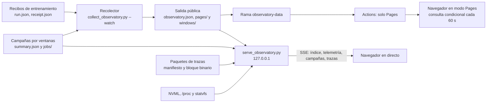

# Observatorio de MARS-TITAN

La página sigue las campañas de entrenamiento con los recibos que publica el recolector. Tiene siete vistas: campaña, curvas por época, recursos, trazas de memoria, políticas financieras, registros y método. La misma interfaz funciona en dos modos que comparten código y contrato de datos.

- **Pages.** Datos estáticos de la rama `observatory-data`. El índice se consulta cada 60 segundos con `If-None-Match`. Una respuesta 304 no descarga ni redibuja nada. Las matrices de las campañas por ventanas (`windows/`) se piden solo al elegir la campaña. La barra superior muestra la antigüedad de la recogida con su zona horaria.
- **Directo en local.** `scripts/serve_observatory.py` sirve el sitio y empuja eventos SSE. Añade telemetría del equipo, el estado en vivo de las campañas por ventanas y trazas de aprendizaje, todo en solo lectura. Escucha en `127.0.0.1` salvo que se pida otra cosa de forma expresa.

## Flujo de datos



El servidor local no escribe en ninguna de sus fuentes ni toma el bloqueo de las campañas. Lee el índice cuando cambia su identidad de archivo y avisa al navegador, que lo descarga con la misma petición condicional que en Pages.

## Modo directo

```bash
uv run --locked python scripts/serve_observatory.py \
  --public-dir RUTA_DE_LA_SALIDA_PUBLICA_DEL_RECOLECTOR \
  --config configs/observatory/campaigns.json \
  --campaign A=RUTA_DE_UNA_CAMPAÑA_POR_VENTANAS \
  --traces-dir RUTA_DE_LOS_PAQUETES_DE_TRAZAS
```

Todas las fuentes son opcionales. Sin `--public-dir` solo hay telemetría. La orden imprime la dirección, por defecto `http://127.0.0.1:8765/`, y termina con `Ctrl+C`. Los límites son de cuatro clientes SSE, dos eventos por segundo y cliente, 24 conexiones, 8 MiB por archivo JSON y 256 MiB por paquete de trazas. `--allow-remote` es necesario para escuchar fuera del bucle local.

Los paquetes de trazas se preparan a partir de la carpeta del registrador de aprendizaje, sin modificarla:

```bash
uv run --locked python scripts/export_learning_traces.py \
  --traces RUTA_DEL_REGISTRADOR --output RUTA_DE_LOS_PAQUETES \
  --name NOMBRE --run-id RUN_ID --attempt-id ATTEMPT_ID --model-id MODEL_ID
```

## Código

| Archivo | Responsabilidad |
| --- | --- |
| `state.mjs` | Contrato del índice, de las páginas y de las matrices de campañas por ventanas, visibilidad de fases reservadas y CSV. |
| `model.mjs` | Estructuras derivadas puras: series de campañas, matrices, curvas, medianas, ritmo y estimaciones. |
| `sources.mjs` | Lectura condicional, páginas inmutables y flujo SSE. |
| `scheduler.mjs` | Un único fotograma por lote de cambios y pausa con la pestaña oculta. |
| `decimate.mjs` | Reducción M4 de series largas con índices de la serie original. |
| `traces.mjs` | Lectura y verificación de paquetes de trazas binarios. |
| `charts.mjs` | Líneas sobre uPlot, dispersión y mapas de calor en canvas, escalas cividis y divergente. |
| `view-*.mjs`, `drawer.mjs` | Una vista por archivo y el detalle de una ejecución. |
| `app.js` | Estado de la página, modos, URL, avisos y planificación. |

uPlot 1.6.32 y las fuentes Atkinson Hyperlegible Next, Atkinson Hyperlegible Mono y Newsreader se sirven desde `vendor/` y `fonts/`, con sus licencias. La política de seguridad no admite scripts ni estilos de otros orígenes.

## Pruebas

```bash
node --test site/tests/*.test.mjs
node site/tests/observatory-browser.mjs RUTA/playwright/index.mjs [CARPETA_DE_CAPTURAS]
OBSERVATORY_PYTHON="uv run --locked python" node site/tests/live-browser.mjs RUTA/playwright/index.mjs
OBSERVATORY_PYTHON="uv run --locked python" node site/tests/benchmark-browser.mjs RUTA/playwright/index.mjs [CARPETA_PUBLICA] [SEGUNDOS]
```

Las pruebas unitarias no necesitan navegador. `observatory-browser.mjs` imita Pages con un servidor de Node que responde 304 y recorre consulta condicional, reintento tras un 503, URL, teclado, fase reservada, CSV, texto hostil, importación local, temas, movimiento reducido y anchos de 320 a 1440 píxeles. `observatory-browser.mjs` comprueba también el selector de campañas por ventanas y que su matriz inmutable se descarga una vez. `live-browser.mjs` arranca el servidor de Python real y comprueba SSE, actualización de campañas e índice, límite de clientes y liberación de plazas. `benchmark-browser.mjs` mide un millón de puntos y la CPU en reposo y no aprueba ni suspende. Las tres usan Playwright y Chrome locales y datos ficticios rotulados como prueba. Ninguna se ejecuta en GitHub Actions.

La auditoría previa al rediseño, las decisiones y las medidas están en [docs/engineering/observatory.md](../docs/engineering/observatory.md) y en [docs/engineering/observatory-ux-audit.md](../docs/engineering/observatory-ux-audit.md).
